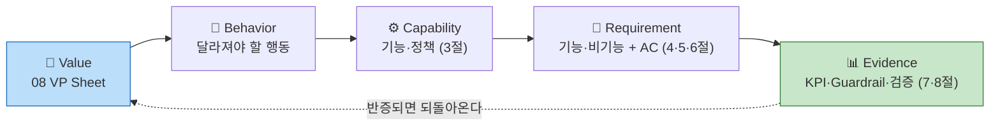

# 09. PRD & Requirement Trace — CardFit

> **CardFit**은 소비가 곧 바뀔 사람을 위해 카드 조합을 다시 계산해주는 서비스다. 마이데이터로 확보한 과거 소비 기록과 사용자가 직접 입력한 미래 소비 변화를 함께 반영해, 보유·신규카드의 실적 구간·혜택한도·연회비를 계산 근거와 함께 공개하며 실행 가능한 카드 조합 재배치안을 제시한다.
>
> 이 문서는 `08_Value_Proposition.md`의 Pain Reliever·Gain Creator가 **요구사항 → Acceptance Criteria → 측정 지표로 추적되는지**를 고정한다(`방법론.md` 5장 연결규칙 `Value Proposition → PRD`).
>
> 표기 — 근거 등급: 🔵 확인된 사실 · ⚪ 추론 · 🟡 가정 · 🟠 미확인 / 우선순위: Must · Should · Could · Won't

---

## 0. 한눈에 보기

| 축 | 이 문서의 답 |
| --- | --- |
| **핵심 기능 1개** | **F-04 조합 최적화 — Net Benefit 게이팅.** 나머지는 이 계산이 성립하기 위한 전후 단계다 |
| 보조 기능 2개 | F-06 계산 근거 공개 · F-11 초기값 자동 제안 |
| 명시적 제외 | **해지·전환 실행 대행·상담·안내** — 마이데이터 기반 서비스에 직권·대행 권한이 없다 |
| 성공 판정 | 북극성 **조합안 선택률 ≥ 40%** 🟡 + Guardrail 5개(하나라도 넘으면 중단) |
| 전제 검증 | **E2 Concierge Test** — 선택률 20% 미달이면 피벗 |

---

## 1. 목적·범위

### 1-1. 목적과 목표

소비 구조가 곧 바뀔 사용자가 **미래 지출을 기준으로 카드 조합을 다시 계산받고, 그 계산을 스스로 검증해 결정**할 수 있게 한다.

| 목표 | 수치화된 정의 |
| --- | --- |
| **G1. 계산을 대신한다** | 수기 240분 판단을 **p95 5분 이내**에 결론 하나로 (⚪ 기준선 1인 진술) |
| **G2. 미래를 기준으로 삼는다** | 계산에 **미래 입력 반영률 100%** — 미래 입력 없이 산출된 결과는 결과로 취급하지 않는다 |
| **G3. 바꿀 가치가 있을 때만 권한다** | 임계 미달 케이스에서 **"현재 조합 유지" 반환률 100%** |
| **G4. 검증 가능하게 만든다** | 결과 1건당 **공개 항목 ≥ 6개**(실적구간·혜택한도·연회비·제외조건·기준일·미반영 항목) |
| **G5. 실패를 보이게 만든다** | 실행 완주율을 **상시 노출** — 개입은 하지 않되 사각지대를 없앤다 |
| **G6. 예측이 틀려도 답을 준다** | 지출 시나리오 **3개(적게·예상대로·많이)를 모두 계산**해 탭으로 제공 |

### 1-2. 범위

| In | Out |
| --- | --- |
| F-01 미래지출 입력 · F-02 마이데이터 연동 · F-03 시나리오 계산(3개) · F-04 조합 최적화 · F-05 결제수단 배분 · F-06 근거 공개 · F-08 이벤트 비종속 · F-11 초기값 제안 · F-12 스코프 경계 고지 · F-13 실행 완주율 계측 | **해지·전환 실행 대행·상담·만류 대응 안내** · 신규카드 자동 발급 · 자동결제 · 대출·BNPL · 리텐션 전용 기능 · 카드 20장+ 대량 처리 최적화 · **시나리오 신뢰도 등급 배지**(별도 검토) |

**신규 카드는 카드사 공식 신청 페이지로 이동 링크만 제공한다** — 신청서 작성·제출을 대신하지 않아 대행이 아니다. **해지는 이 단계 대상이 아니다.**

---

## 2. 사용자 시나리오

| # | 스토리 | Job | 우선순위 |
| :---: | --- | :---: | :---: |
| **US-A** | 소비가 곧 바뀔 사용자로서, 미래 지출을 카드 혜택과 연결해 계산받고 싶다 | A | 1 |
| **US-C** | 계산 결과대로 실제 해지·전환까지 완주하고 싶다 — **스코프 경계 스토리** | C | 1 |
| US-F | 이벤트명을 고르지 않고도 내 소비 변화를 인정받고 싶다 | F | 3 |
| US-B | 계산 근거를 직접 검증하고 싶다 | B | 4 |
| US-D | 정확한 숫자를 몰라도 부담 없이 입력하고 싶다 | D | 5 |
| US-E | 이벤트가 끝난 뒤에도 쓸 이유를 갖고 싶다 | E | 5 (비MVP) |

**정상 흐름** — 마이데이터 연동 → 초기값 제안 → 미래지출 입력 → 제약조건 → **3개 시나리오 계산** → "예상대로" 탭 결론 제시(조합 또는 유지) → 근거 확인 → 선택 → (30일 후) 완주 여부 계측

**실패·복구 흐름**

| 실패 | 복구 |
| --- | --- |
| 마이데이터 API 장애 | "최근 확인된 데이터 기준" 경고 + 기준일 노출로 계산 계속 |
| 미래 입력 0건 | **400 반환** — 과거만으로 계산한 결과를 결과로 내놓지 않는다 |
| 근거 6항목 미달 | **응답 거부** — 근거 없는 결과를 노출하지 않는다 |
| 필수 데이터 누락 | **추천 중단** — 부분 데이터로 계산하지 않는다 |
| Net Benefit 임계 미달 | **"유지" 결론 반환** — 실패가 아니라 정상 결과다 |
| 동의 만료·철회 후 계산 요청 | 400 + 재동의 유도. 만료 데이터로 계산하지 않는다 |
| **선택 후 실행 실패** | **제품은 개입하지 않는다.** F-13이 사유를 수집해 지표로만 집계한다 |

---

## 3. 기능 요구사항 — MoSCoW

**프레임 선택 근거**: 실측 데이터가 없어 RICE의 Reach·Confidence를 채울 수 없다. **범위 합의가 먼저 필요한 단계**라 MoSCoW를 골랐고, "Won't" 칸이 전략의 포기 선언을 담는다.

| ID | 기능 | Job | 우선순위 | 우선순위 근거 (대안 대비 가치) |
| :---: | --- | :---: | :---: | --- |
| **F-01** | 미래지출 입력 (카테고리·금액·시점, 이벤트 선택 강제 없음) | A·F | **Must** | **경쟁 6곳 중 이 단계를 가진 곳 0곳** 🔵 — ⓐ 시간축의 유일한 진입점 |
| **F-02** | 마이데이터 연동 — 과거 소비·보유카드 자동 수집 + 제약조건 입력 | A·D | **Must** | Table Stakes. 카드 이용내역은 마이데이터 API로만 제공 🔵 — 없으면 계산 불성립 |
| **F-03** | 시나리오 계산 — 실적구간·한도·연회비 반영 순혜택. **적게·예상대로·많이 3개 시나리오를 모두 산출** | A | **Must** | 뱅크샐러드는 후보 카드 **1장**과 비교 🔵. 3개 시나리오는 예측 오차를 흡수하는 장치 |
| **F-04** | 조합 최적화 — 해지·유지·신규추가 + **Net Benefit 게이팅**. **"예상대로"를 기본 노출**, 적게·많이는 탭 전환 | A·B | **Must** | **경쟁자 체인에 없는 단계** 🔵. "유지"를 정답으로 반환하는 유일한 설계 |
| **F-05** | 결제수단 배분 — 카드별 역할·금액 배분 (**계산·배분까지만**) | B·C | **Must** | 경쟁자 체인에 없는 두 번째 단계 — ⓑ 조합축. **실행 대행 아님** |
| **F-06** | 계산 근거 공개 — 적용 규칙 + **제외 조건**·기준일·rule_version | B | **Must** | 뱅크샐러드는 결과 금액만 공개 🔵 → 산출 과정·제외조건까지 확장 |
| **F-11** | 과거 패턴 기반 **초기값 자동 제안** | D·A | **Must** | **가장 큰 가정의 완화 장치.** 온보딩 이탈이 실패 경로 — 기능 추가가 아니라 **MVP 성립 조건** |
| F-08 | 이벤트 비종속 입력 (자유 카테고리, 증감 양방향) | F | Should | 이벤트 선택 단계를 **두지 않는 것**만으로 대부분 충족 |
| F-12 | 스코프 경계 고지 + **금지어 자동 검수** | C | Should | GR4 위반은 규제 리스크. 난이도 대비 차단 효과가 크다 |
| F-13 | **실행 완주율 계측** (측정 전용, 개입 없음) | C | Should | 북극성의 사각지대를 드러냄. **대행이 아니라 측정이라 스코프 위반 아님** |
| F-07 | 단계적 전환 제안 — 효과 큰 카드부터 | C | Could | 정보 과부하 완화 — **실행 지원이 아니라 제시 방식** |
| F-09 | 소득·지출 범위(최소~평균) 입력 | D | Could | Job D는 두 지표 모두 후순위 |
| F-10 | 정기 재진단 알림 | E | **Won't v1** | Drift가 시장이 아니라 **사용자 입력**에서 발생 — 정기 점검할 대상이 없다 |
| F-14 | 카드 20장+ 대량 처리 최적화 | — | **Won't v1** | Extreme·Market Relevance 최저 구간 |

### 3-1. 시나리오 탭 3개 — 계산·노출 규칙

| 탭 | 계산 기준 | 노출 |
| --- | --- | --- |
| **예상대로** | 사용자 입력값 그대로 | **기본 탭 — 화면이 열리면 이 결론이 보인다** |
| 적게 | 입력값보다 낮춘 값 | 탭 전환 시 (보조 탐색) |
| 많이 | 입력값보다 높인 값 | 탭 전환 시 (보조 탐색) |

- 세 탭 모두 **동일한 계산 로직**(진단 → Net Benefit → 게이팅)을 각 지출 가정에 독립 적용해 **미리 계산해 둔다** — 탭 전환은 재계산을 일으키지 않는다.
- **"여러 안을 나열하지 않는다" 원칙과 충돌하지 않는다** — 화면은 항상 "예상대로" 결론 하나로 열리므로 첫 화면 선택 부담이 생기지 않는다. 적게·많이는 궁금한 사용자가 스스로 여는 화면이며 기본 결론을 대체하지 않는다.
- **각 탭에 지출 가정을 캡션으로 명시한다**(예: "예상보다 20% 적게 쓸 경우"). 세 탭의 결론이 서로 다를 수 있어, 가정을 표기하지 않으면 *"결국 뭐가 맞는 답인지"* 신뢰가 흔들린다.
- **시나리오 신뢰도 등급 배지(강건/조건부/보류)는 이 문서 범위 밖**이다 — 별도 검토 사항.

---

## 4. 비기능 요구사항

| 구분 | 요구사항 |
| --- | --- |
| **성능** | `POST /calculate` **p95 ≤ 5s**(3개 시나리오 동시 산출 기준) · 근거 화면 **p95 ≤ 1s** · 사용자 여정 전체 **결론 도달 p95 ≤ 5분** |
| **정확성** | 계산 오류율 **≤ 0.1%** · 동일 입력 재계산 **불일치 0건**(결정론성) · 배분 합계와 입력 총액 오차 **≤ 1원** |
| **신뢰성** | 월 가용성 **≥ 99.5%** · 마이데이터 장애 시 경고 표시 후 계산 계속 · 필수 데이터 누락 시 추천 중단 |
| **보안·규제** | 마이데이터 인가 요건 준수(자본금·물적설비·보안) · 동의 범위 최소화 · **오조회 1건 = 즉시 중단·신고** |
| **감사 증적** | 계산 요청·응답, 적용 `rule_version`, 입력 스냅샷, 마이데이터 응답 코드 **전건 보존** |
| **데이터 운영** | 카드 혜택 Rule **버전 관리**(적용 시작·종료일) · 최신성 경고 · 갱신 지연 30일 초과 시 해당 카드 계산 대상 제외 |
| **모니터링** | 북극성 · 보조 지표 · Guardrail 5개 대시보드, 페르소나 층별 분해 |

> **계산과 설명의 분리를 시스템 설계 단계에서 강제한다** — 금액 산출은 결정론적 규칙 엔진, AI는 근거를 사용자 언어로 설명하는 역할에 한정한다. 이 경계가 무너지면 *"AI가 혜택을 보장한다"*는 오해로 이어지는 규제 리스크가 된다.

---

## 5. Acceptance Criteria — 핵심 5건

| 스토리 | Given | When | Then (판정 조건) |
| :---: | --- | --- | --- |
| **US-A** | 마이데이터 연동 완료 + 보유카드 ≥ 1장 | 미래지출 1건 이상 입력 후 계산 요청 | **p95 ≤ 5s** 안에 3개 시나리오가 산출되고 "예상대로" 결론이 노출된다. 유지 시 예상혜택과 추천 조합 예상혜택의 **차액이 원 단위로** 표시된다 |
| **US-A** | 미래지출 입력 **0건** | 계산 요청 | 결과를 반환하지 **않고** 입력을 요구한다 — 미래 입력 미반영 결과 노출 **0건**(G2) |
| **US-B** | 조합 결론이 반환된 상태 | 근거 화면 열람 | 적용 규칙·제외 조건이 **≥ 6항목** 표기된다. **6항목 미달이면 응답을 거부**한다(GR3 = 0건). 계산에 못 넣은 비용은 "이 계산에는 포함되지 않았습니다"로 **누락률 0%** 표기 |
| **US-C** | 조합 결론에 "해지" 항목 포함 | 결과 화면 확인 | **"신청·해지는 카드사에서 직접 진행하셔야 합니다"** 경계 안내가 노출된다(미노출 0건). 금지어 자동 스캔 적발 **0건**(GR4). **범위 인지율 ≥ 90%** 🟡 |
| **US-C** | 사용자가 조합안을 선택 | 30일 경과 후 후속 확인 | 완주 여부가 **집계된다** — 응답 수집률 **≥ 30%**(계측 작동 최소선 🟡), 집계 실패 0건. **제품은 개입하지 않고**, 미완주 사유는 집계 전용이며 후속 액션을 자동 트리거하지 않는다 |
| **F-04 게이팅** | Net Benefit이 임계 미달 | 계산 완료 | **"현재 조합 유지"를 결론으로 반환**한다 — 반환률 100%(G3). 임계 미달인데 변경을 제안한 건수 **0건**, 1건이라도 발생 시 즉시 중단(GR2) |
| **F-03 시나리오** | 미래지출이 입력된 상태 | 계산 요청 | 3개 시나리오가 **모두 미리 계산**되고, 탭 전환 시 **재계산이 발생하지 않는다**. 각 탭에 지출 가정 캡션이 **누락 없이** 표기된다 |
| **US-F** | 온보딩 진입 | 입력 흐름 전체 통과 | **이벤트 필수 선택 단계가 0개**다. 지출 **감소** 방향도 오류 없이 처리된다(처리 실패 0건) |

---

## 6. 데이터 · 인터페이스 · 상태 · 운영 역할

### 6-1. 핵심 엔터티

| 엔터티 | 주요 필드 | 출처 |
| --- | --- | --- |
| **User** | user_id, 마이데이터 동의 상태·범위·일시 | 자체 |
| **HeldCard** | 카드사, 카드명, 연회비, 발급일, 실적 기준월 | 마이데이터 API |
| **PastSpend** | 가맹점, 업종코드, 금액, 결제일 | 마이데이터 API |
| **FutureSpendPlan** | 카테고리(자유 입력 허용), 금액, 시점, 확실도 | 사용자 (F-01) |
| **Constraint** | 최대 카드 수, 연회비 상한, 신규 발급 허용 여부 | 사용자 (F-02) |
| **BenefitRule** | 전월실적 구간, 통합할인한도, **제외 항목**, 적용 시작·종료일, **rule_version** | 카드사 약관 **수집·버전관리** |
| **Calculation** | 입력 스냅샷, **scenario**(적게/예상대로/많이), 적용 rule_version, 기준일, **미반영 항목** | 규칙 엔진 |
| **PlanCandidate** | 조합 구성, Gross Benefit, 전환비용 3항목, **Net Benefit**, 임계 통과 여부 | 규칙 엔진 (F-04) |
| **Allocation** | 배정 카테고리, 배분 금액 | 규칙 엔진 (F-05) |
| **OutcomeLog** | 선택 여부·일시, **선택된 scenario**, 30일 후 완주 응답 | 자체 (F-13) |

### 6-2. 외부 연동

| 인터페이스 | 제약 |
| --- | --- |
| 마이데이터 카드 업권 API | **단일 채널 — 대체 공급자 없음** 🔵. 장애 시 우회 경로 없음. **호출당 과금** 🔵 |
| 카드 혜택 Rule 데이터 | **공식 통합 API 없음** 🔵 — 8개 카드사·겸영은행 파편화. 수집·버전관리 필수 |
| `POST /calculate` | p95 ≤ 5s. **미래 입력 0건이면 400.** 3개 시나리오를 함께 반환 |
| `GET /calculations/{id}/evidence` | 근거 6항목 미달 시 **응답 거부** |
| `POST /outcomes/{id}/completion` | **측정 전용 — 실행 개입 엔드포인트 없음** |

### 6-3. 상태 전이

| 객체 | 상태값 | 전이 규칙 |
| --- | --- | --- |
| **마이데이터 동의** | 미동의 → 동의 → (만료 / 철회) | 만료·철회 상태에서 계산 요청은 **400**. 철회 시 수집 데이터 파기 |
| **Calculation** | 요청 → (성공 / 실패 / 부분) | **부분 = 필수 데이터 누락** → 결과로 취급하지 않고 추천 중단. **3개 시나리오 중 하나라도 실패하면 전체를 부분으로 처리** |
| **PlanCandidate** | 제시 → (선택 / 미선택) → 만료 | **`rule_version` 변경 또는 기준일 +30일 경과 시 만료.** 만료 조합안은 재계산 없이 실행 대상이 되지 않는다 |
| **OutcomeLog** | 미발송 → 발송 → (응답 / 무응답) | 발송은 선택 +30일 **1회만**. **무응답은 미완주로 집계**. 재발송·독려 없음(GR4 위반) |

> **조합안 만료가 G4의 최소 조건이다.** 3주 전 결과를 들고 실행하려는 사이 약관이 갱신되면 계산 근거가 이미 틀린 것이다.

### 6-4. 운영 역할

| 역할 | 담당 활동 | Guardrail 권한 |
| --- | --- | --- |
| **데이터 운영** | 약관 수집·`rule_version` 관리·최신성 경고 | GR5 |
| **계산 품질** | 경계값 회귀 테스트·결정론성 검증·오류 신고 정정 | GR1·GR2·GR3 **발의** |
| **제품(PM)** | 지표 집계·보고, 금지어 예외 승인 | **중단 최종 결정** |
| **컴플라이언스·보안** | 동의 범위 점검, 오조회 감시, 문구 규제 검토 | **오조회 시 PM 우회 단독 중단** |

> **오조회만 PM을 우회한다** — 타인 데이터 노출은 사업 판단 대상이 아니라 즉시 신고 의무 사항이다.

---

## 7. KPI · Guardrail

### 7-1. North Star

**조합안 선택률** — 계산 결과를 받은 사용자 중 제시된 조합안을 **저장·확정**한 비율. 목표 **≥ 40%** 🟡 (외부 벤치마크가 없어 **팀 합의 임계치**다).

**세는 방법**

| 항목 | 규칙 |
| --- | --- |
| 집계 단위 | **사람 단위** — 재계산 반복은 1로 |
| 인정 기간 | 결과 열람 후 **7일 이내** 선택 (코호트) |
| **분모 제외** | **"예상대로" 탭 결론이 "현재 조합 유지"인 사용자** — 선택할 조합안이 없다 |
| 시나리오 처리 | **어느 탭에서 선택해도 분자에 포함**하고, `OutcomeLog.선택된 scenario`를 함께 기록한다 |
| 제외군 감시 | 제외군 비율이 **30% 초과 시 산식 재설계** — 유효 표본이 얇아져 값이 불안정해진다 |

> **분모 제외가 이 지표의 핵심 설계다.** 임계 미달 시 "유지"를 정답으로 반환하는데(G3), 그 사용자를 분모에 넣으면 **정직하게 유지를 권할수록 점수가 떨어진다.** 잘하면 점수가 내려가는 지표는 지표가 아니다.
>
> **탭 3개 도입으로 판정 기준이 하나 늘었다** — 탭마다 결론이 다를 수 있으므로 제외군 판정은 **기본 탭("예상대로") 결론을 기준**으로 한다. 그렇지 않으면 같은 사용자가 탭에 따라 제외군에도 분모에도 들어간다.

### 7-2. Metric Tree

| 구분 | 지표 | 정의 | 방향 |
| --- | --- | --- | --- |
| **North Star** | 조합안 선택률 | 7-1 산식 | ↑ **40% 이상** |
| Input | 온보딩 완료율 | 미래지출 입력 저장 ÷ 마이데이터 동의 | ↑ 60% 이상 (F-11로 개선) |
| Input | 결론 도달 소요시간 | 입력 완료 → 결과 표시, p95 | ↓ **5분 이내** |
| Input | 계산 근거 열람률 | 근거 펼침 ÷ 결과 열람 | ↑ 50% 이상 |
| Input | 이벤트 비종속 진입률 | 태그 미선택 완료 ÷ 전체 완료 | ↑ 20% 이상 |
| Input | **보조 탭 열람률** | 적게·많이 탭 1회 이상 열람 ÷ 결과 열람 | 관찰 — 낮으면 F-03의 계산 비용이 정당화되지 않는다 |
| **🔍 Blind-spot** | **실행 완주율** (F-13) | 30일 후 "바꿨다" ÷ 조합안 선택자 (**무응답 = 미완주**) | **개선 대상 아님 — 측정 전용.** 북극성과 나란히 보고, 격차 20%p 이상이면 경보 |
| **Guardrail** | 불필요 신규카드 추천률 | 임계 미달인데 "변경" 결론 | **0% — 1건이면 즉시 중단** |
| **Guardrail** | 계산 오류율 | 경계값 회귀 실패 ÷ 전체 / 재계산 불일치 | **≤ 0.1%, 불일치 0건** |
| **Guardrail** | 근거 미공개 결과 노출 | 공개 항목 6개 미달 노출 건수 | **0건** |
| **Guardrail** | 실행 지원 오인 문구 노출 | 금지어 스캐너 적발 건수 | **0건** |
| **Guardrail** | 남의 데이터 표시(오조회) | 응답 주인 ≠ 로그인 사용자 | **0건 — 1건이면 중단·신고** |

**Blind-spot 층을 왜 따로 두는가** — 북극성은 "골랐는지"까지만 잰다. 선택 후 실행에 실패한 사용자는 **지표상 성공으로 집계**된다. 이 지표는 Input(올릴 수단이 없다)도 Guardrail(낮다고 멈출 수 없다)도 아니다 — **개선하지도 중단하지도 않지만 반드시 봐야 하는 것**이다. 그래서 목표값을 두지 않고, 무응답을 미완주로 세어 좋게 나올 자유도를 없앴다.

### 7-3. 트레이드오프 선언

| # | 올리려는 지표 | 악화 감시 | 긴장의 실체 |
| :---: | --- | --- | --- |
| T1 | **조합안 선택률** | 불필요 신규카드 추천 **0%** | 선택률을 올리는 가장 쉬운 방법은 **혜택 좋아 보이는 신규카드를 끼워 넣는 것**이다. 숫자는 오르고 차별점은 무너진다 |
| T2 | 결론 도달 시간 ↓ | 계산 오류율 · 근거 항목 수 | 5분을 맞추려 규칙을 건너뛰거나 근거를 6개 미만으로 깎으면 G4가 사라진다 |
| T3 | 온보딩 완료율 ↑ | **초기값 수정률** | F-11로 완료율은 오르지만 **틀린 초기값을 검토 없이 통과**시킬 수 있다 |
| T4 | 어떤 편의성 지표든 | 오조회 0건 · 오인 문구 0건 | **협상 대상이 아니다.** 1건이면 멈춘다 |

### 7-4. 쓰지 않는 지표

누적 가입자 수 · 앱 다운로드 수 · 결과 화면 조회 수 · **계산 요청 건수**(마이데이터는 호출당 과금 🔵 — 성과가 아니라 **비용**이다. 시나리오 3개 계산으로 호출량이 늘어 더 중요해졌다) · "예상 절감액 총합"(실행되지 않은 금액이다)

---

## 8. 검증 설계

| 실험 | 가설 | 설계 | 성공 기준 |
| :---: | --- | --- | --- |
| **E2 Concierge** (최우선) | 계산 결과를 받으면 조합안을 선택한다 | 혼인 **모집 40 / 유효 30**(제외군 25% 가정), 사람이 직접 계산. 근거 공개 2군 | 선택률 **≥ 40%** 🟡 · 근거 열람 **전후** 신뢰 점수 상승. **2군 비교는 방향 관찰**(15/15 검출력 13%로 판정 불가) |
| E1 인터뷰 | 미래 입력 의향이 실재한다 | 실제 사용자 n=15 — **모의 인터뷰 전면 교체** | Job A 언급률 ≥ 60% 🟡 |
| E3 A/B | F-11이 온보딩 이탈을 줄인다 | n=500 (250/250) | B군 ≥ 60% **및 A군 대비 +15%p** 🟡 **및 수정률 정상** |
| E4 회귀 | 규칙 엔진이 경계값에서 정확하다 | 경계값 케이스 ≥ 200건 | 오류율 ≤ 0.1% · 불일치 0건 |
| E5 벤치마크 | 동일 데이터에서 더 정확한 조합을 낸다 | 같은 스냅샷 n=20 비교 | 비교 단위·근거 항목·전환비용 3축 전부 우위 |
| E6 경계 인지 | F-12 고지가 기대 격차를 막는다 | E2·E4 참여자 사후 설문 | 인지율 ≥ 90% 🟡(n=30에서 신뢰구간 ±11%p) · 금지어 0건 |
| **E7a** | 미완주 사유의 종류를 안다 | E2 선택자, 30일 후 (**개입 없음**) | 목표 없음. **비율은 산출하지 않는다**(응답 6명 수준) |
| **E7b** | 실행 완주 비율을 안다 | **베타** 선택자, 30일 후 | 목표 없음 — 기준선 확보. **착수 +21주 이후** |

**중단 조건** — GR1 초과 또는 GR2·GR3·GR4·오조회 1건 = **즉시 중단** / E2 선택률 **< 20% = 전제 재검토(피벗)** / E2 제외군 **> 30% = 북극성 산식 재설계** / E3 +15%p 미달 또는 수정률 비정상 = **F-11 재설계** / 마이데이터 인가·제휴 미확정 = **베타 진입 불가**

> **표본 수는 목표값과 중단선의 간격에서 역산했다.** 40% vs 20%를 가르는 데는 30명이면 충분하다(오판 확률 1.7%). 원안의 "근거 공개군 +15%p" 기준은 검출력 13%라 삭제했다 — **있는 효과를 없다고 잘못 기록하는 것이 가장 나쁜 결과다.**

---

## 9. 요구사항 추적표

`08_Value_Proposition.md`의 Pain Reliever·Gain Creator가 요구사항 → AC → 지표로 이어지는지 확인한다. **이 표가 이 문서의 존재 이유다.**

| VP 요소 | 요구사항 | Acceptance Criteria | 측정 지표 |
| --- | :---: | --- | :---: |
| 계산을 대신한다 | F-03 | p95 ≤ 5s 안에 결론 반환 | 결론 도달 p95 ≤ 5분 |
| 미래를 기준으로 삼는다 | F-01 | **미래 입력 0건이면 400** | 미래 입력 반영률 100% |
| **예측 오차를 흡수한다** | **F-03·F-04** | 3개 시나리오 사전 계산, 탭 전환 시 재계산 없음, 가정 캡션 누락 0건 | **보조 탭 열람률**(관찰) |
| Net Benefit 게이팅 | F-04 | 임계 미달 시 "유지" 반환률 **100%** | **GR2 = 0%** |
| 계산 근거를 공개한다 | F-06 | 공개 항목 **≥ 6개**, 미달 시 응답 거부 | 근거 열람률 ≥ 50% / **GR3 = 0건** |
| 카드별 역할·배분 제시 | F-05 | 배분 합계와 입력 총액 오차 ≤ 1원 | — |
| 입력 부담 완화 | F-11 | 초기값 자동 제안, 직접 입력 강제 0개 | 온보딩 완료율 ≥ 60% |
| 이벤트 비종속 인정 | F-01·F-08 | 이벤트 필수 선택 **0개**, 양방향 처리 실패 0건 | 비종속 진입률 ≥ 20% |
| **실행 마찰 — 경계 고지** | **F-12** | 경계 안내 미노출 0건, 범위 인지율 ≥ 90% | **GR4 = 0건** |
| **실행 마찰 — 사각지대 측정** | **F-13** | 30일 후 집계, 북극성과 나란히 리포트, 후속 액션 자동 트리거 없음 | 실행 완주율 (목표 없음) |
| 🔶 지속 사용 동기 (Job E) | — | Won't v1 | D+90 재방문율 (관측 불가) |

### 9-1. 주장 → 실험 → 측정 도구

| 주장 | 등급 | 검증 | 측정 도구 |
| --- | :---: | :---: | --- |
| 경쟁 6곳 중 3조건 동시 충족 **0곳** | 🔵 | E5 | 벤치마크 비교표 — 비교 단위·근거 항목·전환비용 항목 수 |
| 자동대체 후 혜택 불일치 민원 **+88.4%** | 🔵 | E1·E2 | 인터뷰 코딩(불신 언급률) · 신뢰 응답 |
| 카드 이용내역은 마이데이터 API로만 | 🔵 | — | 설계 제약 |
| 혼인 **24만 건(+8.1%)**, 1인당 **1,473만~2,203만원** | 🔵 | 베타 | 채널 도달률 · SOM 실측 |
| **A·C 공동 1위** | 🟡 팀 추정 | E1·E2 | Importance·Satisfaction 실측 — 🟡 → 🔵 승격 목표 |
| JTBD 인터뷰 A·C 최상위 반응 | 🟡 **모의** | E1 | 실제 응답으로 **전면 교체 필요** |
| 미래 입력이 조합 선택으로 이어진다 | 🟠 | **E2** | 북극성 조합안 선택률 |
| 근거 공개가 신뢰를 만든다 | 🟠 | E2 (전후 비교) | 신뢰 점수 상승폭 |
| F-11이 온보딩 이탈을 줄인다 | 🟠 | E3 | 온보딩 완료율 |
| **시나리오 3개가 예측 오차 부담을 줄인다** | 🟠 | E2·E3 | **보조 탭 열람률 + 열람자의 선택률 차이** |
| 실행 완주율이 낮다 | ⚪ (3회 시도 0회) | E7a → E7b | 실행 완주율 |

---

## 10. 리스크 · 가정 · 의존성

### 10-1. 리스크

| # | 리스크 | 영향 | 완화 |
| :---: | --- | --- | --- |
| R1 | **가장 큰 가정 붕괴** — 미래 입력의 수고가 혜택 보상을 정당화하지 못한다 | 🔴 F-01~F-06 동시 무효화 | F-11을 Must로 승격. **E2에서 최우선 검증** |
| R2 | 마이데이터 인가·제휴 지속성 | 🔴 계산 불성립 | 인가 vs 제휴 조기 확정 — **착수 전 선결** |
| R3 | 카드 혜택 Rule 파편화 | 계산 신뢰도 붕괴 | rule_version 관리 + 최신성 경고 + 초기 범위 축소 |
| R4 | **북극성 착시** — 선택 후 실행 실패가 성공으로 집계 | 지표가 실패를 못 본다 | **F-13을 나란히 리포트** |
| R5 | **인센티브 충돌** — 발급 연계 수수료 모델이면 "유지" 결론은 수익 0원 | 차별점과 매출 충돌 | **임계값(D2) 확정 후 정합한 수익모델 선택.** 순서를 뒤집으면 임계값이 수수료 쪽으로 왜곡된다 |
| R6 | **호출 비용** — 시나리오 3개로 마이데이터·계산 호출량 증가 | 단위경제 악화 | 3개 시나리오는 **1회 수집 데이터로 계산**해 마이데이터 호출을 늘리지 않는다. 보조 탭 열람률이 낮으면 재검토 |
| R7 | 스코프 오인 | 규제 리스크 | F-12 고지 + 금지어 자동 검수, GR4 = 0건 |

### 10-2. 주요 가정

| # | 가정 | 등급 | 반증되면 |
| :---: | --- | :---: | --- |
| A1 | 미래 입력의 수고가 혜택 보상으로 정당화된다 | 🟡 | **서비스 전체** |
| A2 | 사용자가 미래 지출을 숫자로 표현할 수 있다 | 🟡 | F-01 설계 (F-11로 완화) |
| A3 | 근거 공개가 신뢰를 만든다 | 🟠 | G4의 근거 |
| A4 | AOS·DOS 우선순위가 실사용자에게도 유지된다 | 🟡 | 기능 우선순위 재배열 |
| A5 | **Net Benefit 임계값을 사용자가 납득한다** | 🟠 **임계값 자체가 미정** | **GR2 정의 불가** |
| A6 | 실행 완주율이 낮다 | ⚪ | 보조 지표의 존재 이유 |
| A7 | **적게·많이 시나리오를 실제로 열어본다** | 🟠 | F-03의 계산 비용이 정당화되지 않는다 |

### 10-3. 착수 전 선결

| # | 의존성 | 상태 | 막는 것 |
| :---: | --- | :---: | --- |
| **D1** | 마이데이터 **인가 vs 제휴** 결정 | 🔴 미정 | F-02 전체 — 계산 불성립 |
| **D2** | **Net Benefit 절대·상대 임계값** 확정 | 🔴 미정 | F-04·GR2·G3 |
| **D3** | **수익모델** 선택 (B2C 유료 / 발급 연계 / B2B2C) | 🔴 미정 | R5·단위경제·"유지도 정답" 정합성 |
| **D4** | MVP 지원 카드사·상품 범위와 약관 갱신 운영 | 🔴 미정 | F-03·R3 |
| **D5** | **시나리오 3개의 증감 폭 정의**(예: ±20%) | 🔴 미정 | F-03 계산 기준 |
| D6 | **웨딩업체 모집 경로** | 🟠 미확보 | E2 착수 |
| D7 | 개인정보 동의서 · Concierge 응대 스크립트 | 🟠 미작성 | E2 착수 |
| D8 | 경계값 테스트 케이스 ≥ 200건 · GR4 금지어 사전 | 🟠 | E4·E6 판정 |
| D9 | 모집인 등록·재무자문 규제 분류 | 🟠 미확인 | 4절 규제 |
| D10 | 실제 사용자 인터뷰 (모의 인터뷰 대체) | ⬜ 미실시 | A4·JTBD 확정 |

---

## 11. 이 PRD의 한계

1. **기준선이 전량 🟠다.** 서비스가 없어 실측값이 없고 목표값은 전부 🟡 제안값이다. **E2 완료 후 재설정을 전제**로 한다. 목표 40%·60%·50%에 **외부 벤치마크가 없어** "팀 합의 임계치"로 성격을 표기했다 — 없는 근거를 만들어 붙이지 않았다.
2. **AOS·DOS는 팀 추정, JTBD는 모의 인터뷰다.** E1·E2로 실측 교체 전까지 2절 스토리 우선순위는 **교차검증된 제품 가설**이지 "검증된 시장 가치"가 아니다.
3. **D1~D5가 미정인 상태로 작성됐다.** 특히 **Net Benefit 임계값(D2)이 없어 GR2를 정량 정의할 수 없고**, 수익모델(D3)이 없어 "유지도 정답"의 인센티브 정합성을 확인할 수 없으며, **시나리오 증감 폭(D5)이 없어 F-03의 계산 기준이 비어 있다.**
4. **Job C는 의도적으로 미해결이다.** AOS·DOS 공동 1순위이지만 스코프 밖이며, 이 PRD는 **고지(F-12)와 측정(F-13)으로만** 다룬다.
5. **시나리오 탭 3개는 계산·노출 방식만 확정됐다.** 신뢰도 등급 배지(강건/조건부/보류)는 별도 검토 사항이고, **보조 탭을 실제로 열어보는지(A7)도 미검증**이다.

---

**입력 문서**: `효진/확정본/08_Value_Proposition.md`(Pain Reliever·Gain Creator·KPI 설계) · `윤정/확정본/02_Value_Chain.md`(스코프 정의처) · `03_KSF.md` · `11_Benchmark_Transfer.md`(Net Benefit 게이팅·To-Be 흐름·시나리오 3개) · `가람/확정본/05~07`(CJM·AOS·DOS·JTBD) · `윤정/0820/메커니즘_벤치마킹_분석_리포트.md` 2-9절(시나리오 탭)
**작업본**: `효진/0820/09_PRD_Requirement_Trace_v0.1.md`(전체 AC 24건·리스크 상세) · `효진/0820/09-1_KPI_Design_Worksheet_v0.1.md`(이벤트 택소노미·산식·관측 시점) · `효진/0820/final/05_실험_설계서.md`(표본 검출력 검산) · `효진/0820/final/06_금지어_사전.md`(GR4 판정 기준)
**후속**: `10_Evidence_Inference_Assumption.md` — 이 PRD의 🔵/⚪/🟡/🟠 등급 판정과 E1~E7 결과가 추적되어야 한다
