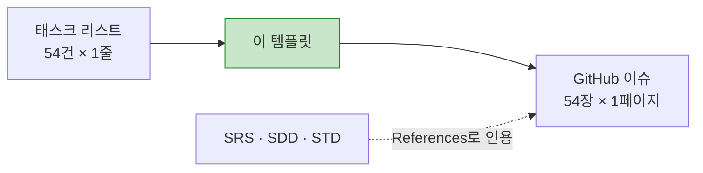

# [GitHub 프로젝트용 TASK 템플릿] CardFit

**문서 ID:** TPL-CARDFIT-001

**개정 버전:** 1.0

**날짜:** 2026-08-25

**근거 문서:** TASK-CARDFIT-001 v2.1 (`[태스크 리스트] CardFit.md`)

**참조 문서:** SRS-CARDFIT-001 · SDD-CARDFIT-001 · STD-CARDFIT-001

**실제 이슈 템플릿:** `.github/ISSUE_TEMPLATE/feature-task.md` (GitHub 이슈 생성 시 자동 적용)

---

## 0. 이 문서의 역할

`[태스크 리스트] CardFit.md`는 태스크 **54건을 한 줄씩** 나열한 목록이다. 이 문서는 그 한 줄을 **GitHub 이슈 한 장의 상세 명세**로 펼치는 템플릿과 작성 규칙을 정의한다.



**템플릿 원문은 1장에 그대로 두었다.** CardFit에 맞춘 작성 규칙은 2장, 문서화 순서는 3장에 있다.

---

## 1. 템플릿 원문

```markdown
---
name: Feature Task
about: SRS 기반의 구체적인 개발 태스크 명세
title: "[Feature] FR-001: {기능 요약}"
labels: 'feature, backend, priority:high'
assignees: ''
---

## 🎯 Summary
- 기능명: [FR-001] 이메일 기반 회원가입
- 목적: 사용자가 서비스에 접근하기 위한 고유 계정을 안전하게 생성한다.

## 🔗 References (Spec & Context)
> 💡 AI Agent & Dev Note: 작업 시작 전 아래 문서를 반드시 먼저 Read/Evaluate 할 것.
- SRS 문서: [`/docs/SRS_v0.md#FR-001`](#)
- 시퀀스 다이어그램: [`/docs/SRS_v0.md#sequence-login`](#)
- 데이터 모델 (ERD): [`/docs/erd.md#User`](#)
- API 명세: [`/docs/api_v1.yaml#POST-/users`](#)

## ✅ Task Breakdown (실행 계획)
- [ ] 데이터베이스 마이그레이션 스크립트 작성 (`users` 테이블 확장 등)
- [ ] 회원가입 DTO 및 검증(Validation) 로직 구현
- [ ] 비밀번호 단방향 암호화 (Bcrypt 등) 로직 적용
- [ ] 비즈니스 로직(Service) 및 예외 처리 구현
- [ ] API Controller 연동 및 통합 테스트 작성

## 🧪 Acceptance Criteria (BDD/GWT)
Scenario 1: 정상적인 회원가입
- Given: 유효한 형태의 이메일(`test@example.com`)과 보안 정책을 충족하는 비밀번호가 주어짐
- When: `/api/v1/users`로 회원가입(POST)을 요청함
- Then: DB에 유저가 생성되고, 201 Created 상태 코드와 함께 User ID를 반환한다.

Scenario 2: 중복된 이메일 가입 시도
- Given: 이미 DB에 존재하는 이메일(`exist@example.com`)이 주어짐
- When: 해당 이메일로 회원가입을 요청함
- Then: 계정 생성에 실패하며, 409 Conflict 상태 코드와 지정된 에러 메시지를 반환한다.

## ⚙️ Technical & Non-Functional Constraints
- 성능: 응답시간 p95 ≤ 300ms 달성
- 안정성: 에러율 ≤ 0.5% 유지
- 보안: 비밀번호 평문 저장 절대 금지, 요청 페이로드 로깅 시 마스킹 처리 필수

## 🏁 Definition of Done (DoD)
- [ ] 모든 Acceptance Criteria를 충족하는가?
- [ ] 단위 테스트(Unit Test) 및 통합 테스트(Integration Test)가 추가되었고 통과하는가?
- [ ] SonarQube / Linter 등의 정적 분석 도구 경고가 없는가?
- [ ] API 명세서(Swagger 등)가 최신화되었는가?

## 🚧 Dependencies & Blockers
- Depends on: #12 (DB 인프라 세팅 이슈)
- Blocks: #24 (로그인 기능 구현 이슈)
```

---

## 2. CardFit 작성 규칙

### 2.1 필드 매핑

| 템플릿 필드 | CardFit에서 채우는 방법 | 출처 |
| --- | --- | :---: |
| `title` | `[Feature] BE-06: 계산 엔진 코어` — **태스크 ID를 그대로** 쓴다(FR-001 아님) | TASK 1.0~1.6 |
| `labels` | `epic:<Epic>` · `layer:<in\|da\|be\|fe\|qa\|ds>` · `priority:<p0\|p1\|p2>` · 차단 시 `blocked:<D코드>` | 2.2 |
| **Summary** | 기능명 + 목적 1문장. 목적은 **어느 요구사항을 만족시키는가**로 쓴다 | TASK `Feature` 열 |
| **References** | 2.3 참조 규칙 | SRS·SDD·STD |
| **Task Breakdown** | SDD 시퀀스·순서도의 단계를 체크리스트로 분해 | SDD 5·6장 |
| **Acceptance Criteria** | **STD의 해당 TC를 BDD로 옮긴다.** 새로 만들지 않는다 | STD 1~3장 |
| **Constraints** | 해당 태스크가 걸리는 REQ-NF의 임계치를 그대로 | SRS 4.2 |
| **DoD** | 2.4 공통 DoD + 태스크별 추가분 | — |
| **Dependencies** | TASK `선행 태스크` 열 → 이슈 번호. `Blocks`는 역방향 조회 | TASK 전 표 |

### 2.2 라벨 체계

| 축 | 값 |
| --- | --- |
| `epic:` | `infra` `data` `auth` `mydata` `input` `calc` `evidence` `ai` `compliance` `tracking` `metric` `guardrail` `ruledata` `api` `qa` `design` |
| `layer:` | `ct` `mk` `in` `da` `be` `fe` `ts` `qa` `ds` |
| `priority:` | `p0`(Guardrail 대응) · `p1`(Must) · `p2`(Should·Could) |
| `blocked:` | `d16` `d2` `d5` `d11` `d4` `dec-3b` — 착수 차단 태스크에만 |
| `cqrs:` | `query`(상태 불변) · `command`(상태 변경) · `mixed` — BE 19그룹 |
| `nfr:` | `req-nf-001` ~ `req-nf-009` — 해당 NFR을 만족시키는 태스크 |
| `contract:` | `api`(CT) · `mock`(MK) · `db`(DA) — 계약 정의 태스크 |

**`cqrs:` 라벨의 실무 의미** — `command`는 상태를 바꾸므로 마이그레이션·롤백 계획이 필요하고, `query`는 롤백이 불필요해 리뷰 부담이 낮다. 같은 복잡도 `M`이라도 배포 위험이 다르다.

**`nfr:` 라벨이 필요한 이유** — REQ-NF를 만족시키는 태스크가 `IN`·`DA`·`BE`·`QA`에 흩어져 있다(예: REQ-NF-004 → DA-04·BE-01·QA-02). 라벨 필터로 *"이 NFR을 만족시키는 태스크가 다 발급됐는가"* 를 한눈에 본다.

**`priority:p0`는 STD 0.4의 P0 6건과 일치시킨다** — TC-FUNC-004·006·009, TC-NF-002·004, TC-EXC-002를 담은 그룹(`CT-02` `BE-07` `BE-10` `BE-12` `BE-01` `BE-16`)이다.

### 2.3 References 참조 규칙

템플릿의 예시 경로(`/docs/SRS_v0.md`)를 CardFit 실제 경로로 바꾼다.

| 항목 | 실제 경로 |
| --- | --- |
| SRS 문서 | `/docs/[SRS 문서] CardFit (한글).md` + 절 번호 |
| 시퀀스 다이어그램 | `/docs/[설계 문서] CardFit (한글).md#5-동적-설계--시퀀스-다이어그램` |
| 데이터 모델 (ERD) | `/docs/[SRS 문서] CardFit (한글).md#641-erd` |
| 테스트 케이스 | `/docs/[테스트 명세서] CardFit (한글).md#tc-func-004` |
| API 명세 | `/docs/[SRS 문서] CardFit (한글).md` §6.1.1~6.1.3 |

> **API 명세는 SRS §6.1.1~6.1.3에 있다.** 공통 응답 봉투 · 에러 코드 체계(`CF-4001`~`CF-2001`) · 엔드포인트별 요청·응답 스키마를 그곳에서 인용한다.

### 2.4 공통 DoD

모든 태스크에 아래를 넣고, 태스크별 항목을 덧붙인다.

```markdown
- [ ] 모든 Acceptance Criteria를 충족하는가?
- [ ] 대응 테스트 케이스(STD)가 구현되고 통과하는가?
- [ ] **배포 게이트 ①·② 를 통과하는가?** (C-TEC-007a)
- [ ] **의존성 경계 린트를 통과하는가?** (ADR-02 — AI가 계산 클래스를 참조하지 않는가)
- [ ] Linter 경고가 없는가?
- [ ] 변경이 SRS·SDD와 어긋나지 않는가? (`python3 tools/verify_docs.py` 통과)
```

세 번째·네 번째 항목이 이 프로젝트 고유다. **ADR-02는 배포 경계로 강제되지 않으므로 DoD에서 한 번 더 확인한다.**

### 2.5 차단 태스크(🔴) 작성 규칙

`blocked:` 라벨이 붙은 7개 그룹은 **Acceptance Criteria의 숫자를 채울 수 없다.**

| 규칙 | 내용 |
| --- | --- |
| AC 숫자 | `{D2 확정 후 주입}` 처럼 **플레이스홀더로 남긴다.** 임의 값을 넣지 않는다 |
| Blockers | `## 🚧 Dependencies & Blockers`에 **`Blocked by: D16 (SRS 4.1.0 RE-1~RE-8)`** 를 명시한다 |
| 이슈 상태 | GitHub 프로젝트에서 `Blocked` 컬럼에 둔다. `Todo`로 올리지 않는다 |

---

## 3. 풀버전 태스크 문서 작성 순서

### 3.1 순서를 정하는 원칙 4가지

| # | 원칙 | 이유 |
| :---: | --- | --- |
| **1** | **의존성 위상 정렬** — 선행 그룹의 문서가 먼저 있어야 한다 | `Depends on: #12`를 쓰려면 12번 이슈가 이미 존재해야 한다 |
| **2** | **계약 우선** — 다른 그룹이 인용할 계약(API·스키마)을 먼저 | 계약이 없으면 그것을 소비하는 그룹의 AC를 구체적으로 쓸 수 없다 |
| **3** | **차단 분리** — 🔴 7개 그룹은 마지막에 | 지금 쓰면 AC가 플레이스홀더가 되고 D16 확정 후 다시 써야 한다 |
| **4** | **관점 병렬** — DS 트랙은 개발과 독립 | `DS-01`~`DS-05`는 개발 문서를 기다리지 않는다 |

### 3.2 배치별 작성 순서

| 배치 | 대상 | 그룹 수 | 산출 파일 |
| :---: | --- | :---: | --- |
| **1** | CT-01 · CT-02 — API 계약 | 2 | `S1-계약-API.md` ✅ |
| **2** | MK-01 · MK-02 — Mock | 2 | `S2-계약-Mock.md` |
| **3** | IN-01 · IN-02 · IN-04 · IN-05 — 기반 인프라 | 4 | `S3-인프라기반.md` |
| **4** | DA-01~04 — 데이터 계층 | 4 | `S4-데이터.md` |
| **5** | BE-01 · BE-02 · BE-04 · BE-05 — 인증·입력 | 4 | `S5-인증입력.md` |
| **6** | BE-11 · BE-12 · BE-14 · BE-16 — 근거·컴플라이언스 | 4 | `S6-근거.md` |
| **7** | BE-13 · BE-17 · BE-18 · BE-19 — 계측·API | 4 | `S7-계측API.md` |
| **8** | FE-01~08 — 화면 | 8 | `S8-프론트엔드.md` |
| **9** | IN-03 · IN-06 · IN-07 · QA-01~03 — NFR·게이트 | 6 | `S9-NFR.md` |
| **10** | 🔴 BE-03 · BE-06~10 · BE-15 · IN-08 — 차단 해소 후 | 8 | `S10-계산도메인.md` |
| **11** | TS-01~03 — 테스트 코드 | 3 | `S11-테스트.md` |
| **병렬** | DS-01~05 — 디자인 | 5 | `SD-디자인.md` |
| | **합계** | **54** | |

**8번(FE)이 앞당겨진 이유** — Mock(2번)이 먼저 나오므로 FE는 백엔드 완성을 기다리지 않는다.

**10번을 마지막에 두는 이유** — `BE-06`~`BE-10`이 **D16**(규칙 엔진 계산 명세)에 막혀 있다. 지금 쓰면 AC가 *"`{RE-1 확정 후}` 순서로 계산한다"* 로 남고, 확정 후 전부 다시 손봐야 한다.

### 3.3 분량 조정

복잡도 `L` 그룹은 간이 형식(Summary · References · AC 1개 · 공통 DoD)으로 써도 된다. **기본값은 풀버전이다.**

## 4. 이 템플릿을 쓸 때 주의할 것

| # | 주의 | 이유 |
| :---: | --- | --- |
| 1 | **AC를 새로 만들지 않는다** | STD에 이미 27건의 판정 기준이 있다. 다시 쓰면 두 문서가 갈라진다 |
| 2 | **`FR-001` 대신 실제 태스크 ID를 쓴다** | 태스크 리스트·추적표와 ID가 어긋나면 `verify_docs.py`가 잡지 못한다 |
| 3 | **차단 태스크의 숫자를 임의로 채우지 않는다** | 2.5 규칙. 플레이스홀더가 정직한 상태다 |
| 4 | **DS 태스크에는 API·ERD 참조를 넣지 않는다** | 디자인 태스크에 해당 없는 항목을 비워두는 대신 **삭제**한다 |
| 5 | **Constraints는 REQ-NF 임계치를 그대로 옮긴다** | 템플릿 예시의 `p95 ≤ 300ms`는 CardFit 값이 아니다. 계산 API는 `p95 ≤ 5s`다 |

---

*근거 문서: `[태스크 리스트] CardFit.md` (TASK-CARDFIT-001 v1.0)*

*작성자: 기획 분석가, 검토자: 개발팀 리드, 승인자: 제품 책임자 (PM)*
