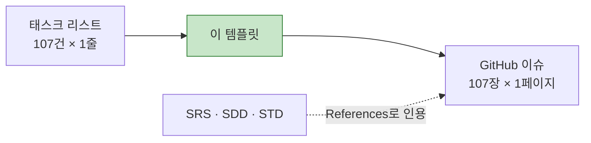

# [GitHub 프로젝트용 TASK 템플릿] CardFit

**문서 ID:** TPL-CARDFIT-001

**개정 버전:** 1.0

**날짜:** 2026-08-25

**근거 문서:** TASK-CARDFIT-001 v1.0 (`[태스크 리스트] CardFit.md`)

**참조 문서:** SRS-CARDFIT-001 · SDD-CARDFIT-001 · STD-CARDFIT-001

**실제 이슈 템플릿:** `.github/ISSUE_TEMPLATE/feature-task.md` (GitHub 이슈 생성 시 자동 적용)

---

## 0. 이 문서의 역할

`[태스크 리스트] CardFit.md`는 태스크 **107건을 한 줄씩** 나열한 목록이다. 이 문서는 그 한 줄을 **GitHub 이슈 한 장의 상세 명세**로 펼치는 템플릿과 작성 규칙을 정의한다.



**템플릿 원문은 1장에 그대로 두었다.** CardFit에 맞춘 작성 규칙은 2장, 문서화 순서는 3장에 있다.

---

## 1. 템플릿 원문

```markdown
---
name: Feature Task
about: SRS 기반의 구체적인 개발 태스크 명세
title: "[Feature] FR-001: {기능 요약}"
labels: 'feature, backend, priority:high'
assignees: ''
---

## 🎯 Summary
- 기능명: [FR-001] 이메일 기반 회원가입
- 목적: 사용자가 서비스에 접근하기 위한 고유 계정을 안전하게 생성한다.

## 🔗 References (Spec & Context)
> 💡 AI Agent & Dev Note: 작업 시작 전 아래 문서를 반드시 먼저 Read/Evaluate 할 것.
- SRS 문서: [`/docs/SRS_v0.md#FR-001`](#)
- 시퀀스 다이어그램: [`/docs/SRS_v0.md#sequence-login`](#)
- 데이터 모델 (ERD): [`/docs/erd.md#User`](#)
- API 명세: [`/docs/api_v1.yaml#POST-/users`](#)

## ✅ Task Breakdown (실행 계획)
- [ ] 데이터베이스 마이그레이션 스크립트 작성 (`users` 테이블 확장 등)
- [ ] 회원가입 DTO 및 검증(Validation) 로직 구현
- [ ] 비밀번호 단방향 암호화 (Bcrypt 등) 로직 적용
- [ ] 비즈니스 로직(Service) 및 예외 처리 구현
- [ ] API Controller 연동 및 통합 테스트 작성

## 🧪 Acceptance Criteria (BDD/GWT)
Scenario 1: 정상적인 회원가입
- Given: 유효한 형태의 이메일(`test@example.com`)과 보안 정책을 충족하는 비밀번호가 주어짐
- When: `/api/v1/users`로 회원가입(POST)을 요청함
- Then: DB에 유저가 생성되고, 201 Created 상태 코드와 함께 User ID를 반환한다.

Scenario 2: 중복된 이메일 가입 시도
- Given: 이미 DB에 존재하는 이메일(`exist@example.com`)이 주어짐
- When: 해당 이메일로 회원가입을 요청함
- Then: 계정 생성에 실패하며, 409 Conflict 상태 코드와 지정된 에러 메시지를 반환한다.

## ⚙️ Technical & Non-Functional Constraints
- 성능: 응답시간 p95 ≤ 300ms 달성
- 안정성: 에러율 ≤ 0.5% 유지
- 보안: 비밀번호 평문 저장 절대 금지, 요청 페이로드 로깅 시 마스킹 처리 필수

## 🏁 Definition of Done (DoD)
- [ ] 모든 Acceptance Criteria를 충족하는가?
- [ ] 단위 테스트(Unit Test) 및 통합 테스트(Integration Test)가 추가되었고 통과하는가?
- [ ] SonarQube / Linter 등의 정적 분석 도구 경고가 없는가?
- [ ] API 명세서(Swagger 등)가 최신화되었는가?

## 🚧 Dependencies & Blockers
- Depends on: #12 (DB 인프라 세팅 이슈)
- Blocks: #24 (로그인 기능 구현 이슈)
```

---

## 2. CardFit 작성 규칙

### 2.1 필드 매핑

| 템플릿 필드 | CardFit에서 채우는 방법 | 출처 |
| --- | --- | :---: |
| `title` | `[Feature] BE-012: RuleEngine 계산 코어` — **태스크 ID를 그대로** 쓴다(FR-001 아님) | TASK 1.1~1.5 |
| `labels` | `epic:<Epic>` · `layer:<in\|da\|be\|fe\|qa\|ds>` · `priority:<p0\|p1\|p2>` · 차단 시 `blocked:<D코드>` | 2.2 |
| **Summary** | 기능명 + 목적 1문장. 목적은 **어느 요구사항을 만족시키는가**로 쓴다 | TASK `Feature` 열 |
| **References** | 2.3 참조 규칙 | SRS·SDD·STD |
| **Task Breakdown** | SDD 시퀀스·순서도의 단계를 체크리스트로 분해 | SDD 5·6장 |
| **Acceptance Criteria** | **STD의 해당 TC를 BDD로 옮긴다.** 새로 만들지 않는다 | STD 1~3장 |
| **Constraints** | 해당 태스크가 걸리는 REQ-NF의 임계치를 그대로 | SRS 4.2 |
| **DoD** | 2.4 공통 DoD + 태스크별 추가분 | — |
| **Dependencies** | TASK `선행 태스크` 열 → 이슈 번호. `Blocks`는 역방향 조회 | TASK 전 표 |

### 2.2 라벨 체계

| 축 | 값 |
| --- | --- |
| `epic:` | `infra` `data` `auth` `mydata` `input` `calc` `evidence` `ai` `compliance` `tracking` `metric` `guardrail` `ruledata` `api` `qa` `design` |
| `layer:` | `in` `da` `be` `fe` `qa` `ds` |
| `priority:` | `p0`(Guardrail 대응) · `p1`(Must) · `p2`(Should·Could) |
| `blocked:` | `d16` `d2` `d5` `d11` `d4` `dec-3b` — 착수 차단 태스크에만 |
| `cqrs:` | `query`(상태 불변) · `command`(상태 변경) · `mixed`(분해 검토) — BE 42건 |
| `nfr:` | `req-nf-001` ~ `req-nf-009` — 해당 NFR을 만족시키는 태스크 |
| `contract:` | `api`(CT) · `mock`(MK) · `db`(DA) — 계약 정의 태스크 |

**`cqrs:` 라벨의 실무 의미** — `command`는 상태를 바꾸므로 마이그레이션·롤백 계획이 필요하고, `query`는 롤백이 불필요해 리뷰 부담이 낮다. 같은 복잡도 `M`이라도 배포 위험이 다르다.

**`nfr:` 라벨이 필요한 이유** — REQ-NF를 만족시키는 태스크가 `IN`·`DA`·`BE`·`QA`에 흩어져 있다(예: REQ-NF-004 → DA-011·BE-002·QA-006). 라벨 필터로 *"이 NFR을 만족시키는 태스크가 다 발급됐는가"* 를 한눈에 본다.

**`priority:p0`는 STD 0.4의 P0 6건과 일치시킨다** — TC-FUNC-004·006·009, TC-NF-002·004, TC-EXC-002에 대응하는 태스크다.

### 2.3 References 참조 규칙

템플릿의 예시 경로(`/docs/SRS_v0.md`)를 CardFit 실제 경로로 바꾼다.

| 항목 | 실제 경로 |
| --- | --- |
| SRS 문서 | `/docs/[SRS 문서] CardFit (한글).md` + 절 번호 |
| 시퀀스 다이어그램 | `/docs/[설계 문서] CardFit (한글).md#5-동적-설계--시퀀스-다이어그램` |
| 데이터 모델 (ERD) | `/docs/[SRS 문서] CardFit (한글).md#641-erd` |
| 테스트 케이스 | `/docs/[테스트 명세서] CardFit (한글).md#tc-func-004` |
| API 명세 | **미작성 — 3.1 W0 참고** |

> **템플릿의 `API 명세` 항목을 지금은 채울 수 없다.** SRS 6.1은 엔드포인트 **목록**만 있고 요청·응답 스키마가 없다. API를 다루는 태스크(BE-033~036, FE 전반)를 문서화하기 전에 W0에서 먼저 만들어야 한다.

### 2.4 공통 DoD

모든 태스크에 아래를 넣고, 태스크별 항목을 덧붙인다.

```markdown
- [ ] 모든 Acceptance Criteria를 충족하는가?
- [ ] 대응 테스트 케이스(STD)가 구현되고 통과하는가?
- [ ] **배포 게이트 ①·② 를 통과하는가?** (C-TEC-007a)
- [ ] **의존성 경계 린트를 통과하는가?** (ADR-02 — AI가 계산 클래스를 참조하지 않는가)
- [ ] Linter 경고가 없는가?
- [ ] 변경이 SRS·SDD와 어긋나지 않는가? (`python3 tools/verify_docs.py` 통과)
```

세 번째·네 번째 항목이 이 프로젝트 고유다. **ADR-02는 배포 경계로 강제되지 않으므로 DoD에서 한 번 더 확인한다.**

### 2.5 차단 태스크(🔴) 작성 규칙

`blocked:` 라벨이 붙은 9건은 **Acceptance Criteria의 숫자를 채울 수 없다.**

| 규칙 | 내용 |
| --- | --- |
| AC 숫자 | `{D2 확정 후 주입}` 처럼 **플레이스홀더로 남긴다.** 임의 값을 넣지 않는다 |
| Blockers | `## 🚧 Dependencies & Blockers`에 **`Blocked by: D16 (SRS 4.1.0 RE-1~RE-8)`** 를 명시한다 |
| 이슈 상태 | GitHub 프로젝트에서 `Blocked` 컬럼에 둔다. `Todo`로 올리지 않는다 |

---

## 3. 풀버전 태스크 문서 작성 순서

### 3.1 순서를 정하는 4가지 원칙

| # | 원칙 | 이유 |
| :---: | --- | --- |
| **1** | **의존성 위상 정렬** — 선행 태스크의 문서가 먼저 있어야 한다 | `Depends on: #12` 를 쓰려면 12번 이슈가 이미 존재해야 한다. 역순으로 쓰면 링크가 전부 나중에 채워진다 |
| **2** | **계약 우선** — 다른 태스크가 인용할 계약(스키마·API·정책)을 먼저 | DA(테이블)·API 스키마가 없으면 그것을 소비하는 BE·FE 태스크의 AC를 구체적으로 쓸 수 없다 |
| **3** | **차단 분리** — 🔴 9건은 마지막에 | 지금 쓰면 AC가 플레이스홀더투성이가 되고, D16 확정 후 전부 다시 손봐야 한다 |
| **4** | **관점 병렬** — DS(디자인) 트랙은 개발과 독립 | DS-001~009는 BE·FE 문서를 기다리지 않는다. 별도 트랙으로 동시 진행 |

### 3.2 웨이브별 작성 순서

| Wave | 대상 | 건수 | 왜 이 순서인가 |
| :---: | --- | :---: | --- |
| **W0** | **선행 정비** — ① API 명세(OpenAPI) 작성 ② 문서 앵커 체계 확정 | 2 | 템플릿의 `References` 4항목 중 **API 명세가 없다.** 앵커가 없으면 `#FR-001` 형식 링크가 성립하지 않는다 |
| **W1** | 인프라 기반 — IN-001~004 · IN-008 · IN-009 | 6 | 모든 태스크의 최상위 선행. `Depends on: None`이라 링크 문제가 없다 |
| **W2** | 데이터 계약 — DA-001~012 | 12 | **원칙 2.** 15개 테이블이 확정돼야 BE 태스크의 AC에 컬럼·제약을 쓸 수 있다 |
| **W3** | 인증·보안 — BE-001~004 · DA-011 · BE-002 · QA-006 | 7 | RLS(DA-011)와 애플리케이션 대조(BE-002)는 **이중화 쌍**이라 함께 써야 서로의 역할이 명확해진다 |
| **W4** | 입력 도메인 — BE-005~010 · IN-016 | 7 | 계산의 입력을 만드는 층. BE-005는 🔴지만 **입력 층 전체 맥락과 함께 써야** 나머지가 이해된다 |
| **W5** | 근거·AI·컴플라이언스 — BE-021~026 | 6 | 계산 결과를 소비하는 층. AC를 계산 결과의 *형태*로만 쓸 수 있어 D16 없이 진행 가능 |
| **W6** | API — BE-033~036 · BE-037 | 5 | **W0의 API 명세가 있어야 쓸 수 있다.** 계약을 인용하는 쪽 |
| **W7** | 계측·감사·Guardrail — BE-027~032 · IN-010~015 | 12 | 다른 층을 관측하는 층이라 대상 태스크가 먼저 문서화돼야 참조가 성립 |
| **W8** | 프론트엔드 — FE-001~024 | 24 | BE 계약과 DS 화면 설계를 **양쪽에서 인용**하므로 둘 다 나온 뒤 |
| **W9** | 🔴 **계산 도메인** — BE-011~020 | 10 | **원칙 3.** D16·D2 확정 후. 이 프로젝트의 핵심이자 가장 많이 고쳐질 문서들 |
| **W10** | QA — QA-001~005 · QA-007 | 6 | 검증 대상이 전부 문서화된 뒤 |
| **병렬** | 디자인 — DS-001~009 | 9 | **원칙 4.** W1과 동시 착수 가능 |
| | **합계** | **107** | |

### 3.3 웨이브 순서의 근거 3가지

**① W0이 왜 먼저인가** — 템플릿은 `API 명세: /docs/api_v1.yaml#POST-/users`를 요구한다. CardFit에는 이 파일이 없다. SRS 6.1이 엔드포인트 7행을 나열하지만 **요청·응답 스키마·에러 코드가 없어** BE-033~036과 FE 전반의 AC를 *"201을 반환한다"* 수준으로 쓸 수 없다. 두 가지 중 하나를 골라야 한다.

| 선택지 | 결과 |
| --- | --- |
| ⓐ W0에서 OpenAPI 명세를 먼저 만든다 | 문서 1건이 늘지만 이후 태스크의 AC가 구체적으로 써진다 |
| ⓑ References의 API 명세 항목을 비운다 | 템플릿을 그대로 못 쓰고, 구현 시 계약이 개발자 재량이 된다 |

**⑨ W9를 마지막에 두는 이유** — BE-011~020은 D16(RE-1~RE-8)에 막혀 있다. 지금 쓰면 AC가 *"`{RE-1 확정 후}` 순서로 계산한다"* 로 남는다. **10건 전부를 나중에 다시 손대는 것보다, 확정 후 한 번에 쓰는 편이 총량이 적다.**

**⑧ W8(FE)이 늦은 이유** — FE 태스크의 `References`는 BE 계약(API)과 DS 화면 설계를 **양쪽에서 인용**한다. 한쪽만 있으면 절반이 빈 링크가 된다.

### 3.4 웨이브별 산출 단위

한 웨이브를 **한 문서**로 묶어 낸다. 이슈 107장을 개별 파일로 만들면 관리가 어렵다.

```
docs/tasks/
├── W0-선행정비.md          (2건)
├── W1-인프라기반.md        (6건)
├── W2-데이터계약.md        (12건)
├── ...
└── WD-디자인.md            (9건)
```

각 파일은 **템플릿 형식의 태스크 명세를 순서대로 담고**, GitHub 이슈로 옮길 때 그대로 복사해 쓴다.

### 3.5 분량 조정 제안

**107건 전부를 풀버전으로 쓰면 과한 태스크가 있다.** 복잡도 `L`인 태스크(예: FE-008 탭 캡션 표시)에 BDD 시나리오 2개와 DoD 6항목은 과잉이다.

| 복잡도 | 제안 형식 | 건수 |
| :---: | --- | :---: |
| **H · M** | 풀버전 — 템플릿 전 항목 | 약 71 |
| **L** | 축약판 — Summary · References · AC 1개 · DoD 공통 | 약 36 |

**이건 제안이며 기본값은 풀버전이다.** 축약을 원하지 않으면 전건 풀버전으로 진행한다.

---

## 4. 이 템플릿을 쓸 때 주의할 것

| # | 주의 | 이유 |
| :---: | --- | --- |
| 1 | **AC를 새로 만들지 않는다** | STD에 이미 27건의 판정 기준이 있다. 다시 쓰면 두 문서가 갈라진다 |
| 2 | **`FR-001` 대신 실제 태스크 ID를 쓴다** | 태스크 리스트·추적표와 ID가 어긋나면 `verify_docs.py`가 잡지 못한다 |
| 3 | **차단 태스크의 숫자를 임의로 채우지 않는다** | 2.5 규칙. 플레이스홀더가 정직한 상태다 |
| 4 | **DS 태스크에는 API·ERD 참조를 넣지 않는다** | 디자인 태스크에 해당 없는 항목을 비워두는 대신 **삭제**한다 |
| 5 | **Constraints는 REQ-NF 임계치를 그대로 옮긴다** | 템플릿 예시의 `p95 ≤ 300ms`는 CardFit 값이 아니다. 계산 API는 `p95 ≤ 5s`다 |

---

*근거 문서: `[태스크 리스트] CardFit.md` (TASK-CARDFIT-001 v1.0)*

*작성자: 기획 분석가, 검토자: 개발팀 리드, 승인자: 제품 책임자 (PM)*
