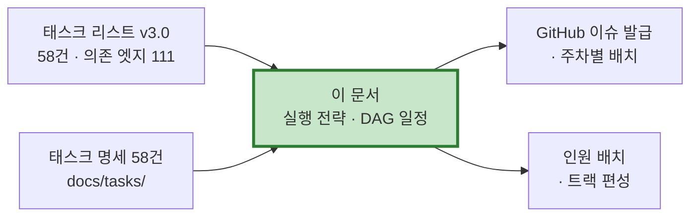
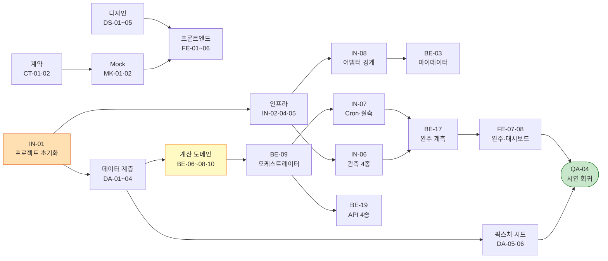
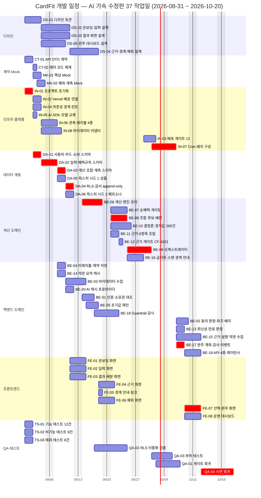
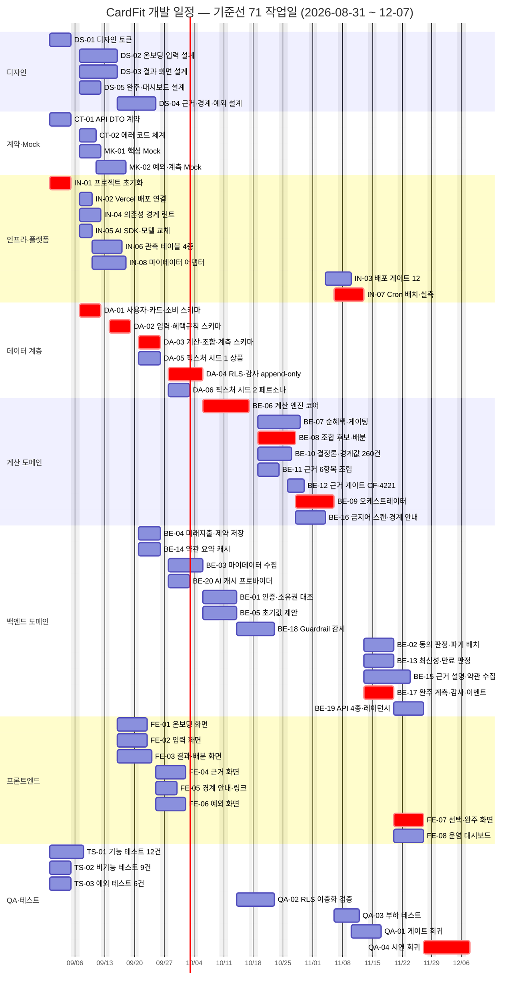
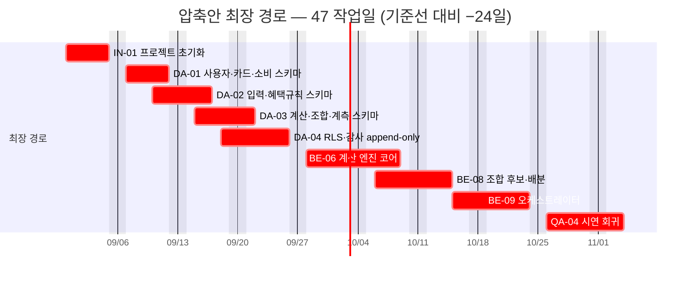

# [개발 실행 총괄] CardFit (한글)

# 태스크 58건의 실행 전략 · 의존성 구조 · DAG 기반 병렬 일정

**문서 ID:** EXE-CARDFIT-001

**개정 버전:** 1.1

**날짜:** 2026-08-26

**근거 문서:** TASK-CARDFIT-001 v3.0 (`[태스크 리스트] CardFit.md`) · `docs/tasks/` 태스크 명세 **58건**

**GitHub:** 이슈 **#1~#58** · 프로젝트 [maybeaj/projects/1](https://github.com/users/maybeaj/projects/1)

**참조 문서:** SRS-CARDFIT-001 · SDD-CARDFIT-001 · STD-CARDFIT-001 · CALC-CARDFIT-001 · FXT-CARDFIT-001 · GTD-CARDFIT-001 · TPL-CARDFIT-001

---

## 0. 이 문서의 역할

태스크 리스트는 **무엇을 만드는가**를, 태스크 명세 58건은 **각각을 어떻게 만드는가**를 정한다. 이 문서는 그 사이에 빠져 있던 **누가 언제 무엇을 동시에 하는가**를 채운다.



### 0.1 v1.1에서 달라진 것

**채택 계획이 AI 가속 수정판으로 바뀌었다.** v1.0은 사람 손 기준 기준선 71작업일과 압축안 47일을 제시했다. AI 보조 개발을 전제로 재산정한 결과 **29작업일**이 됐고, 이것이 GitHub 프로젝트에 등록된 일정이다.

| 판 | 총 기간 | 인일 | 근거 |
| --- | :---: | :---: | --- |
| v1.0 기준선 | 71일 (14주) | 313 | 체크리스트 항목 x 0.45 x 복잡도 계수 |
| v1.0 압축안 | 47일 (9주) | 313 | 위 + 압축 레버 4개 |
| **v1.1 채택 — AI 가속** | **37일 (7.4주)** | **160** | 위 + **작업 성격별 AI 가속 계수**(6.5절) + 저위험 레버 ④ |
| (미채택) AI 가속 + 레버 ① | 29일 (5.8주) | 160 | 위 + `IN-07` 분할 — **태스크 구조 변경을 수반해 보류**(6.4절) |

**58건 전건이 GitHub 이슈로 등록됐다**(#1~#58). 각 이슈는 `docs/tasks/<ID>.md`를 본문으로 갖고, 의존성 항목에 실제 이슈 번호가 채워져 있다.

### 0.1 이 문서가 정하는 것과 정하지 않는 것

| 정한다 | 정하지 않는다 |
| --- | --- |
| 트랙 편성과 트랙별 부하(인일) | 실제 담당자 배정 — 팀 구성에 따른다 |
| 태스크별 소요 산정 근거와 값 | 개인별 생산성 계수 |
| 임계 경로와 슬랙 | 휴가·장애 등 개별 리스크 |
| 병렬 실행 가능 구간과 최대 동시 실행 수 | 스프린트 세리머니 운영 방식 |
| 일정 압축 레버와 각각의 효과 | 압축 채택 여부 — **1건은 태스크 구조 변경을 수반한다**(6장) |

---

## 1. 실행 전략

### 1.1 다섯 가지 원칙

| # | 원칙 | 무엇을 지키나 | 어기면 |
| :---: | --- | --- | --- |
| **1** | **계약 우선** — `CT`·`MK`를 먼저 고정한다 | BE와 FE가 같은 응답 형태를 참조한다 | 두 태스크가 같은 계약을 다르게 구현해도 탐지되지 않는다 |
| **2** | **경계 먼저** — `IN-04`(의존성 린트)·`IN-08`(어댑터)을 코드가 쌓이기 전에 세운다 | ADR-02와 외부 연동 경계 | 나중에 세우면 이미 넘어간 의존성을 되돌려야 한다 |
| **3** | **픽스처 우선** — 외부 연동 없이 전 경로를 돌린다 | 개발·시연이 규제·계약 결정을 기다리지 않는다 | 🟡 5건(D1·D4·D9·D11·D13)이 다시 착수를 막는다 |
| **4** | **게이트 우선** — `BE-10`·`BE-16`·`IN-03`을 뒤로 미루지 않는다 | GR1·GR4를 사후 중단이 아니라 사전 차단으로 | 게이트 없이 쌓인 코드는 게이트를 켜는 순간 대량으로 막힌다 |
| **5** | **검증 이중화** — `QA-04`(참조 계산기 대조)와 `BE-10`(경계값 260건)을 함께 둔다 | 계산 명세 오독 | 두 검증이 같은 각도면 나란히 틀린다 |

### 1.2 트랙 편성

**58건을 8트랙으로 나눈다.** 트랙 경계는 태스크 접두어가 아니라 **동시에 만질 코드 영역**을 기준으로 잡았다 — `BE` 20건을 계산 도메인과 도메인·연동으로 쪼갠 이유다.

| 트랙 | 태스크 | 건수 | 부하(인일) | 최대 동시 | 활동 구간 |
| --- | --- | :---: | :---: | :---: | :---: |
| **디자인** | DS-01~05 | 5 | 31 | 3 | D+0 ~ D+19 |
| **계약·Mock** | CT-01·02 · MK-01·02 | 4 | 19 | 2 | D+0 ~ D+14 |
| **인프라·플랫폼** | IN-01~08 | 8 | 36 | 3 | D+0 ~ D+54 |
| **데이터 계층** | DA-01~06 | 6 | 31 | 2 | D+5 ~ D+26 |
| **계산 도메인** | BE-06~12 · BE-16 | 8 | 51 | 4 | D+26 ~ D+49 |
| **백엔드 도메인** | BE-01~05 · 13~15 · 17~20 | 12 | 67 | 4 | D+15 ~ D+64 |
| **프론트엔드** | FE-01~08 | 8 | 39 | 3 | D+12 ~ D+64 |
| **QA·테스트** | TS-01~03 · QA-01~04 | 7 | 39 | 3 | D+0 ~ D+71 |
| | **합계** | **58** | **313** | **10** | |

**권장 인원은 6명이다.** 총 313인일을 기준선 71작업일에 소화하려면 평균 4.4명이 상시 붙어야 하고, 최대 동시 실행이 10건이라 피크에는 더 필요하다. 6명 편성안:

| 역할 | 담당 트랙 | 부하 |
| --- | --- | :---: |
| 백엔드 A | 계산 도메인 | 51인일 |
| 백엔드 B | 백엔드 도메인 | 67인일 |
| 프론트엔드 | 프론트엔드 + Mock 소비 | 39인일 |
| 인프라·데이터 | 인프라·플랫폼 + 데이터 계층 | 67인일 |
| 디자인 | 디자인 (초반 집중 후 QA 지원) | 31인일 |
| QA | QA·테스트 + 계약 | 58인일 |

> **인프라·데이터 트랙이 임계 경로를 독점한다.** 임계 경로 12건 중 5건(IN-01·DA-01~04)이 이 한 사람에게 몰려 있다. **초반 5주는 이 트랙에 2명을 붙이는 것이 전체 일정에 가장 크게 기여한다**(6장 압축 레버 ①).

### 1.3 착수 조건 — Definition of Ready

태스크 하나를 시작하기 전에 아래가 모두 참이어야 한다.

- [ ] 선행 태스크가 **전건 완료**됐다 (`docs/tasks/<ID>.md`의 `Depends on`)
- [ ] 태스크 명세의 **References 문서를 읽었다** — 특히 계산 관련은 CALC, 픽스처 관련은 FXT
- [ ] AC의 판정 기준값이 **명세에서 온 것**임을 확인했다 (임의 값이 아니다)
- [ ] `mode:fixture` 태스크라면 **External Blocker의 재개 조건**을 이해했다

### 1.4 완료 조건 — 공통 DoD

전 태스크에 공통으로 걸리는 8항목이다. 태스크별 추가 항목은 각 명세의 DoD 절에 있다.

```
□ 모든 Acceptance Criteria를 충족하는가?
□ 대응 테스트 케이스(STD)가 구현되고 통과하는가?
□ 배포 게이트 ①·②를 통과하는가?                    (C-TEC-007a)
□ 의존성 경계 린트를 통과하는가?                     (ADR-02 · IN-04)
□ 픽스처 모드에서 외부 호출 0회로 동작하는가?           (FXT 1장)
□ Linter 경고가 없는가?
□ python3 tools/verify_docs.py 가 통과하는가?
□ 문서 갱신이 필요한 변경이면 해당 명세를 함께 고쳤는가?
```

**계산 도메인 4건(BE-06~08·BE-10)에는 한 항목이 더 붙는다** — `tools/fixtures/expected-results.json`의 페르소나 5인 × 시나리오 3개 결론 대조.

---

## 2. 의존성 구조

### 2.1 DAG 요약

| 항목 | 값 |
| --- | :---: |
| 노드 | **58** |
| 엣지 | **111** |
| 위상 계층 | **12** |
| 순환 | **0** |
| 진입점 (선행 없음) | 6 — CT-01 · DS-01 · IN-01 · TS-01~03 |
| 종착점 (후행 없음) | 다수, 최종 수렴점은 **QA-04** |
| 착수 차단 | **0** (SRS 10.3 해소 완료) |

### 2.2 트랙 수준 흐름

**111개 엣지를 전부 그리면 읽히지 않는다.** 트랙 사이의 인계 지점만 남긴 골격이다.



### 2.3 위상 계층 12개

**같은 계층 안의 태스크는 서로 의존하지 않는다** — 인원만 있으면 전부 동시에 갈 수 있다.

| 계층 | 건수 | 태스크 |
| :---: | :---: | --- |
| L1 | 6 | CT-01 · DS-01 · IN-01 · TS-01 · TS-02 · TS-03 |
| L2 | 9 | CT-02 · DA-01 · DS-02 · DS-03 · DS-05 · IN-02 · IN-04 · IN-05 · MK-01 |
| L3 | 8 | DA-02 · DS-04 · FE-01 · FE-02 · FE-03 · IN-06 · IN-08 · MK-02 |
| L4 | 7 | BE-04 · BE-14 · DA-03 · DA-05 · FE-04 · FE-05 · FE-06 |
| L5 | 4 | BE-03 · BE-20 · DA-04 · DA-06 |
| L6 | 3 | BE-01 · BE-05 · BE-06 |
| L7 | 6 | BE-07 · BE-08 · BE-10 · BE-11 · BE-18 · QA-02 |
| L8 | 3 | BE-09 · BE-12 · BE-16 |
| L9 | 3 | IN-03 · IN-07 · QA-03 |
| L10 | 5 | BE-02 · BE-13 · BE-15 · BE-17 · QA-01 |
| L11 | 3 | BE-19 · FE-07 · FE-08 |
| L12 | 1 | QA-04 |

### 2.4 허브 태스크 — 지연이 가장 크게 번지는 곳

| 태스크 | 후행 | 소요 | 슬랙 | 지연 시 무슨 일이 |
| :---: | :---: | :---: | :---: | --- |
| **DA-02** | 9건 | 5일 | **0일** | 계산 엔진·근거·AI·픽스처가 함께 밀린다. **가장 위험한 단일 태스크** |
| **DA-01** | 7건 | 5일 | **0일** | 데이터 계층 전체와 인증·마이데이터가 밀린다 |
| MK-01 | 6건 | 5일 | 48일 | FE 6건이 대기하지만 여유가 커서 흡수된다 |
| CT-01 | 5건 | 5일 | 45일 | Mock·근거·API가 대기, 여유로 흡수 |
| IN-06 | 5건 | 5일 | 41일 | 계측·가드레일·대시보드 대기, 여유로 흡수 |
| **DA-03** | 5건 | 5일 | **0일** | 계산 스키마가 없으면 오케스트레이션이 멈춘다 |
| **BE-06** | 5건 | 9일 | **0일** | 계산 도메인 전부 — 단일 태스크 중 소요 최대 |
| **IN-01** | 4건 | 5일 | **0일** | 모든 것의 시작점 |

> **후행이 많다고 위험한 것이 아니라, 후행이 많으면서 슬랙이 0인 것이 위험하다.** MK-01은 후행 6건이지만 48일 여유가 있어 하루 이틀 밀려도 전체 일정이 흔들리지 않는다. 반면 **DA-02는 후행 9건에 슬랙 0** — 하루 밀리면 전체가 하루 밀린다.

---

## 3. 일정 산정

### 3.1 소요 산정 방법

**추정을 근거 있는 수로 만들기 위해 태스크 명세의 체크리스트를 셌다.**

```
소요(일) = max(2, ceil(체크리스트 항목 수 × 0.45 × 복잡도 계수))
복잡도 계수 — H 1.4 · M 1.0 · L 0.8
```

| 항목 | 값 |
| --- | :---: |
| 체크리스트 총 항목 수 (`docs/tasks/` 58건) | **555** |
| 태스크당 항목 수 범위 | 7 ~ 13 |
| 산정 소요 합계 | **313 인일** |
| 태스크당 평균 | 5.4일 |

**이 산정의 성격을 분명히 해 둔다.** 체크리스트 항목은 작업의 **개수**이지 크기가 아니다. "Prisma 마이그레이션 생성"과 "S1 지출 정규화 구현"이 같은 1항목으로 세어졌다. 복잡도 계수가 그 차이를 거칠게 보정할 뿐이므로, **실측 2주 뒤 계수를 재조정하는 것을 전제로 쓴다.**

### 3.2 CPM 결과

| 항목 | 값 |
| --- | :---: |
| **기준선 총 기간** | **71 작업일** (약 14주 · 7스프린트) |
| 달력 기준 | 2026-08-31 ~ **2026-12-07** |
| 임계 경로 태스크 | **12건** |
| 최대 동시 실행 | **10건** (2주차) |
| 평균 동시 실행 | 4.4건 |

**슬랙 분포**

| 슬랙 | 건수 | 뜻 |
| :---: | :---: | --- |
| 0일 (임계) | **12** | 하루 밀리면 전체가 하루 밀린다 |
| 1~5일 | 0 | — |
| 6~15일 | 8 | 주의 구간 |
| 16일 이상 | **38** | 완충재. 자원을 임계 경로로 옮길 수 있다 |

> **슬랙이 양극화돼 있다.** 12건이 0일이고 38건이 16일 이상이다. 중간이 비어 있다는 것은 **임계 경로만 관리하면 나머지는 알아서 흡수된다**는 뜻이다.

### 3.3 임계 경로 — 12건 71일

| # | 태스크 | 이름 | 소요 | 착수(D+) | 완료(D+) |
| :---: | :---: | --- | :---: | :---: | :---: |
| 1 | **IN-01** | 프로젝트 초기화 | 5 | D+0 | D+5 |
| 2 | **DA-01** | 사용자·카드·소비 스키마 | 5 | D+5 | D+10 |
| 3 | **DA-02** | 입력·혜택규칙 스키마 | 5 | D+10 | D+15 |
| 4 | **DA-03** | 계산·조합·계측 스키마 | 5 | D+15 | D+20 |
| 5 | **DA-04** | RLS·감사 append-only | 6 | D+20 | D+26 |
| 6 | **BE-06** | 계산 엔진 코어 | 9 | D+26 | D+35 |
| 7 | **BE-08** | 조합 후보·배분 | 7 | D+35 | D+42 |
| 8 | **BE-09** | 오케스트레이터 | 7 | D+42 | D+49 |
| 9 | **IN-07** | Cron 배치 구성 | 5 | D+49 | D+54 |
| 10 | **BE-17** | 완주 계측·감사·이벤트 | 5 | D+54 | D+59 |
| 11 | **FE-07** | 선택·완주 화면 | 5 | D+59 | D+64 |
| 12 | **QA-04** | 시연 회귀 | 7 | D+64 | D+71 |

**임계 경로의 성격이 세 구간으로 나뉜다.**

1. **D+0 ~ D+26 — 스키마 직렬 구간 (IN-01 → DA-01~04, 26일)** 데이터 계층 4건이 순차로 걸려 있다. 실제로는 Prisma 마이그레이션이 배치로 실행되므로 **겹칠 여지가 가장 큰 구간**이다.
2. **D+26 ~ D+49 — 계산 도메인 구간 (BE-06 → BE-08 → BE-09, 23일)** 계산 엔진이 조합·배분·오케스트레이션의 전제라 논리적으로 직렬이다. 겹치려면 인터페이스를 먼저 고정해야 한다.
3. **D+49 ~ D+71 — 계측·완주 꼬리 구간 (IN-07 → BE-17 → FE-07 → QA-04, 22일)** **여기에 구조적 낭비가 있다.** `IN-07`은 Cron 구성과 서버리스 실측을 한 태스크로 묶었는데, Cron 구성은 `BE-09`를 기다릴 이유가 없다(6장).

---

## 4. Gantt 차트

### 4.1 채택 계획 — AI 가속 수정판 37 작업일

**빨간 막대가 임계 경로 12건이다.** 2026-08-31 착수 · **2026-10-20 종료**, 주말 제외. 이 일정이 GitHub 프로젝트에 등록된 값이다.



**임계 경로 12건은 기준선과 같지만 성격이 바뀌었다.** 기준선에서 26일이던 스키마 직렬 구간(IN-01→DA-01~04)이 **8일로 줄어** 전체의 22%가 됐고, 계산 도메인(BE-06→08→09)이 **15일로 41%**를 차지한다. **코드 생산이 빨라질수록 판단이 필요한 구간이 병목으로 드러난다.**

**꼬리 구간(IN-07→BE-17→FE-07→QA-04) 14일이 남아 있다.** 여기가 레버 ①(`IN-07` 분할)로 8일 더 줄일 수 있는 자리이며, 채택하면 29일이 된다(6.4절).

### 4.2 기준선 — 71 작업일 (참고)

사람 손 기준 원안이다. AI 가속을 전제하지 않는 팀이 인수할 때의 기준선으로 남긴다.



---

## 5. 병렬 실행 계획

### 5.1 주차별 최대 동시 실행

| 주차 | W1 | W2 | W3 | W4 | W5 | W6 | W7 | W8 | W9 | W10 | W11 | W12 | W13 | W14 | W15 |
| --- | :-: | :-: | :-: | :-: | :-: | :-: | :-: | :-: | :-: | :-: | :-: | :-: | :-: | :-: | :-: |
| 동시 실행 | 6 | **10** | 8 | 8 | 7 | 3 | 3 | 6 | 4 | 3 | 5 | 5 | 4 | 1 | 1 |

**부하가 앞에 몰려 있다.** 1~5주차에 6~10건이 동시에 돌고, 6~7주차에 3건으로 떨어진다. 이 골짜기는 **계산 도메인(BE-06)이 혼자 도는 구간**이며, 여기서 남는 인원을 어디에 쓸지가 5.3절의 문제다.

### 5.2 계층별 착수 묶음

| 주차 | 착수 | 성격 |
| :---: | --- | --- |
| **W1** | IN-01 · CT-01 · DS-01 · TS-01~03 | 진입점 6건. 서로 의존하지 않아 전부 동시 착수 |
| **W2** | DA-01 · CT-02 · MK-01 · IN-02·04·05 · DS-02·03·05 | 최대 부하 구간 |
| **W3~4** | DA-02·03 · MK-02 · IN-06·08 · DS-04 · FE-01~06 · BE-04·14 | Mock·픽스처가 나오며 FE 전면 착수 |
| **W5~6** | DA-04·05·06 · BE-03·20 · BE-01·05 | 보안 이중화와 픽스처 적재 |
| **W6~10** | **BE-06 → BE-07·08·10·11 → BE-09·12·16** | 계산 도메인. 임계 경로 |
| **W10~13** | IN-03·07 · BE-02·13·15·17·18 · QA-01·02·03 | 게이트·배치·계측 |
| **W13~15** | BE-19 · FE-07·08 · **QA-04** | API 마감 후 시연 회귀로 종료 |

### 5.3 슬랙을 어디에 쓰나

**여유가 가장 큰 5건**은 사실상 아무 때나 할 수 있다 — 인원이 남는 구간의 완충재로 쓴다.

| 태스크 | 슬랙 | 언제 끼워 넣나 |
| :---: | :---: | --- |
| TS-02 · TS-03 | 66일 | 진입점이라 언제든. **W6~7 골짜기 구간에 배치 권장** |
| TS-01 | 65일 | 12건으로 가장 크다. 분할해 두 사람이 나눠도 된다 |
| IN-04 | 61일 | **다만 원칙 2에 따라 W2에 한다** — 일정 여유와 무관하게 코드가 쌓이기 전이어야 한다 |
| FE-01 | 54일 | Mock 완료 후 아무 때나 |

> **`IN-04`가 슬랙 61일인데 W2에 하는 이유**는 일정이 아니라 **아키텍처 강제 시점** 때문이다. CPM은 "언제 해도 전체 일정에 영향 없다"고 말하지만, 늦게 하면 이미 넘어간 의존성을 되돌리는 작업이 새로 생긴다. **CPM이 보지 못하는 비용이다.**

---

## 6. 일정 압축안

### 6.1 태스크 리스트의 5스프린트 제안과의 충돌

태스크 리스트 4장은 **5스프린트(50작업일)**를 제안한다. 그러나 임계 경로가 **71일**이므로 **인원을 아무리 늘려도 5스프린트에 끝나지 않는다.** 임계 경로는 직렬이라 병렬화로 줄지 않는다.

**선택지는 둘이다** — ⓐ 7스프린트로 조정하거나, ⓑ 임계 경로 자체를 구조적으로 줄인다.

### 6.2 압축 레버 4개

| # | 레버 | 근거 | 효과 |
| :---: | --- | --- | :---: |
| **①** | **`IN-07` 분할** — Cron 구성(3일 · `IN-02`만 필요)과 서버리스 실측(2일 · `BE-09` 필요)을 나눈다 | 태스크 명세상 Cron 배치 구성은 `BE-09` 산출물을 쓰지 않는다. 실측(D15)만 계산 엔진을 기다린다 | **−15일** |
| **②** | **DA 체인 40% 겹침** — DA-01→02→03→04를 순차 대기 대신 부분 겹침 | 태스크 리스트 1.2절 *"Prisma 마이그레이션은 배치로 실행된다"* | **−6일** |
| **③** | **BE-06 → BE-08 40% 겹침** | `BE-08`은 `BE-06` 전체가 아니라 Gross 산출 인터페이스만 필요하다. 인터페이스를 먼저 고정하면 겹칠 수 있다 | **−3일** |
| **④** | **BE-17 → FE-07 40% 겹침** | `FE-07`은 Mock 기반으로 화면을 먼저 만들고 `BE-17` 연결만 뒤에 한다 | **−2일** |
| | **4건 동시 적용** | | **−24일 → 47일** |

**①이 압도적이다.** 나머지 셋을 다 합쳐도 −11일인데 ① 하나가 −15일이다. 이유는 `IN-07`이 임계 경로의 꼬리 구간을 **불필요하게 붙잡고 있기** 때문이다 — Cron 구성이 계산 오케스트레이터를 기다릴 이유가 없다.

### 6.3 압축안 Gantt — 최장 경로



**압축 후 최장 경로는 9건 47일**이며, 꼬리 구간(IN-07 → BE-17 → FE-07)이 사라지고 **QA-04가 BE-09 직후로 당겨진다.** 달력으로는 2026-11-03 종료 — **약 9주 반, 5스프린트에 근접한다.**

### 6.4 채택 조건과 리스크

| 레버 | 채택 조건 | 리스크 |
| :---: | --- | --- |
| ① | **태스크 리스트·병합 맵 수정 필요** — `IN-07`을 `IN-07a`(Cron 구성) · `IN-07b`(실측)로 분할하고 `BE-02`·`BE-13`·`BE-15`·`BE-17`의 선행을 `IN-07a`로 바꾼다 | 낮음. 의존 관계가 실제로 그렇다 |
| ② | DA 담당 2명 또는 스키마 초안을 먼저 합의 | 중간. 마이그레이션 충돌 가능 |
| ③ | `BE-06`의 Gross 산출 인터페이스를 **착수 시점에 먼저 고정** | 중간. 인터페이스가 흔들리면 재작업 |
| ④ | `FE-07`이 Mock 기반으로 선행 개발 | 낮음. Mock이 이미 있다 |

**권고 — ①과 ④를 먼저 채택한다.** 둘 다 리스크가 낮고 합쳐서 −17일이며, ①은 태스크 구조가 실제 의존을 잘못 담고 있던 것을 바로잡는 일이다. ②·③은 팀 규모가 확정된 뒤 판단한다.

> **①을 채택하면 태스크가 59건이 된다.** 태스크 리스트·`tools/task_merge_map.json`·`docs/tasks/` 파일 분할이 함께 따라간다. 채택 결정 전에는 기준선 71일로 계획한다.

### 6.5 AI 가속 산정 — 채택 계획의 근거

**AI 보조는 모든 작업을 같은 비율로 줄이지 않는다.** 코드를 쓰는 시간은 크게 줄지만, 무엇을 만들지 판단하는 시간과 시스템이 돌아가기를 기다리는 시간은 거의 줄지 않는다. 세 군으로 나눠 계수를 달리 적용했다.

| 군 | 계수 | 대상 | 왜 이 값인가 |
| :---: | :---: | --- | --- |
| **A 코드 생산** | **×0.35** | 계약·스키마·Mock·픽스처 적재·화면·테스트 코드 · 관측 테이블 (34건) | 명세가 이미 코드에 가깝다. 계약은 SRS §6.1 표, 스키마는 DDL, 화면은 DS 시안, 테스트는 STD 판정 SLO가 그대로 입력이 된다 |
| **B 판단·설계** | **×0.55** | 계산 도메인 · 인증 · 마이데이터 · 어댑터 경계 · AI 설명 (11건) | 계산 명세(CALC)가 S1~S6까지 구체적이라 AI가 옮길 수 있지만, **경계 판정과 예외 해석은 사람이 확인해야 한다** |
| **B' 디자인** | **×0.70** | DS-01~05 (5건) | *"그대로 두세요"* 를 실패로 보이지 않게 만드는 문제(DS-03)는 생성으로 풀리지 않는다 |
| **C 검증·측정** | **×0.80** | 배포 연결 · 게이트 · 실측 · 부하·보안·시연 회귀 (8건) | **사람 속도가 아니라 시스템 속도에 묶여 있다.** 부하 테스트는 부하를 거는 시간이, 실측은 함수가 도는 시간이 지배한다 |

**결과 — 313인일 → 160인일, 71작업일 → 37작업일.** 인일이 49% 줄었고 기간은 48% 줄었다. 임계 경로에 A군(스키마 4건)이 걸려 있어 앞부분이 크게 압축된 반면, 뒤쪽 B·C군은 그만큼 줄지 않았다.

**이 산정에서 조심할 것 두 가지.**

1. **C군이 줄지 않는다는 사실이 후반부를 지배한다.** 최장 경로 끝의 `QA-04`(시연 회귀)는 6일 그대로다. 앞이 빨라져도 검증은 그만큼 빨라지지 않는다.
2. **리뷰 부하가 계수에 반영돼 있지 않다.** 코드가 빨리 나오면 읽고 판단할 양도 함께 늘어난다. **A군 비중이 큰 주차(W1~W2, 착수 34건)에 리뷰 병목이 생길 수 있다.**

---

## 7. 리스크와 대응

| # | 리스크 | 신호 | 대응 |
| :---: | --- | --- | --- |
| **1** | **DA-02 지연** (후행 9건 · 슬랙 0) | W3 종료 시점에 미완료 | 데이터 트랙에 즉시 인원 추가. 슬랙 큰 트랙(QA·테스트)에서 차출 |
| **2** | **BE-06 소요 초과** (9일 · 단일 최대) | 체크리스트 절반이 W7에 미완 | 시나리오 3건 중 `AS_EXPECTED` 먼저 완성해 `BE-11`·`BE-10`을 먼저 풀어준다 |
| **3** | **서버리스 실행 상한 초과** (D15) | `IN-07` 실측에서 하드 타임아웃 관측 | SRS 1.5.2 갈래③의 ⓐ 분할 저장 ⓑ 백그라운드+폴링 중 선택. **어느 쪽이든 ADR-03(탭 전환 재계산 없음) 유지** |
| **4** | **참조 계산기와 제품 구현 불일치** | `QA-04`에서 12건 중 일부 어긋남 | 계산 명세 재확인. 두 구현 중 어느 쪽이 오독인지 판정 — 명세가 모호하면 CALC를 고치고 `rule_spec_version`을 올린다 |
| **5** | **소요 산정 자체가 틀림** | 2주 실측이 산정 대비 ±30% 초과 | 복잡도 계수를 재조정하고 CPM을 다시 돌린다. **3.1절이 이를 전제로 쓰였다** |
| **6** | **인증 방식 미결** (`BE-01`) | W5 착수 시점에 수단 미정 | SRS 미명시 항목이다. `BE-01` 이슈에서 결정하고 근거를 남긴다(태스크 리스트 §6 한계 1) |

---

## 8. 진행 관리

### 8.1 이슈 발급

```bash
# docs/tasks/<ID>.md 를 GitHub 이슈로 발급 후
# 각 파일의 #<이슈번호> 자리표시자를 실제 번호로 치환한다
# 발급 순서 = 배치 순서 (TPL-CARDFIT-001 3.2절)
```

**배치 순서를 지켜야 `Depends on`의 번호를 한 번에 채울 수 있다.** 선행 태스크의 이슈가 먼저 있어야 번호를 참조할 수 있기 때문이다.

### 8.2 주간 점검 항목

- [ ] **임계 경로 12건의 진척** — 이것만 지연되면 전체가 지연된다
- [ ] `DA-02`·`BE-06` 두 허브의 상태 (리스크 1·2)
- [ ] `python3 tools/verify_docs.py` — 104항목 통과 유지
- [ ] `python3 tools/generate_fixtures.py` — 페르소나 기대 결론 일치 유지
- [ ] 배포 게이트 ①·② 통과율 (W10 이후)

### 8.3 GitHub 연동 현황

**58건 전건이 이슈로 등록됐다.** 이슈 본문은 `docs/tasks/<ID>.md`와 같고, 의존성 항목의 `#번호`가 실제 이슈를 가리킨다.

| 항목 | 값 |
| --- | --- |
| 저장소 | `maybeaj/cardfit-prd-to-srs` |
| 이슈 번호 | **#1 ~ #58** (위상 순서로 발급) |
| 프로젝트 | [maybeaj/projects/1](https://github.com/users/maybeaj/projects/1) |
| 라벨 | 41종 — `part:` `epic:` `complexity:` `sprint:` + 보조 5축 |

### 8.4 태스크 ↔ 이슈 ↔ 일정 대조표

**🔴는 최장 경로다.** 슬랙 열의 `—`는 6일 이상 여유가 있어 사실상 아무 때나 할 수 있다는 뜻이다.

| 이슈 | 태스크 | 트랙 | 주차 | 소요 | 착수 | 완료 | 슬랙 |
| :---: | :---: | --- | :---: | :---: | :---: | :---: | :---: |
| #1 | **CT-01** | 계약·Mock | W1 | 2일 | 2026-08-31 | 2026-09-01 | — |
| #2 | **DS-01** | 디자인 | W1 | 4일 | 2026-08-31 | 2026-09-03 | — |
| #3 | **IN-01** | 인프라·플랫폼 | W1 | 2일 | 2026-08-31 | 2026-09-01 | 🔴 |
| #4 | **TS-01** | QA·테스트 | W1 | 2일 | 2026-08-31 | 2026-09-01 | — |
| #5 | **TS-02** | QA·테스트 | W1 | 2일 | 2026-08-31 | 2026-09-01 | — |
| #6 | **TS-03** | QA·테스트 | W1 | 2일 | 2026-08-31 | 2026-09-01 | — |
| #7 | **CT-02** | 계약·Mock | W1 | 1일 | 2026-09-02 | 2026-09-02 | — |
| #8 | **DA-01** | 데이터 계층 | W1 | 2일 | 2026-09-02 | 2026-09-03 | 🔴 |
| #9 | **DS-02** | 디자인 | W1 | 5일 | 2026-09-04 | 2026-09-10 | — |
| #10 | **DS-03** | 디자인 | W1 | 5일 | 2026-09-04 | 2026-09-10 | — |
| #11 | **DS-05** | 디자인 | W1 | 4일 | 2026-09-04 | 2026-09-09 | — |
| #12 | **IN-02** | 인프라·플랫폼 | W1 | 2일 | 2026-09-02 | 2026-09-03 | — |
| #13 | **IN-04** | 인프라·플랫폼 | W1 | 2일 | 2026-09-02 | 2026-09-03 | — |
| #14 | **IN-05** | 인프라·플랫폼 | W1 | 1일 | 2026-09-02 | 2026-09-02 | — |
| #15 | **MK-01** | 계약·Mock | W1 | 2일 | 2026-09-02 | 2026-09-03 | — |
| #16 | **DA-02** | 데이터 계층 | W1 | 2일 | 2026-09-04 | 2026-09-07 | 🔴 |
| #17 | **DS-04** | 디자인 | W2 | 5일 | 2026-09-11 | 2026-09-17 | — |
| #18 | **FE-01** | 프론트엔드 | W2 | 2일 | 2026-09-11 | 2026-09-14 | — |
| #19 | **FE-02** | 프론트엔드 | W2 | 2일 | 2026-09-11 | 2026-09-14 | — |
| #20 | **FE-03** | 프론트엔드 | W2 | 2일 | 2026-09-11 | 2026-09-14 | — |
| #21 | **IN-06** | 인프라·플랫폼 | W1 | 2일 | 2026-09-04 | 2026-09-07 | — |
| #22 | **IN-08** | 인프라·플랫폼 | W1 | 3일 | 2026-09-04 | 2026-09-08 | — |
| #23 | **MK-02** | 계약·Mock | W1 | 2일 | 2026-09-03 | 2026-09-04 | — |
| #24 | **BE-04** | 백엔드 도메인 | W2 | 2일 | 2026-09-08 | 2026-09-09 | — |
| #25 | **BE-14** | 백엔드 도메인 | W2 | 2일 | 2026-09-08 | 2026-09-09 | — |
| #26 | **DA-03** | 데이터 계층 | W2 | 2일 | 2026-09-08 | 2026-09-09 | 🔴 |
| #27 | **DA-05** | 데이터 계층 | W2 | 2일 | 2026-09-08 | 2026-09-09 | — |
| #28 | **FE-04** | 프론트엔드 | W3 | 2일 | 2026-09-18 | 2026-09-21 | — |
| #29 | **FE-05** | 프론트엔드 | W3 | 1일 | 2026-09-18 | 2026-09-18 | — |
| #30 | **FE-06** | 프론트엔드 | W3 | 2일 | 2026-09-18 | 2026-09-21 | — |
| #31 | **BE-03** | 백엔드 도메인 | W2 | 3일 | 2026-09-10 | 2026-09-14 | — |
| #32 | **BE-20** | 백엔드 도메인 | W2 | 2일 | 2026-09-10 | 2026-09-11 | — |
| #33 | **DA-04** | 데이터 계층 | W2 | 2일 | 2026-09-10 | 2026-09-11 | 🔴 |
| #34 | **DA-06** | 데이터 계층 | W2 | 2일 | 2026-09-10 | 2026-09-11 | — |
| #35 | **BE-01** | 백엔드 도메인 | W3 | 3일 | 2026-09-14 | 2026-09-16 | — |
| #36 | **BE-05** | 백엔드 도메인 | W3 | 3일 | 2026-09-15 | 2026-09-17 | — |
| #37 | **BE-06** | 계산 도메인 | W3 | 5일 | 2026-09-14 | 2026-09-18 | 🔴 |
| #38 | **BE-07** | 계산 도메인 | W4 | 4일 | 2026-09-21 | 2026-09-24 | — |
| #39 | **BE-08** | 계산 도메인 | W4 | 4일 | 2026-09-21 | 2026-09-24 | 🔴 |
| #40 | **BE-10** | 계산 도메인 | W4 | 5일 | 2026-09-21 | 2026-09-25 | — |
| #41 | **BE-11** | 계산 도메인 | W4 | 2일 | 2026-09-21 | 2026-09-22 | — |
| #42 | **BE-18** | 백엔드 도메인 | W3 | 4일 | 2026-09-17 | 2026-09-22 | — |
| #43 | **QA-02** | QA·테스트 | W3 | 6일 | 2026-09-17 | 2026-09-24 | — |
| #44 | **BE-09** | 계산 도메인 | W4 | 4일 | 2026-09-25 | 2026-09-30 | 🔴 |
| #45 | **BE-12** | 계산 도메인 | W4 | 1일 | 2026-09-23 | 2026-09-23 | — |
| #46 | **BE-16** | 계산 도메인 | W4 | 2일 | 2026-09-25 | 2026-09-28 | — |
| #47 | **IN-03** | 인프라·플랫폼 | W5 | 3일 | 2026-09-29 | 2026-10-01 | — |
| #48 | **IN-07** | 인프라·플랫폼 | W5 | 4일 | 2026-10-01 | 2026-10-06 | 🔴 |
| #49 | **QA-03** | QA·테스트 | W5 | 3일 | 2026-10-01 | 2026-10-05 | — |
| #50 | **BE-02** | 백엔드 도메인 | W6 | 3일 | 2026-10-07 | 2026-10-09 | — |
| #51 | **BE-13** | 백엔드 도메인 | W6 | 2일 | 2026-10-07 | 2026-10-08 | — |
| #52 | **BE-15** | 백엔드 도메인 | W6 | 4일 | 2026-10-07 | 2026-10-12 | — |
| #53 | **BE-17** | 백엔드 도메인 | W6 | 2일 | 2026-10-07 | 2026-10-08 | 🔴 |
| #54 | **QA-01** | QA·테스트 | W5 | 4일 | 2026-10-02 | 2026-10-07 | — |
| #55 | **BE-19** | 백엔드 도메인 | W6 | 2일 | 2026-10-09 | 2026-10-12 | — |
| #56 | **FE-07** | 프론트엔드 | W6 | 2일 | 2026-10-09 | 2026-10-12 | 🔴 |
| #57 | **FE-08** | 프론트엔드 | W6 | 2일 | 2026-10-09 | 2026-10-12 | — |
| #58 | **QA-04** | QA·테스트 | W7 | 6일 | 2026-10-13 | 2026-10-20 | 🔴 |

### 8.5 완료 판정

**전 태스크 완료 = `QA-04` 통과.** 페르소나 5인 × 시나리오 3개의 결론이 `expected-results.json`과 전건 일치하고, 배포 게이트 2건이 살아 있으며, `verify_docs.py`가 통과하는 상태다.

---

## 9. 이 문서가 정하지 않은 것

1. **소요 산정은 체크리스트 항목 수 기반의 근사다.** 항목의 크기 차이를 복잡도 계수로만 보정했다. 2주 실측 후 재조정을 전제로 한다(3.1절).
2. **인원 배치안은 6명 가정이다.** 팀 규모가 다르면 트랙 병합·분할이 필요하고 임계 경로 외 태스크의 배치가 달라진다.
3. **압축 레버 ①은 태스크 구조 변경을 수반한다.** 채택 전까지 기준선 71일이 유효한 계획이다.
4. **달력 일정은 2026-08-31 착수·주말 제외 기준이다.** 공휴일을 반영하지 않았다.
5. **🟡 5건(D1·D4·D9·D11·D13)이 실서비스 전환 시 다시 열린다.** 그때의 추가 일정은 이 문서 범위 밖이다(태스크 리스트 3.1절).

---

*근거 문서: `[태스크 리스트] CardFit.md` (TASK-CARDFIT-001 v3.0) · `docs/tasks/` 58건*

*작성자: 기획 분석가, 검토자: 개발팀 리드, 승인자: 제품 책임자 (PM)*
