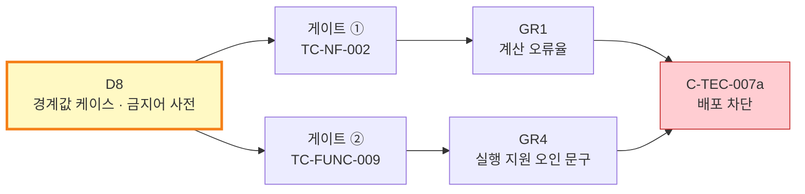

# [배포 게이트 데이터] CardFit (한글)

# 경계값 케이스 및 금지어 사전 명세 (D8)

**문서 ID:** GTD-CARDFIT-001

**개정 버전:** 1.0

**날짜:** 2026-08-25

**근거 문서:** STD-CARDFIT-001 v1.0 (`[테스트 명세서] CardFit (한글).md`)

**참조 문서:** SRS-CARDFIT-001 (`[SRS 문서] CardFit (한글).md`)

**해소 대상:** 의존성 D8 (SRS 10.3)

---

## 0. 이 문서가 해소하는 것

**의존성 D8** — *경계값 테스트 케이스 ≥ 200건 · GR4 금지어 사전* 이 미작성이었다. **D8은 배포 게이트 2건을 모두 막고 있었다.**



D8이 없으면 C-TEC-007a(배포 게이트 허용)를 확정한 의미가 사라진다. 게이트를 구성할 데이터가 없기 때문이다.

### 0.1 산출물

| 파일 | 역할 | 소비 대상 |
| --- | --- | :---: |
| `tools/generate_boundary_cases.py` | 경계 차원 정의 + 케이스 생성기 | 게이트 ① |
| `tools/boundary-cases.json` | 생성된 케이스 **260건** | 게이트 ① |
| `tools/prohibited-terms.json` | 금지어 사전 — 6 카테고리 · 패턴 **32개** · 허용목록 6개 | 게이트 ② |
| `tools/scan_prohibited_terms.py` | 스캐너 구현 (allowlist 우선 판정) | 게이트 ② |
| `tools/scan-samples.json` | 스캐너 자체 검증 샘플 **31건** | 게이트 ② 회귀 |

**개수를 주장하지 않고 생성·실행해 확인했다.** 아래 결과는 실제 실행 출력이다.

```
$ python3 tools/generate_boundary_cases.py
생성: 260건 → tools/boundary-cases.json
  단독 53건 / 조합 207건
  게이트 요구 200건: ✅ 충족

$ python3 tools/scan_prohibited_terms.py
샘플 31건 / 판정 불일치 0건
종료코드: 0
```

---

## 1. 경계값 케이스 — 게이트 ① (TC-NF-002)

### 1.1 왜 손으로 200건을 쓰지 않았나

경계값 200건을 일일이 나열하면 **빠진 조합을 확인할 수 없고, 규칙이 바뀔 때마다 200건을 손으로 고쳐야 한다.** 그래서 **경계 차원을 정의하고 생성**한다. 차원이 늘면 케이스가 자동으로 늘고, 커버리지를 세어 확인할 수 있다.

### 1.2 경계 차원 9개 — 단독 53건

각 차원의 경계값을 전수 열거한다. **"바로 아래 · 정확히 · 바로 위"** 세 지점이 계산 오류가 가장 자주 나는 곳이다.

| 차원 | 값 수 | 경계 지점 | 대응 요구사항 |
| --- | :---: | --- | :---: |
| **실적구간** | 8 | 하한 −1원 / 하한 / 하한 +1원 / 상한 −1원 / 상한 / 상한 +1원 / 최저 미달 / 최고 초과 | REQ-FUNC-003 |
| **통합할인한도** | 5 | 한도 −1원 / 한도 / 한도 +1원 / 한도 0원 / 한도 없음 | REQ-FUNC-003 |
| **연회비** | 6 | 0원 / 일반 / 사용자 상한 −1원·정확히·+1원 / 조합 합산 초과 | REQ-FUNC-004 |
| **제외항목** | 5 | 없음 / 전액 / 일부 / 실적에만 / 혜택에만 | REQ-FUNC-003 |
| **시나리오** | 3 | 적게 / 예상대로 / 많이 | REQ-FUNC-003 |
| **게이팅 임계값** | 8 | 절대 −1원·정확히·+1원 / 상대 미달·정확히 / **절대 통과·상대 미달** / **절대 미달·상대 통과** / Net 음수 | REQ-FUNC-004 |
| **배분 나눗셈** | 4 | 나누어떨어짐 / 1원 남음 / 2원 남음 / 3분할 | REQ-FUNC-005 |
| **만료·최신성** | 8 | 기준일 +29·30·31일 / rule_version 동일·변경 / `verified_at` 29·30·31일 | REQ-EXC-006 · REQ-NF-007 |
| **카드 수** | 6 | 0 / 1 / 2 / 5 / 10 / 20장 | REQ-FUNC-003 |

**게이팅 차원의 교차 케이스 2건이 특히 중요하다** — *절대 임계는 통과했는데 상대 임계는 미달* 인 경우, 그리고 그 반대. 둘 다 `KEEP_CURRENT`여야 한다. 어느 한쪽만 보고 판정하면 GR2 위반이 된다.

### 1.3 상호작용 쌍 6개 — 조합 207건

전체 데카르트 곱(수십만 건)은 불필요하다. **상호작용이 실재하는 쌍만** 조합한다.

| 쌍 | 왜 상호작용하나 | 건수 |
| --- | --- | :---: |
| 실적구간 × 제외항목 | 제외항목이 실적 산정액을 바꿔 구간이 이동한다 | 40 |
| 실적구간 × 시나리오 | 시나리오별 지출액이 실적구간을 바꾼다 | 24 |
| 통합할인한도 × 시나리오 | 지출 증감이 한도 도달 여부를 바꾼다 | 15 |
| 게이팅 × 배분 | 게이팅 통과 후 배분 합계 정합성이 이어진다 | 32 |
| 게이팅 × 연회비 | 연회비가 전환비용을 통해 Net Benefit에 들어간다 | 48 |
| 만료 × 카드 수 | 카드마다 `rule_version`이 달라 만료 판정이 갈린다 | 48 |
| | **합계** | **207** |

**단독 53 + 조합 207 = 260건.** 게이트 요구(200건)를 충족한다.

### 1.4 파라미터 — **바인딩 완료** (2026-08-25)

**D2·D5가 확정돼 260건 전건에 주입됐다.** 값의 정본은 `[계산 명세서] CardFit (한글).md`(CALC-CARDFIT-001) 1장이다.

| 파라미터 | 값 | 의존성 | 근거 |
| --- | :---: | :---: | :---: |
| `abs_threshold` | **3000** (원/월) | **D2** | CALC 3.3절 |
| `rel_threshold` | **0.10** | **D2** | CALC 3.3절 |
| `scenario_delta` | **0.20** | **D5** | CALC 5장 |

```bash
python3 tools/generate_boundary_cases.py --abs 3000 --rel 0.10 --delta 0.20 \
        -o tools/boundary-cases.json
# → params_bound: true
```

**케이스 구조를 파라미터와 분리해 둔 설계가 값을 치렀다.** D2·D5를 기다리는 동안 게이트 배관을 먼저 만들었고, 확정 후 명령 한 번으로 260건이 바인딩됐다.

### 1.5 게이트 판정 기준

| 항목 | 기준 |
| --- | --- |
| 통과 조건 | 260건 전건 기대값 일치 · 계산 오류율 **≤ 0.1%** |
| 결정론성 | 동일 입력 10회 반복의 **응답 해시 전건 동일** |
| 배분 정합 | 합계와 입력 총액 오차 **≤ 1원** |
| 실패 시 | **배포 차단** (GR1 위반) |

---

## 2. 금지어 사전 — 게이트 ② (TC-FUNC-009)

### 2.1 카테고리 6개

금지어는 취향이 아니라 **각각 어떤 결정을 지키기 위한 것인지**가 정해져 있다.

| ID | 카테고리 | 지키려는 것 | 심각도 |
| :---: | --- | --- | :---: |
| **PT-A** | 실행 대행 암시 | **ADR-04** — 대행 권한이 없다 | block |
| **PT-B** | 혜택 보장·확정 표현 | 계산은 규칙 기반 **예상치**다 | block |
| **PT-C** | AI 계산·판단·추천 주체 표현 | **ADR-02** — 혜택 계산과 **최종 조합 추천**은 규칙 엔진이 한다. AI 허용 기능은 **약관 요약**과 **추천 근거 설명** 둘뿐이다 | block |
| **PT-D** | 금융 상담·자문 표현 | **D9** 모집인·재무자문 규제 분류 미확인 | block |
| **PT-E** | 재촉·독려 표현 | **REQ-FUNC-010** — 측정 전용, 개입 없음 | block |
| **PT-F** | 만료·최신성 은폐 표현 | **ADR-06** — 기준일 노출이 근거 공개의 조건 | warn |

각 카테고리에 **허용 대체 표현**을 함께 적었다. 금지만 하면 작성자가 무엇을 써야 하는지 알 수 없다.

| 금지 예 | 허용 대체 |
| --- | --- |
| *"저희가 대신 해지해 드립니다"* | *"신청·해지는 카드사에서 직접 진행하셔야 합니다"* |
| *"연 34만원 혜택을 보장합니다"* | *"입력하신 지출 계획을 기준으로 계산한 예상 금액입니다"* |
| *"AI가 최적 카드를 계산해 추천합니다"* | *"계산 결과를 쉬운 말로 정리했습니다"* |
| *"항상 최신 정보 기준입니다"* | *"○○○○년 ○○월 ○○일 기준으로 계산했습니다"* |

### 2.2 허용목록이 먼저 적용된다

**필수 문구가 금지어를 포함한다.** REQ-FUNC-009가 노출을 의무화한 경계 안내는 *"신청·**해지**는 카드사에서 직접 진행하셔야 합니다"* 로, `해지`가 들어 있다.

그래서 스캐너는 **허용목록 문구를 먼저 제거한 뒤 잔여 텍스트에만 패턴을 적용**한다. 순서를 바꾸면 **요구사항이 의무화한 문구가 배포를 막는다.**

| 허용목록 | 근거 |
| --- | :---: |
| 신청·해지는 카드사에서 직접 진행하셔야 합니다 | REQ-FUNC-009 |
| 해지는 이 단계 대상이 아닙니다 | SRS 1.2 |
| 카드사 공식 신청 페이지로 이동합니다 | SRS 1.2 |
| 이 계산에는 포함되지 않았습니다 | REQ-FUNC-006 |
| 최근 확인된 데이터 기준 | REQ-EXC-003 |
| 현재 조합 유지 | REQ-FUNC-004 |

### 2.3 스캐너를 만들어 검증했더니 사전에 구멍이 있었다

사전만 작성하고 끝내지 않고 스캐너를 구현해 27건 샘플로 돌렸다. **1차 실행에서 1건이 통과해 버렸다.**

```
❌  block   AI가 최적 카드를 계산해 추천합니다        적발: -
```

원인은 패턴이 `AI가` **바로 뒤**만 보고 있었다는 점이다. *"AI가 **최적 카드를** 계산해"* 처럼 목적어가 끼면 놓친다.

**보강**: 목적어 삽입을 허용하되(최대 24자), *"계산 **결과**"* 같은 명사구는 부정 전방탐색으로 제외했다. **AI가 계산 결과를 설명하는 것은 허용**되기 때문이다(ADR-02).

```
허용: AI가 계산 결과를 쉬운 말로 설명합니다     ← 설명 = ADR-02 준수
금지: AI가 지출 패턴을 분석해 판단합니다        ← 판단 = ADR-02 위반
```

이 구분이 PT-C의 핵심이다. **"AI"와 "계산"이 같은 문장에 있다는 것만으로는 위반이 아니다.** AI가 계산의 *주체*로 서술되는 것이 위반이다.

**보강 후 재실행 — 샘플 27건 전건 일치, 종료코드 0.**

### 2.4 게이트가 반드시 걸려야 하는 경로

| 경로 | 왜 위험한가 |
| --- | --- |
| 일반 코드·문구 변경 | 기본 경로 |
| **AI 모델 식별자 변경 (환경 변수)** | C-TEC-006이 환경 변수만으로 모델 교체를 허용한다. **코드 변경이 없어 게이트를 우회할 수 있다.** 모델이 바뀌면 같은 근거에 다른 문장이 나오므로 반드시 재스캔해야 한다 |
| AI 프롬프트 변경 | 출력 문체가 바뀐다 |

### 2.5 사전 유지보수 규칙

| 상황 | 조치 |
| --- | --- |
| 새 금지어를 추가할 때 | **샘플에 block 케이스와 pass 케이스를 함께 추가**한다. pass 케이스가 없으면 오탐을 알 수 없다 |
| 허용목록에 문구를 추가할 때 | 그 문구가 실제로 요구사항이 의무화한 것인지 확인한다. 오탐 회피용 추가는 GR4를 무력화한다 |
| 패턴을 넓힐 때 | 스캐너를 다시 돌려 **pass 8건이 여전히 통과하는지** 확인한다 |

---

## 3. 남은 것

| 항목 | 상태 |
| --- | --- |
| 경계값 케이스 구조 260건 | ✅ 완료 |
| 금지어 사전 6 카테고리 · 패턴 32개 | ✅ 완료 |
| 스캐너 구현 + 자체 검증 31건 | ✅ 완료 |
| **경계값 파라미터 바인딩** | ✅ **완료** — `params_bound: true` (D2·D5 주입) |
| **경계값 기대 숫자 산출** | ⬜ **BE-10에서 수행.** D16이 확정돼(CALC 2~4장) 규칙은 있고, 각 지점의 금액은 계산 엔진 구현 후 산출한다 |
| 게이트를 실제 Git Push에 연결 | ⬜ 코드 저장소 생성 후 |
| 실행 파일 형태의 회귀 스위트 | ⬜ 계산 엔진 구현 후 (케이스는 준비됨) |

**D8 자체는 해소됐다.** 게이트 2건을 구성할 데이터와 판정 로직이 준비됐고, 게이트 ②는 지금 바로 돌려 검증할 수 있다. 게이트 ①은 계산 엔진이 생기면 케이스를 그대로 먹인다.

**금지어 게이트는 픽스처 문구에도 적용했다.** AI 근거 설명 5건 · 약관 요약 24건 · 약관 원문 24건 = **53건 전건**을 스캔해 `block` 적발 0건을 확인했다(FXT 7.3절).

---

*작성자: 기획 분석가, 검토자: 계산 품질 · 컴플라이언스·보안, 승인자: 제품 책임자 (PM)*
