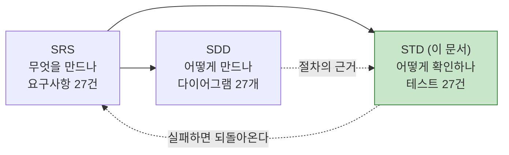
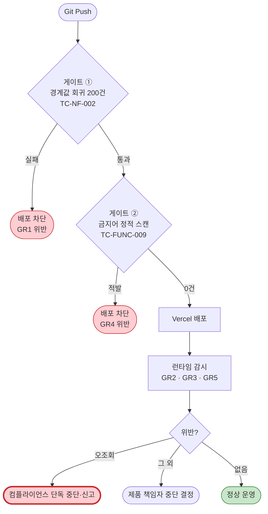

# [테스트 명세서] CardFit (한글)

# 소프트웨어 테스트 명세서 (STD)

**문서 ID:** STD-CARDFIT-001

**개정 버전:** 1.0

**날짜:** 2026-08-25

**근거 문서:** SRS-CARDFIT-001 v1.0 (`[SRS 문서] CardFit (한글).md`)

**참조 문서:** SDD-CARDFIT-001 (`[설계 문서] CardFit (한글).md`) · GTD-CARDFIT-001 (`[배포 게이트 데이터] CardFit (한글).md`)

---

## 0. 이 문서를 읽는 방법

### 0.1 왜 별도 문서인가

SRS 5장 추적성 매트릭스가 `TC-FUNC-001` ~ `TC-EXC-006` **27개 ID를 발행**했으나 그 내용이 어디에도 없었다. 이 문서가 그 ID들의 본문이다.

SRS 본문에 넣지 않은 이유는 두 가지다. 표준 양식(`[SRS 문서] AD-Core-Platform`)이 추적성 매트릭스에 **TC ID만 나열**하고 본문을 두지 않으며, 테스트 케이스는 요구사항이 아니라 **검증 산출물**이다. SRS 11장은 검증 *접근*(29148 9.6.19)을 규정하고, 이 문서는 그 접근의 *실행 단위*를 규정한다.

### 0.2 테스트 케이스가 도출된 근거

**새로 만든 판정 기준이 없다.** 모든 기대 결과와 SLO는 SRS에 이미 있는 값을 옮긴 것이다.

| 테스트 케이스 항목 | 어디서 왔나 |
| --- | --- |
| 사전조건 · 절차 | SDD 5장 시퀀스 다이어그램 · 6장 순서도 |
| 기대 결과 | SRS 4.1·4.2·4.3의 **인수 기준** 열 |
| 판정 SLO | SRS 5.1·5.2의 **SLO** 열 · 4.2의 **임계치** |
| 상태 전이 검증 | SRS 6.5 · SDD 7장 |

### 0.3 테스트 유형

| 유형 | 뜻 | 실행 시점 |
| --- | --- | --- |
| **단위** | 함수·클래스 하나를 떼어 확인 | 코드 변경마다 |
| **통합** | 여러 컴포넌트를 이어 확인 | 코드 변경마다 |
| **E2E** | 사용자 화면부터 DB까지 전 구간 | 배포 전 · 일간 |
| **부하** | 목표 처리량에서 응답 시간 측정 | 주요 변경 시 |
| **보안** | 접근 제어·권한 확인 | 배포 전 · 상시 |
| **회귀** | 기존 동작이 깨지지 않았는지 확인 | **배포 게이트** (C-TEC-007a) |
| **배치** | 주기 작업이 정상 동작하는지 확인 | 일간 |

### 0.4 우선순위

| 등급 | 뜻 | 해당 |
| :---: | --- | --- |
| **P0** | **하나라도 실패하면 배포·서비스 중단.** Guardrail 5건에 대응 | TC-FUNC-004·006·009 · TC-NF-002·004 · TC-EXC-002 |
| **P1** | Must Have 요구사항 검증 | 나머지 Must 대응 케이스 |
| **P2** | Should Have · Could Have | TC-FUNC-008·010·011·012 |

---

## 1. 기능 테스트 — TC-FUNC-001 ~ 012

### TC-FUNC-001 미래지출 입력

| 항목 | 내용 |
| --- | --- |
| **대응 요구사항** | REQ-FUNC-001 (Must) · AC-07 |
| **유형 · 우선순위** | 통합 · **P1** |
| **사전조건** | 마이데이터 연동 완료(REQ-FUNC-002), 로그인 상태 |
| **절차** | ① 미래지출 입력 화면 진입 ② 카테고리를 **목록에 없는 자유 문자열**로 입력 ③ 금액·시점·확실도 입력 ④ 저장 ⑤ **금액을 음수(지출 감소)로** 입력해 ②~④ 반복 |
| **기대 결과** | 두 건 모두 `future_spend_plans`에 저장된다. 자유 카테고리가 거부되지 않고, 감소 방향도 오류 없이 처리된다 |
| **판정 SLO** | 이벤트 필수 선택 단계 **0개** · 감소 방향 처리 실패 **0건** · 자유 카테고리 거부 **0건** |
| **실패 시** | REQ-FUNC-001·008 재설계. 이벤트 비종속(US-F)이 성립하지 않는다 |

### TC-FUNC-002 마이데이터 연동 및 제약조건 수집

| 항목 | 내용 |
| --- | --- |
| **대응 요구사항** | REQ-FUNC-002 (Must) · AC-01 · AC-F4 |
| **유형 · 우선순위** | 통합 · **P1** |
| **사전조건** | 마이데이터 연동 환경(**D11 확정 필요** — 고정 IP·인증서), 테스트 계정 |
| **절차** | ① 동의 범위 확인 후 동의 ② 보유카드·과거소비 수집 확인 ③ 제약조건(최대 카드 수·연회비 상한·신규 발급 허용) 입력·저장 ④ **동의 상태를 `EXPIRED`로 변경** ⑤ 계산 요청 |
| **기대 결과** | ①~③은 정상 저장. ⑤는 `400`과 재동의 유도를 반환한다 |
| **판정 SLO** | 수집 데이터 누락 **0건** · 만료 상태 계산 수행 **0건** · `consent_status` 전이가 6.5 규칙과 일치 |
| **실패 시** | 계산 불성립. REQ-FUNC-003 이후 전부 차단 |

### TC-FUNC-003 순혜택 시나리오 계산 — 3개 사전 계산

| 항목 | 내용 |
| --- | --- |
| **대응 요구사항** | REQ-FUNC-003 (Must) · AC-06 · REQ-NF-005 |
| **유형 · 우선순위** | 통합 · **P1** |
| **사전조건** | 보유카드 ≥ 1장, 미래지출 ≥ 1건, `benefit_rules` 적재(**D4 확정 필요**), 증감 폭 설정(**D5 확정 필요**) |
| **절차** | ① `POST /api/v1/calculate` 호출 ② 응답에서 시나리오 3건 확인 ③ **마이데이터 API 호출 수를 계측** ④ 각 탭의 지출 가정 캡션 확인 ⑤ **탭을 전환하며 재계산 발생 여부 관측** |
| **기대 결과** | `calculation_scenarios`에 `LESS`·`AS_EXPECTED`·`MORE` 3행이 생성된다. 탭 전환은 조회만 발생시킨다 |
| **판정 SLO** | 시나리오 3건 생성 · **마이데이터 호출 = 1회**(REQ-NF-005) · 탭 전환 재계산 **0건** · 캡션 누락 **0건** |
| **실패 시** | 호출이 2회 이상이면 단위경제 붕괴. SDD 5.1의 `collectOnce` 위치 오류를 확인한다 |

### TC-FUNC-004 조합 최적화 및 Net Benefit 게이팅 🔴

| 항목 | 내용 |
| --- | --- |
| **대응 요구사항** | REQ-FUNC-004 (Must) · AC-05 · **GR2** · ADR-01 |
| **유형 · 우선순위** | 통합 + 회귀 · **P0 — 배포 게이트** |
| **사전조건** | TC-FUNC-003 통과, **Net Benefit 임계값 확정(D2)** |
| **절차** | ① Net Benefit이 **임계값 바로 위**인 케이스로 계산 ② Net Benefit이 **임계값 바로 아래**인 케이스로 계산 ③ 전환비용 3항목이 각각 반영됐는지 확인 ④ **전체 판정 로그를 임계값과 전건 대조** |
| **기대 결과** | ①은 `RECOMMEND_CHANGE` + 차액 원 단위 표시. ②는 `KEEP_CURRENT`("현재 조합 유지") |
| **판정 SLO** | "유지" 반환률 **100%**(임계 미달 전건) · **임계 미달인데 변경 제안 0건** · 차액 표기 누락 0건 |
| **실패 시** | **GR2 위반 = 즉시 서비스 중단.** 1건이라도 발생하면 배포하지 않는다 |
| **비고** | 임계값 경계 ±1원 케이스를 반드시 포함한다. TC-NF-002 회귀 스위트에 편입된다 |

### TC-FUNC-005 결제수단 배분

| 항목 | 내용 |
| --- | --- |
| **대응 요구사항** | REQ-FUNC-005 (Must) · AC-01 |
| **유형 · 우선순위** | 단위 + 통합 · **P1** |
| **사전조건** | TC-FUNC-004에서 `RECOMMEND_CHANGE` 결론 획득 |
| **절차** | ① 조합안의 배분 결과 조회 ② **`SUM(allocated_amount_won)` 과 입력 총액을 비교** ③ 금액을 1원 단위로 나누어떨어지지 않는 케이스(예: 3으로 분할)로 반복 |
| **기대 결과** | 카드별 역할과 배분 금액이 제시되고, 합계가 입력 총액과 일치한다 |
| **판정 SLO** | **합계 오차 ≤ 1원** · 실행 대행 기능 노출 **0건** |
| **실패 시** | 금액을 `BIGINT` 원 단위 정수로 저장하는지 확인(SDD 6.4.3). 부동소수점 사용이 원인일 가능성이 높다 |

### TC-FUNC-006 계산 근거 공개 🔴

| 항목 | 내용 |
| --- | --- |
| **대응 요구사항** | REQ-FUNC-006 (Must) · AC-02 · **GR3** |
| **유형 · 우선순위** | 통합 · **P0** |
| **사전조건** | 계산 성공 상태 |
| **절차** | ① `GET /api/v1/calculations/{id}/evidence` 호출 ② **공개 항목 수를 계수** ③ 6항목(실적구간·통합할인한도·연회비·제외조건·기준일·미반영 항목) 각각의 존재 확인 ④ 미반영 항목 표기 문구 확인 ⑤ AI 설명 문장 존재 확인 |
| **기대 결과** | 공개 항목 ≥ 6개, 미반영 항목이 *"이 계산에는 포함되지 않았습니다"* 로 표기된다 |
| **판정 SLO** | 공개 항목 **≥ 6개** · 미반영 항목 표기 누락률 **0%** · 응답 **p95 ≤ 1s** |
| **실패 시** | **GR3 위반.** 6항목 미달 노출은 1건도 허용하지 않는다 |

### TC-FUNC-007 초기값 자동 제안

| 항목 | 내용 |
| --- | --- |
| **대응 요구사항** | REQ-FUNC-007 (Must) · REQ-NF-008 · E3 |
| **유형 · 우선순위** | 통합 + E2E · **P1** |
| **사전조건** | 과거 소비 데이터 ≥ 3개월 적재 |
| **절차** | ① 온보딩 진입 ② 제안된 초기값 존재 확인 ③ **직접 입력을 강제하는 필드가 있는지 점검** ④ 초기값을 수정하지 않고 통과 ⑤ `is_suggested`·`was_edited` 기록 확인 |
| **기대 결과** | 초기값이 제안되고, 수정 없이도 다음 단계로 진행된다. 수정 여부가 기록된다 |
| **판정 SLO** | 직접 입력 강제 필드 **0개** · 온보딩 완료율 **≥ 60%**(E3) · **초기값 수정률 관측 가능** |
| **실패 시** | 온보딩 이탈이 주 실패 경로가 된다. 가정 A1 재검토 |
| **비고** | **수정률을 반드시 함께 본다.** 완료율만 오르고 틀린 초기값이 검토 없이 통과하면 트레이드오프 T3 위반이다 |

### TC-FUNC-008 이벤트 비종속 입력

| 항목 | 내용 |
| --- | --- |
| **대응 요구사항** | REQ-FUNC-008 (Should) · AC-07 |
| **유형 · 우선순위** | E2E · **P2** |
| **사전조건** | 신규 사용자 |
| **절차** | ① 온보딩 전 구간을 통과 ② **이벤트·태그 선택을 요구하는 단계가 있는지 계수** ③ `onboarding_done` 이벤트의 `tag_selected` 값 확인 |
| **기대 결과** | 이벤트를 고르지 않고 온보딩을 끝낼 수 있다 |
| **판정 SLO** | 이벤트 필수 선택 단계 **0개** · `tag_selected=false` 완주 가능 |

### TC-FUNC-009 스코프 경계 고지 및 금지어 검수 🔴

| 항목 | 내용 |
| --- | --- |
| **대응 요구사항** | REQ-FUNC-009 (Should) · AC-03 · **GR4** · **C-TEC-007a 게이트 ②** |
| **유형 · 우선순위** | E2E + 회귀 · **P0 — 배포 게이트** |
| **사전조건** | "해지" 항목이 포함된 조합 결론, **금지어 사전 확정(D8)** |
| **절차** | ① 결과 화면에서 경계 안내 문구 노출 확인 ② **템플릿 전체 정적 스캔** ③ **AI 생성 문장 런타임 스캔** ④ **환경 변수로 AI 모델을 교체한 뒤 ②③ 재실행**(C-TEC-006 경로) ⑤ 사후 설문으로 범위 인지율 측정(E6) |
| **기대 결과** | *"신청·해지는 카드사에서 직접 진행하셔야 합니다"* 가 노출되고, 실행 대행으로 오인될 문구가 없다 |
| **판정 SLO** | 경계 안내 미노출 **0건** · 금지어 적발 **0건** · 범위 인지율 **≥ 90%** |
| **실패 시** | **GR4 위반 = 배포 차단.** 규제 리스크 항목이다 |
| **비고** | ④가 핵심이다. **모델 교체는 코드 변경 없이 배포되므로**, 게이트가 모델 식별자 변경에도 걸리도록 구성해야 한다 |

### TC-FUNC-010 실행 완주율 계측

| 항목 | 내용 |
| --- | --- |
| **대응 요구사항** | REQ-FUNC-010 (Should) · AC-04 · ADR-04 |
| **유형 · 우선순위** | 배치 + E2E · **P2** |
| **사전조건** | 조합안 선택 상태, 발송 채널 확정(**D14 필요**), 시각을 조작할 수 있는 테스트 환경 |
| **절차** | ① 조합안 선택 → `outcome_logs` 생성 확인 ② **시각을 +30일로 이동** ③ 일간 배치 실행 → 발송 확인 ④ **배치를 한 번 더 실행**해 재발송 여부 확인 ⑤ 응답 없이 방치 후 집계 확인 ⑥ 미완주 사유 입력 시 **후속 액션 트리거 발생 여부 점검** |
| **기대 결과** | 발송은 1회만 일어나고, 무응답은 미완주로 집계된다. 어떤 자동 후속 액션도 발생하지 않는다 |
| **판정 SLO** | 발송 **정확히 1회** · 재발송 **0건** · 무응답의 미완주 집계 **100%** · **자동 후속 액션 트리거 0건** |
| **실패 시** | 재발송·독려가 발생하면 **GR4(실행 지원 오인) 위반**이다 |
| **비고** | `OutcomeTracker`에 `resend()`·`remind()` 메서드가 **없는지** 코드 수준에서 함께 확인한다(SDD 3.3) |

### TC-FUNC-011 단계적 전환 제안

| 항목 | 내용 |
| --- | --- |
| **대응 요구사항** | REQ-FUNC-011 (Could) |
| **유형 · 우선순위** | 단위 · **P2** |
| **사전조건** | 조합 결론에 변경 항목 2건 이상 |
| **절차** | ① 제시 순서 확인 ② 효과 크기 내림차순 정렬 검증 ③ **실행을 대행하는 동작이 없는지 확인** |
| **기대 결과** | 효과가 큰 항목이 먼저 제시된다. 제시 방식일 뿐 실행 지원이 아니다 |
| **판정 SLO** | 정렬 오류 **0건** · 실행 대행 동작 **0건** |
| **비고** | **조건부 범위**다. 착수가 확정되지 않으면 실행하지 않는다 |

### TC-FUNC-012 소득·지출 범위 입력

| 항목 | 내용 |
| --- | --- |
| **대응 요구사항** | REQ-FUNC-012 (Could) |
| **유형 · 우선순위** | 단위 · **P2** |
| **사전조건** | 미래지출 입력 화면 |
| **절차** | ① 단일값 대신 범위(최소~평균) 입력 ② 저장 ③ 계산에 반영되는지 확인 |
| **기대 결과** | 범위 입력이 저장되고 계산에 반영된다 |
| **판정 SLO** | 범위 입력 저장 실패 **0건** |
| **비고** | **조건부 범위**다 |

---

## 2. 비기능 테스트 — TC-NF-001 ~ 009

### TC-NF-001 응답 시간 및 여정 소요

| 항목 | 내용 |
| --- | --- |
| **대응 요구사항** | REQ-NF-001 (Must) · AC-01 · AC-02 |
| **유형 · 우선순위** | 부하 · **P1** |
| **사전조건** | APM 도구 확정(**D14 필요**), 보유카드 수별 시나리오 데이터, **함수 실행 상한 확인(D15)** |
| **절차** | ① 카드 3·5·10장 케이스로 `POST /calculate` 부하 인가 ② `GET .../evidence` 부하 인가 ③ 엔드포인트별 p50·p95·p99 수집 ④ 입력 완료→결과 표시 구간 여정 시간 측정 ⑤ **서버리스 하드 타임아웃 발생 여부 관측** |
| **기대 결과** | 계산 p95 ≤ 5s, 근거 p95 ≤ 1s, 여정 p95 ≤ 5분 |
| **판정 SLO** | `POST /calculate` **p95 ≤ 5s** · `GET .../evidence` **p95 ≤ 1s** · 결론 도달 **p95 ≤ 5분** · **타임아웃 0건** |
| **실패 시** | 카드 장수에 따른 조합 폭발이 원인일 가능성이 높다. ADR-03의 "탭 전환 시 재계산 없음"을 유지하면서 ⓐ 시나리오별 분할 저장 ⓑ 백그라운드 계산 중 선택한다(D15) |

### TC-NF-002 계산 정확성 및 결정론성 🔴

| 항목 | 내용 |
| --- | --- |
| **대응 요구사항** | REQ-NF-002 (Must) · **GR1** · E4 · **C-TEC-007a 게이트 ①** |
| **유형 · 우선순위** | 회귀 · **P0 — 배포 게이트** |
| **사전조건** | **경계값 케이스 ≥ 200건 확정(D8)** |
| **절차** | ① 경계값 200건 회귀 스위트 실행 ② **동일 입력으로 같은 계산을 10회 반복하고 응답 해시를 비교** ③ 실적구간 경계(구간 하한 ±1원), 통합할인한도 초과 직전·직후, 제외항목 포함·미포함 케이스를 각각 포함 ④ 배분 합계 검증 ⑤ **게이팅 임계값 경계 ±1원**(TC-FUNC-004 편입) |
| **기대 결과** | 200건 전부 기대값과 일치. 10회 반복의 응답 해시가 모두 동일 |
| **판정 SLO** | 계산 오류율 **≤ 0.1%**(200건 중 실패 0건 목표) · **재계산 불일치 0건** · 배분 합계 오차 **≤ 1원** |
| **실패 시** | **GR1 초과 = 배포 차단.** 불일치가 1건이라도 나오면 계산 경로에 비결정론적 요소가 있다는 뜻이므로, AI가 계산에 개입했는지(ADR-02 위반) 먼저 확인한다 |
| **비고** | **이 케이스가 C-TEC-007a 게이트 ①이다.** Git Push 시 자동 실행되며 실패하면 배포되지 않는다 |

### TC-NF-003 가용성 및 부분 장애 시 거동

| 항목 | 내용 |
| --- | --- |
| **대응 요구사항** | REQ-NF-003 (Must) · AC-F3 · AC-F5 |
| **유형 · 우선순위** | 장애 주입 · **P1** |
| **사전조건** | 마이데이터 API 모킹 환경, Vercel·Supabase SLA 확인 |
| **절차** | ① 마이데이터 API 타임아웃 주입 → 계산 계속 여부 확인 ② 오류 응답 주입 → 동일 확인 ③ 필수 데이터 누락 상태 주입 → 추천 중단 확인 ④ 월 가용률 산출 ⑤ **두 서비스(Vercel·Supabase) 가용성 곱이 99.5%를 넘는지 검산** |
| **기대 결과** | 장애 시 경고와 기준일을 붙여 계산을 계속하고, 필수 데이터 누락 시에만 중단한다 |
| **판정 SLO** | 월 가용성 **≥ 99.5%**(월 허용 다운타임 3시간 39분) · 장애 시 **무단 중단 0건** · 경고·기준일 미표기 **0건** |
| **실패 시** | 두 외부 서비스 SLA 곱이 목표에 못 미치면 REQ-NF-003을 조정하거나 이중화를 검토한다 |

### TC-NF-004 인증·인가 및 오조회 차단 🔴

| 항목 | 내용 |
| --- | --- |
| **대응 요구사항** | REQ-NF-004 (Must) · **GR5** · AC-F4 |
| **유형 · 우선순위** | 보안 · **P0** |
| **사전조건** | 사용자 A·B 계정, **Supabase RLS 정책 적용** |
| **절차** | ① A로 로그인해 **B의 `calculationId`로 조회 시도** ② A로 로그인해 B의 `outcomeId`로 완주 응답 시도 ③ 인증 없이 전 엔드포인트 호출 ④ **RLS를 우회하는 직접 쿼리 시도**(1차 방어선 검증) ⑤ 애플리케이션 대조 로그 확인(2차 방어선) ⑥ 동의 철회 후 24시간 내 파기 확인 |
| **기대 결과** | ①②는 차단되고 컴플라이언스에 통보된다. ③은 인증 요구. ④는 DB가 거부한다 |
| **판정 SLO** | **오조회 0건** · 비인가 접근 차단 **100%** · 파기 SLA **24시간 내** · 실시간 통보 발생 확인 |
| **실패 시** | **GR5 위반 = 컴플라이언스가 제품 책임자를 우회해 단독 중단하고 규제기관에 신고한다.** 이 서비스에서 가장 무거운 실패다 |
| **비고** | **1차 RLS와 2차 애플리케이션 대조를 각각 독립 검증한다.** 한쪽을 껐을 때 다른 쪽이 막는지 확인해야 이중화가 실효를 갖는다 |

### TC-NF-005 비용 — 마이데이터 호출 과금 통제

| 항목 | 내용 |
| --- | --- |
| **대응 요구사항** | REQ-NF-005 (Must) · AC-06 · ADR-03 |
| **유형 · 우선순위** | 통합 · **P1** |
| **사전조건** | 호출 계측 활성, **DB 기반 `CallBudgetCounter`**(서버리스는 인메모리 카운터가 유지되지 않는다) |
| **절차** | ① 계산 1건 수행 후 마이데이터 호출 수 확인 ② 탭 3개를 모두 전환하며 추가 호출 발생 여부 확인 ③ 동일 사용자가 재계산 반복 시 호출 수 추이 확인 ④ 결론 없이 종료된 낭비 호출 비율 산출 ⑤ **AI 호출 수·토큰 계측**(DEC-3 확정 후) |
| **기대 결과** | 결론 1건당 마이데이터 호출이 1회를 넘지 않는다 |
| **판정 SLO** | **결론 1건당 마이데이터 호출 ≤ 1회** · 시나리오 확장으로 인한 추가 호출 **0건** · 낭비 호출 비율 관측 가능 |
| **실패 시** | SDD 5.1에서 `collectOnce`가 시나리오 반복문 **밖**에 있는지 확인한다 |
| **비고** | **AI 호출 과금이 현재 임계치에 없다.** DEC-3 확정 시 *근거 설명 1건당 AI 호출 ≤ 1회* 를 추가한다 |

### TC-NF-006 감사 증적 — 계산 재현성

| 항목 | 내용 |
| --- | --- |
| **대응 요구사항** | REQ-NF-006 (Must) · 가정 A-002 |
| **유형 · 우선순위** | 통합 + 보안 · **P1** |
| **사전조건** | `audit_logs`에 애플리케이션 계정의 UPDATE·DELETE 권한 미부여 |
| **절차** | ① 계산 100건 수행 후 감사 로그 적재율 확인 ② 요청·응답·`rule_version`·입력 스냅샷·마이데이터 응답코드 각 필드 존재 확인 ③ **감사 로그 UPDATE·DELETE 시도** → 거부 확인 ④ 과거 계산 1건을 스냅샷으로 **재현**해 결과 일치 확인 ⑤ **사용자 데이터 파기 후에도 감사 로그가 남는지 확인** ⑥ `spend_window` 기간의 `past_spends`가 변경됐는지 확인(A-002 검증) |
| **기대 결과** | 적재율 100%, 수정·삭제 거부, 재현 결과 일치, 파기 후 증적 유지 |
| **판정 SLO** | 감사 로그 적재율 **100%** · 적재 누락 **0건** · UPDATE·DELETE 성공 **0건** · 재현 테스트 성공률 **100%** |
| **실패 시** | ⑥이 실패하면(과거 소비가 갱신됨) **`spend_window` 기간 참조로는 재현이 불가능**하다. 가정 A-002가 반증된 것이므로 `collected_at` 기준 스냅샷 방식으로 전환한다 |

### TC-NF-007 데이터 최신성 — Rule 버전 관리

| 항목 | 내용 |
| --- | --- |
| **대응 요구사항** | REQ-NF-007 (Must) · AC-F6 |
| **유형 · 우선순위** | 배치 · **P1** |
| **사전조건** | `benefit_rules` 적재, 일간 최신성 점검 배치 구성 |
| **절차** | ① 특정 카드의 `verified_at`을 **31일 전으로 변경** ② 일간 배치 실행 ③ 해당 카드가 계산 대상에서 제외되는지 확인 ④ 최신성 경고 노출 확인 ⑤ `verified_at` 갱신 후 대상 복귀 확인 ⑥ **구버전 `benefit_rules` 행이 삭제되지 않았는지 확인** |
| **기대 결과** | 30일 초과 카드가 계산에서 제외되고, 데이터 운영에 경고가 간다. 구버전은 보존된다 |
| **판정 SLO** | 30일 초과 카드의 **무단 사용 0건** · 제외 처리 누락 **0건** · 구버전 삭제 **0건** |
| **실패 시** | 오래된 규칙으로 계산하면 근거 공개(REQ-FUNC-006)가 거짓이 된다 |

### TC-NF-008 사용성 — 입력 부담 및 결론 도달

| 항목 | 내용 |
| --- | --- |
| **대응 요구사항** | REQ-NF-008 (Should) · E3 |
| **유형 · 우선순위** | E2E · **P1** |
| **사전조건** | A/B 테스트 환경(n=500, 250/250) |
| **절차** | ① A군(초기값 제안 미적용)·B군(적용) 분리 ② 온보딩 완료율 측정 ③ 결론 도달 소요시간 p95 측정 ④ **초기값 수정률 측정** ⑤ 직접 입력 강제 필드 계수 |
| **기대 결과** | B군 완료율 ≥ 60%이고 A군 대비 +15%p 이상. 수정률이 정상 범위 |
| **판정 SLO** | 온보딩 완료율 **≥ 60%** · A군 대비 **+15%p** · 결론 도달 **p95 ≤ 5분** · 직접 입력 강제 **0개** |
| **실패 시** | 초기값 제안 재설계. 완료율만 오르고 수정률이 비정상이면 **트레이드오프 T3 위반**이므로 통과로 보지 않는다 |

### TC-NF-009 계측 가능성 — 지표 관측용 이벤트

| 항목 | 내용 |
| --- | --- |
| **대응 요구사항** | REQ-NF-009 (Must) · 11.2 측정 창구 |
| **유형 · 우선순위** | 통합 · **P1** |
| **사전조건** | 이벤트 분석 도구 확정(**D14 필요**) |
| **절차** | ① 사용자 여정 1회를 완주하며 7종 이벤트 적재 확인 — `input_done` · `result_viewed` · `evidence_expanded` · `scenario_tab_opened` · `onboarding_done`(`tag_selected` 포함) · `plan_selected` · `outcome_response` ② 각 이벤트의 필수 속성 존재 확인 ③ **사람 단위 7일 코호트 집계 산식 검증** ④ 북극성 **분모 제외 로직** 검증 — "예상대로" 결론이 "유지"인 사용자가 분모에서 빠지는지 ⑤ 제외군 비율 산출 |
| **기대 결과** | 7종 이벤트가 누락 없이 적재되고, 북극성 산식이 11.1 규칙대로 계산된다 |
| **판정 SLO** | 이벤트 적재 누락 **0건** · 7일 코호트 집계 가능 · **분모 제외 오류 0건** · 제외군 비율 관측 가능 |
| **실패 시** | 이벤트가 빠지면 해당 지표는 **영구히 측정 불가**가 된다. 근거 열람률·보조 탭 열람률은 화면 행동으로만 관측된다 |
| **비고** | ④가 핵심이다. **분모 제외가 틀리면 게이팅(ADR-01)을 정직하게 지킬수록 북극성이 떨어진다**(ADR-05) |

---

## 3. 예외 테스트 — TC-EXC-001 ~ 006

**"결과를 내지 않는 것"이 정답인 케이스다.** 정상 동작 확인보다 **잘못된 결과를 내놓지 않는지**가 판정 대상이다.

### TC-EXC-001 미래 입력 0건 시 계산 거부

| 항목 | 내용 |
| --- | --- |
| **대응 요구사항** | REQ-EXC-001 (Must) · AC-F1 · G2 |
| **유형 · 우선순위** | 통합 · **P1** |
| **사전조건** | 마이데이터 연동 완료, **미래지출 0건** |
| **절차** | ① `POST /calculate` 호출 ② 응답 코드·본문 확인 ③ `calculation_input_plans` 행 수 확인 ④ 과거 데이터만으로 계산된 결과가 저장되지 않았는지 확인 |
| **기대 결과** | `400`과 입력 요구를 반환하고, 어떤 결과도 생성·노출되지 않는다 |
| **판정 SLO** | 미래 입력 미반영 결과 노출 **0건** · 오응답 **0건** · `calculation_input_plans` 행 **0건** |
| **비고** | `calculation_input_plans`에 행이 없다는 사실이 곧 판정 근거다(SDD 6.4.3) |

### TC-EXC-002 근거 6항목 미달 시 응답 거부 🔴

| 항목 | 내용 |
| --- | --- |
| **대응 요구사항** | REQ-EXC-002 (Must) · AC-F2 · **GR3** |
| **유형 · 우선순위** | 통합 · **P0** |
| **사전조건** | 근거 항목이 5개만 조립되는 상태를 강제 주입 |
| **절차** | ① `GET .../evidence` 호출 ② 응답 확인 ③ **AI 설명이 생성되지 않았는지 확인**(게이트 뒤에 있어야 한다) ④ 6개로 복구 후 정상 응답 확인 |
| **기대 결과** | 5개 상태에서는 응답을 거부하고, AI 설명도 생성하지 않는다 |
| **판정 SLO** | 6항목 미달 노출 **0건** · 미달 시 AI 호출 **0건** |
| **실패 시** | **GR3 위반.** ③이 실패하면 AI가 부족한 근거에 그럴듯한 설명을 붙여 결함을 가릴 수 있다(SDD 6.4 순서도) |

### TC-EXC-003 마이데이터 장애 시 계산 계속

| 항목 | 내용 |
| --- | --- |
| **대응 요구사항** | REQ-EXC-003 (Must) · AC-F3 |
| **유형 · 우선순위** | 장애 주입 · **P1** |
| **사전조건** | 최근 확인 스냅샷 존재, 마이데이터 API 모킹 |
| **절차** | ① 타임아웃 주입 ② 계산 요청 ③ 경고 문구·기준일 노출 확인 ④ 응답 시간 측정 ⑤ **스냅샷이 없는 신규 사용자**로 반복 |
| **기대 결과** | *"최근 확인된 데이터 기준"* 경고와 기준일을 노출하고 계산을 완료한다. ⑤는 스냅샷이 없으므로 필수 데이터 누락으로 처리된다 |
| **판정 SLO** | 경고·기준일 미표기 **0건** · 무단 중단 **0건** · `p95 ≤ 5s` 유지 |
| **비고** | ⑤가 경계다. **장애와 데이터 부재는 다른 처리**를 받는다 |

### TC-EXC-004 동의 만료·철회 시 계산 차단

| 항목 | 내용 |
| --- | --- |
| **대응 요구사항** | REQ-EXC-004 (Must) · AC-F4 · REQ-NF-004 |
| **유형 · 우선순위** | 통합 + 보안 · **P1** |
| **사전조건** | 동의 상태를 조작할 수 있는 테스트 계정 |
| **절차** | ① `consent_status`를 `EXPIRED`로 변경 후 계산 요청 ② `WITHDRAWN`으로 변경 후 계산 요청 ③ 재동의 후 정상 계산 확인 ④ 철회 후 24시간 내 파기 배치 확인 ⑤ **파기 후 `audit_logs` 잔존 확인** |
| **기대 결과** | ①②는 `400` + 재동의 유도. ④는 수집 데이터 파기. ⑤는 증적 유지 |
| **판정 SLO** | 만료·철회 데이터 기반 계산 **0건** · 파기 **24시간 내** · 파기 후 감사 로그 손실 **0건** |
| **비고** | ⑤는 `audit_logs`가 `users`를 FK로 참조하지 않기 때문에 성립한다(SDD 5.5). 파기와 증적 보존이 충돌하지 않는 설계다 |

### TC-EXC-005 부분 계산 시 추천 중단

| 항목 | 내용 |
| --- | --- |
| **대응 요구사항** | REQ-EXC-005 (Must) · AC-F5 |
| **유형 · 우선순위** | 통합 · **P1** |
| **사전조건** | 특정 시나리오만 실패시킬 수 있는 주입 환경 |
| **절차** | ① `MORE` 시나리오만 실패시켜 계산 ② `calculations.status` 확인 ③ **성공한 2개 시나리오가 노출되는지 확인** ④ 3건 모두 실패 케이스 반복 ⑤ 필수 데이터 누락 케이스 반복 |
| **기대 결과** | ②는 `PARTIAL`. ③에서 어떤 시나리오도 노출되지 않는다 |
| **판정 SLO** | 부분 결과 노출 **0건** · 상태 오분류 **0건** |
| **실패 시** | 세 탭 중 하나가 비면 사용자는 남은 두 탭을 완전한 결과로 오인한다. **전부 아니면 전무**가 이 요구사항의 취지다 |

### TC-EXC-006 조합안 만료 시 재계산 유도

| 항목 | 내용 |
| --- | --- |
| **대응 요구사항** | REQ-EXC-006 (Must) · AC-F6 · ADR-06 |
| **유형 · 우선순위** | 배치 + 통합 · **P1** |
| **사전조건** | 제시 상태의 조합안, `benefit_rules` 조작 가능 |
| **절차** | ① `rule_version`을 변경 후 해당 조합안 상태 확인 ② 별도 조합안의 기준일을 **+31일**로 이동 후 상태 확인 ③ 만료 조합안 열람 → 표기·재계산 유도 확인 ④ **만료 조합안으로 실행(선택) 시도** ⑤ `SELECTED` 상태 조합안도 만료되는지 확인 |
| **기대 결과** | ①② 모두 `EXPIRED`. ③은 만료 표기와 재계산 유도. ④는 차단 |
| **판정 SLO** | 만료 조합안 실행 대상 노출 **0건** · 만료 판정 지연 **0건** · `expires_at` NULL **0건** |
| **비고** | ⑤가 중요하다. **이미 선택된 조합안도 만료된다**(SRS 6.5). 선택 후 실행 사이에 약관이 갱신되면 근거가 이미 틀린 것이다 |

---

## 4. 배포 게이트 — C-TEC-007a

**DEC-2가 ⓐ(제약 완화)로 확정되어 배포 전 검증 게이트 1개가 허용됐다.** Guardrail 5건 중 2건이 배포 게이트를 전제로 설계됐기 때문이며, 게이트가 없으면 *"1건이라도 발생 시 즉시 중단"* 이 사전 차단에서 사후 중단으로 성격이 바뀐다.

| 게이트 | 검사 | 대응 테스트 | 실패 시 |
| :---: | --- | :---: | --- |
| **①** | 경계값 회귀 200건 + 결정론성 해시 비교 | **TC-NF-002** | 배포 차단 (GR1) |
| **②** | 금지어 정적 스캔 (템플릿 전체) | **TC-FUNC-009** | 배포 차단 (GR4) |

**게이트가 반드시 걸려야 하는 경로 3가지**

| 경로 | 왜 위험한가 |
| --- | --- |
| 일반 코드 변경 | 기본 경로다 |
| **AI 모델 식별자 변경** (환경 변수) | C-TEC-006이 환경 변수만으로 모델 교체를 허용한다. **코드 변경이 없어 게이트를 우회할 수 있다.** 모델이 바뀌면 같은 근거에 다른 문장이 나오므로 게이트 ②를 반드시 다시 통과해야 한다 |
| `benefit_rules` 데이터 변경 | 규칙이 바뀌면 경계값 기대값도 바뀐다. 게이트 ①의 기대값 갱신이 함께 이뤄져야 한다 |

**게이트로 막지 못하는 Guardrail 3건** — GR2(게이팅 위반) · GR3(근거 미공개) · GR5(오조회)는 **런타임에만 판정 가능**하다. 배포 전 검사로는 잡히지 않으므로 실시간 감시(**D14** 알림 도구 필요)에 의존한다.

---

## 5. 추적 매트릭스

**요구사항 27건이 테스트 케이스로 전부 덮였는지 확인하는 표다.**

| 요구사항 | 테스트 케이스 | 대응 AC | 유형 | 우선순위 |
| :---: | :---: | :---: | --- | :---: |
| REQ-FUNC-001 | TC-FUNC-001 | AC-07 | 통합 | P1 |
| REQ-FUNC-002 | TC-FUNC-002 | AC-01 · AC-F4 | 통합 | P1 |
| REQ-FUNC-003 | TC-FUNC-003 | AC-06 | 통합 | P1 |
| REQ-FUNC-004 | **TC-FUNC-004** | AC-05 | 통합+회귀 | **P0** |
| REQ-FUNC-005 | TC-FUNC-005 | AC-01 | 단위+통합 | P1 |
| REQ-FUNC-006 | **TC-FUNC-006** | AC-02 | 통합 | **P0** |
| REQ-FUNC-007 | TC-FUNC-007 | — | 통합+E2E | P1 |
| REQ-FUNC-008 | TC-FUNC-008 | AC-07 | E2E | P2 |
| REQ-FUNC-009 | **TC-FUNC-009** | AC-03 | E2E+회귀 | **P0** |
| REQ-FUNC-010 | TC-FUNC-010 | AC-04 | 배치+E2E | P2 |
| REQ-FUNC-011 | TC-FUNC-011 | — | 단위 | P2 |
| REQ-FUNC-012 | TC-FUNC-012 | — | 단위 | P2 |
| REQ-NF-001 | TC-NF-001 | AC-01·02 | 부하 | P1 |
| REQ-NF-002 | **TC-NF-002** | — | 회귀 | **P0** |
| REQ-NF-003 | TC-NF-003 | AC-F3·F5 | 장애 주입 | P1 |
| REQ-NF-004 | **TC-NF-004** | AC-F4 | 보안 | **P0** |
| REQ-NF-005 | TC-NF-005 | AC-06 | 통합 | P1 |
| REQ-NF-006 | TC-NF-006 | — | 통합+보안 | P1 |
| REQ-NF-007 | TC-NF-007 | AC-F6 | 배치 | P1 |
| REQ-NF-008 | TC-NF-008 | — | E2E | P1 |
| REQ-NF-009 | TC-NF-009 | — | 통합 | P1 |
| REQ-EXC-001 | TC-EXC-001 | AC-F1 | 통합 | P1 |
| REQ-EXC-002 | **TC-EXC-002** | AC-F2 | 통합 | **P0** |
| REQ-EXC-003 | TC-EXC-003 | AC-F3 | 장애 주입 | P1 |
| REQ-EXC-004 | TC-EXC-004 | AC-F4 | 통합+보안 | P1 |
| REQ-EXC-005 | TC-EXC-005 | AC-F5 | 통합 | P1 |
| REQ-EXC-006 | TC-EXC-006 | AC-F6 | 배치+통합 | P1 |

**Guardrail ↔ 테스트 대응**

| Guardrail | 테스트 케이스 | 판정 시점 |
| --- | :---: | --- |
| GR1 계산 오류율 | TC-NF-002 | **배포 게이트 ①** |
| GR2 불필요 신규카드 추천 | TC-FUNC-004 | 런타임 전건 대조 |
| GR3 근거 미공개 | TC-FUNC-006 · TC-EXC-002 | 런타임 |
| GR4 실행 지원 오인 문구 | TC-FUNC-009 | **배포 게이트 ②** + 런타임 |
| GR5 오조회 | TC-NF-004 | 런타임 (상시) |

---

## 6. 실행에 선결이 필요한 항목

**테스트 케이스는 작성됐으나 아래가 정해지지 않으면 실행할 수 없다.**

| 선결 | 막는 테스트 |
| :---: | --- |
| **D2** Net Benefit 임계값 | **TC-FUNC-004** (P0) · TC-NF-002의 게이팅 경계 케이스 |
| **D5** 시나리오 증감 폭 | TC-FUNC-003 |
| ~~D8~~ 경계값 케이스 · 금지어 사전 | ✅ **해소** — `[배포 게이트 데이터] CardFit (한글).md` (케이스 260건 · 사전 6 카테고리). 기대 숫자는 D2·D5 확정 시 바인딩 |
| **D4** 지원 카드사 범위 | TC-FUNC-003 · TC-NF-007 |
| **D11** 마이데이터 연동 가능성 | TC-FUNC-002 · TC-NF-005 |
| **D14** 발송·알림·분석·APM 도구 | TC-FUNC-010 · TC-NF-001·004·009 |
| **D15** 함수 실행 시간 상한 실측 | TC-NF-001 |
| **DEC-3** 외부 AI 전송 방식 | TC-FUNC-006의 AI 설명 부분 · TC-NF-005의 AI 호출 계측 |

**D8은 해소됐다.** 경계값 케이스 260건과 금지어 사전(패턴 32개·허용목록 6개)이 `tools/`에 준비됐고, 게이트 ②는 스캐너 구현까지 끝나 **지금 바로 실행해 검증할 수 있다**(샘플 27건 전건 통과). 게이트 ①은 계산 엔진이 생기면 케이스를 그대로 먹인다.

**남은 최우선 선결은 D2다.** 게이팅 임계값이 없으면 TC-FUNC-004(P0)와 경계값 케이스의 기대 숫자를 확정할 수 없다.

---

*입력 문서: `[SRS 문서] CardFit (한글).md` · `[설계 문서] CardFit (한글).md`*

*작성자: 기획 분석가, 검토자: 계산 품질, 승인자: 제품 책임자 (PM)*
