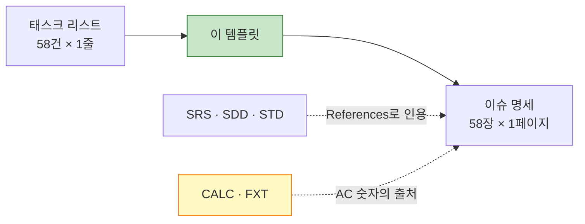

# [Ops] TASK 템플릿 CardFit

**문서 ID:** TPL-CARDFIT-001

**개정 버전:** 2.1

**날짜:** 2026-08-25

**근거 문서:** TASK-CARDFIT-001 v3.0 (`[TaskList]cardfit-task-list.md`)

**참조 문서:** SRS-CARDFIT-001 · SDD-CARDFIT-001 · STD-CARDFIT-001 · **CALC-CARDFIT-001** · **FXT-CARDFIT-001**

**실제 이슈 템플릿:** `.github/ISSUE_TEMPLATE/feature-task.md` (GitHub 이슈 생성 시 자동 적용)

**파일 컨벤션 출처:** `wild-mental/ai-place-mate-prd-to-srs` `docs/tasks/` — 1 태스크 = 1 파일, 파일명 = 태스크 ID

---

## 0. 이 문서의 역할

`[TaskList]cardfit-task-list.md`는 태스크 **58건을 한 줄씩** 나열한 목록이다. 이 문서는 그 한 줄을 **GitHub 이슈 한 장의 상세 명세**로 펼치는 템플릿과 작성 규칙, 그리고 **어떤 순서로 펼칠지**를 정의한다.



**템플릿 원문은 1장에 그대로 두었다.** CardFit에 맞춘 작성 규칙은 2장, 작성 순서는 3장에 있다.

### 0.1 개정 이력

**v2.0 — 태스크 리스트 v3.0 반영**

| 항목 | v1.0 (TASK v2.1 기준) | v2.0 (TASK v3.0 기준) |
| --- | --- | --- |
| 대상 태스크 | 54건 · 착수 차단 7건 | **58건 · 착수 차단 0건** |
| 차단 태스크 규칙 | AC 숫자를 플레이스홀더로 남긴다 | **삭제.** AC 숫자를 CALC·FXT에서 인용해 채운다 |
| `blocked:` 라벨 | D16·D2·D5·D11·D4·DEC-3b | **삭제.** 대신 `mode:fixture`로 픽스처 전제를 표기 |
| References | SRS · SDD · STD | **CALC · FXT 2건 추가** |
| 공통 DoD | 6항목 | **8항목** — 픽스처 모드 통과 · 참조 계산기 대조 추가 |
| 작성 순서 | 11배치. 계산 도메인이 마지막 | **14배치. 계산 도메인이 8번으로 이동** |

**v2.1 — 파일·본문 컨벤션 정렬**

`docs/tasks/`의 파일 단위를 **배치에서 태스크로** 바꾼다. 기존 `S1-계약-API.md`는 태스크 2건을 한 파일에 담고 이슈 본문을 ` ```markdown ` 블록으로 감쌌는데, GitHub 이슈 한 장과 파일 한 개가 어긋나 있었다.

| 항목 | v2.0 (배치 파일) | **v2.1 (태스크 파일)** |
| --- | --- | --- |
| 파일 단위 | 배치 1개 = 파일 1개 (태스크 2~6건) | **태스크 1건 = 파일 1건 (58개)** |
| 파일명 | `S1-계약-API.md` | **`CT-01.md`** — 태스크 ID |
| H1 | `[태스크 명세 · 배치 1] 계약 — API` | **`# GitHub Project용 TASK 템플릿`** |
| 프론트매터 | `---` 구분자 | **```yaml 코드블록** |
| 본문 | ` ```markdown ` 블록으로 감쌈 | **그대로 노출** |
| 배치 | 파일의 단위 | **작성 순서의 단위로만 남는다** (3장) |

> **배치는 사라지지 않고 역할이 바뀐다.** 파일을 묶는 단위였던 것이 **한 번에 작성할 묶음**을 가리키는 이름이 된다. 배치 6을 쓴다는 것은 파일 5개(`IN-08.md` · `DA-05.md` · `DA-06.md` · `BE-14.md` · `BE-20.md`)를 한 번에 쓴다는 뜻이다.

## 1. 템플릿 원문

```markdown
---
name: Feature Task
about: SRS 기반의 구체적인 개발 태스크 명세
title: "[Feature] FR-001: {기능 요약}"
labels: 'feature, backend, priority:high'
assignees: ''
---

## 🎯 Summary
- 기능명: [FR-001] 이메일 기반 회원가입
- 목적: 사용자가 서비스에 접근하기 위한 고유 계정을 안전하게 생성한다.

## 🔗 References (Spec & Context)
> 💡 AI Agent & Dev Note: 작업 시작 전 아래 문서를 반드시 먼저 Read/Evaluate 할 것.
- SRS 문서: [`/docs/SRS_v0.md#FR-001`](#)
- 시퀀스 다이어그램: [`/docs/SRS_v0.md#sequence-login`](#)
- 데이터 모델 (ERD): [`/docs/erd.md#User`](#)
- API 명세: [`/docs/api_v1.yaml#POST-/users`](#)

## ✅ Task Breakdown (실행 계획)
- [ ] 데이터베이스 마이그레이션 스크립트 작성 (`users` 테이블 확장 등)
- [ ] 회원가입 DTO 및 검증(Validation) 로직 구현
- [ ] 비밀번호 단방향 암호화 (Bcrypt 등) 로직 적용
- [ ] 비즈니스 로직(Service) 및 예외 처리 구현
- [ ] API Controller 연동 및 통합 테스트 작성

## 🧪 Acceptance Criteria (BDD/GWT)
Scenario 1: 정상적인 회원가입
- Given: 유효한 형태의 이메일(`test@example.com`)과 보안 정책을 충족하는 비밀번호가 주어짐
- When: `/api/v1/users`로 회원가입(POST)을 요청함
- Then: DB에 유저가 생성되고, 201 Created 상태 코드와 함께 User ID를 반환한다.

Scenario 2: 중복된 이메일 가입 시도
- Given: 이미 DB에 존재하는 이메일(`exist@example.com`)이 주어짐
- When: 해당 이메일로 회원가입을 요청함
- Then: 계정 생성에 실패하며, 409 Conflict 상태 코드와 지정된 에러 메시지를 반환한다.

## ⚙️ Technical & Non-Functional Constraints
- 성능: 응답시간 p95 ≤ 300ms 달성
- 안정성: 에러율 ≤ 0.5% 유지
- 보안: 비밀번호 평문 저장 절대 금지, 요청 페이로드 로깅 시 마스킹 처리 필수

## 🏁 Definition of Done (DoD)
- [ ] 모든 Acceptance Criteria를 충족하는가?
- [ ] 단위 테스트(Unit Test) 및 통합 테스트(Integration Test)가 추가되었고 통과하는가?
- [ ] SonarQube / Linter 등의 정적 분석 도구 경고가 없는가?
- [ ] API 명세서(Swagger 등)가 최신화되었는가?

## 🚧 Dependencies & Blockers
- Depends on: #12 (DB 인프라 세팅 이슈)
- Blocks: #24 (로그인 기능 구현 이슈)
```

> **이 원문은 예제다.** `FR-001 이메일 기반 회원가입`·`p95 ≤ 300ms`·`Bcrypt`는 CardFit 요구사항이 아니다. 섹션 구조와 서술 방식만 가져오고, 내용은 2장 규칙으로 채운다.

---

## 2. CardFit 작성 규칙

### 2.1 파일 컨벤션

**태스크 1건이 파일 1개이고 GitHub 이슈 1장이다.** 셋의 개수가 어긋나면 추적이 끊긴다.

| 항목 | 규칙 |
| --- | --- |
| 위치 | `docs/tasks/` |
| 파일명 | **태스크 ID + `.md`** — `CT-01.md` · `BE-06.md` · `DS-03.md`. 접미어·설명어를 붙이지 않는다 |
| 개수 | 58개 (태스크 리스트 5장 합계와 같아야 한다) |
| H1 | **`# GitHub Project용 TASK 템플릿`** — 전 파일 동일. 파일이 템플릿의 인스턴스임을 표시한다 |
| 프론트매터 | ` ```yaml ` 코드블록. `---` 구분자를 쓰지 않는다(문서 머리말로 렌더링되어 버린다) |
| 본문 | 섹션 7개를 **그대로** 쓴다. 코드블록으로 감싸지 않는다 |

**파일 기본형**

````markdown
# GitHub Project용 TASK 템플릿

```yaml
name: GitHub Project 용 TASK 템플릿
about: SRS 기반의 구체적인 개발 태스크 명세
title: "[Feature] CT-01: API DTO 전 도메인 정의"
labels: 'feature, part:backend, epic:CT, complexity:M, sprint:S1, contract:api'
assignees: ''
```

## 🎯 Summary
...(이하 섹션 7개)
````

**`### 2.4` References 첫 줄에 태스크 리스트를 넣는다** — `/docs/plan-docs/[TaskList]cardfit-task-list.md#ct-01`. 이슈에서 목록으로 되짚어 갈 경로가 있어야 한다.

**`## 🚧 Dependencies & Blockers` 표기**

```markdown
- Depends on: #<이슈번호> (DA-02) · #<이슈번호> (IN-05)
- Blocks: #<이슈번호> (BE-07) · #<이슈번호> (BE-08) · #<이슈번호> (BE-10)
- External Blocker: 없음
- ⚠️ **후행 5건** — 이 태스크가 밀리면 5개가 함께 밀린다.
```

| 규칙 | 내용 |
| --- | --- |
| `#<이슈번호>` | 발급 전에는 이 자리표시자를 그대로 두고 괄호 안 태스크 ID로 식별한다 |
| 출처 | `Depends on` = 태스크 리스트 `선행 태스크` 열, `Blocks` = `후행 태스크` 열. **수기로 만들지 않는다** |
| External Blocker | 픽스처 전제 태스크는 여기에 `실서비스 전환 시 D11 재개(SRS 10.3)` 처럼 적는다 |
| ⚠️ 후행 경고 | 후행이 **3건 이상**일 때만 붙인다. 전부 붙이면 경고가 무뎌진다 |

### 2.2 필드 매핑

| 템플릿 필드 | CardFit에서 채우는 방법 | 출처 |
| --- | --- | :---: |
| `title` | `[Feature] BE-06: 계산 엔진 코어` — **태스크 ID를 그대로** 쓴다(FR-001 아님) | TASK 1.0~1.6 |
| `labels` | 기본 4축(`part:` `epic:` `complexity:` `sprint:`) + 해당 시 보조 5축 | 2.3 |
| **Summary** | 기능명 + 목적 1문장. 목적은 **어느 요구사항을 만족시키는가**로 쓴다 | TASK `Feature` 열 |
| **References** | 2.4 참조 규칙 | SRS·SDD·STD·CALC·FXT |
| **Task Breakdown** | SDD 시퀀스·순서도의 단계를 체크리스트로 분해 | SDD 5·6장 |
| **Acceptance Criteria** | **STD의 해당 TC를 BDD로 옮긴다.** 새로 만들지 않는다 | STD 1~3장 |
| **Constraints** | 해당 태스크가 걸리는 REQ-NF의 임계치를 그대로 | SRS 4.2 |
| **DoD** | 2.5 공통 DoD + 태스크별 추가분 | — |
| **Dependencies** | TASK `선행 태스크` 열 → 이슈 번호. `Blocks`는 `후행 태스크` 열 | TASK 전 표 |

### 2.3 라벨 체계

**기본 4축은 필수, 보조 5축은 해당할 때만 붙인다.**

| 구분 | 축 | 값 |
| :---: | --- | --- |
| **필수** | `part:` | `backend` `frontend` `infra` `data` `qa` `design` |
| **필수** | `epic:` | `CT` `MK` `IN` `DA` `BE` `FE` `TS` `QA` `DS` — 태스크 ID 접두어를 그대로 |
| **필수** | `complexity:` | `H` `M` `L` — 태스크 리스트 `복잡도` 열 |
| **필수** | `sprint:` | `S1` ~ `S5` — 태스크 리스트 4장 착수 순서 |
| 보조 | `priority:` | `p0`(Guardrail 대응) · `p1`(Must) · `p2`(Should·Could) |
| 보조 | `cqrs:` | `query`(상태 불변) · `command`(상태 변경) · `mixed` — BE 20그룹 |
| 보조 | `nfr:` | `req-nf-001` ~ `req-nf-009` — 해당 NFR을 만족시키는 태스크 |
| 보조 | `contract:` | `api`(CT) · `mock`(MK) · `db`(DA) |
| 보조 | `mode:` | `fixture` — **픽스처 전제로 구현하는 태스크.** 실서비스 전환 시 다시 열린다 |

예시 — `labels: 'feature, part:backend, epic:BE, complexity:H, sprint:S3, priority:p0, cqrs:command'`

**`cqrs:` 라벨의 실무 의미** — `command`는 상태를 바꾸므로 마이그레이션·롤백 계획이 필요하고, `query`는 롤백이 불필요해 리뷰 부담이 낮다. 같은 복잡도 `M`이라도 배포 위험이 다르다.

**`nfr:` 라벨이 필요한 이유** — REQ-NF를 만족시키는 태스크가 `IN`·`DA`·`BE`·`QA`에 흩어져 있다(예: REQ-NF-004 → DA-04·BE-01·QA-02). 라벨 필터로 *"이 NFR을 만족시키는 태스크가 다 발급됐는가"* 를 한눈에 본다.

**`mode:fixture`가 `blocked:`를 대체한다.** v1.0의 `blocked:` 라벨은 착수 차단 7건을 표시하는 것이었고, 차단이 0건이 되면서 표시할 대상이 사라졌다. 대신 **픽스처 전제로 구현하는 태스크**(IN-06 · IN-08 · DA-05 · DA-06 · BE-03 · BE-14 · BE-15 · BE-20)에 붙인다. 실서비스 전환 시 손대야 할 범위를 라벨 필터 하나로 뽑기 위해서다.

**`priority:p0`는 STD 0.4의 P0 6건과 일치시킨다** — TC-FUNC-004·006·009, TC-NF-002·004, TC-EXC-002를 담은 그룹(`CT-02` `BE-07` `BE-10` `BE-12` `BE-01` `BE-16`)이다.

### 2.4 References 참조 규칙

템플릿의 예시 경로(`/docs/SRS_v0.md`)를 CardFit 실제 경로로 바꾼다.

| 항목 | 실제 경로 | 언제 넣나 |
| --- | --- | --- |
| SRS 문서 | `/docs/tech-design-docs/[SRS]cardfit-srs-v1_0.md` + 절 번호 | **전 태스크** |
| 시퀀스 다이어그램 | `/docs/tech-design-docs/[SDD]cardfit-design.md` §5 | BE·FE |
| 데이터 모델 (ERD) | `/docs/tech-design-docs/[SRS]cardfit-srs-v1_0.md` §6.4.1 | DA·BE |
| API 명세 | `/docs/tech-design-docs/[SRS]cardfit-srs-v1_0.md` §6.1.1~6.1.3 | CT·MK·BE·FE |
| 테스트 케이스 | `/docs/tech-design-docs/[STD]cardfit-test-spec.md#tc-func-004` | AC가 있는 전 태스크 |
| **계산 명세** | `/docs/tech-design-docs/[CALC]cardfit-calc-spec.md` + 절 번호 | **계산·게이팅·배분·근거** |
| **픽스처 명세** | `/docs/tech-design-docs/[FXT]cardfit-fixture-spec.md` + 절 번호 | **`mode:fixture` 태스크** |

> **API 명세는 SRS §6.1.1~6.1.3에 있다.** 공통 응답 봉투 · 에러 코드 체계(`CF-4001`~`CF-2001`) · 엔드포인트별 요청·응답 스키마를 그곳에서 인용한다.
>
> **계산 관련 태스크는 CALC를 반드시 인용한다.** BE-06~08·BE-10·BE-11은 계산 순서·전환비용·임계값을 SRS가 아니라 CALC에서 가져온다. SRS 4.1.0은 *무엇을 정해야 하는가*의 기록이고, 값의 정본은 CALC다.

### 2.5 공통 DoD

모든 태스크에 아래를 넣고, 태스크별 항목을 덧붙인다.

```markdown
- [ ] 모든 Acceptance Criteria를 충족하는가?
- [ ] 대응 테스트 케이스(STD)가 구현되고 통과하는가?
- [ ] **배포 게이트 ①·② 를 통과하는가?** (C-TEC-007a)
- [ ] **의존성 경계 린트를 통과하는가?** (ADR-02 — AI가 계산 클래스를 참조하지 않는가)
- [ ] **픽스처 모드(`CARDFIT_DATA_MODE=fixture`)에서 외부 호출 0회로 동작하는가?**
- [ ] Linter 경고가 없는가?
- [ ] 변경이 SRS·SDD와 어긋나지 않는가? (`python3 tools/verify_docs.py` 45항목 통과)
- [ ] 문서 갱신이 필요한 변경이면 해당 명세를 함께 고쳤는가?
```

3·4·5번째 항목이 이 프로젝트 고유다. **ADR-02는 배포 경계로 강제되지 않으므로 DoD에서 한 번 더 확인한다.**

**계산 도메인 태스크(BE-06~08 · BE-10)는 한 항목을 더 넣는다.**

```markdown
- [ ] **참조 계산기 대조 — `tools/fixtures/expected-results.json`의 페르소나 5인 × 시나리오 3개 결론이 일치하는가?**
```

### 2.6 픽스처 전제 태스크 작성 규칙

`mode:fixture` 라벨이 붙은 태스크는 **지금 구현하는 것과 나중에 바뀌는 것을 문서에 함께 적는다.**

| 규칙 | 내용 |
| --- | --- |
| Summary | 픽스처 전제임을 한 문장으로 밝힌다 — *"픽스처 모드에서 외부 호출 없이 …"* |
| Task Breakdown | **인터페이스 정의 → 픽스처 구현 → 실호출 구현 자리(스텁)** 순으로 쪼갠다 |
| AC | 픽스처 모드 시나리오를 쓴다. 실호출 시나리오는 **적지 않는다**(검증할 대상이 없다) |
| Constraints | *"실서비스 전환 시 D○○가 다시 열린다"* 를 명시한다 (SRS 10.3 · FXT 9장) |
| Blockers | `Blocked by:` 는 쓰지 않는다. 차단은 0건이다 |

### 2.7 AC 숫자의 출처

**v1.0에서 플레이스홀더로 남기던 숫자를 이제 채운다.** 임의 값이 아니라 결정본에서 인용한다.

| 숫자 | 값 | 출처 |
| --- | :---: | :---: |
| Net Benefit 절대 임계값 | 월 3,000원 | CALC 3.3절 |
| Net Benefit 상대 임계값 | 10% | CALC 3.3절 |
| 시나리오 증감 폭 | ±20% | CALC 5장 |
| 전환비용 계수 | 5,000원 / 10,000원 | CALC 3.1절 |
| 조합 후보 상한 | 20개 (보유카드 사전 컷 8장) | CALC 4.1절 |
| 계산 API 레이턴시 | p95 ≤ 5s | SRS 4.2 REQ-NF-001 |
| 배분 합계 오차 | ≤ 1원 | SRS 4.1 REQ-FUNC-005 |
| 페르소나 기대 결론 | P1·P2 유지 / P3·P4 변경 / P5 예외 | FXT 3.2절 |

---

## 3. 풀버전 태스크 문서 작성 순서

### 3.1 순서를 정하는 원칙 5가지

| # | 원칙 | 이유 |
| :---: | --- | --- |
| **1** | **의존성 위상 정렬** — 선행 그룹의 문서가 먼저 있어야 한다 | `Depends on: #12`를 쓰려면 12번 이슈가 이미 존재해야 한다 |
| **2** | **계약 우선** — 다른 그룹이 인용할 계약(API·Mock·스키마)을 먼저 | 계약이 없으면 그것을 소비하는 그룹의 AC를 구체적으로 쓸 수 없다 |
| **3** | **상호작용 결합** — 같은 인터페이스·상태·파일을 공유하는 태스크는 한 배치에 | 배치가 갈리면 두 문서가 같은 계약을 각자 서술하게 되고 곧 갈라진다 |
| **4** | **Mock 이후 FE 조기화** — FE는 Mock·DS만 참조하므로 BE를 기다리지 않는다 | 태스크 리스트 4장의 착수 순서와 같은 논리다 |
| **5** | **관점 병렬** — DS 트랙은 개발 문서와 독립 | `DS-01`~`DS-05`는 개발 문서를 기다리지 않는다 |

> **v1.0의 원칙 3(차단 분리)이 사라졌다.** 차단이 0건이라 분리할 대상이 없고, 계산 도메인이 뒤에서 앞으로 이동한 이유가 이것이다.

### 3.2 배치별 작성 순서

**배치는 파일의 단위가 아니라 한 번에 쓸 묶음이다.** 산출물은 언제나 태스크 1건당 파일 1개다.

| 배치 | 대상 | 수 | 산출 파일 (`docs/tasks/`) | 성립 조건 |
| :---: | --- | :---: | --- | :---: |
| **1** | 계약 — API | 2 | `CT-01.md` `CT-02.md` | — |
| **2** | 계약 — Mock | 2 | `MK-01.md` `MK-02.md` | 1 |
| **3** | 인프라 기반 | 4 | `IN-01.md` `IN-02.md` `IN-04.md` `IN-05.md` | — |
| **D** | 디자인 | 5 | `DS-01.md` ~ `DS-05.md` | — (늦어도 4 앞) |
| **4** | 프론트엔드 A | 6 | `FE-01.md` ~ `FE-06.md` | 2 · D |
| **5** | 데이터 스키마 | 4 | `DA-01.md` ~ `DA-04.md` | 3 |
| **6** | 픽스처 | 5 | `IN-08.md` `DA-05.md` `DA-06.md` `BE-14.md` `BE-20.md` | 3 · 5 |
| **7** | 인증·마이데이터·입력 | 4 | `BE-01.md` `BE-03.md` `BE-04.md` `BE-05.md` | 5 · 6 |
| **8** | **계산 도메인** | 4 | `BE-06.md` `BE-07.md` `BE-08.md` `BE-10.md` | 5 |
| **9** | 근거·오케스트레이션 | 4 | `BE-09.md` `BE-11.md` `BE-12.md` `BE-16.md` | 1 · 8 |
| **10** | 관측·게이트 | 5 | `IN-03.md` `IN-06.md` `IN-07.md` `QA-02.md` `QA-03.md` | 3 · 7 · 8 · 9 |
| **11** | 계측·최신성 | 5 | `BE-02.md` `BE-13.md` `BE-15.md` `BE-17.md` `BE-18.md` | 10 |
| **12** | API·게이트 회귀 | 2 | `BE-19.md` `QA-01.md` | 9 · 10 · 11 |
| **13** | 프론트엔드 B | 2 | `FE-07.md` `FE-08.md` | 11 · D |
| **14** | 시연 회귀·테스트 | 4 | `QA-04.md` `TS-01.md` ~ `TS-03.md` | 4 · 12 · 13 |
| | **합계** | **58** | **파일 58개** | |

**선행 위반 0건으로 검산했다** — 앞 배치들이 뒤 배치 태스크의 `선행 태스크` 열을 모두 덮는다. 58건 전건 포함, 중복·누락 0.

### 3.3 이 순서에서 놓치기 쉬운 4가지

**① 배치 4(FE-A)를 앞으로 당긴 것이 이 순서의 핵심이다.** FE-01~06은 `MK`와 `DS`만 참조한다. 뒤로 미루면 FE 6건의 문서가 BE 전체를 기다리게 되고, 정작 구현은 2스프린트에 시작한다 — 문서가 구현보다 늦는 상태가 된다.

**② 배치 6(픽스처)이 배치 7·8보다 먼저다.** `BE-03`(마이데이터 수집)은 `IN-08`의 어댑터 인터페이스를 인용해야 AC를 쓸 수 있고, `BE-06`(계산 엔진)은 `DA-05`가 적재한 카드 상품 구조를 전제한다. 순서를 뒤집으면 두 문서가 인터페이스를 각자 상상해서 쓴다.

**③ 배치 8(계산 도메인)이 v1.0의 마지막에서 8번으로 올라왔다.** D16·D2·D5가 확정돼 AC 숫자를 CALC에서 인용할 수 있게 됐기 때문이다. `BE-06`은 `DA-02`·`DA-04`만 있으면 쓸 수 있고, 뒤의 근거·오케스트레이션·API가 모두 이것을 참조한다.

**④ 배치 D(디자인)를 4번 앞에 끼워야 한다.** `FE-01`의 `Depends on`에 `DS-02`가 들어간다. 디자인 문서가 없으면 FE 문서의 의존 링크가 빈다. 개발 트랙과 병렬이지만 **문서 작성 순서에서는 FE보다 앞**이다.

### 3.4 분량과 형식

| 항목 | 기준 |
| --- | --- |
| 배치당 태스크 | **2~6건.** 6건을 넘으면 한 번에 쓰기 어렵고 앞뒤 일관성이 무너진다 |
| 파일당 분량 | 풀버전 기준 60~120줄. 복잡도 `L`은 간이 형식(Summary · References · AC 2개 · 공통 DoD) 허용 |
| AC 시나리오 | **최소 2개, 그중 1개는 실패 흐름.** 정상 흐름만 있는 이슈는 반려 대상 |
| 배치 요약 | 배치를 다 쓴 뒤 커밋 메시지에 요약표(태스크 · 복잡도 · Blocks · 라벨)를 남긴다. **별도 배치 문서를 만들지 않는다** |

**배치 문서를 없앤 이유** — 배치 요약이 파일로 남으면 태스크 리스트와 같은 내용을 두 곳에서 관리하게 된다. 선행·후행은 이미 `tools/apply_task_merge.py`가 계산하고, 배치 구분은 `sprint:` 라벨과 이 문서 3.2절이 갖고 있다.

## 4. 검증기가 강제하는 것

`tools/verify_docs.py`가 `docs/tasks/*.md`를 검사한다. **어기면 문서 검증이 실패한다.**

| # | 규칙 | 실패 조건 |
| :---: | --- | --- |
| 1 | 섹션 7개가 모두 있어야 한다 | `## 🎯 Summary` · `## 🔗 References (Spec & Context)` · `## ✅ Task Breakdown (실행 계획)` · `## 🧪 Acceptance Criteria (BDD/GWT)` · `## ⚙️ Technical & Non-Functional Constraints` · `## 🏁 Definition of Done (DoD)` · `## 🚧 Dependencies & Blockers` 중 하나라도 빠짐 |
| 2 | `Scenario N:` 이 **2개 이상** | 시나리오 1개짜리 이슈 |
| 3 | `- Given:` 수 = `- Then:` 수 | 갈래를 열고 결과를 안 적음 |
| 4 | 파일명 = 태스크 ID | `docs/tasks/`의 파일명이 태스크 리스트에 없는 ID |

**제목 문자열이 정확히 일치해야 한다.** 이모지·괄호·띄어쓰기를 바꾸면 검사에서 누락으로 잡힌다. 1장 원문을 그대로 복사해 쓰는 것이 안전하다.

> **⚠️ 검증기는 아직 v2.0(배치 파일) 전제로 짜여 있다.** 현재 구현은 파일 안의 ` ```markdown ` 블록을 찾아 그 블록에 규칙 1~3을 적용한다. v2.1 형식은 블록이 없으므로 **검사가 통째로 건너뛰어진다** — 실패하지 않고 조용히 통과한다.
>
> **첫 태스크 파일을 쓰는 시점에 검증기를 함께 고쳐야 한다.** 파일 본문 전체를 검사 대상으로 바꾸고, 규칙 4(파일명 ↔ 태스크 ID 대조)와 개수 대조(58개)를 추가한다.

## 5. 이 템플릿을 쓸 때 주의할 것

| # | 주의 | 이유 |
| :---: | --- | --- |
| 1 | **AC를 새로 만들지 않는다** | STD에 이미 27건의 판정 기준이 있다. 다시 쓰면 두 문서가 갈라진다 |
| 2 | **`FR-001` 대신 실제 태스크 ID를 쓴다** | 태스크 리스트·추적표와 ID가 어긋나도 `verify_docs.py`는 **잡지 못한다**. 이슈 문서의 ID는 사람이 확인해야 하는 유일한 항목이다 |
| 3 | **Constraints는 REQ-NF 임계치를 그대로 옮긴다** | 템플릿 예시의 `p95 ≤ 300ms`는 CardFit 값이 아니다. 계산 API는 `p95 ≤ 5s`다 |
| 4 | **DS 태스크에는 API·ERD 참조를 넣지 않는다** | 해당 없는 항목을 비워두는 대신 **삭제**한다 |
| 5 | **`Depends on`은 `#<이슈번호> (BE-06)` 형태로 쓴다** | 이슈 번호는 발급 후에 채운다. 괄호 안 ID가 있어야 번호가 비어 있어도 의존이 읽힌다 |
| 6 | **계산 숫자는 CALC에서, 시연 데이터는 FXT에서 인용한다** | SRS를 뒤져 봐야 그 숫자는 없다. SRS 4.1.0은 "정해야 한다"는 기록이고 값은 CALC에 있다 |
| 7 | **픽스처 전제를 숨기지 않는다** | `mode:fixture` 라벨과 Constraints 한 줄이 없으면, 실서비스 전환 시 무엇을 다시 손대야 하는지 아무도 모른다 |
| 8 | **프론트매터를 `---`로 감싸지 않는다** | ` ```yaml ` 블록으로 쓴다. `---`는 마크다운 뷰어가 문서 머리말로 해석해 내용이 사라진다 |
| 9 | **파일명에 설명어를 붙이지 않는다** | `BE-06-계산엔진.md`가 아니라 `BE-06.md`다. 태스크명이 바뀔 때 파일명이 따라 흔들린다 |

---

*근거 문서: `[TaskList]cardfit-task-list.md` (TASK-CARDFIT-001 v3.0)*

*작성자: 기획 분석가, 검토자: 개발팀 리드, 승인자: 제품 책임자 (PM)*
