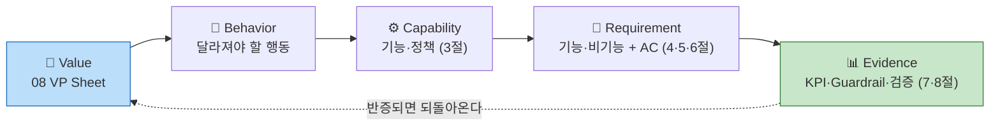

# PRD & Requirement Trace — CardFit

**문서 ID:** PRD-CARDFIT-001 · **버전:** 1.0 · **파생 SRS:** `[SRS]cardfit-srs-v1_0.md`

> **CardFit**은 소비가 곧 바뀔 사람을 위해 카드 조합을 다시 계산해주는 서비스다. 마이데이터로 확보한 과거 소비 기록과 사용자가 직접 입력한 미래 소비 변화를 함께 반영해, 보유·신규카드의 실적 구간·혜택한도·연회비를 계산 근거와 함께 공개하며 실행 가능한 카드 조합 재배치안을 제시한다.
>
> 이 문서는 `08_Value_Proposition.md`의 Pain Reliever·Gain Creator가 **요구사항 → Acceptance Criteria → 측정 지표로 추적되는지**를 고정한다(`방법론.md` 5장 연결규칙 `Value Proposition → PRD`).
>
> 표기 — 🔵 출처가 확인된 사실 / 우선순위: Must · Should · Could · Won't
>
> **이 문서의 수치는 모두 결정된 값이다.** 실측으로 재설정할 항목은 7-2 기준선 열과 8절 검증 설계가 관리하고, 구조 결정의 근거와 기각한 대안은 10-1 ADR이 보관한다. 본문에 미확인 경고를 병기하지 않는다 — 결정과 검증 계획을 같은 문장에 섞으면 둘 다 힘을 잃는다.

---

## 0. 한눈에 보기

| 축 | 이 문서의 답 |
| --- | --- |
| **핵심 기능 1개** | **F-04 조합 최적화 — Net Benefit 게이팅.** 나머지는 이 계산이 성립하기 위한 전후 단계다 |
| 보조 기능 2개 | F-06 계산 근거 공개 · F-11 초기값 자동 제안 |
| 명시적 제외 | **해지·전환 실행 대행·상담·안내** — 마이데이터 기반 서비스에 직권·대행 권한이 없다 |
| 성공 판정 | 북극성 **조합안 선택률 ≥ 40%** + Guardrail 5개(하나라도 넘으면 중단) |
| 전제 검증 | **E2 Concierge Test** — 선택률 20% 미달이면 피벗 |
| 구조 결정 근거 | **10-1 ADR 7건** — 게이팅·계산/설명 분리·시나리오 3개·스코프 경계·분모 제외·만료·MoSCoW |

---

## 1. 목적·범위

### 1-1. 목적과 목표

소비 구조가 곧 바뀔 사용자가 **미래 지출을 기준으로 카드 조합을 다시 계산받고, 그 계산을 스스로 검증해 결정**할 수 있게 한다.

| 목표 | 수치화된 정의 |
| --- | --- |
| **G1. 계산을 대신한다** | 수기 240분 판단을 **p95 5분 이내**에 결론 하나로 (기준선 240분 — 출처: 사용자 진술 1건, E1 n=15로 재측정) |
| **G2. 미래를 기준으로 삼는다** | 계산에 **미래 입력 반영률 100%** — 미래 입력 없이 산출된 결과는 결과로 취급하지 않는다 |
| **G3. 바꿀 가치가 있을 때만 권한다** | 임계 미달 케이스에서 **"현재 조합 유지" 반환률 100%** |
| **G4. 검증 가능하게 만든다** | 결과 1건당 **공개 항목 ≥ 6개**(실적구간·혜택한도·연회비·제외조건·기준일·미반영 항목) |
| **G5. 실패를 보이게 만든다** | 실행 완주율을 **상시 노출** — 개입은 하지 않되 사각지대를 없앤다 |
| **G6. 예측이 틀려도 답을 준다** | 지출 시나리오 **3개(적게·예상대로·많이)를 모두 계산**해 탭으로 제공 |

### 1-2. 범위

| 구분 | 내용 |
| --- | --- |
| **In — v1 확정** | F-01 미래지출 입력 · F-02 마이데이터 연동 · F-03 시나리오 계산(3개) · F-04 조합 최적화 · F-05 결제수단 배분 · F-06 근거 공개 · F-08 이벤트 비종속 · F-11 초기값 제안 · F-12 스코프 경계 고지 · F-13 실행 완주율 계측 |
| **조건부 In — Could** | F-07 단계적 전환 제안 · F-09 소득·지출 범위 입력. **Must·Should가 전부 완료되고 스프린트 여유가 남을 때만 착수**한다. 미착수가 기본값이며, 빠져도 v1은 성립한다 |
| **Out — v1 제외** | **해지·전환 실행 대행·상담·만류 대응 안내** · 신규카드 자동 발급 · 자동결제 · 대출·BNPL · 리텐션 전용 기능 · F-10 정기 재진단 알림 · F-14 카드 20장+ 대량 처리 최적화 · **시나리오 신뢰도 등급 배지**(별도 검토) |

**신규 카드는 카드사 공식 신청 페이지로 이동 링크만 제공한다** — 신청서 작성·제출을 대신하지 않아 대행이 아니다. **해지는 이 단계 대상이 아니다.**

> **Could를 In/Out 어느 쪽에도 두지 않으면 스프린트 협상에서 매번 다시 다툰다.** F-07·F-09는 "하면 좋지만 안 해도 되는 것"이라는 위치를 명시적으로 고정해, 일정 압박이 왔을 때 무엇을 먼저 버릴지 논쟁 없이 결정되게 한다. 판단 근거는 10-1 **ADR-07**에 있다.

---

## 2. 사용자 시나리오

| # | 스토리 | Job | 우선순위 |
| :---: | --- | :---: | :---: |
| **US-A** | 소비가 곧 바뀔 사용자로서, 미래 지출을 카드 혜택과 연결해 계산받고 싶다 | A | 1 |
| **US-C** | 계산 결과대로 실제 해지·전환까지 완주하고 싶다 — **스코프 경계 스토리** | C | 1 |
| US-F | 이벤트명을 고르지 않고도 내 소비 변화를 인정받고 싶다 | F | 3 |
| US-B | 계산 근거를 직접 검증하고 싶다 | B | 4 |
| US-D | 정확한 숫자를 몰라도 부담 없이 입력하고 싶다 | D | 5 |
| US-E | 이벤트가 끝난 뒤에도 쓸 이유를 갖고 싶다 | E | 5 (비MVP) |

**정상 흐름** — 마이데이터 연동 → 초기값 제안 → 미래지출 입력 → 제약조건 → **3개 시나리오 계산** → "예상대로" 탭 결론 제시(조합 또는 유지) → 근거 확인 → 선택 → (30일 후) 완주 여부 계측

**실패·복구 흐름**

| 실패 | 복구 |
| --- | --- |
| 마이데이터 API 장애 | "최근 확인된 데이터 기준" 경고 + 기준일 노출로 계산 계속 |
| 미래 입력 0건 | **400 반환** — 과거만으로 계산한 결과를 결과로 내놓지 않는다 |
| 근거 6항목 미달 | **응답 거부** — 근거 없는 결과를 노출하지 않는다 |
| 필수 데이터 누락 | **추천 중단** — 부분 데이터로 계산하지 않는다 |
| Net Benefit 임계 미달 | **"유지" 결론 반환** — 실패가 아니라 정상 결과다 |
| 동의 만료·철회 후 계산 요청 | 400 + 재동의 유도. 만료 데이터로 계산하지 않는다 |
| **선택 후 실행 실패** | **제품은 개입하지 않는다.** F-13이 사유를 수집해 지표로만 집계한다 |

---

## 3. 기능 요구사항 — MoSCoW

**프레임 선택 근거**: 실측 데이터가 없어 RICE의 Reach·Confidence를 채울 수 없다. **범위 합의가 먼저 필요한 단계**라 MoSCoW를 골랐고, "Won't" 칸이 전략의 포기 선언을 담는다.

| ID | 기능 | Job | 우선순위 | 의존성 | 스프린트 | 우선순위 근거 (대안 대비 가치) |
| :---: | --- | :---: | :---: | :---: | :---: | --- |
| **F-01** | 미래지출 입력 (카테고리·금액·시점, 이벤트 선택 강제 없음) | A·F | **Must** | 없음 | **1** | **경쟁 6곳 중 이 단계를 가진 곳 0곳** 🔵 — ⓐ 시간축의 유일한 진입점 |
| **F-02** | 마이데이터 연동 — 과거 소비·보유카드 자동 수집 + 제약조건 입력 | A·D | **Must** | **D1** | **1** | Table Stakes. 카드 이용내역은 마이데이터 API로만 제공 🔵 — 없으면 계산 불성립 |
| **F-03** | 시나리오 계산 — 실적구간·한도·연회비 반영 순혜택. **적게·예상대로·많이 3개 시나리오를 모두 산출** | A | **Must** | F-02 · **D4·D5** | **2** → 3-1 분할 | 뱅크샐러드는 후보 카드 **1장**과 비교 🔵. 3개 시나리오는 예측 오차를 흡수하는 장치 |
| **F-04** | 조합 최적화 — 해지·유지·신규추가 + **Net Benefit 게이팅**. **"예상대로"를 기본 노출**, 적게·많이는 탭 전환 | A·B | **Must** | F-03 · **D2** | **2** → 3-1 분할 | **경쟁자 체인에 없는 단계** 🔵. "유지"를 정답으로 반환하는 유일한 설계 |
| **F-05** | 결제수단 배분 — 카드별 역할·금액 배분 (**계산·배분까지만**) | B·C | **Must** | F-04 | **1** | 경쟁자 체인에 없는 두 번째 단계 — ⓑ 조합축. **실행 대행 아님** |
| **F-06** | 계산 근거 공개 — 적용 규칙 + **제외 조건**·기준일·rule_version | B | **Must** | F-03 · **D4** | **1** | 뱅크샐러드는 결과 금액만 공개 🔵 → 산출 과정·제외조건까지 확장 |
| **F-11** | 과거 패턴 기반 **초기값 자동 제안** | D·A | **Must** | F-02 | **1** | **가장 큰 가정의 완화 장치.** 온보딩 이탈이 실패 경로 — 기능 추가가 아니라 **MVP 성립 조건** |
| F-08 | 이벤트 비종속 입력 (자유 카테고리, 증감 양방향) | F | Should | F-01 | **0.5** | 이벤트 선택 단계를 **두지 않는 것**만으로 대부분 충족 |
| F-12 | 스코프 경계 고지 + **금지어 자동 검수** | C | Should | **D8·D9** | **1** | GR4 위반은 규제 리스크. 난이도 대비 차단 효과가 크다 |
| F-13 | **실행 완주율 계측** (측정 전용, 개입 없음) | C | Should | F-04 | **1** | 북극성의 사각지대를 드러냄. **대행이 아니라 측정이라 스코프 위반 아님** |
| F-07 | 단계적 전환 제안 — 효과 큰 카드부터 | C | Could | F-04·F-05 | **1** | 정보 과부하 완화 — **실행 지원이 아니라 제시 방식** |
| F-09 | 소득·지출 범위(최소~평균) 입력 | D | Could | F-01 | **1** | Job D는 두 지표 모두 후순위 |
| F-10 | 정기 재진단 알림 | E | **Won't v1** | — | — | Drift가 시장이 아니라 **사용자 입력**에서 발생 — 정기 점검할 대상이 없다 |
| F-14 | 카드 20장+ 대량 처리 최적화 | — | **Won't v1** | — | — | Extreme·Market Relevance 최저 구간 |

**1 스프린트 = 2주.** 의존성 열의 `D*`는 10-4 착수 전 선결 항목이다. **D1·D2·D4·D5가 미정인 동안 F-02·F-03·F-04·F-06은 착수할 수 없다** — Must 7건 중 4건이 선결 항목에 막혀 있다는 뜻이고, 이것이 이 PRD의 실질적 착수 조건이다.

### 3-1. 1 스프린트를 넘는 2건 — 분할

Could 이상 모든 항목이 1 스프린트에 들어가야 한다. F-03·F-04만 2 스프린트라 아래처럼 나눈다. **ID는 유지하고 인수 기준을 단계로 쪼갠다** — 문서 전체의 추적 관계를 흔들지 않기 위해서다.

| 분할 단위 | 범위 | 스프린트 | 완료 판정 |
| :---: | --- | :---: | --- |
| **F-03 (a)** | 순혜택 계산 엔진 — 실적구간·통합할인한도·연회비·제외항목 반영. **단일 시나리오("예상대로")만** | 1 | 경계값 회귀 200건 통과, 재계산 불일치 0건 (E4) |
| **F-03 (b)** | 3개 시나리오 확장 — D5 증감 폭 적용, 사전 계산·탭 전환 시 재계산 없음, 가정 캡션 | 1 | 탭 전환 재계산 0건, 마이데이터 추가 호출 0건 |
| **F-04 (a)** | 조합 후보 생성 + Gross/Net Benefit 산출 — 전환비용 3항목 반영 | 1 | 배분 합계 오차 ≤ 1원, 후보 생성 실패 0건 |
| **F-04 (b)** | **Net Benefit 게이팅** + "예상대로" 기본 노출 · 탭 전환 | 1 | 임계 미달 시 "유지" 반환률 100%, GR2 = 0건 |

**F-03(a) → F-04(a) → F-03(b) → F-04(b) 순서로 쌓는다.** 게이팅(F-04b)이 마지막인 이유는 **임계값(D2)이 가장 늦게 확정될 항목**이라서다 — 임계값을 기다리는 동안 계산 엔진과 후보 생성은 진행할 수 있다.

### 3-2. 시나리오 탭 3개 — 계산·노출 규칙

| 탭 | 계산 기준 | 노출 |
| --- | --- | --- |
| **예상대로** | 사용자 입력값 그대로 | **기본 탭 — 화면이 열리면 이 결론이 보인다** |
| 적게 | 입력값보다 낮춘 값 | 탭 전환 시 (보조 탐색) |
| 많이 | 입력값보다 높인 값 | 탭 전환 시 (보조 탐색) |

- 세 탭 모두 **동일한 계산 로직**(진단 → Net Benefit → 게이팅)을 각 지출 가정에 독립 적용해 **미리 계산해 둔다** — 탭 전환은 재계산을 일으키지 않는다.
- **"여러 안을 나열하지 않는다" 원칙과 충돌하지 않는다** — 화면은 항상 "예상대로" 결론 하나로 열리므로 첫 화면 선택 부담이 생기지 않는다. 적게·많이는 궁금한 사용자가 스스로 여는 화면이며 기본 결론을 대체하지 않는다.
- **각 탭에 지출 가정을 캡션으로 명시한다**(예: "예상보다 20% 적게 쓸 경우"). 세 탭의 결론이 서로 다를 수 있어, 가정을 표기하지 않으면 *"결국 뭐가 맞는 답인지"* 신뢰가 흔들린다.
- **시나리오 신뢰도 등급 배지(강건/조건부/보류)는 이 문서 범위 밖**이다 — 별도 검토 사항.

---

## 4. 비기능 요구사항

| ID | 구분 | 요구사항 | 임계치 | 모니터링 항목 (관측 주기) |
| :---: | --- | --- | --- | --- |
| **NFR-01** | **성능** | 계산·근거 응답과 여정 전체 소요 | `POST /calculate` **p95 ≤ 5s**(3개 시나리오 동시 산출 기준) · `GET .../evidence` **p95 ≤ 1s** · 결론 도달 **p95 ≤ 5분** | 엔드포인트별 p50·p95·p99 레이턴시, 여정 단계별 소요시간 분포, 타임아웃 건수 (실시간 · 일간 리포트) |
| **NFR-02** | **정확성** | 결정론적 규칙 엔진의 계산 정합성 | 계산 오류율 **≤ 0.1%** · 동일 입력 재계산 **불일치 0건** · 배분 합계와 입력 총액 오차 **≤ 1원** | 경계값 회귀 200건 통과율, 동일입력 응답 해시 불일치 건수, 배분 합계 검증 실패 건수 (배포마다 · 일간) |
| **NFR-03** | **가용성** | 월 가용성과 부분 장애 시 거동 | 월 **≥ 99.5%**(월 허용 다운타임 **3시간 39분**) · 마이데이터 장애 시 경고 표시 후 계산 계속 · 필수 데이터 누락 시 추천 중단 | 월 가용률, 마이데이터 API 오류율·타임아웃율, 계산 실패율, 경고 표시 후 완주율 (실시간 알림 · 월간 SLA) |
| **NFR-04** | **보안·규제** | 인가 요건·동의 최소화·오조회 차단 | 오조회 **0건**(1건 = 즉시 중단·신고) · 마이데이터 인가 요건 준수(자본금·물적설비·보안) · 동의 범위 최소화 · 철회 시 파기 **24시간 내** | 응답 주인 ≠ 로그인 사용자 **전건 대조** 검출 수, 동의 만료·철회 후 접근 시도 수, 파기 SLA 준수율, 동의 항목 수 변동 (실시간 알림) |
| **NFR-05** | **비용** | 마이데이터 호출 과금 통제 | **결론 1건당 마이데이터 호출 ≤ 1회**(시나리오 3개는 1회 수집 데이터로 계산) · 시나리오 확장으로 인한 추가 호출 **0건** · 결론 1건당 단위원가 상한 **TBD** (D3 수익모델 확정 시 확정) | 결론당 마이데이터 호출 수, 일 호출량·과금액, 재계산 반복 호출 수, 결론 없이 종료된 호출(낭비 호출) 비율 (일간 · 주간 단위경제 리포트) |
| **NFR-06** | **감사 증적** | 계산 재현에 필요한 전건 보존 | 계산 요청·응답, 적용 `rule_version`, 입력 스냅샷, 마이데이터 응답 코드 **전건 보존** · 적재 누락 **0건** · 보존기간 **TBD** (D9 규제 분류 확정 시) | 계산 요청 대비 감사로그 적재율(100% 기준), 재현 테스트 성공률 (일간) |
| **NFR-07** | **데이터 운영** | 카드 혜택 Rule 최신성 | 갱신 지연 **≤ 30일** · 초과 시 해당 카드 **계산 대상 제외**(무단 사용 0건) · `rule_version` 적용 시작·종료일 필수 | 카드별 약관 최종 확인일 경과일수, 30일 초과 카드 수·제외 처리 건수, 최신성 경고 노출률 (일간) |

**대시보드** — 북극성 · 보조 지표 · Guardrail 5개 · 위 NFR 7건의 모니터링 항목을 한 화면에 두고, **페르소나 층별로 분해**한다. 임계치를 넘긴 항목은 담당 역할(6-4)에게 자동 알림한다.

> **비용을 비기능 요구로 올린 이유** — 마이데이터는 호출당 과금이다 🔵. 시나리오를 3개로 늘리면서 호출량이 늘 수 있는데, 이 항목이 없으면 **성능을 올리려 호출을 늘리는 선택이 아무 저항 없이 통과**한다. `결론 1건당 호출 ≤ 1회`가 그 저항선이고, 7-4가 "계산 요청 건수"를 성과 지표에서 배제한 것과 같은 판단이다.

> **계산과 설명의 분리를 시스템 설계 단계에서 강제한다** — 금액 산출은 결정론적 규칙 엔진, AI는 근거를 사용자 언어로 설명하는 역할에 한정한다. 이 경계가 무너지면 *"AI가 혜택을 보장한다"*는 오해로 이어지는 규제 리스크가 된다. 결정 근거는 10-1 **ADR-02**.

---

## 5. Acceptance Criteria — 정상 7건 · 실패 6건

### 5-1. 정상 경로

| ID | 스토리 | Given | When | Then (판정 조건) | SLO |
| :---: | :---: | --- | --- | --- | --- |
| **AC-01** | **US-A** | 마이데이터 연동 완료 + 보유카드 ≥ 1장 | 미래지출 1건 이상 입력 후 계산 요청 | 3개 시나리오가 산출되고 "예상대로" 결론이 노출된다. 유지 시 예상혜택과 추천 조합 예상혜택의 **차액이 원 단위로** 표시된다 | `POST /calculate` **p95 ≤ 5s** · 차액 표기 누락 **0건** |
| **AC-02** | **US-B** | 조합 결론이 반환된 상태 | 근거 화면 열람 | 적용 규칙·제외 조건이 **≥ 6항목** 표기된다. 계산에 못 넣은 비용은 "이 계산에는 포함되지 않았습니다"로 표기된다 | 근거 화면 **p95 ≤ 1s** · 공개 항목 **≥ 6개** · 미반영 항목 표기 누락률 **0%** |
| **AC-03** | **US-C** | 조합 결론에 "해지" 항목 포함 | 결과 화면 확인 | **"신청·해지는 카드사에서 직접 진행하셔야 합니다"** 경계 안내가 노출된다 | 경계 안내 미노출 **0건** · 금지어 스캔 적발 **0건**(GR4) · 범위 인지율 **≥ 90%** |
| **AC-04** | **US-C** | 사용자가 조합안을 선택 | 30일 경과 후 후속 확인 | 완주 여부가 **집계된다**. **제품은 개입하지 않고**, 미완주 사유는 집계 전용이며 후속 액션을 자동 트리거하지 않는다 | 응답 수집률 **≥ 30%** · 집계 실패 **0건** · 자동 트리거 발생 **0건** |
| **AC-05** | **F-04 게이팅** | Net Benefit이 임계 미달 | 계산 완료 | **"현재 조합 유지"를 결론으로 반환**한다 | "유지" 반환률 **100%**(G3) · 임계 미달인데 변경 제안 **0건**, 1건이라도 발생 시 즉시 중단(GR2) |
| **AC-06** | **F-03 시나리오** | 미래지출이 입력된 상태 | 계산 요청 | 3개 시나리오가 **모두 미리 계산**되고, 각 탭에 지출 가정 캡션이 표기된다 | 탭 전환 시 재계산 **0건** · 캡션 누락 **0건** · 시나리오 확장으로 인한 마이데이터 추가 호출 **0건**(NFR-05) |
| **AC-07** | **US-F** | 온보딩 진입 | 입력 흐름 전체 통과 | **이벤트 필수 선택 단계가 0개**다. 지출 **감소** 방향도 처리된다 | 이벤트 필수 선택 단계 **0개** · 감소 방향 처리 실패 **0건** |

### 5-2. 실패 경로 — 실패도 판정 대상이다

**"결과를 내지 않는 것"이 정답인 케이스가 6건이다.** 이 표가 없으면 장애·미입력 상황에서 무엇을 반환할지가 구현자 재량이 되고, 그 재량이 G2·G4를 무너뜨린다.

| ID | 트리거 | Given | When | Then (판정 조건) | SLO |
| :---: | --- | --- | --- | --- | --- |
| **AC-F1** | 미래 입력 없음 | 미래지출 입력 **0건** | 계산 요청 | 결과를 반환하지 **않고** `400`과 함께 입력을 요구한다 | 미래 입력 미반영 결과 노출 **0건**(G2) · 오응답 **0건** |
| **AC-F2** | 근거 부족 | 근거 항목이 **6개 미달**로 구성된 결과 | 근거 화면 요청 | **응답을 거부**한다 — 근거 없는 결과를 노출하지 않는다 | GR3 = **0건** · 6항목 미달 노출 **0건** |
| **AC-F3** | 마이데이터 장애 | 마이데이터 API 장애·타임아웃 | 계산 요청 | **"최근 확인된 데이터 기준" 경고 + 기준일**을 노출하고 **계산을 계속한다** — 무단 중단하지 않는다 | 경고·기준일 미표기 **0건** · 장애 시 무단 중단 **0건** · `p95 ≤ 5s` 유지 |
| **AC-F4** | 동의 실효 | 마이데이터 동의가 **만료 또는 철회**된 상태 | 계산 요청 | `400`과 재동의 유도를 반환한다. 만료 데이터로 계산하지 않는다 | 만료·철회 데이터 기반 계산 **0건** · 철회 후 파기 **24시간 내**(NFR-04) |
| **AC-F5** | 부분 계산 | 3개 시나리오 중 **1개 이상 실패** | 계산 완료 판정 | 전체를 **"부분"으로 처리**하고 추천을 중단한다 — 성공한 시나리오만 결과로 내놓지 않는다 | 부분 결과 노출 **0건** · 부분 상태 오분류 **0건** |
| **AC-F6** | 조합안 만료 | `rule_version` 변경 또는 기준일 **+30일 경과** | 조합안 열람·실행 시도 | **만료를 표기하고 재계산을 유도**한다. 만료 조합안은 실행 대상이 되지 않는다 | 만료 조합안 실행 대상 노출 **0건** · 만료 판정 지연 **0건** |

---

## 6. 데이터 · 인터페이스 · 상태 · 운영 역할

### 6-1. 핵심 엔터티

| 엔터티 | 주요 필드 | 출처 |
| --- | --- | --- |
| **User** | user_id, 마이데이터 동의 상태·범위·일시 | 자체 |
| **HeldCard** | 카드사, 카드명, 연회비, 발급일, 실적 기준월 | 마이데이터 API |
| **PastSpend** | 가맹점, 업종코드, 금액, 결제일 | 마이데이터 API |
| **FutureSpendPlan** | 카테고리(자유 입력 허용), 금액, 시점, 확실도 | 사용자 (F-01) |
| **Constraint** | 최대 카드 수, 연회비 상한, 신규 발급 허용 여부 | 사용자 (F-02) |
| **BenefitRule** | 전월실적 구간, 통합할인한도, **제외 항목**, 적용 시작·종료일, **rule_version** | 카드사 약관 **수집·버전관리** |
| **Calculation** | 입력 스냅샷, **scenario**(적게/예상대로/많이), 적용 rule_version, 기준일, **미반영 항목** | 규칙 엔진 |
| **PlanCandidate** | 조합 구성, Gross Benefit, 전환비용 3항목, **Net Benefit**, 임계 통과 여부 | 규칙 엔진 (F-04) |
| **Allocation** | 배정 카테고리, 배분 금액 | 규칙 엔진 (F-05) |
| **OutcomeLog** | 선택 여부·일시, **선택된 scenario**, 30일 후 완주 응답 | 자체 (F-13) |

### 6-2. 외부 연동

| 인터페이스 | 제약 |
| --- | --- |
| 마이데이터 카드 업권 API | **단일 채널 — 대체 공급자 없음** 🔵. 장애 시 우회 경로 없음. **호출당 과금** 🔵 |
| 카드 혜택 Rule 데이터 | **공식 통합 API 없음** 🔵 — 8개 카드사·겸영은행 파편화. 수집·버전관리 필수 |
| `POST /calculate` | p95 ≤ 5s. **미래 입력 0건이면 400.** 3개 시나리오를 함께 반환 |
| `GET /calculations/{id}/evidence` | 근거 6항목 미달 시 **응답 거부** |
| `POST /outcomes/{id}/completion` | **측정 전용 — 실행 개입 엔드포인트 없음** |

### 6-3. 상태 전이

| 객체 | 상태값 | 전이 규칙 |
| --- | --- | --- |
| **마이데이터 동의** | 미동의 → 동의 → (만료 / 철회) | 만료·철회 상태에서 계산 요청은 **400**. 철회 시 수집 데이터 파기 |
| **Calculation** | 요청 → (성공 / 실패 / 부분) | **부분 = 필수 데이터 누락** → 결과로 취급하지 않고 추천 중단. **3개 시나리오 중 하나라도 실패하면 전체를 부분으로 처리** |
| **PlanCandidate** | 제시 → (선택 / 미선택) → 만료 | **`rule_version` 변경 또는 기준일 +30일 경과 시 만료.** 만료 조합안은 재계산 없이 실행 대상이 되지 않는다 |
| **OutcomeLog** | 미발송 → 발송 → (응답 / 무응답) | 발송은 선택 +30일 **1회만**. **무응답은 미완주로 집계**. 재발송·독려 없음(GR4 위반) |

> **조합안 만료가 G4의 최소 조건이다.** 3주 전 결과를 들고 실행하려는 사이 약관이 갱신되면 계산 근거가 이미 틀린 것이다.

### 6-4. 운영 역할

| 역할 | 담당 활동 | Guardrail 권한 |
| --- | --- | --- |
| **데이터 운영** | 약관 수집·`rule_version` 관리·최신성 경고 | GR5 |
| **계산 품질** | 경계값 회귀 테스트·결정론성 검증·오류 신고 정정 | GR1·GR2·GR3 **발의** |
| **제품(PM)** | 지표 집계·보고, 금지어 예외 승인 | **중단 최종 결정** |
| **컴플라이언스·보안** | 동의 범위 점검, 오조회 감시, 문구 규제 검토 | **오조회 시 PM 우회 단독 중단** |

> **오조회만 PM을 우회한다** — 타인 데이터 노출은 사업 판단 대상이 아니라 즉시 신고 의무 사항이다.

---

## 7. KPI · Guardrail

### 7-1. North Star

**조합안 선택률** — 계산 결과를 받은 사용자 중 제시된 조합안을 **저장·확정**한 비율. 목표 **≥ 40%**.

이 값은 외부 벤치마크가 없는 영역이라 **팀 합의로 확정한 임계치**다. 근거를 만들어 붙이는 대신 확정 경로를 고정했다 — **E2 실측값으로 재설정**하며(11절), 20% 미달이면 목표 조정이 아니라 **전제 재검토(피벗)** 로 간다.

**세는 방법**

| 항목 | 규칙 |
| --- | --- |
| 집계 단위 | **사람 단위** — 재계산 반복은 1로 |
| 인정 기간 | 결과 열람 후 **7일 이내** 선택 (코호트) |
| **분모 제외** | **"예상대로" 탭 결론이 "현재 조합 유지"인 사용자** — 선택할 조합안이 없다 |
| 시나리오 처리 | **어느 탭에서 선택해도 분자에 포함**하고, `OutcomeLog.선택된 scenario`를 함께 기록한다 |
| 제외군 감시 | 제외군 비율이 **30% 초과 시 산식 재설계** — 유효 표본이 얇아져 값이 불안정해진다 |

> **분모 제외가 이 지표의 핵심 설계다.** 임계 미달 시 "유지"를 정답으로 반환하는데(G3), 그 사용자를 분모에 넣으면 **정직하게 유지를 권할수록 점수가 떨어진다.** 잘하면 점수가 내려가는 지표는 지표가 아니다.
>
> **탭 3개 도입으로 판정 기준이 하나 늘었다** — 탭마다 결론이 다를 수 있으므로 제외군 판정은 **기본 탭("예상대로") 결론을 기준**으로 한다. 그렇지 않으면 같은 사용자가 탭에 따라 제외군에도 분모에도 들어간다.

### 7-2. Metric Tree

| 구분 | 지표 | 정의 | 기준선 | 목표 | 측정 창구 (이벤트 · 주기) |
| --- | --- | --- | --- | --- | --- |
| **North Star** | 조합안 선택률 | 7-1 산식 | **없음 — 신규 지표.** E2 실측값으로 확정 | ↑ **≥ 40%** | `plan_selected` ÷ `result_viewed`, 사람 단위 **7일 코호트** · 주간 대시보드 |
| Input | 온보딩 완료율 | 미래지출 입력 저장 ÷ 마이데이터 동의 | **없음.** E3 A군(F-11 미적용)이 기준선 | ↑ **≥ 60%** (F-11로 개선) | `future_spend_saved` ÷ `mydata_consent_done` · 일간 |
| Input | 결론 도달 소요시간 | 입력 완료 → 결과 표시, p95 | **240분** — 수기 판단(사용자 진술 1건, E1 n=15로 재측정) | ↓ **p95 ≤ 5분** | `input_done` → `result_viewed` 타임스탬프 차, APM p95 · 일간 |
| Input | 계산 근거 열람률 | 근거 펼침 ÷ 결과 열람 | **없음.** E2 실측값으로 확정 | ↑ **≥ 50%** | `evidence_expanded` ÷ `result_viewed` · 주간 |
| Input | 이벤트 비종속 진입률 | 태그 미선택 완료 ÷ 전체 완료 | **없음.** 베타 첫 4주가 기준선 | ↑ **≥ 20%** | `onboarding_done`의 `tag_selected=false` 비율 · 주간 |
| Input | **보조 탭 열람률** | 적게·많이 탭 1회 이상 열람 ÷ 결과 열람 | **없음.** 베타 첫 4주가 기준선 | **관찰 — 목표 없음.** 낮으면 F-03의 계산 비용이 정당화되지 않는다 | `scenario_tab_opened`(예상대로 제외) ÷ `result_viewed` · 주간 |
| **🔍 Blind-spot** | **실행 완주율** (F-13) | 30일 후 "바꿨다" ÷ 조합안 선택자 (**무응답 = 미완주**) | **없음 — E7b로 기준선 확보**(착수 +21주 이후) | **개선 대상 아님 — 측정 전용.** 북극성과 나란히 보고, 격차 20%p 이상이면 경보 | `outcome_response`(발송 +30일, 1회) ÷ `plan_selected`, 무응답=미완주 · 월간 |
| **Guardrail** | 불필요 신규카드 추천률 | 임계 미달인데 "변경" 결론 | **0** | **0% — 1건이면 즉시 중단** | 게이팅 판정 로그 전건 대조 · **실시간 알림** |
| **Guardrail** | 계산 오류율 | 경계값 회귀 실패 ÷ 전체 / 재계산 불일치 | **0** | **≤ 0.1%, 불일치 0건** | 회귀 스위트(배포마다) + 동일입력 응답 해시 비교 · 일간 |
| **Guardrail** | 근거 미공개 결과 노출 | 공개 항목 6개 미달 노출 건수 | **0** | **0건** | 근거 응답 항목 수 검증 로그 · **실시간 알림** |
| **Guardrail** | 실행 지원 오인 문구 노출 | 금지어 스캐너 적발 건수 | **0** | **0건** | 배포 전 정적 스캔 + 런타임 문구 스캔 · **실시간 알림** |
| **Guardrail** | 남의 데이터 표시(오조회) | 응답 주인 ≠ 로그인 사용자 | **0** | **0건 — 1건이면 중단·신고** | 응답 주체 전건 대조 · **실시간 알림 + 컴플라이언스 즉시 통보** |

**기준선이 "없음"인 이유와 처리** — 서비스가 아직 없어 실측값이 존재하지 않는 지표가 6개다. 기준선을 추정값으로 채우지 않고 **어느 실험·시점이 그 값을 확정하는지**를 적었다. Guardrail 5건은 위반 건수 지표라 기준선이 **정의상 0**이고, 목표와 같다 — 개선할 값이 아니라 지켜야 할 선이다.

**Blind-spot 층을 왜 따로 두는가** — 북극성은 "골랐는지"까지만 잰다. 선택 후 실행에 실패한 사용자는 **지표상 성공으로 집계**된다. 이 지표는 Input(올릴 수단이 없다)도 Guardrail(낮다고 멈출 수 없다)도 아니다 — **개선하지도 중단하지도 않지만 반드시 봐야 하는 것**이다. 그래서 목표값을 두지 않고, 무응답을 미완주로 세어 좋게 나올 자유도를 없앴다.

### 7-3. 트레이드오프 선언

| # | 올리려는 지표 | 악화 감시 | 긴장의 실체 |
| :---: | --- | --- | --- |
| T1 | **조합안 선택률** | 불필요 신규카드 추천 **0%** | 선택률을 올리는 가장 쉬운 방법은 **혜택 좋아 보이는 신규카드를 끼워 넣는 것**이다. 숫자는 오르고 차별점은 무너진다 |
| T2 | 결론 도달 시간 ↓ | 계산 오류율 · 근거 항목 수 | 5분을 맞추려 규칙을 건너뛰거나 근거를 6개 미만으로 깎으면 G4가 사라진다 |
| T3 | 온보딩 완료율 ↑ | **초기값 수정률** | F-11로 완료율은 오르지만 **틀린 초기값을 검토 없이 통과**시킬 수 있다 |
| T4 | 어떤 편의성 지표든 | 오조회 0건 · 오인 문구 0건 | **협상 대상이 아니다.** 1건이면 멈춘다 |

### 7-4. 쓰지 않는 지표

누적 가입자 수 · 앱 다운로드 수 · 결과 화면 조회 수 · **계산 요청 건수**(마이데이터는 호출당 과금 🔵 — 성과가 아니라 **비용**이다. 시나리오 3개 계산으로 호출량이 늘어 더 중요해졌다) · "예상 절감액 총합"(실행되지 않은 금액이다)

---

## 8. 검증 설계

| 실험 | 가설 | 설계 | 성공 기준 |
| :---: | --- | --- | --- |
| **E2 Concierge** (최우선) | 계산 결과를 받으면 조합안을 선택한다 | 혼인 **모집 40 / 유효 30**(제외군 25% 가정), 사람이 직접 계산. 근거 공개 2군 | 선택률 **≥ 40%** · 근거 열람 **전후** 신뢰 점수 상승. **2군 비교는 방향 관찰**(15/15 검출력 13%로 판정 불가) |
| E1 인터뷰 | 미래 입력 의향이 실재한다 | 실제 사용자 n=15 — **모의 인터뷰 전면 교체** | Job A 언급률 ≥ 60% |
| E3 A/B | F-11이 온보딩 이탈을 줄인다 | n=500 (250/250) | B군 ≥ 60% **및 A군 대비 +15%p** · **수정률 정상** |
| E4 회귀 | 규칙 엔진이 경계값에서 정확하다 | 경계값 케이스 ≥ 200건 | 오류율 ≤ 0.1% · 불일치 0건 |
| E5 벤치마크 | 동일 데이터에서 더 정확한 조합을 낸다 | 같은 스냅샷 n=20 비교 | 비교 단위·근거 항목·전환비용 3축 전부 우위 |
| E6 경계 인지 | F-12 고지가 기대 격차를 막는다 | E2·E4 참여자 사후 설문 | 인지율 ≥ 90%(n=30에서 신뢰구간 ±11%p) · 금지어 0건 |
| **E7a** | 미완주 사유의 종류를 안다 | E2 선택자, 30일 후 (**개입 없음**) | 목표 없음. **비율은 산출하지 않는다**(응답 6명 수준) |
| **E7b** | 실행 완주 비율을 안다 | **베타** 선택자, 30일 후 | 목표 없음 — 기준선 확보. **착수 +21주 이후** |

**중단 조건** — GR1 초과 또는 GR2·GR3·GR4·오조회 1건 = **즉시 중단** / E2 선택률 **< 20% = 전제 재검토(피벗)** / E2 제외군 **> 30% = 북극성 산식 재설계** / E3 +15%p 미달 또는 수정률 비정상 = **F-11 재설계** / 마이데이터 인가·제휴 미확정 = **베타 진입 불가**

> **표본 수는 목표값과 중단선의 간격에서 역산했다.** 40% vs 20%를 가르는 데는 30명이면 충분하다(오판 확률 1.7%). 원안의 "근거 공개군 +15%p" 기준은 검출력 13%라 삭제했다 — **있는 효과를 없다고 잘못 기록하는 것이 가장 나쁜 결과다.**

---

## 9. 요구사항 추적표

`08_Value_Proposition.md`의 Pain Reliever·Gain Creator가 요구사항 → AC → 지표로 이어지는지 확인한다. **이 표가 이 문서의 존재 이유다.**

| VP 요소 | 요구사항 | Acceptance Criteria | 측정 지표 |
| --- | :---: | --- | :---: |
| 계산을 대신한다 | F-03 | p95 ≤ 5s 안에 결론 반환 | 결론 도달 p95 ≤ 5분 |
| 미래를 기준으로 삼는다 | F-01 | **미래 입력 0건이면 400** | 미래 입력 반영률 100% |
| **예측 오차를 흡수한다** | **F-03·F-04** | 3개 시나리오 사전 계산, 탭 전환 시 재계산 없음, 가정 캡션 누락 0건 | **보조 탭 열람률**(관찰) |
| Net Benefit 게이팅 | F-04 | 임계 미달 시 "유지" 반환률 **100%** | **GR2 = 0%** |
| 계산 근거를 공개한다 | F-06 | 공개 항목 **≥ 6개**, 미달 시 응답 거부 | 근거 열람률 ≥ 50% / **GR3 = 0건** |
| 카드별 역할·배분 제시 | F-05 | 배분 합계와 입력 총액 오차 ≤ 1원 | — |
| 입력 부담 완화 | F-11 | 초기값 자동 제안, 직접 입력 강제 0개 | 온보딩 완료율 ≥ 60% |
| 이벤트 비종속 인정 | F-01·F-08 | 이벤트 필수 선택 **0개**, 양방향 처리 실패 0건 | 비종속 진입률 ≥ 20% |
| **실행 마찰 — 경계 고지** | **F-12** | 경계 안내 미노출 0건, 범위 인지율 ≥ 90% | **GR4 = 0건** |
| **실행 마찰 — 사각지대 측정** | **F-13** | 30일 후 집계, 북극성과 나란히 리포트, 후속 액션 자동 트리거 없음 | 실행 완주율 (목표 없음) |
| 지속 사용 동기 (Job E) | — | Won't v1 | D+90 재방문율 (관측 불가) |

### 9-1. 주장 → 실험 → 측정 도구

**출처가 확인된 사실 🔵** — 요구사항의 근거로 그대로 쓴다.

| 주장 | 재확인 | 측정 도구 |
| --- | :---: | --- |
| 경쟁 6곳 중 3조건 동시 충족 **0곳** 🔵 | E5 | 벤치마크 비교표 — 비교 단위·근거 항목·전환비용 항목 수 |
| 자동대체 후 혜택 불일치 민원 **+88.4%** 🔵 | E1·E2 | 인터뷰 코딩(불신 언급률) · 신뢰 응답 |
| 카드 이용내역은 마이데이터 API로만 제공 🔵 | — | 설계 제약 (재확인 불필요) |
| 혼인 **24만 건(+8.1%)**, 1인당 **1,473만~2,203만원** 🔵 | 베타 | 채널 도달률 · SOM 실측 |

**검증 대기 — 실험이 배정된 주장** — 결정은 이미 내렸고, 아래는 그 결정이 맞았는지 확인하는 일정표다. 각 항목은 반증되면 되돌아올 지점(10-3)이 지정돼 있다.

| 주장 | 현재 근거 | 검증 실험 | 측정 도구 | 반증 시 |
| --- | --- | :---: | --- | :---: |
| **미래 입력이 조합 선택으로 이어진다** | 없음 — 이 서비스의 최상위 전제 | **E2** | 북극성 조합안 선택률 | **A1 → 서비스 전체** |
| 근거 공개가 신뢰를 만든다 | 없음 | E2 (전후 비교) | 신뢰 점수 상승폭 | A3 → G4의 근거 |
| F-11이 온보딩 이탈을 줄인다 | 없음 | E3 | 온보딩 완료율 | F-11 재설계 |
| **시나리오 3개가 예측 오차 부담을 줄인다** | 없음 | E2·E3 | **보조 탭 열람률 + 열람자의 선택률 차이** | A7 → F-03 계산 비용 재검토 |
| A·C 공동 1위 | 팀 추정 (AOS·DOS) | E1·E2 | Importance·Satisfaction 실측 | A4 → 기능 우선순위 재배열 |
| JTBD 인터뷰 A·C 최상위 반응 | 모의 인터뷰 | E1 | 실제 응답으로 **전면 교체** | A4 → 2절 스토리 우선순위 |
| 실행 완주율이 낮다 | 관찰 3회 시도 0회 완주 | E7a → E7b | 실행 완주율 | A6 → 보조 지표 존재 이유 |

---

## 10. ADR · 리스크 · 가정 · 의존성

### 10-1. ADR — 제품 구조 결정 기록

**왜 PRD에 ADR을 두는가** — 이 문서의 결정 대부분은 "무엇을 만들까"가 아니라 **"무엇을 하지 않기로 했는가"**다. 게이팅·스코프 경계·분모 제외는 모두 **성과 지표를 스스로 깎는 선택**이라, 근거를 남기지 않으면 다음 분기에 "왜 이렇게 불편하게 만들었나"로 되돌려진다. 각 ADR은 **검증하려는 비즈니스 가설과 실험**을 함께 물고 있어야 판단의 유효기한을 갖는다.

| ID | 결정 | 이 결정이 없었다면 | 기각한 대안과 이유 | 감수하는 비용 | 검증하는 가설 · 실험 |
| :---: | --- | --- | --- | --- | :---: |
| **ADR-01** | **Net Benefit 임계 미달 시 "현재 조합 유지"를 결론으로 반환한다** | 전환비용을 감춘 채 항상 "바꾸세요"를 반환하게 된다 — 경쟁자와 같은 제품이 되고, 차별점이 사라진다 | ⓐ 항상 최적 조합 제시 → 전환비용이 혜택을 넘는 케이스에서 사용자 손실 · ⓑ 임계값 없이 점수만 표기 → 판단을 사용자에게 되던짐 | **북극성이 구조적으로 낮아진다.** "유지" 사용자는 선택할 조합안이 없다 → ADR-05로 상쇄 | 바꿀 가치가 있을 때만 권해도 사용자가 이탈하지 않는다 · **E2** |
| **ADR-02** | **금액 산출은 결정론적 규칙 엔진, AI는 근거 설명 전용.** 경계를 시스템 설계 단계에서 강제한다 | 계산에 LLM이 끼어들어 동일 입력에 다른 금액이 나온다 — NFR-02 결정론성이 성립 불가 | ⓐ LLM이 계산까지 → 재현 불가·감사 불가 · ⓑ AI 미사용 → 근거 6항목이 약관 문어체로 남아 G4가 형식만 충족 | AI로 계산 커버리지를 빠르게 넓히는 경로를 포기 — 카드사별 규칙을 사람이 정의해야 한다 | *"AI가 혜택을 보장한다"* 오해를 차단한다 · **E4**(결정론성) · **E6**(문구) |
| **ADR-03** | **지출 시나리오 3개를 1회 수집 데이터로 사전 계산**하고, 탭 전환은 재계산을 일으키지 않는다 | 사용자가 입력값을 바꿔가며 재요청 → 마이데이터 호출이 사용량에 비례해 늘고 단위경제가 깨진다 | ⓐ 탭 전환 시 실시간 재계산 → 호출 과금 증가(NFR-05 위반) · ⓑ 단일 시나리오만 → 예측이 틀리면 결과 전체가 무효 | 열어보지 않는 탭 2개의 계산을 항상 낸다 — **A7이 반증되면 낭비로 확정** | 3개 시나리오가 예측 오차 부담을 줄인다 · **E2·E3** (보조 탭 열람률) |
| **ADR-04** | **해지·전환 실행은 스코프 밖.** 고지(F-12)와 측정(F-13)으로만 다루고 개입하지 않는다 | 마이데이터 사업자에게 없는 대행 권한을 전제한 기능이 설계에 들어간다 — 규제 리스크 | ⓐ 실행 대행·상담 제공 → 직권 없음, 모집인 규제 저촉(D9) · ⓑ 측정도 하지 않음 → AOS·DOS 공동 1위 Job C를 통째로 방치 | **가장 중요한 사용자 Job을 의도적으로 미해결로 남긴다.** 완주 실패를 보고도 개입하지 않는다 | 경계를 명시하면 기대 격차가 생기지 않는다 · **E6** (범위 인지율 ≥ 90%) |
| **ADR-05** | **북극성 분모에서 "예상대로" 결론이 "유지"인 사용자를 제외한다.** 제외군 30% 초과 시 산식 재설계 | 정직하게 "유지"를 권할수록 북극성이 떨어진다 — **잘하면 점수가 내려가는 지표**가 되어 ADR-01과 정면 충돌 | ⓐ 분모에 포함 → 게이팅을 끌 인센티브 발생 · ⓑ "유지 수락"을 분자에 포함 → 성격이 다른 두 행동을 한 지표로 섞음 | 유효 표본이 얇아진다. 제외군 비율 자체를 감시 지표로 추가해야 한다 | 게이팅과 지표가 같은 방향을 가리킨다 · **E2** (제외군 비율 실측) |
| **ADR-06** | **조합안은 `rule_version` 변경 또는 기준일 +30일에 만료**된다. 만료분은 재계산 없이 실행 대상이 되지 않는다 | 3주 전 계산을 들고 실행하는 사이 약관이 갱신되면, 이미 틀린 근거로 해지를 권한 셈이 된다 | ⓐ 만료 없음 → G4(검증 가능성)가 형식만 남는다 · ⓑ 열람 시마다 재계산 → 마이데이터 호출 증가(NFR-05 위반) | 사용자가 다시 계산해야 하는 마찰이 생긴다 — 실행 완주율을 더 낮출 수 있다 | 근거의 유효기간을 밝히는 것이 신뢰를 만든다 · **E2** (근거 열람 전후 신뢰) |
| **ADR-07** | **우선순위 프레임은 MoSCoW.** Could(F-07·F-09)는 In/Out이 아니라 **"조건부 In"** 으로 위치를 고정한다 | 실측이 없어 RICE의 Reach·Confidence를 채울 수 없다. Could의 자리를 비워두면 스프린트마다 범위 협상이 재발한다 | ⓐ RICE·WSJF → 입력값을 만들어 붙여야 함 · ⓑ Could를 Out에 편입 → 여유가 생겨도 착수 근거가 사라짐 | 정량 비교가 불가능해 우선순위 근거가 서술형으로 남는다 | 범위 합의가 먼저 필요한 단계라는 판단 · **E1·E2 이후 RICE 재검토** |

> **ADR-01과 ADR-05는 한 쌍이다.** 게이팅만 도입하고 분모를 그대로 두면, 지표가 게이팅을 끄라고 압박한다. 둘을 함께 결정한 것이 이 PRD의 핵심 구조 판단이고, **R5(인센티브 충돌)와 D3(수익모델)이 이 쌍의 유효성을 결정**한다 — 발급 연계 수수료 모델을 택하면 "유지" 결론은 수익 0원이 되어 ADR-01이 조직 내부에서 무너진다.

### 10-2. 리스크

| # | 리스크 | 영향 | 완화 |
| :---: | --- | --- | --- |
| R1 | **가장 큰 가정 붕괴** — 미래 입력의 수고가 혜택 보상을 정당화하지 못한다 | 🔴 F-01~F-06 동시 무효화 | F-11을 Must로 승격. **E2에서 최우선 검증** |
| R2 | 마이데이터 인가·제휴 지속성 | 🔴 계산 불성립 | 인가 vs 제휴 조기 확정 — **착수 전 선결** |
| R3 | 카드 혜택 Rule 파편화 | 계산 신뢰도 붕괴 | rule_version 관리 + 최신성 경고 + 초기 범위 축소 |
| R4 | **북극성 착시** — 선택 후 실행 실패가 성공으로 집계 | 지표가 실패를 못 본다 | **F-13을 나란히 리포트** |
| R5 | **인센티브 충돌** — 발급 연계 수수료 모델이면 "유지" 결론은 수익 0원 | 차별점과 매출 충돌 | **임계값(D2) 확정 후 정합한 수익모델 선택.** 순서를 뒤집으면 임계값이 수수료 쪽으로 왜곡된다 |
| R6 | **호출 비용** — 시나리오 3개로 마이데이터·계산 호출량 증가 | 단위경제 악화 | 3개 시나리오는 **1회 수집 데이터로 계산**해 마이데이터 호출을 늘리지 않는다. 보조 탭 열람률이 낮으면 재검토 |
| R7 | 스코프 오인 | 규제 리스크 | F-12 고지 + 금지어 자동 검수, GR4 = 0건 |

### 10-3. 주요 가정

가정은 **결정을 유보한 자리가 아니라, 결정을 지탱하는 전제**다. 각 항목에 검증 실험과 반증 시 되돌아갈 지점을 붙여, 무엇이 틀리면 무엇을 다시 여는지 고정한다.

| # | 가정 | 지탱하는 결정 | 검증 실험 | 반증되면 |
| :---: | --- | :---: | :---: | --- |
| **A1** | 미래 입력의 수고가 혜택 보상으로 정당화된다 | **서비스 전체** · ADR-01 | **E2** | **F-01~F-06 동시 무효화** — 전제 재검토(피벗) |
| A2 | 사용자가 미래 지출을 숫자로 표현할 수 있다 | F-01 | E1·E3 | F-01 설계 (F-11로 완화) |
| A3 | 근거 공개가 신뢰를 만든다 | G4 · F-06 · ADR-06 | E2 (전후 비교) | G4의 근거 |
| A4 | AOS·DOS 우선순위가 실사용자에게도 유지된다 | 2절 스토리 우선순위 · ADR-07 | E1·E2 | 기능 우선순위 재배열 |
| **A5** | **Net Benefit 임계값을 사용자가 납득한다** | ADR-01 · GR2 · G3 | **D2 확정 후 E2** | **GR2 정량 정의 불가** — 임계값(D2)이 미정인 동안 게이팅 판정선을 확정할 수 없다 |
| A6 | 실행 완주율이 낮다 | F-13 · Blind-spot 층 | E7a → E7b | 보조 지표의 존재 이유 |
| A7 | **적게·많이 시나리오를 실제로 열어본다** | ADR-03 · F-03(b) | E2·E3 (보조 탭 열람률) | F-03의 계산 비용이 정당화되지 않는다 — 시나리오 3개 재검토 |

> **A5만 성질이 다르다.** 나머지는 "맞는지 확인해야 하는" 가정이지만, A5는 **확인할 대상(임계값)이 아직 정해지지 않았다.** D2를 확정하는 것이 검증보다 먼저다.

### 10-4. 착수 전 선결

| # | 의존성 | 상태 | 막는 것 |
| :---: | --- | :---: | --- |
| **D1** | 마이데이터 **인가 vs 제휴** 결정 | 🔴 미정 | F-02 전체 — 계산 불성립 |
| **D2** | **Net Benefit 절대·상대 임계값** 확정 | 🔴 미정 | F-04·GR2·G3 |
| **D3** | **수익모델** 선택 (B2C 유료 / 발급 연계 / B2B2C) | 🔴 미정 | R5·단위경제·"유지도 정답" 정합성 |
| **D4** | MVP 지원 카드사·상품 범위와 약관 갱신 운영 | 🔴 미정 | F-03·R3 |
| **D5** | **시나리오 3개의 증감 폭 정의**(예: ±20%) | 🔴 미정 | F-03 계산 기준 |
| D6 | **웨딩업체 모집 경로** | 미확보 | E2 착수 |
| D7 | 개인정보 동의서 · Concierge 응대 스크립트 | 미작성 | E2 착수 |
| D8 | 경계값 테스트 케이스 ≥ 200건 · GR4 금지어 사전 | 미작성 | E4·E6 판정 · F-12 |
| D9 | 모집인 등록·재무자문 규제 분류 | 미확인 | 4절 규제 · NFR-04·NFR-06 · F-12 |
| D10 | 실제 사용자 인터뷰 (모의 인터뷰 대체) | 미실시 | A4·JTBD 확정 |

---

## 11. 재설정 규칙 — 이 문서가 갱신되는 시점

이 PRD의 수치는 모두 결정된 값이다. 다만 **언제 어떤 값을 실측으로 갈아끼우는지**를 미리 못 박아 둔다. 그 시점이 오기 전까지는 아래 값이 판단 기준이다.

| # | 대상 | 현재 값의 성격 | 갱신 시점 | 갱신 후 처리 |
| :---: | --- | --- | :---: | --- |
| **1** | 북극성 40% · 온보딩 60% · 근거 열람 50% | **팀 합의로 확정한 임계치.** 외부 벤치마크가 없는 영역이라 근거를 만들어 붙이지 않았다 | **E2·E3 완료 후** | 7-2 기준선 열을 실측값으로 교체하고 목표를 재설정한다. E2 선택률 20% 미달이면 목표 조정이 아니라 **피벗** |
| **2** | 2절 스토리 우선순위 (AOS·DOS·JTBD) | 팀 추정과 모의 인터뷰로 **교차검증한 제품 가설**. "검증된 시장 가치"와는 구분한다 | **E1(n=15) 완료 후** | 실제 응답으로 전면 교체. A4 반증 시 기능 우선순위 재배열 (ADR-07 재검토) |
| **3** | **D1~D5** | **미정 — 착수 전 선결 항목** | 착수 전 | D2(임계값) 없이는 GR2를 정량 정의할 수 없고, D3(수익모델) 없이는 ADR-01·05의 인센티브 정합성을 확인할 수 없으며, D5(증감 폭) 없이는 F-03(b)의 계산 기준이 비어 있다 |
| **4** | 시나리오 신뢰도 등급 배지 | **별도 검토 — 이 문서 범위 밖** | 별도 검토 완료 후 | 도입 시 3-2에 노출 규칙을 추가한다 |

**의도적으로 미해결로 남긴 것 — Job C.** AOS·DOS 공동 1순위이지만 스코프 밖이다. 이 PRD는 **고지(F-12)와 측정(F-13)으로만** 다루며, 이는 누락이 아니라 **ADR-04의 결정**이다. 되돌리려면 ADR-04를 먼저 뒤집어야 한다.

---

**입력 문서**: `효진/확정본/08_Value_Proposition.md`(Pain Reliever·Gain Creator·KPI 설계) · `윤정/확정본/02_Value_Chain.md`(스코프 정의처) · `03_KSF.md` · `11_Benchmark_Transfer.md`(Net Benefit 게이팅·To-Be 흐름·시나리오 3개) · `가람/확정본/05~07`(CJM·AOS·DOS·JTBD) · `윤정/0820/메커니즘_벤치마킹_분석_리포트.md` 2-9절(시나리오 탭)
**작업본**: `효진/0820/09_PRD_Requirement_Trace_v0.1.md`(전체 AC 24건·리스크 상세) · `효진/0820/09-1_KPI_Design_Worksheet_v0.1.md`(이벤트 택소노미·산식·관측 시점) · `효진/0820/final/05_실험_설계서.md`(표본 검출력 검산) · `효진/0820/final/06_금지어_사전.md`(GR4 판정 기준)
**후속**: `10_Evidence_Inference_Assumption.md` — 9-1 검증 대기 주장, 10-3 가정 A1~A7, E1~E7 결과가 추적되어야 한다
