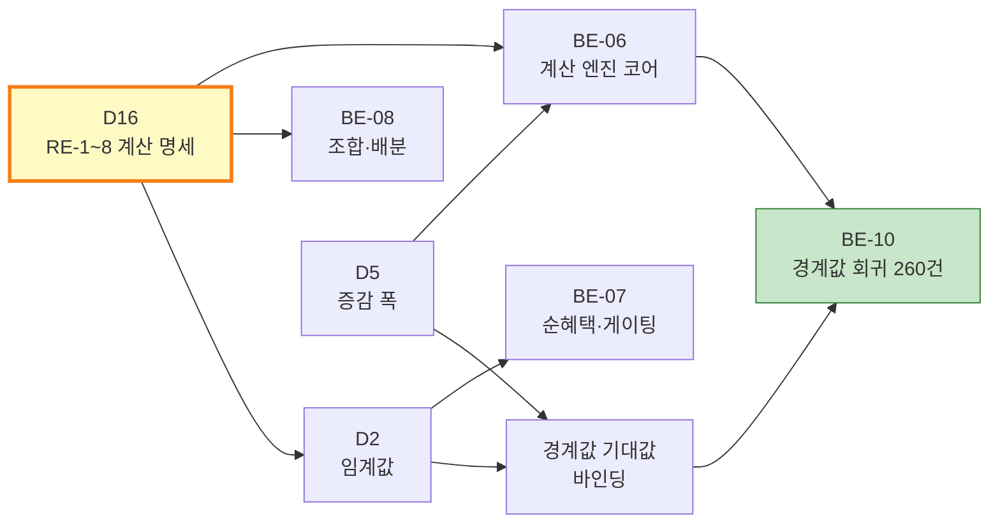
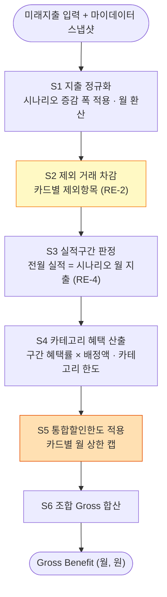
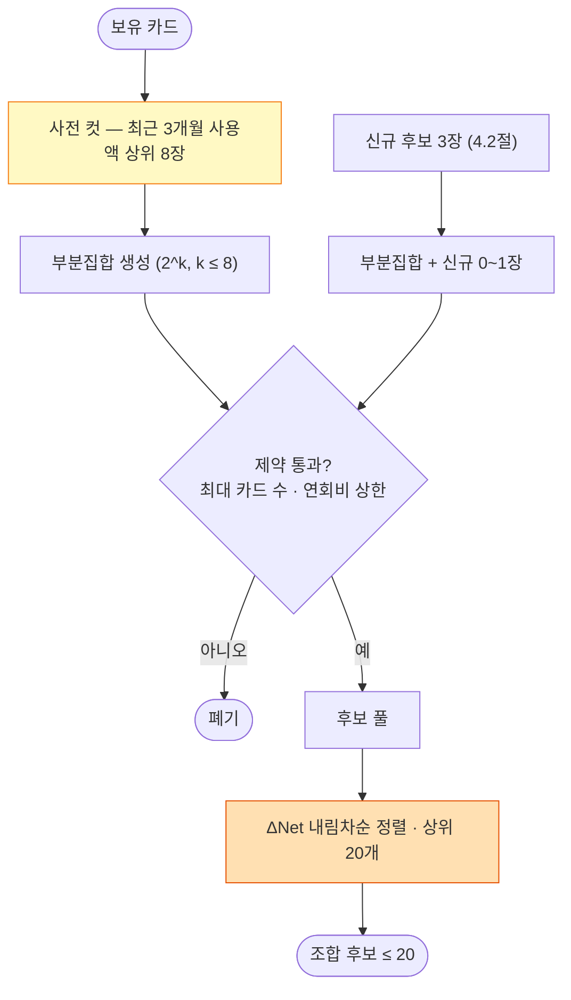

# [CALC] CardFit (한글)

# 규칙 엔진 계산 명세 · Net Benefit 게이팅 기준 (D16 · D2 · D5)

**문서 ID:** CALC-CARDFIT-001

**개정 버전:** 1.0

**날짜:** 2026-08-25

**근거 문서:** SRS-CARDFIT-001 v1.0 (`[SRS]cardfit-srs-v1_0.md`) 4.1.0 · 4.1.1 · 6.3

**참조 문서:** GTD-CARDFIT-001 (게이트 데이터) · FXT-CARDFIT-001 (픽스처 데이터) · STD-CARDFIT-001 (테스트)

**해소 대상:** 의존성 **D16**(RE-1~RE-8) · **D2**(Net Benefit 임계값) · **D5**(시나리오 증감 폭) — SRS 10.3

---

## 0. 이 문서가 해소하는 것

SRS 4.1.0은 규칙 엔진이 **무엇을 입력받아 무엇을 내놓는가**까지만 정의했다. **그 안에서 어떤 순서로 어떤 식을 적용하는가**는 비어 있었고, 이것이 D16이다. 비어 있는 동안 계산 도메인 태스크 4개가 착수 불가였다.



**D16 → D2 순서를 지켰다.** 전환비용 산정 방법(RE-5)을 먼저 고정하고 그 위에서 임계값(D2)을 정했다. 순서를 뒤집으면 전환비용의 크기를 모른 채 임계값을 정하게 되어 임계값이 판정력을 갖지 못한다(SRS 4.1.0 RE-5).

### 0.1 이 문서의 지위

| 항목 | 내용 |
| --- | --- |
| **성격** | 기획·상품 결정의 기록. 기술 설계가 아니다 |
| **정본 범위** | 계산 순서 · 산정식 · 판정 기준값 · 동점 처리 |
| **구속 대상** | BE-06 · BE-07 · BE-08 · BE-10 · BE-11 · 경계값 260건 기대값 |
| **변경 절차** | 값 변경은 `rule_spec_version` 증가 + 경계값 260건 재바인딩 + 배포 게이트 ① 재실행 |

---

## 1. 결정 요약

**10건의 결정을 한 표에 모은다.** 각 행이 SRS 4.1.0의 미결 항목 하나에 대응한다.

| # | 항목 | **결정값** | 채택하지 않은 대안 | 채택 이유 |
| :---: | --- | --- | --- | --- |
| **RE-1** | 계산 적용 순서 | **S1 지출 정규화 → S2 제외 차감 → S3 실적구간 판정 → S4 카테고리 혜택·한도 → S5 통합할인한도 → S6 합산** (2장) | 한도를 제외 차감 전에 적용 | 제외 거래는 애초에 혜택 대상이 아니다. 먼저 빼야 한도가 실제 혜택분에만 걸린다 |
| **RE-2** | 제외항목 적용 대상 | **실적 산정·혜택 적용 둘 다** | 혜택 적용에만 | 카드사 약관의 다수 관행이며, 둘 다 적용이 사용자에게 불리한 쪽(보수적)이라 과대 추정 위험이 없다 |
| **RE-3** | Gross Benefit 산정 기간 | **월 단위 정규화.** 연회비는 ÷12 | 연 단위 합산 · 입력 기간 기준 | 실적구간·통합할인한도가 원래 월 단위다. 변환 손실이 가장 적고 임계값을 "월 ○○○원"으로 읽을 수 있다 |
| **RE-4** | 미래 시나리오의 "전월 실적" | **정상 상태 가정** — 전월 실적 = 같은 시나리오의 월 지출 총액(제외 차감 후) | 과거 3개월 평균 고정 · 첫 달 미달 처리 | 시나리오 3개가 실적구간 차이로 드러난다. 첫 달 실적 미달 가능성은 **미반영 항목**으로 고지한다(3.5절) |
| **RE-5** | 전환비용 3항목 산정 | **ⓐ 연회비 변동 ÷12 · ⓑ 신규 진입 카드당 월 5,000원 · ⓒ 변경 항목당 10,000원 ÷12 상각** (3.1절) | 연회비만 계산 · 균형 계수 | "유지"를 기본 결론으로 두는 ADR-01과 정합한다. 전환비용을 작게 잡으면 GR2 위반 위험이 커진다 |
| **RE-6** | 조합 후보 생성 규칙 | **제약 필터 후 상위 20개.** 보유카드 사전 컷 8장 (4.1절) | 2^N 전수 · 그리디 | 카드 10장에서도 REQ-NF-001(p95 ≤ 5s)과 서버리스 실행 상한을 지킨다 |
| **RE-7** | 신규 카드 후보 풀 | **픽스처 카탈로그 24종 중 적합도 상위 3장** (4.2절) | 전 상품 · 제휴 상품만 | D4(지원 범위)를 픽스처로 고정했다. 출처는 FXT-CARDFIT-001 |
| **RE-8** | 동일 카테고리 중복 혜택 | **택일.** 한 카테고리 금액은 한 카드에만 배정 | 합산 | 한 거래는 한 장으로 결제된다. 합산 가정은 실제로 받을 수 없는 금액을 만든다 |
| **D2** | Net Benefit 임계값 | **절대 월 3,000원 · 상대 10%** (3.3절) | 절대 1,000원·상대 5% | 커피 두 잔 값 이하의 개선으로 카드를 바꾸라고 말하지 않는다. A5 가정의 검증 대상 값이다 |
| **D5** | 시나리오 증감 폭 | **±20%** | ±10% · ±30% | SRS 6.3 규칙7의 캡션 예시("예상보다 20% 적게 쓸 경우")와 일치한다 |

> **RE-5와 D2는 한 쌍이다.** 전환비용을 크게 잡고 임계값도 높이면 "유지"만 나오고, 둘 다 낮추면 "변경"만 나온다. 위 조합은 **전환비용을 현실적으로 잡고 임계값은 그 위에서 완만하게** 두는 지점이다. 실측 분포는 E2(Concierge Test)에서 확인하며, 조정하면 `rule_spec_version`을 올린다.

---

## 2. 계산 파이프라인 (RE-1)

### 2.1 단계 정의



| 단계 | 입력 | 처리 | 출력 |
| :---: | --- | --- | --- |
| **S1** | 미래지출 입력(카테고리·금액·시점) | 시나리오 계수 적용(적게 0.8 · 예상대로 1.0 · 많이 1.2) 후 **월 지출액으로 환산** | `monthly_spend[category]` |
| **S2** | S1 · 카드별 `exclusions` | 제외 카테고리 금액을 **실적 기준액과 혜택 기준액 양쪽에서** 제거 | `eligible_spend[card][category]` |
| **S3** | S2 합계 | `perf_tiers`에서 구간 판정. 구간 경계는 **이상(≥) 기준** | `tier[card]`, `benefit_rate[card][category]` |
| **S4** | S2 · S3 | 카테고리별 `floor(금액 × 혜택률)`, 카테고리 한도 초과분 절사 | `benefit[card][category]` |
| **S5** | S4 | 카드별 월 통합할인한도로 캡. 초과 시 **혜택률 높은 카테고리부터 채운다** | `benefit[card]` |
| **S6** | S5 | 조합에 속한 카드의 혜택 합산 | `gross_benefit(C)` (월, 원) |

### 2.2 제외항목의 적용 대상 (RE-2)

**제외 카테고리 금액은 실적으로도 인정되지 않고 혜택도 받지 못한다.** 예를 들어 세금·공과금이 제외항목인 카드에서 월 지출 200만원 중 공과금이 30만원이면, 실적 산정액은 170만원이고 혜택 산정액도 170만원이다.

**이 선택이 사용자에게 불리한 쪽이다.** 실적만 인정하고 혜택은 주지 않는 카드사도, 반대인 카드사도 있으므로 상품별 실제 약관과 어긋날 수 있다. 어긋나는 카드는 픽스처 `exclusion_mode` 필드로 표시하고, 근거 화면의 **미반영 항목**에 고지한다.

### 2.3 산정 기간 정규화 (RE-3)

| 값 | 정규화 |
| --- | --- |
| 카테고리 혜택 · 통합할인한도 | 원래 월 단위 — 그대로 |
| 연회비 | `round(연회비 ÷ 12)` — 원 단위 반올림(HALF_UP) |
| 1회성 전환 실행 부담 | `round(금액 ÷ 12)` — 12개월 상각 |
| 사용자 입력 미래지출 | 입력 기간이 n개월이면 `총액 ÷ n` |

**모든 판정과 표시는 "월 ○○○원" 축 하나로만 이뤄진다.** 화면에 연 단위 금액을 병기할 때는 `월값 × 12`로 계산하고, 계산 내부에서 연 축을 쓰지 않는다.

### 2.4 "전월 실적"의 정의 (RE-4)

미래 지출 계획에는 "전월"이 없다. **정상 상태(steady state)를 가정한다** — 해당 시나리오의 월 지출이 매달 반복된다고 보고, 그 값을 전월 실적으로 쓴다.

| 시나리오 | 월 지출(제외 차감 후) | 전월 실적으로 쓰는 값 |
| :---: | :---: | :---: |
| 적게 | 입력 × 0.8 | 같은 값 |
| 예상대로 | 입력 × 1.0 | 같은 값 |
| 많이 | 입력 × 1.2 | 같은 값 |

**시나리오 3개가 의미를 갖는 이유가 여기 있다.** "적게" 시나리오에서 실적 구간이 한 칸 떨어지면 혜택률이 함께 떨어지고, 그것이 탭 사이 금액 차이로 나타난다.

**첫 달은 이 가정이 성립하지 않는다.** 실제로는 전월 실적이 아직 쌓이지 않아 첫 달 혜택이 낮을 수 있다. 이 한계는 근거 화면의 미반영 항목 ①로 고지한다(3.5절).

### 2.5 동일 카테고리 중복 혜택 (RE-8)

**택일한다.** 카테고리 하나의 금액은 조합 안의 카드 **한 장에만** 배정된다. 배정 규칙은 결정론적이다.

1. 카테고리별로 **한계 혜택액**(그 카드에 배정했을 때 늘어나는 혜택)이 가장 큰 카드를 선택한다
2. 통합할인한도에 걸려 한계 혜택액이 0이 되면 **차순위 카드**로 넘긴다
3. 동점이면 **① 혜택률 높은 카드 ② 연회비 낮은 카드 ③ `card_product_id` 사전순** 순으로 결정한다

배정 순서는 **카테고리 금액 내림차순**이며, 금액이 같으면 카테고리 코드 사전순이다. 이 순서가 고정이라 같은 입력은 항상 같은 배분을 낳는다(REQ-NF-002).

### 2.6 정수·반올림 정책

| 지점 | 규칙 |
| --- | --- |
| 카테고리 혜택 산출 | **내림(floor)** — 카드사가 소수점 이하를 주지 않는다 |
| 월 환산(÷12, ÷n) | **반올림(HALF_UP)** — 원 단위 |
| 한도 절사 | 내림 |
| 배분 금액 | 원 단위 정수. 잔여 오차는 **배분 금액이 가장 큰 카테고리**에 흡수 → 합계 오차 ≤ 1원(REQ-FUNC-005) |
| 저장 타입 | 원 단위 정수 `BIGINT`. 부동소수를 계산 경로에 두지 않는다(SRS 1.5.1 신규제약 5) |

---

## 3. 전환비용과 게이팅 (RE-5 · D2)

### 3.1 전환비용 3항목 (RE-5)

| 항목 | 산정식 (월, 원) | 근거 |
| :---: | --- | --- |
| **ⓐ 연회비 변동** | `round((후보 조합 연회비 합 − 현재 조합 연회비 합) ÷ 12)` | 관측 가능한 실제 금액. 음수(절감)를 허용한다 |
| **ⓑ 실적 재달성 부담** | `5,000원 × 신규 진입 카드 수` | 새 카드의 실적 구간에 오르기까지 혜택이 낮게 나오는 구간을 월 정액으로 근사 |
| **ⓒ 전환 실행 부담** | `round(10,000원 × 변경 항목 수 ÷ 12)` | 해지·발급·주력카드 교체 1건당 1회성 10,000원을 12개월 상각 |

**용어 고정**

| 용어 | 정의 |
| --- | --- |
| **신규 진입 카드** | 현재 조합에 없다가 후보 조합에 포함된 카드 (신규 발급 + 보유 중 미사용 카드의 재활성화) |
| **변경 항목** | 해지 1건 · 신규 발급 1건 · 주력 카테고리 재배정 1건을 각각 1로 센다 |
| **현재 조합** | 마이데이터 스냅샷의 보유카드 중 **최근 3개월 사용 이력이 있는 카드** 전부 |

`전환비용(C) = ⓐ + ⓑ + ⓒ`. 유지 후보(현재 조합 그대로)의 전환비용은 **정의상 0원**이다.

**ⓑ·ⓒ의 계수 5,000원·10,000원은 관측값이 아니라 판단값이다.** "수고"를 돈으로 바꾸는 데는 정답이 없다(SRS 4.1.0 RE-5). 이 값은 A5 가정의 검증 대상이며 E2에서 사용자 납득 여부를 확인한다. 근거 화면에는 **계수와 산정 방식을 그대로 노출**한다.

### 3.2 Net Benefit 정의

```
Gross(C)       = 조합 C의 월 혜택 합계 (2장 S6)
NetBenefit(C)  = Gross(C) − 전환비용(C)
ΔNet(C)        = NetBenefit(C) − Gross(현재 조합)
```

**SRS 4.1.1 ②의 "Net Benefit ≥ 임계값"은 개선분 `ΔNet` 기준으로 해석한다.** 임계값이 절대 금액(월 3,000원)이므로 이 해석에서만 판정력이 생긴다 — `NetBenefit` 총액과 비교하면 거의 모든 후보가 통과해 게이팅이 무력해진다. 이 해석 고정이 본 명세가 SRS에 추가하는 유일한 의미 결정이다.

### 3.3 게이팅 판정 (D2)

| 판정 | 조건 |
| :---: | --- |
| **RECOMMEND_CHANGE** | `ΔNet(C) ≥ 3,000원/월` **그리고** `ΔNet(C) ÷ Gross(현재) ≥ 0.10` |
| **KEEP_CURRENT** | 위 두 조건 중 **하나라도** 미달 |

**경계는 이상(≥) 기준이다.** 정확히 3,000원이면 통과, 2,999원이면 미달이다. 경계값 케이스 `BC-*`(gating 차원)의 기대값이 이 규칙을 따른다.

**`Gross(현재) = 0`인 경우** — 보유 카드가 없거나 현재 혜택이 0원이면 상대 판정은 **면제**하고 절대 판정만 적용한다. 0으로 나누는 경로를 두지 않는다.

**최종 후보 선정** — 조건을 통과한 후보 중 `ΔNet` 최댓값 1건을 결론으로 제시한다. 통과 후보가 0건이면 `KEEP_CURRENT`이며, 이는 **정상 결과이고 반환률 100% 대상**이다(SRS 6.3 규칙2 · GR2).

### 3.4 판정 예시

전제: 현재 조합 `Gross = 32,000원/월`

| 사례 | 후보 Gross | 전환비용 | ΔNet | 절대 판정 | 상대 판정 | 결론 |
| :---: | ---: | ---: | ---: | :---: | :---: | :---: |
| **가** | 41,000 | 5,833 | +3,167 | ✅ ≥3,000 | ✅ 9.9%… | ❌ **KEEP_CURRENT** |
| **나** | 43,000 | 5,833 | +5,167 | ✅ | ✅ 16.1% | **RECOMMEND_CHANGE** |
| **다** | 37,000 | 833 | +4,167 | ✅ | ✅ 13.0% | **RECOMMEND_CHANGE** |
| **라** | 52,000 | 19,167 | +833 | ❌ | ❌ | **KEEP_CURRENT** |

> **사례 가가 이 명세의 성격을 보여준다.** 월 3,167원이 늘지만 상대 기준 10%에 0.1%p 못 미쳐 "유지"가 된다. 두 조건을 **모두** 요구하는 것이 SRS 4.1.1 ②의 두 마름모이며, 하나만 통과한 후보를 변경으로 제안하면 **GR2 위반**이다.

### 3.5 미반영 항목 표준 목록

근거 6항목 중 마지막 항목(REQ-FUNC-006)에 다음을 **항상 노출**한다. 이 목록은 계산이 구조적으로 담지 못하는 것들이다.

| # | 미반영 항목 | 왜 못 넣나 |
| :---: | --- | --- |
| ① | **첫 달 실적 미달 가능성** | 정상 상태 가정(RE-4)의 한계 |
| ② | 카드사 이벤트·한시 프로모션 | `rule_version`에 담기지 않는 비정형 혜택 |
| ③ | 무이자 할부 · 포인트 소멸·이월 | 상품별 규칙이 파편화돼 정형화되지 않았다 |
| ④ | 제외항목 해석 차이 | RE-2를 일괄 적용했다(2.2절) |
| ⑤ | 전환 실행 부담의 개인차 | ⓒ의 10,000원은 평균 가정값이다 |
| ⑥ | 연회비 환급·일할 정산 | 해지 시점의 환급 규칙을 계산에 넣지 않았다 |

---

## 4. 조합 후보 생성 (RE-6 · RE-7)

### 4.1 후보 생성 규칙 (RE-6)



| 규칙 | 값 | 근거 |
| --- | :---: | --- |
| 보유카드 사전 컷 | **최근 3개월 사용액 상위 8장** | 2^8 = 256으로 탐색 상한을 고정한다. 컷으로 빠진 카드는 근거 화면에 목록으로 표기한다 |
| 신규 추가 | **조합당 최대 1장** | 동시에 두 장을 새로 발급하라는 제안은 "단계적 전환"(REQ-FUNC-011)과 어긋난다 |
| 제약 필터 | 최대 카드 수 · 연회비 상한 · 신규 발급 허용 여부 | 사용자 입력(REQ-FUNC-002) |
| 최종 후보 상한 | **20개** | 정렬 후 절단. 절단 사실은 근거 화면에 표기하지 않는다(선정된 1건만 제시하므로) |
| 빈 조합 | 제외 | 카드 0장 조합은 후보가 아니다 |

**후보 수 상한** — 카드 8장 기준 `256 × (1 + 3) = 1,024`개를 생성해 제약 필터 후 상위 20개로 자른다. 카드 3장이면 `8 × 4 = 32`개다. 이 값이 REQ-NF-001 부하 테스트(QA-03)의 기준 규모다.

### 4.2 신규 카드 후보 풀 (RE-7)

**출처는 픽스처 카탈로그 24종이다**(FXT-CARDFIT-001 2장). 선별은 3단계다.

1. **제약 필터** — 사용자의 연회비 상한 이하, 신규 발급 허용일 것
2. **적합도 점수** — 사용자 지출 상위 3개 카테고리에 대해 `Σ(카테고리 월 지출 × 해당 상품의 최고 구간 혜택률)`
3. **상위 3장** — 동점이면 ① 연회비 낮은 순 ② `card_product_id` 사전순

**이미 보유한 상품과 같은 `card_product_id`는 후보에서 제외한다.** 같은 카드를 다시 발급하라는 제안이 되지 않도록 한다.

### 4.3 정렬과 동점 처리 — 결정론 보장

**REQ-NF-002(재계산 불일치 0건)는 정렬이 전순서일 때만 성립한다.** 다음 키를 순서대로 적용한다.

| 순위 | 키 | 방향 |
| :---: | --- | :---: |
| 1 | `ΔNet` | 내림차순 |
| 2 | 전환비용 합 | 오름차순 |
| 3 | 조합 카드 수 | 오름차순 |
| 4 | 연회비 합 | 오름차순 |
| 5 | `card_product_id` 정렬 후 사전순 | 오름차순 |

5번 키까지 오면 동일 조합이므로 전순서가 보장된다. **해시·집합 순회 순서·부동소수 비교를 정렬 키로 쓰지 않는다**(ADR-02 · SRS 10.4 품질 요구).

---

## 5. 시나리오 (D5)

| 시나리오 | 계수 | 캡션 문구 (SRS 6.3 규칙7) |
| :---: | :---: | --- |
| `LESS` 적게 | **0.8** | "예상보다 20% 적게 쓸 경우" |
| `AS_EXPECTED` 예상대로 | **1.0** | "입력하신 금액 그대로" |
| `MORE` 많이 | **1.2** | "예상보다 20% 많이 쓸 경우" |

**계수는 카테고리별이 아니라 전체 지출에 일괄 적용한다.** 카테고리마다 다른 증감을 두면 사용자가 캡션 한 줄로 이해할 수 없고, 근거 화면에 카테고리별 가정을 모두 나열해야 한다.

**3개 시나리오는 1회 수집 데이터로 모두 사전 계산한다**(ADR-03 · REQ-NF-005). 계수만 다른 같은 파이프라인을 3회 도는 구조이므로 마이데이터 재호출이 발생할 자리가 없다.

---

## 6. 배분 (REQ-FUNC-005)

| 규칙 | 내용 |
| --- | --- |
| 배분 단위 | 카테고리 × 카드 (RE-8 택일) |
| 합계 정합 | `Σ 배분 금액 = Σ 입력 지출액`, 오차 ≤ 1원 |
| 잔여 처리 | 반올림 잔여는 **배분 금액 최대 카테고리**에 가산 |
| 역할 표기 | 카드별 주력 카테고리를 배분액 내림차순 최대 3개까지 표기 |
| 실행 | **제시까지만 한다.** 실행 대행·자동 이체 변경은 범위 밖(SRS 1.2) |

---

## 7. 경계값 260건 기대값 바인딩

GTD-CARDFIT-001 1.4절이 예고한 파라미터 주입을 본 명세의 값으로 수행한다.

```bash
python3 tools/generate_boundary_cases.py \
  --abs 3000 --rel 0.10 --delta 0.20 \
  -o tools/boundary-cases.json
# → params_bound: true
```

| 파라미터 | 값 | 출처 |
| --- | :---: | :---: |
| `abs_threshold` | **3000** | D2 (1장) |
| `rel_threshold` | **0.10** | D2 (1장) |
| `scenario_delta` | **0.20** | D5 (1장) |

**기대 숫자 산출은 2~4장의 규칙을 코드로 옮긴 뒤 생성한다**(BE-10). 본 문서는 그 산출이 따를 규칙을 확정할 뿐, 260건의 개별 금액을 손으로 적지 않는다 — 손으로 적으면 규칙과 갈라진다.

---

## 8. 근거 6항목 매핑 (REQ-FUNC-006)

**6항목 하한이 계산 단계와 1:1로 대응한다.** 이 매핑이 성립하지 않으면 BE-12가 `CF-4221`로 거부한다.

| # | 근거 항목 | 산출 지점 |
| :---: | --- | :---: |
| 1 | 적용 실적구간 | S3 (2.1절) |
| 2 | 통합할인한도 | S5 (2.1절) |
| 3 | 연회비 | 전환비용 ⓐ (3.1절) |
| 4 | 제외조건 | S2 (2.2절) |
| 5 | 기준일 | 마이데이터 스냅샷 `as_of` |
| 6 | 미반영 항목 | 표준 목록 6건 (3.5절) |
| (+) | `rule_version` | 카드별 규칙 버전 |

---

## 9. 이 명세가 정하지 않은 것

1. **ⓑ·ⓒ 계수의 실증 근거가 없다.** 5,000원·10,000원은 판단값이며 E2 이후 조정 대상이다.
2. **제외항목 해석을 상품별로 나누지 않았다.** RE-2를 일괄 적용했고, 어긋나는 상품은 미반영 항목 ④로 고지한다.
3. **첫 달 효과를 모델링하지 않았다.** 정상 상태 가정(RE-4)의 대가이며 미반영 항목 ①이다.
4. **후보 상한 20개의 근거는 성능이지 최적성이 아니다.** 21번째 후보가 더 나을 가능성을 배제하지 못한다. 정렬 1순위가 `ΔNet`이므로 실질 위험은 낮지만, 배제한 것을 배제했다고 적어 둔다.
5. **사전 컷 8장은 카드 다수 보유자에게 손해일 수 있다.** SRS 7.2(대량 보유 카드 처리 최적화)가 다룰 항목이다.

---

## 10. 추적

| 결정 | 막고 있던 것 | 해소되는 태스크 |
| :---: | --- | --- |
| RE-1·2·3·4·8 | REQ-FUNC-003 계산 | **BE-06** |
| RE-5 · D2 | REQ-FUNC-004 (b) 게이팅 | **BE-07** |
| RE-6 · RE-7 · RE-8 | REQ-FUNC-004 (a) · 005 배분 | **BE-08** |
| D2 · D5 바인딩 | 경계값 260건 기대값 | **BE-10** · QA-01 |
| 3.5절 미반영 목록 | REQ-FUNC-006 6항목 | BE-11 · BE-12 |
| D5 | 시나리오 캡션 | BE-06 · FE-03 |

---

*근거 문서: `[SRS]cardfit-srs-v1_0.md` (SRS-CARDFIT-001 v1.0) 4.1.0 · 10.3*

*작성자: 기획 분석가, 검토자: 계산 품질, 승인자: 제품 책임자 (PM)*
