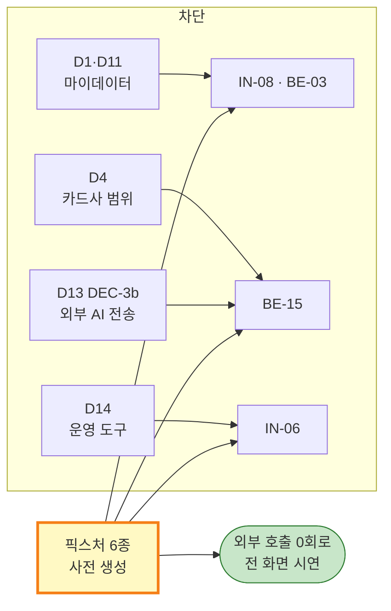

# [FXT] CardFit (한글)

# 외부 연동 없이 시연 가능한 사전 생성 데이터 (D1 · D4 · D11 · D13 · D14)

**문서 ID:** FXT-CARDFIT-001

**개정 버전:** 1.0

**날짜:** 2026-08-25

**근거 문서:** SRS-CARDFIT-001 v1.0 (`[SRS]cardfit-srs-v1_0.md`) 1.5.2 · 6.2 · 10.3

**참조 문서:** CALC-CARDFIT-001 (계산 명세) · GTD-CARDFIT-001 (게이트 데이터) · SDD-CARDFIT-001 (설계)

**해소 대상:** 의존성 **D1**(인가 vs 제휴) · **D4**(지원 카드사 범위) · **D11**(DEC-1 연동 가능성) · **D13**(DEC-3b 외부 AI 전송) · **D14**(운영 도구 선정) — SRS 10.3

---

## 0. 이 문서가 해소하는 것

**외부 시스템에 붙지 않고도 제품 전 화면을 시연할 수 있게 한다.** 마이데이터 API·카드사 약관 수집·외부 AI·발송 채널·APM은 모두 계약이나 인가가 선행돼야 하는 것들이고, 그것을 기다리는 동안 태스크 3건이 착수 불가였다.



### 0.1 산출물

| 파일 | 내용 | 실측 | 소비 대상 |
| --- | --- | :---: | :---: |
| `tools/fixtures/card-products.json` | 카드 상품 카탈로그 · 혜택 규칙 | **24종** | BE-06 · BE-08 · RE-7 후보 풀 |
| `tools/fixtures/terms.json` | 약관 원문 + 요약 | **24건** | BE-14 · BE-15 · FE-04 |
| `tools/fixtures/personas.json` | 페르소나 · 제약조건 · 미래지출 | **5인** | 시연 진입점 |
| `tools/fixtures/mydata-snapshots.json` | 보유카드 · 과거 거래 · 동의 상태 | **348건** | BE-03 · BE-05 |
| `tools/fixtures/expected-results.json` | 페르소나 × 시나리오 3개 기대 결론 | **5 × 3** | QA-04 · TS 전 그룹 |
| `tools/fixtures/ai-cache.json` | 근거 설명 + 약관 요약 캐시 | **5 + 24** | BE-14 · BE-15 · FE-04 |
| `tools/fixtures/demo-clock.json` | 완주 계측 시드 · 만료 시드 | **2 + 2** | BE-13 · BE-17 · FE-07 |
| `tools/generate_fixtures.py` | 생성기 + **참조 계산기** | 1 | 재현·검증 |

**픽스처 파일 7종이다.** 아래 표의 실측은 생성기가 출력한 값이며 문서 정합성 검증기(`tools/verify_docs.py`)가 대조한다.

**생성기가 참조 계산기를 함께 담는다.** 픽스처만 만들고 끝내면 시연에서 의도한 결론이 나오는지 알 수 없다. CALC-CARDFIT-001 2~4장을 그대로 옮긴 계산기로 페르소나별 결론을 대조하고, 어긋나면 생성이 **실패**한다(7장).

---

## 1. 픽스처 모드의 경계

**대체하는 것은 외부 경계뿐이다.** 계산·판정·저장은 실제 코드가 그대로 돈다. 픽스처가 계산 결과를 들고 있으면 제품을 검증한 것이 아니라 픽스처를 검증한 것이 된다.

| 계층 | 픽스처 모드 | 실제 모드 (연동 확보 후) |
| --- | --- | --- |
| 마이데이터 수집 | `FixtureMyDataProvider` — 스냅샷 조회 | `ApiMyDataProvider` — 마이데이터 API |
| 카드 상품·약관 | 카탈로그 24종 시드 | 수집 배치(UC-11) |
| AI 약관 요약 | 캐시 조회 | Vercel AI SDK 호출 (DEC-3a) |
| AI 근거 설명 | 캐시 조회 | Vercel AI SDK 호출 (DEC-3b) |
| 발송 채널 | `outbox` 테이블 적재 | 이메일·알림톡 사업자 |
| 실시간 알림 | `alerts` 테이블 + 대시보드 | 알림 도구 |
| 이벤트 분석 | `events` 테이블 집계 | 분석 도구 |
| APM | Route Handler 계측 → `latency_samples` | APM 도구 |
| **계산 엔진** | **대체하지 않는다** | 동일 |
| **게이팅·근거 게이트** | **대체하지 않는다** | 동일 |
| **인증·RLS·감사** | **대체하지 않는다** | 동일 |

**전환 방식은 환경변수 하나다.** `CARDFIT_DATA_MODE=fixture | live`. 인터페이스는 어느 쪽에서도 같고, 픽스처 구현이 인터페이스를 먼저 확정한다 — 이것이 IN-08의 실제 산출물이다.

> **ADR-02 경계를 픽스처가 넘지 않는다.** AI 캐시는 `ExplanationModule`이 읽고, 계산 엔진은 이 파일을 알지 못한다. 의존성 린트(IN-04)의 검사 대상에 픽스처 어댑터를 포함한다.

---

## 2. 카드 상품 카탈로그 (D4 · RE-7)

### 2.1 명명 규칙과 면책

| 요소 | 처리 |
| --- | --- |
| **카드사명** | **실명 사용** — 신한·삼성·현대·KB국민·롯데·하나·우리·NH농협 8곳 |
| **상품명** | **유형명으로 가공** — "생활할인형", "교통주유형" 등. 실존 상품명을 쓰지 않는다 |
| **혜택 규칙** | 공개 약관의 일반적 형태를 **근사한 값**. 특정 상품의 실제 조건이 아니다 |
| **약관 원문** | 시연용 가공 문서. 머리에 `[시연용 가공 문서]`를 표기한다 |

**실존 상품명을 쓰지 않는 이유** — 실제 상품명 아래에 근사값을 넣으면 그 카드의 조건을 잘못 표시하는 것이 된다. 카드사명은 유지해 시연의 현실감을 살리고, 조건을 특정 상품에 귀속시키지 않는 지점이 이 선택이다. **모든 화면에 "시연용 가공 데이터" 배지를 노출한다**(DS-01 컴포넌트).

### 2.2 상품 구조

```json
{
  "card_product_id": "SHC-LIFE",
  "issuer": "신한카드",
  "name": "생활할인형",
  "annual_fee": 15000,
  "tiers": [
    {"min_spend": 0,      "monthly_cap": 0,     "rates": {}},
    {"min_spend": 300000, "monthly_cap": 20000, "rates": {"FOOD": 0.07, "CAFE": 0.10}},
    {"min_spend": 700000, "monthly_cap": 40000, "rates": {"FOOD": 0.10, "CAFE": 0.10}}
  ],
  "category_caps": {"CAFE": 10000},
  "exclusions": ["UTILITY", "TELECOM"],
  "exclusion_mode": "BOTH",
  "rule_version": "2026-08-01-shc-life"
}
```

| 필드 | 대응 SRS·명세 |
| --- | --- |
| `tiers[].min_spend` | 실적구간 (CALC 2.1 S3) — **이상(≥) 기준** |
| `tiers[].monthly_cap` | 통합할인한도 (S5) |
| `category_caps` | 카테고리별 한도 (S4) |
| `exclusions` · `exclusion_mode` | 제외항목 (RE-2). `BOTH` = 실적·혜택 양쪽 제외 |
| `rule_version` | REQ-NF-007 최신성 판정 · 근거 6항목 |

**`tiers[0]`은 실적 미달 구간이며 혜택률이 비어 있다.** 실적 미달 시 혜택 0원이 되는 경로(경계값 `TIER_BELOW_MIN`)를 데이터로도 재현한다.

### 2.3 구성

| 유형 | 상품 수 | 대표 카테고리 |
| --- | :---: | --- |
| 생활할인형 | 3 | 식비 · 마트 · 편의점 |
| 교통·주유형 | 3 | 대중교통 · 주유 |
| 온라인·쇼핑형 | 3 | 온라인쇼핑 · 쇼핑 |
| 통신·공과금형 | 3 | 통신 · 공과금 |
| 프리미엄·여행형 | 3 | 여행 · 쇼핑 |
| 무연회비·기본형 | 3 | 저혜택 · 연회비 0원 |
| 육아·의료형 | 2 | 교육 · 의료 |
| 외식·문화형 | 4 | 식비 · 문화 |
| **합계** | **24** | 카테고리 15종 전건 커버 |

**연회비 0원 상품 4종과 10만원 상품 1종을 함께 둔다.** 전환비용 ⓐ(연회비 변동)가 양수·음수 양쪽으로 나오는 경로를 데이터가 갖고 있어야 게이팅을 제대로 시연할 수 있다.

---

## 3. 페르소나와 마이데이터 스냅샷 (D1 · D11)

### 3.1 페르소나 5인

| ID | 이름 | 보유 | 제약 | 의도한 결론 | 무엇을 시연하나 |
| :---: | --- | --- | --- | :---: | --- |
| **P1** | 김하늘 | 2장 | 최대 2장 · 40,000원 | **KEEP_CURRENT** | 개선 후보가 절대 기준부터 미달인 명백한 유지 |
| **P2** | 이도현 | 2장 | 최대 3장 · 40,000원 | **KEEP_CURRENT** | **절대 기준은 통과, 상대 10% 미달** — 경계 판정 |
| **P3** | 박서윤 | 3장 | 최대 3장 · 30,000원 · 신규 불가 | **RECOMMEND_CHANGE** | **전환비용이 음수**(연회비 절감)인 해지형 변경 |
| **P4** | 정민재 | 1장 | 최대 2장 · 30,000원 | **RECOMMEND_CHANGE** | 신규 발급 1장을 포함한 변경 · 북극성 경로 |
| **P5** | 최유진 | 2장 | 최대 4장 · 60,000원 | **EXCEPTION** | 동의 만료 · 수집 장애 · 근거 미달 |

### 3.2 참조 계산기 실측 (예상대로 탭)

| ID | 현재 혜택(월) | 후보 수 | 판정 | 제시 조합 | 전환비용(월) | ΔNet(월) |
| :---: | ---: | :---: | :---: | --- | ---: | ---: |
| P1 | 55,500 | 12 | KEEP | — | — | — |
| P2 | 71,400 | 12 | KEEP | — | — | +4,666 (6.5%) |
| P3 | 39,100 | 3 | **CHANGE** | LTC-ONLINE + NHC-BASIC | **−7,500** | +7,500 (19.2%) |
| P4 | 10,000 | 7 | **CHANGE** | SHC-BASIC + HNC-DINE | +8,750 | +38,100 |

**P2가 이 픽스처의 핵심이다.** 월 4,666원이 늘지만 현재 혜택 대비 6.5%라 상대 기준 10%에 못 미쳐 "유지"가 된다. **두 조건 중 하나만 통과한 후보를 변경으로 제안하면 GR2 위반**이며(SRS 4.1.1 ②), 이 페르소나가 그 감시를 실동작으로 확인하는 경로다.

**탭마다 결론이 다를 수 있다** — P3는 "많이" 탭에서 KEEP으로 뒤집힌다. 지출이 늘면 프리미엄 카드가 제 값을 하기 때문이다. 이는 오류가 아니라 시나리오 3개를 두는 이유이며, 기본 탭("예상대로") 결론이 대표 결론이라는 규칙(SRS 6.3 규칙6)을 화면에서 확인하는 재료다.

### 3.3 과거 거래 스냅샷

| 항목 | 값 |
| --- | --- |
| 기간 | 기준일 직전 **3개월** |
| 총 거래 | **348건** (페르소나 5인 합계) |
| 건당 구성 | `merchant` · `category` · `amount` · `paid_at` · `card_product_id` |
| 생성 방식 | 월 지출 프로필을 건별로 분해. **고정 시드**(`SEED=20260825`)로 재현 가능 |
| 갱신 | **하지 않는다** — SRS 1.4 A-002(수집 후 갱신되지 않는다)를 데이터로 지킨다 |

**동의 상태를 스냅샷에 담는다.** P5는 `EXPIRED`이며, 이 상태로 계산을 요청하면 `ConsentGuard`가 400을 반환한다(REQ-EXC-004). 픽스처는 동의를 우회하지 않는다.

---

## 4. 약관과 AI 산출물 캐시 (D13)

| 산출물 | 건수 | DEC 대응 |
| --- | :---: | --- |
| 약관 원문 | 24 | 수집 배치 대체 |
| AI 약관 요약 | 24 | **DEC-3a** — 공개 문서라 원래도 전송 가능. 캐시는 호출 비용만 줄인다 |
| AI 근거 설명 | 5 | **DEC-3b** — 사용자 금융정보 전송 문제 자체를 없앤다 |

**DEC-3b가 픽스처로 해소되는 이유는 데이터의 성격이 바뀌기 때문이다.** 픽스처 페르소나는 실존 인물이 아니므로 전송할 개인정보가 없다. 실제 사용자 데이터를 다루는 시점에 DEC-3b는 **다시 열린다** — 픽스처는 이 결정을 없앤 것이 아니라 **시연 시점에서 미룬 것**이며, 9장에 한계로 적었다.

**AI 설명은 규칙 엔진 산출값을 인용만 한다**(ADR-02 · SRS 6.3 규칙4). 캐시 문구도 같은 규칙을 지켜, 금액은 전부 계산 결과에서 온 값이다.

```
P3 근거 설명 (캐시)
  "제안드린 조합은 월 39,100원의 혜택이 예상됩니다. 연회비가 줄어 전환 부담이
   오히려 월 7,500원 이득입니다. 지금보다 월 7,500원이 늘어납니다.
   해지 1장 · 새로 쓰기 시작하는 카드 0장이며, 신청과 해지는 카드사에서
   직접 진행하셔야 합니다."
```

마지막 문장이 REQ-FUNC-009의 경계 고지다. **AI 산출물 53건 전건을 금지어 스캐너에 통과시켰다**(7.3절).

---

## 5. 운영 도구 대체 (D14)

**네 도구를 고르는 대신 DB 테이블 네 개로 대체한다.** 스택 안에서 성립하며(C-TEC-003), 도구를 도입하면 어댑터만 교체한다.

| 필요한 수단 | 픽스처 모드 구현 | 요구사항 |
| --- | --- | :---: |
| 사용자 발송 채널 | `outbox` 테이블 적재 + 대시보드 열람. 실제 발송 0건 | REQ-FUNC-010 |
| 실시간 운영 알림 | `alerts` 테이블 + Guardrail 위반 시 적재 | 11.2 GR1~5 |
| 이벤트 분석 | `events` 테이블 (7종) + 7일 코호트 집계 쿼리 | REQ-NF-009 |
| APM | Route Handler 미들웨어가 `latency_samples`에 p50·p95·p99 원천 기록 | REQ-NF-001·003 |

**발송을 "적재"로 바꿔도 REQ-FUNC-010은 검증된다.** 요구사항이 요구하는 것은 *"+30일에 1회만, 재발송·독려 0건"* 이며, 이는 발송 대상 선정 로직의 문제다. 실제 채널 연결은 로직 검증 뒤의 배관이다.

---

## 6. 데모 클럭

**30일 대기를 시연에서 기다릴 수 없다.** 기준 시각을 코드가 아니라 데이터에서 읽는다.

| 항목 | 값 |
| --- | --- |
| `DEMO_NOW` | **2026-08-25** (픽스처 생성 기준일) |
| 선택 이력 시드 | `demo-clock.json` `outcome_seeds` **2건** — 선택일 `DEMO_NOW − 30일`, `status: NOT_SENT` → 발송 대상으로 즉시 조회된다 |
| 만료 시드 | `demo-clock.json` `expiry_seeds` **2건** — `기준일 +30일 경과` 1건 · `rule_version 변경` 1건 (REQ-EXC-006 · ADR-06) |
| 원칙 | 계산·판정 경로에서 `now()`를 직접 호출하지 않고 **주입받는다**. 결정론(REQ-NF-002)의 전제이기도 하다 |

---

## 7. 검증

### 7.1 참조 계산기 대조

생성기는 CALC-CARDFIT-001을 옮긴 계산기로 페르소나별 결론을 산출하고 `expect`와 대조한다. **하나라도 어긋나면 종료코드 1로 생성을 중단한다.**

```
P1: 기대 KEEP_CURRENT · 실측 KEEP_CURRENT (적게 KEEP_CURRENT / 많이 KEEP_CURRENT)
P2: 기대 KEEP_CURRENT · 실측 KEEP_CURRENT (적게 KEEP_CURRENT / 많이 KEEP_CURRENT)
P3: 기대 RECOMMEND_CHANGE · 실측 RECOMMEND_CHANGE (적게 RECOMMEND_CHANGE / 많이 KEEP_CURRENT)
P4: 기대 RECOMMEND_CHANGE · 실측 RECOMMEND_CHANGE (적게 RECOMMEND_CHANGE / 많이 RECOMMEND_CHANGE)
P5: EXCEPTION (예외 전용)
✅ 페르소나 전건이 의도한 결론을 낸다 (예상대로 시나리오 기준)
```

### 7.2 참조 계산기의 지위

**제품 구현이 아니다.** BE-06~08은 이 계산기를 이식하는 것이 아니라 명세(CALC-CARDFIT-001)를 구현하며, `expected-results.json`은 그 구현이 맞았는지 보는 **독립 대조본**이다. 두 구현이 같은 명세에서 갈라져 나오는 구조라, 값이 어긋나면 둘 중 하나가 명세를 잘못 읽은 것이다.

### 7.3 금지어 스캔

AI 근거 설명 5건 + 약관 요약 24건 + 약관 원문 24건 = **53건 전건**을 GTD 금지어 사전으로 스캔했고 `block` 심각도 적발 **0건**이다(GR4).

### 7.4 재현

```bash
python3 tools/generate_fixtures.py            # 픽스처 6종 + 검증
python3 tools/generate_boundary_cases.py \
        --abs 3000 --rel 0.10 --delta 0.20 \
        -o tools/boundary-cases.json          # D2·D5 바인딩
python3 tools/verify_docs.py                  # 문서 정합성
```

**고정 시드라 실행할 때마다 같은 결과가 나온다.** 픽스처가 실행마다 달라지면 `expected-results.json`이 기대값 노릇을 하지 못한다.

---

## 8. 스키마 매핑

| 픽스처 | SRS 6.4 테이블 | 적재 태스크 |
| --- | --- | :---: |
| `card-products.json` | `card_products` · `benefit_rules` | DA-05 |
| `terms.json` | `benefit_rules.terms_text` · `terms_summary` | DA-05 |
| `personas.json` | `users` · `constraints` · `future_spend_plans` | DA-06 |
| `mydata-snapshots.json` | `held_cards` · `past_spends` · `consents` | DA-06 |
| `expected-results.json` | 적재하지 않는다 — 테스트 대조용 | QA-04 |
| `ai-cache.json` | `ai_outputs` (요약·설명 캐시) | DA-05 · BE-20 |
| `demo-clock.json` | `outcome_logs` · `plan_candidates.status` | DA-06 |

---

## 9. 이 픽스처가 대체하지 못하는 것

1. **DEC-3b는 미뤄진 것이지 없어진 것이 아니다.** 실제 사용자 금융정보를 다루는 순간 국외 이전 검토가 다시 필요하다.
2. **D1(인가 vs 제휴)의 사업·규제 판단은 그대로 남는다.** 픽스처는 그 결정을 기다리는 동안 개발을 진행하게 할 뿐이다.
3. **마이데이터 API의 실제 응답 스키마·오류 코드·지연 특성을 모른다.** `ApiMyDataProvider` 구현 시 어댑터 내부는 다시 설계된다.
4. **혜택 규칙이 실제 상품과 다르다.** 계산 정확도를 이 데이터로 주장할 수 없다. 검증되는 것은 **계산 로직**이지 혜택 정보가 아니다.
5. **AI 캐시는 모델 교체 회귀(GR4)를 대체하지 않는다.** 실제 호출로 전환하는 시점에 금지어 스캔을 다시 돌려야 한다.
6. **부하 특성이 실제와 다르다.** 카드 10장 부하(QA-03)는 페르소나를 늘려 별도로 측정한다.

---

## 10. 추적

| 픽스처 | 해소한 의존성 | 풀린 태스크 |
| --- | :---: | :---: |
| 마이데이터 스냅샷 · 어댑터 경계 | **D1 · D11 (DEC-1)** | IN-08 · BE-03 · BE-05 |
| 카드 상품 카탈로그 24종 | **D4 · RE-7** | BE-15 · BE-08 |
| 약관 + AI 캐시 | **D13 (DEC-3b)** | BE-14 · BE-15 · FE-04 |
| 운영 도구 대체 4종 | **D14** | IN-06 · BE-17 · BE-18 · FE-08 |
| 데모 클럭 | — | BE-13 · BE-17 · FE-07 |
| 참조 계산기 · 기대 결론 | (CALC 검증) | BE-06~08 · BE-10 · QA-04 |

---

*근거 문서: `[SRS]cardfit-srs-v1_0.md` (SRS-CARDFIT-001 v1.0) 1.5.2 · 10.3*

*작성자: 기획 분석가, 검토자: 개발팀 리드 · 컴플라이언스·보안, 승인자: 제품 책임자 (PM)*
