# [SDD] CardFit (한글)

# 기술 설계 명세서 (SDD)

**문서 ID:** SDD-CARDFIT-001

**개정 버전:** 1.0

**날짜:** 2026-08-25

**근거 문서:** SRS-CARDFIT-001 v1.0 (`[SRS]cardfit-srs-v1_0.md`)

**참조 문서:** PRD-CARDFIT-001 (`../cardfit-prd-v1_0.md`)

---

## 0. 이 문서를 읽는 방법

### 0.1 SRS와의 관계

**SRS는 "무엇을 만들 것인가", 이 문서는 "어떻게 만들 것인가"를 다룬다.**

SRS의 요구사항 27건(REQ-FUNC 12 · REQ-NF 9 · REQ-EXC 6)을 설계 산출물로 옮긴 것이며, **새로운 요구사항을 만들지 않았다.** 이 문서에 있고 SRS에 없는 내용은 전부 "요구사항을 만족시키는 방법"에 해당한다.

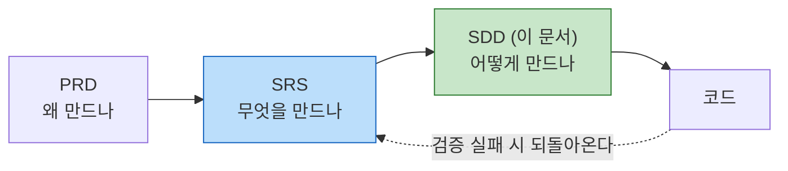

### 0.2 다이어그램 종류와 읽는 순서

배경지식이 없어도 순서대로 읽으면 이해되도록 배치했다. **처음 읽는 사람은 1 → 5 → 2 순서를 권한다.**

| 장 | 다이어그램 | 무엇을 보여주나 | 이런 질문에 답한다 |
| :---: | --- | --- | --- |
| **1** | 유스케이스 | 누가 이 서비스로 무엇을 하나 | "이 서비스는 누가 쓰나?" |
| **2** | 컴포넌트 | 시스템이 어떤 덩어리로 나뉘나 | "어디에 무슨 코드가 들어가나?" |
| **3** | 클래스 (CLD) | 코드의 뼈대가 어떻게 생겼나 | "무슨 클래스를 만들어야 하나?" |
| **4** | ERD | 데이터를 어디에 담나 | "DB 표가 몇 개고 어떻게 이어지나?" |
| **5** | 시퀀스 | 요청 하나가 어떤 순서로 처리되나 | "버튼을 누르면 무슨 일이 일어나나?" |
| **6** | 순서도 | 판단이 어떤 갈래로 갈라지나 | "어떤 조건에서 어떤 답이 나오나?" |
| **7** | 상태 기계 | 무엇이 어떤 상태를 거쳐가나 | "이 데이터는 언제 만료되나?" |
| **8** | 추적 매트릭스 | 요구사항이 설계로 다 옮겨졌나 | "빠진 요구사항이 없나?" |

### 0.3 이 서비스를 처음 보는 사람을 위한 3줄 요약

1. **카드를 여러 장 가진 사람**에게 어떤 카드를 남기고 없앨지 계산해준다
2. **미래에 쓸 돈**을 기준으로 계산한다 — 과거 소비만 보는 다른 서비스와 다른 지점이다
3. 바꿔서 얻는 이득이 작으면 **"그대로 두세요"라고 답한다.** 이걸 게이팅이라 부르고, 이 서비스의 핵심이다

---

## 1. 유스케이스 모델

### 1.1 유스케이스 다이어그램

> **읽는 법** — 왼쪽·오른쪽의 사람 모양이 **행위자**(서비스를 쓰는 사람이나 시스템), 가운데 둥근 상자가 **유스케이스**(그 사람이 하는 일)다. 점선은 외부 시스템과의 연결이다.

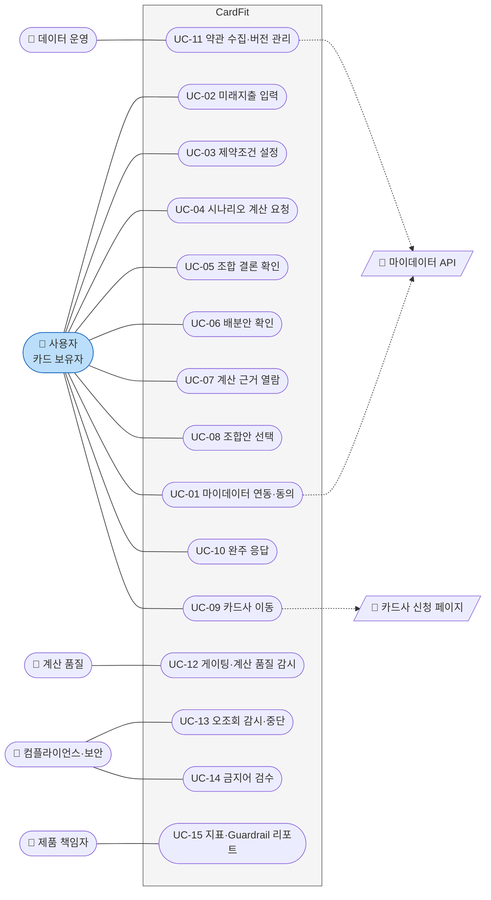

**행위자 5명 중 4명이 운영 인력이다.** 이 서비스는 사용자 기능만으로 성립하지 않는다 — 약관을 수집하는 사람(UC-11)이 없으면 계산이 비고, 감시하는 사람(UC-12~14)이 없으면 Guardrail이 작동하지 않는다.

### 1.2 유스케이스 명세

| ID | 유스케이스 | 행위자 | 사전조건 | 주 흐름 | 대응 요구사항 |
| :---: | --- | --- | --- | --- | :---: |
| **UC-01** | 마이데이터 연동·동의 | 사용자 | 없음 | 동의 범위 확인 → 동의 → 보유카드·과거소비 수집 | REQ-FUNC-002 |
| **UC-02** | 미래지출 입력 | 사용자 | UC-01 완료 | 초기값 자동 제안 확인 → 수정·추가 → 저장 | REQ-FUNC-001·007·008·012 |
| **UC-03** | 제약조건 설정 | 사용자 | UC-01 완료 | 최대 카드 수·연회비 상한·신규 발급 허용 입력 | REQ-FUNC-002 |
| **UC-04** | 시나리오 계산 요청 | 사용자 | UC-02 완료 (미래 입력 ≥ 1건) | 계산 요청 → 3개 시나리오 사전 계산 → "예상대로" 결론 노출 | REQ-FUNC-003 |
| **UC-05** | 조합 결론 확인 | 사용자 | UC-04 성공 | 결론(조합 변경 또는 유지) 확인 → 탭 전환으로 다른 시나리오 탐색 | REQ-FUNC-004·011 |
| **UC-06** | 배분안 확인 | 사용자 | UC-05 결론이 "변경" | 카드별 역할·배분 금액 확인 | REQ-FUNC-005 |
| **UC-07** | 계산 근거 열람 | 사용자 | UC-04 성공 | 근거 펼침 → 적용 규칙·제외조건·기준일 등 6항목 이상 확인 | REQ-FUNC-006 |
| **UC-08** | 조합안 선택 | 사용자 | UC-05 결론이 "변경" | 조합안 저장·확정 → **북극성 지표 분자에 집계** | 11.1 북극성 |
| **UC-09** | 카드사 이동 | 사용자 | UC-08 완료 | 경계 안내 확인 → 카드사 공식 페이지로 이동 | REQ-FUNC-009 |
| **UC-10** | 완주 응답 | 사용자 | UC-08 +30일 경과 | 발송된 확인 요청에 응답 (무응답 = 미완주) | REQ-FUNC-010 |
| **UC-11** | 약관 수집·버전 관리 | 데이터 운영 | 없음 | 약관 수집 → `rule_version` 발행 → 최신성 점검 → 30일 초과 카드 제외 | REQ-NF-007 |
| **UC-12** | 게이팅·계산 품질 감시 | 계산 품질 | 없음 | 경계값 회귀 실행 → 게이팅 판정 전건 대조 → 위반 발의 | REQ-NF-002 · GR1·GR2 |
| **UC-13** | 오조회 감시·중단 | 컴플라이언스·보안 | 없음 | 응답 주체 전건 대조 → 불일치 발견 시 **PM 우회 단독 중단·신고** | REQ-NF-004 · GR5 |
| **UC-14** | 금지어 검수 | 컴플라이언스·보안 | 없음 | 배포 전 정적 스캔 → 런타임 문구 스캔 → 적발 시 차단 | REQ-FUNC-009 · GR4 |
| **UC-15** | 지표·Guardrail 리포트 | 제품 책임자 | 없음 | 북극성·보조·Blind-spot·Guardrail 대시보드 확인 → 중단 결정 | 11.2 지표 체계 |

### 1.3 시스템이 하지 않는 일

유스케이스로 **만들지 않은 것**을 명시한다. 설계 단계에서 "왜 이 기능이 없나"를 반복해 묻지 않기 위해서다.

| 하지 않는 일 | 근거 |
| --- | :---: |
| 해지·전환 실행 대행 | SRS ADR-04 |
| 해지 상담·만류 대응 안내 | SRS ADR-04 |
| 신규카드 자동 발급 (UC-09는 링크 이동까지만) | SRS 1.2 범위 |
| 미완주자에게 재발송·독려 | REQ-FUNC-010 |
| 정기 재진단 알림 | SRS 7.1 |

---

## 2. 시스템 아키텍처

### 2.1 컴포넌트 다이어그램

> **읽는 법** — 상자는 **컴포넌트**(기능 단위 코드 덩어리), 큰 테두리는 **계층**이다. 화살표는 호출 방향(누가 누구를 부르나)이다.

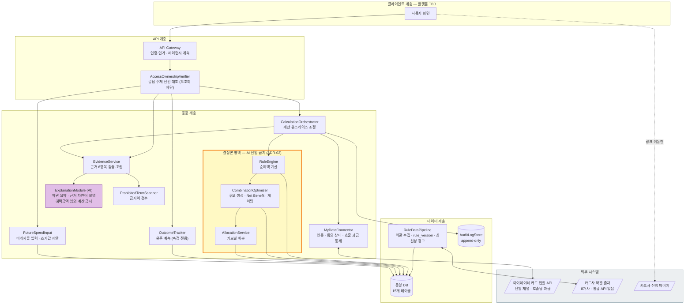

### 2.2 이 아키텍처의 핵심 — 노란 테두리

**노란 테두리 안(결정론 영역)에는 AI가 들어갈 수 없다.** 이것이 SRS ADR-02의 설계 구현이다.

| | 결정론 영역 (노란색) | 설명 영역 (보라색) |
| --- | --- | --- |
| **담당** | RuleEngine · CombinationOptimizer · AllocationService | ExplanationModule (AI) |
| **하는 일** | **혜택을 계산하고 최종 조합을 추천한다** | ⓐ 약관을 요약한다 ⓑ 추천 근거를 쉬운 말로 풀어쓴다 |
| **입력이 같으면** | **답이 반드시 같다** | 표현이 달라도 된다 |
| **깨지면** | REQ-NF-002(재계산 불일치 0건) 위반 | 사용성 저하 |

이 경계가 무너지면 *"AI가 혜택을 보장한다"*는 오해로 이어지는 규제 리스크가 된다. 그래서 **계층 분리로 강제**한다 — `ExplanationModule`은 계산 결과를 입력으로만 받고, `RuleEngine`을 호출할 수 없다.

### 2.3 컴포넌트 책임 정의

| 컴포넌트 | 책임 | 하지 않는 일 | 대응 요구사항 |
| --- | --- | --- | :---: |
| **API Gateway** | 인증·인가, 엔드포인트별 레이턴시 계측 | 업무 판단 | REQ-NF-001·004 |
| **AccessOwnershipVerifier** | 응답 주체 ≠ 로그인 사용자 **전건 대조**, 불일치 시 즉시 차단·통보 | 사업 판단 (PM 승인 불필요) | REQ-NF-004 · GR5 |
| **FutureSpendInput** | 미래지출 입력, 과거 패턴 기반 초기값 제안, 수정 여부 기록 | 금액 계산 | REQ-FUNC-001·007·008·012 |
| **MyDataConnector** | 연동, 동의 상태 판정, **결론 1건당 호출 ≤ 1회 통제** | 계산 | REQ-FUNC-002 · REQ-NF-005 · REQ-EXC-003·004 |
| **CalculationOrchestrator** | 계산 유스케이스 조정, 시나리오 3건 취합, **부분 상태 판정** | 금액 계산 로직 | REQ-FUNC-003 · REQ-EXC-005 |
| **RuleEngine** | 실적구간·통합할인한도·연회비·제외항목 반영 순혜택 산출 | 조합 판단 | REQ-FUNC-003 · REQ-NF-002 |
| **CombinationOptimizer** | 조합 후보 생성, 전환비용 3항목 차감, **게이팅 판정**, 만료 설정 | 배분 | REQ-FUNC-004 · REQ-EXC-006 |
| **AllocationService** | 카드별 역할·금액 배분, 합계 오차 ≤ 1원 보증 | 조합 결정 | REQ-FUNC-005 |
| **EvidenceService** | 근거 6항목 조립·검증, **미달 시 응답 거부** | 금액 재계산 | REQ-FUNC-006 · REQ-EXC-002 |
| **ExplanationModule (AI)** | ⓐ **약관 요약**(`rule_version`당 1회 캐시) ⓑ **추천 근거의 자연어 설명** | **혜택금액 임의 계산** · 조합 추천 | REQ-FUNC-006 (보조) |
| **OutcomeTracker** | 선택 +30일 1회 발송, 완주 집계, 무응답 = 미완주 | **개입·재발송·독려** | REQ-FUNC-010 |
| **ProhibitedTermScanner** | 배포 전 정적 스캔 + 런타임 문구 스캔 | 문구 작성 | REQ-FUNC-009 · GR4 |
| **RuleDataPipeline** | 약관 수집, `rule_version` 발행, **30일 초과 카드 계산 제외** | 계산 | REQ-NF-007 |
| **AuditLogStore** | 계산 요청·응답·`rule_version`·응답코드 전건 보존 (append-only) | 수정·삭제 | REQ-NF-006 |

### 2.4 컴포넌트 간 의존 규칙

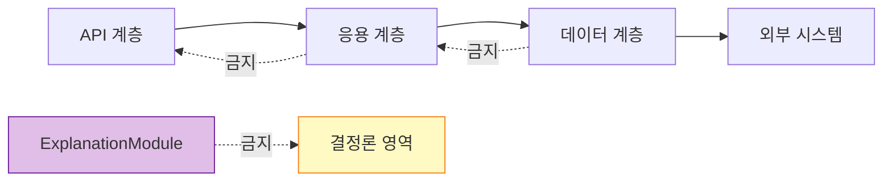

1. **아래 계층만 호출한다.** 데이터 계층이 응용 계층을 부르지 않는다
2. **`ExplanationModule`은 결정론 영역을 호출할 수 없다** — 계산 결과를 인자로만 받는다 (ADR-02)
3. **`MyDataConnector`만 외부 API를 부른다** — 호출 횟수를 한 곳에서 세야 `결론 1건당 ≤ 1회`(REQ-NF-005)를 보증할 수 있다
4. **`AuditLogStore`는 쓰기 전용이다** — UPDATE·DELETE 경로를 만들지 않는다

---

## 3. 정적 설계 — 클래스 다이어그램 (CLD)

> **읽는 법** — 상자 하나가 **클래스**(코드에서 만들 부품 하나)다. 상자 안 윗칸은 그 부품이 가진 **데이터**, 아랫칸은 그 부품이 하는 **일(메서드)**이다. 화살표는 "이 부품이 저 부품을 쓴다"는 뜻이다.
>
> **이 장이 SRS 5장 추적성 매트릭스의 `구현 클래스` 열을 채운다.** SRS에서 TBD로 남겼던 부분이다.

### 3.1 계산 파이프라인 — 핵심 클래스

```mermaid
classDiagram
    direction TB

    class CalculationOrchestrator {
        -ConsentGuard consentGuard
        -MyDataConnector connector
        -ScenarioBuilder scenarioBuilder
        -RuleEngine ruleEngine
        -CombinationOptimizer optimizer
        -AuditRecorder auditRecorder
        +Calculation execute(userId, planIds)
        +CalculationStatus resolveStatus(scenarioResults)
    }

    class ConsentGuard {
        +void assertActive(userId)
        +boolean isExpiredOrWithdrawn(userId)
    }

    class MyDataConnector {
        -CallBudgetCounter budget
        +MyDataSnapshot collectOnce(userId)
        +DegradedSnapshot fallbackToLastKnown(userId)
        +int callCountFor(calculationId)
    }

    class ScenarioBuilder {
        -BigDecimal deltaRatio
        +List~ScenarioInput~ buildThree(planSnapshot)
    }

    class RuleEngine {
        -RuleRepository rules
        -RuleFreshnessChecker freshness
        +ScenarioResult calculate(scenarioInput, cards)
        -long applyPerformanceTier(spend, rule)
        -long applyDiscountCap(benefit, rule)
        -long applyExclusions(spend, rule)
    }

    class CombinationOptimizer {
        -NetBenefitEvaluator evaluator
        -GatingPolicy gating
        -PlanExpiryPolicy expiry
        +List~PlanCandidate~ generate(scenarioResult)
        +GatingResult decide(netBenefit)
    }

    class NetBenefitEvaluator {
        +long grossBenefit(candidate)
        +TransitionCost transitionCost(candidate)
        +long netBenefit(candidate)
    }

    class GatingPolicy {
        -long absoluteThresholdWon
        -BigDecimal relativeThreshold
        +GatingResult evaluate(netBenefit, currentBenefit)
    }

    class AllocationService {
        +List~Allocation~ allocate(candidate, planSnapshot)
        +boolean verifySumWithin1Won(allocations, total)
    }

    class PlanExpiryPolicy {
        +Instant expiresAt(baseDate, ruleVersions)
        +boolean isExpired(candidate)
    }

    CalculationOrchestrator --> ConsentGuard
    CalculationOrchestrator --> MyDataConnector
    CalculationOrchestrator --> ScenarioBuilder
    CalculationOrchestrator --> RuleEngine
    CalculationOrchestrator --> CombinationOptimizer
    CombinationOptimizer --> NetBenefitEvaluator
    CombinationOptimizer --> GatingPolicy
    CombinationOptimizer --> PlanExpiryPolicy
    CombinationOptimizer --> AllocationService
    RuleEngine --> RuleRepository
    RuleEngine --> RuleFreshnessChecker
```

**설계 판단 3건**

| 판단 | 이유 |
| --- | --- |
| **`GatingPolicy`를 별도 클래스로 분리** | 임계값(의존성 D2)이 미정이다. 정책만 갈아끼우면 되도록 분리해, 임계값을 기다리는 동안 나머지를 만들 수 있게 한다 |
| **`ScenarioBuilder.deltaRatio`를 주입값으로** | 증감 폭(의존성 D5)도 미정이다. 상수를 코드에 박지 않는다 |
| **`MyDataConnector.collectOnce`** | 이름에 `Once`를 넣었다. 시나리오 3개를 **1회 수집분으로 계산**해야 하는 REQ-NF-005를 클래스 이름 수준에서 못 박는다 |

### 3.2 근거 공개 및 설명 — ADR-02 경계

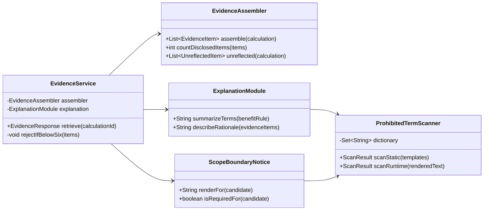

**`ExplanationModule`에 계산 클래스로 향하는 화살표가 하나도 없다.** 이것이 ADR-02를 클래스 수준에서 강제하는 방식이다. AI는 두 가지만 한다 — `BenefitRule`을 받아 **약관을 요약**하고, `EvidenceItem` 목록을 받아 **추천 근거를 설명**한다. 혜택금액을 임의로 계산하지 않는다.

**`summarizeTerms`는 `rule_version`당 1회만 호출한다.** 약관은 사용자별로 다르지 않으므로 요약을 캐시하면 AI 호출이 사용자 수와 무관하게 고정된다(REQ-NF-005). 두 메서드를 분리한 이유가 이것이고, **다루는 데이터가 달라 규제 부담도 다르다** — 약관은 공개 문서이고 근거는 사용자 금융정보를 포함한다(SRS DEC-3a·3b).

**AI 출력은 반드시 `ProhibitedTermScanner`를 지난다.** AI가 *"해지해 드립니다"* 같은 문구를 생성하면 GR4(실행 지원 오인 문구 0건) 위반이 되므로, 런타임 스캔을 통과하지 않은 문장은 노출하지 않는다.

### 3.3 계측 및 감사

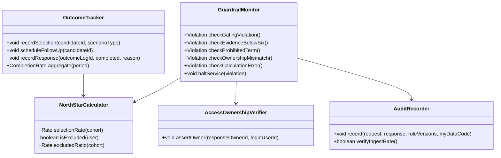

**메서드가 "없는" 것이 설계다.**

| 클래스 | 일부러 만들지 않은 메서드 | 근거 |
| --- | --- | :---: |
| `OutcomeTracker` | `resend()` · `remind()` · `triggerFollowUpAction()` | REQ-FUNC-010 — 재발송·독려는 GR4 위반 |
| `AuditRecorder` | `update()` · `delete()` | REQ-NF-006 — 전건 보존 |
| `ExplanationModule` | 계산 클래스 참조 일체 | ADR-02 |

`NorthStarCalculator.isExcluded()`는 **"예상대로" 탭 결론이 "유지"인 사용자를 분모에서 빼는** 메서드다. ADR-05의 구현이며, `excludedRatio()`가 30%를 넘으면 산식 재설계 신호가 된다.

### 3.4 SRS 5장 `구현 클래스` 열 채우기

| 요구사항 ID | 모듈 | **구현 클래스** |
| --- | --- | --- |
| REQ-FUNC-001 | FutureSpendInput | `FutureSpendPlanService` |
| REQ-FUNC-002 | MyDataConnector | `MyDataConnector` · `ConsentGuard` |
| REQ-FUNC-003 | RuleEngine | `RuleEngine` · `ScenarioBuilder` · `CalculationOrchestrator` |
| REQ-FUNC-004 | CombinationOptimizer | `CombinationOptimizer` · `NetBenefitEvaluator` · **`GatingPolicy`** |
| REQ-FUNC-005 | AllocationService | `AllocationService` |
| REQ-FUNC-006 | EvidenceService | `EvidenceService` · `EvidenceAssembler` · `ExplanationModule` |
| REQ-FUNC-007 | FutureSpendInput | `InitialValueSuggester` |
| REQ-FUNC-008 | FutureSpendInput | `FutureSpendPlanService` |
| REQ-FUNC-009 | EvidenceService · 문구 스캐너 | `ScopeBoundaryNotice` · `ProhibitedTermScanner` |
| REQ-FUNC-010 | OutcomeTracker | `OutcomeTracker` |
| REQ-FUNC-011 | CombinationOptimizer | `StagedTransitionPresenter` |
| REQ-FUNC-012 | FutureSpendInput | `FutureSpendPlanService` |
| REQ-NF-001 | 전 모듈 | `LatencyInterceptor` |
| REQ-NF-002 | RuleEngine | `DeterminismVerifier` · `BoundaryRegressionSuite` |
| REQ-NF-003 | MyDataConnector · RuleEngine | `DegradedModeHandler` |
| REQ-NF-004 | 전 모듈 | **`AccessOwnershipVerifier`** · `ConsentGuard` |
| REQ-NF-005 | MyDataConnector | `CallBudgetCounter` |
| REQ-NF-006 | AuditLogStore | `AuditRecorder` |
| REQ-NF-007 | RuleDataPipeline | `RuleDataPipeline` · `RuleFreshnessChecker` |
| REQ-NF-008 | FutureSpendInput · EvidenceService | `InitialValueSuggester` · `JourneyTimer` |
| REQ-EXC-001 | FutureSpendInput · RuleEngine | `CalculationOrchestrator` (입력 0건 검사) |
| REQ-EXC-002 | EvidenceService | `EvidenceAssembler` (6항목 게이트) |
| REQ-EXC-003 | MyDataConnector | `DegradedModeHandler` |
| REQ-EXC-004 | MyDataConnector | `ConsentGuard` |
| REQ-EXC-005 | RuleEngine · CombinationOptimizer | `CalculationOrchestrator.resolveStatus()` |
| REQ-EXC-006 | RuleDataPipeline · CombinationOptimizer | **`PlanExpiryPolicy`** |

---

## 4. 데이터 설계

### 4.1 ERD

**정본은 SRS 6.4.1이다.** 테이블 15개(PRD 정의 10 + 파생 5)와 계산 입력 3종의 관계가 그곳에 있다. 여기서는 설계 관점의 **읽는 순서**만 덧붙인다.

```mermaid
flowchart LR
    subgraph IN["① 입력 — 사용자와 외부에서 들어온다"]
        A["users"]
        B["held_cards<br/>past_spends"]
        C["future_spend_plans<br/>user_constraints"]
        D["card_products<br/>benefit_rules"]
    end
    subgraph CALC["② 계산 — 입력을 먹고 결과를 낸다"]
        E["calculations"]
        F["calculation_input_plans<br/>calculation_applied_rules"]
        G["calculation_scenarios"]
    end
    subgraph OUT["③ 산출 — 사용자에게 보여줄 것"]
        H["plan_candidates"]
        I["allocations"]
    end
    subgraph OBS["④ 관측 — 나중에 확인할 것"]
        J["outcome_logs"]
        K["audit_logs"]
    end
    IN --> CALC --> OUT --> OBS
    CALC --> OBS
    style IN fill:#E3F2FD,stroke:#1565C0
    style CALC fill:#FFF9C4,stroke:#F57F17
    style OUT fill:#C8E6C9,stroke:#2E7D32
    style OBS fill:#F3E5F5,stroke:#6A1B9A
```

**15개 표를 4묶음으로 보면 외우지 않아도 된다.** 입력 8개 → 계산 4개 → 산출 2개 → 관측 2개 순서로 데이터가 흐른다. (`calculations`가 ②와 ④ 양쪽에 걸린다.)

### 4.2 데이터 무결성 책임 배분

DB 제약으로 표현할 수 있는 것과 그럴 수 없는 것을 나눈다. **후자를 명시하지 않으면 검증 없이 새어 나간다.**

| 무결성 규칙 | 강제 위치 | 요구사항 |
| --- | --- | :---: |
| 시나리오당 정확히 1행 | DB `UNIQUE (calculation_id, scenario_type)` | REQ-FUNC-003 |
| 게이팅 결과는 두 값 중 하나 | DB `CHECK (gating_result IN ...)` | REQ-FUNC-004 |
| 동의 상태는 네 값 중 하나 | DB `CHECK (consent_status IN ...)` | REQ-FUNC-002 |
| 조합안은 만료 시점을 반드시 가짐 | DB `NOT NULL expires_at` | REQ-EXC-006 |
| 감사로그 수정·삭제 금지 | **권한 설정** (애플리케이션 계정에 UPDATE·DELETE 미부여) | REQ-NF-006 |
| **배분 합계 오차 ≤ 1원** | **애플리케이션** `AllocationService.verifySumWithin1Won()` + 일간 배치 대조 | REQ-FUNC-005 |
| **동일 입력 재계산 불일치 0건** | **애플리케이션** `DeterminismVerifier` (응답 해시 비교) | REQ-NF-002 |
| **근거 6항목 하한** | **애플리케이션** `EvidenceAssembler.rejectIfBelowSix()` | REQ-EXC-002 |
| **결론 1건당 마이데이터 호출 ≤ 1회** | **애플리케이션** `CallBudgetCounter` | REQ-NF-005 |
| **응답 주체 = 로그인 사용자** | **애플리케이션** `AccessOwnershipVerifier` (전건 대조) | REQ-NF-004 |

**아래 5건은 DB가 지켜주지 않는다.** 단일 행 제약으로 표현할 수 없는 규칙들이라, 코드와 배치 검증이 유일한 방어선이다. Guardrail 5개 중 4개가 이 영역에 있다.

---

## 5. 동적 설계 — 시퀀스 다이어그램

> **읽는 법** — 맨 위 상자들이 **참여자**(사람이나 컴포넌트), 아래로 내려가는 선이 **시간**이다. 위에서 아래로 읽으면 일이 벌어지는 순서다. `alt`로 갈라진 칸은 "이런 경우 / 저런 경우"를 뜻한다.

### 5.1 SD-01 정상 계산 — 3개 시나리오 사전 계산

**대응**: REQ-FUNC-003 · AC-01 · AC-06 · REQ-NF-005

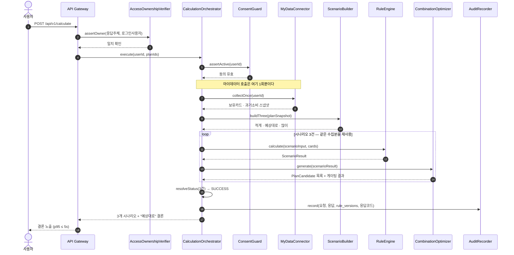

**이 그림의 핵심은 5번 줄이다.** `collectOnce`가 반복문 **밖**에 있다. 시나리오가 3개라도 마이데이터 호출은 1회뿐이며, 이것이 `결론 1건당 호출 ≤ 1회`(REQ-NF-005)를 지키는 방식이다. 호출을 반복문 안으로 옮기면 요구사항이 즉시 깨진다.

### 5.2 SD-02 게이팅 — "현재 조합 유지" 반환

**대응**: REQ-FUNC-004 · AC-05 · GR2 · ADR-01

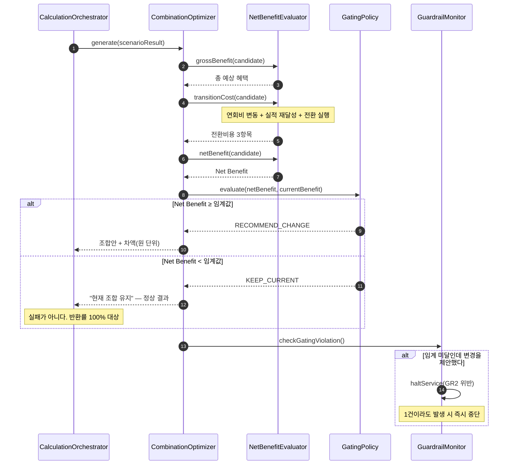

**"유지"는 실패 경로가 아니다.** `alt`의 두 갈래가 모두 정상 응답이며, 오히려 임계 미달인데 변경을 제안하는 것이 위반(GR2)이다. 마지막 블록이 그 감시다.

### 5.3 SD-03 근거 열람 및 6항목 미달 거부

**대응**: REQ-FUNC-006 · REQ-EXC-002 · AC-02 · AC-F2 · GR3 · ADR-02

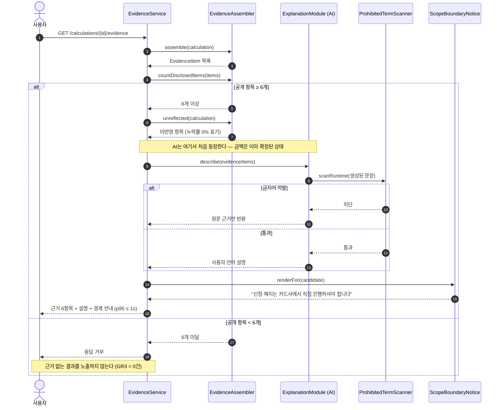

**AI가 등장하는 시점을 보라.** 금액은 이미 확정된 뒤이고, AI는 확정된 근거를 문장으로 바꾸는 일만 한다. 그리고 그 문장은 반드시 금지어 스캔을 지난다.

### 5.4 SD-04 마이데이터 장애 — 계산을 멈추지 않는다

**대응**: REQ-EXC-003 · REQ-NF-003 · AC-F3

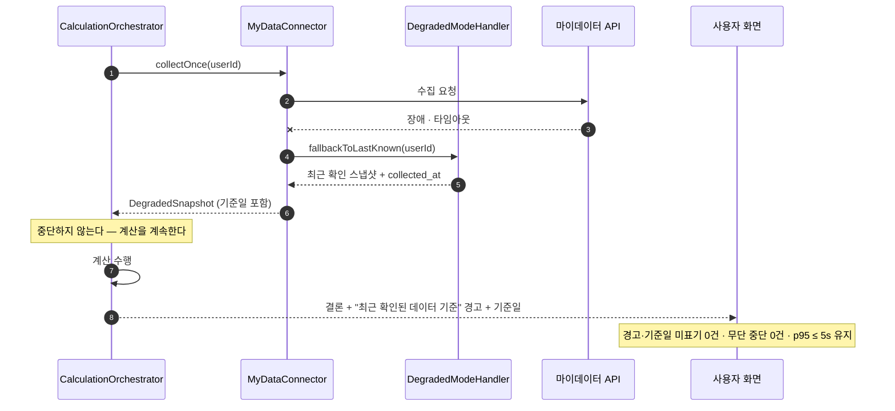

**대체 공급자가 없는 단일 채널**이라 장애 시 우회 경로가 없다. 그래서 "멈추기"가 아니라 "오래된 데이터임을 밝히고 계속하기"를 택했다. 단, **기준일을 반드시 노출**해야 사용자가 스스로 판단할 수 있다.

### 5.5 SD-05 동의 만료·철회 — 계산 차단

**대응**: REQ-EXC-004 · REQ-NF-004 · AC-F4

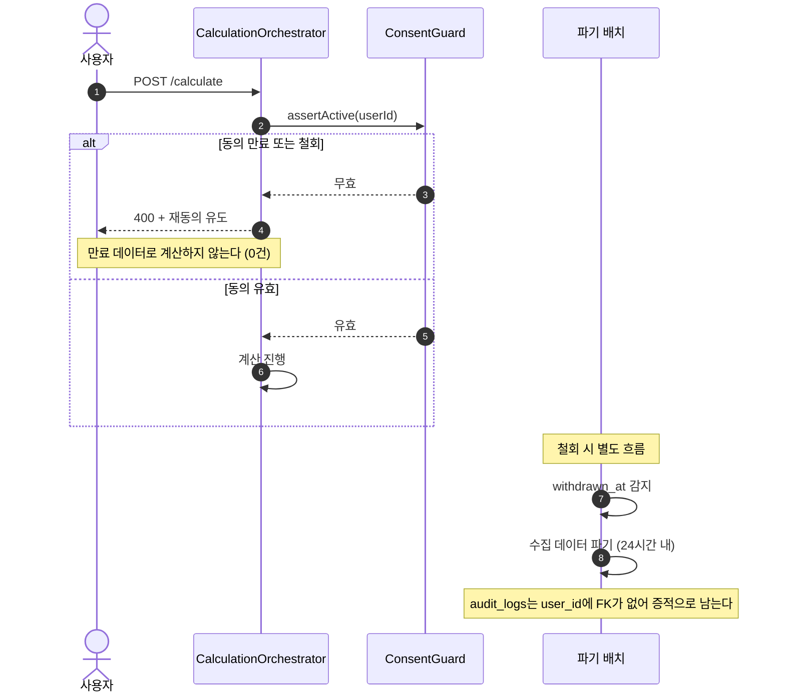

**파기와 증적 보존이 충돌하지 않는 이유**가 마지막 줄에 있다. `audit_logs`가 `users`를 FK로 참조하지 않기 때문에, 사용자 데이터를 파기해도 감사 기록은 남는다.

### 5.6 SD-06 부분 계산 — 하나라도 실패하면 전체 중단

**대응**: REQ-EXC-005 · AC-F5

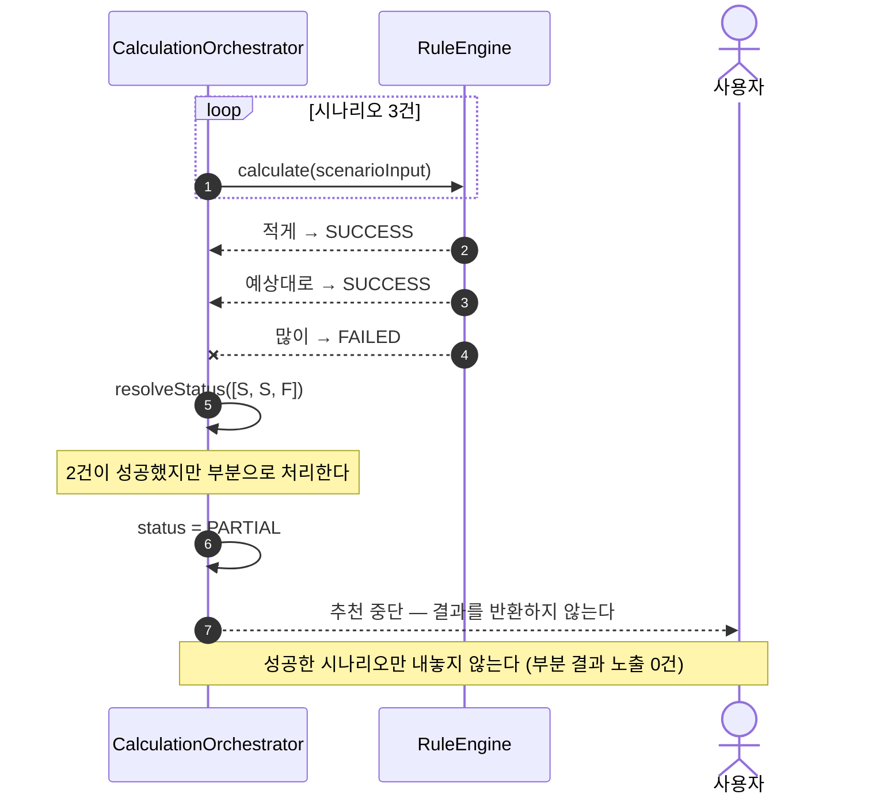

**성공한 2건을 보여주고 싶은 유혹이 이 설계의 시험대다.** 세 탭 중 하나가 비면 사용자는 남은 두 탭을 완전한 결과로 오인한다. 그래서 전부 아니면 전무로 처리한다.

### 5.7 SD-07 조합안 만료

**대응**: REQ-EXC-006 · REQ-NF-007 · ADR-06

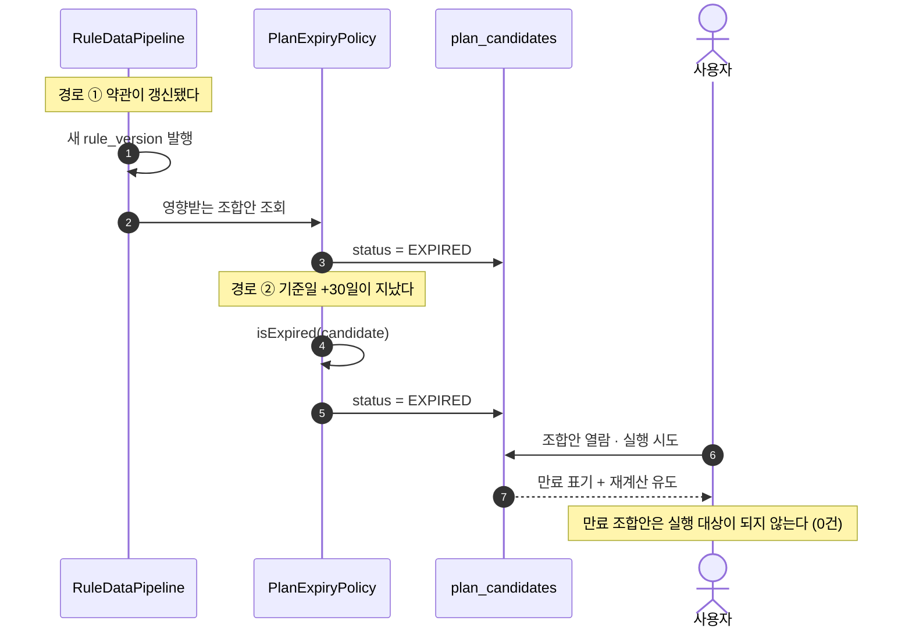

### 5.8 SD-08 완주 계측 — 측정만 하고 개입하지 않는다

**대응**: REQ-FUNC-010 · AC-04 · ADR-04

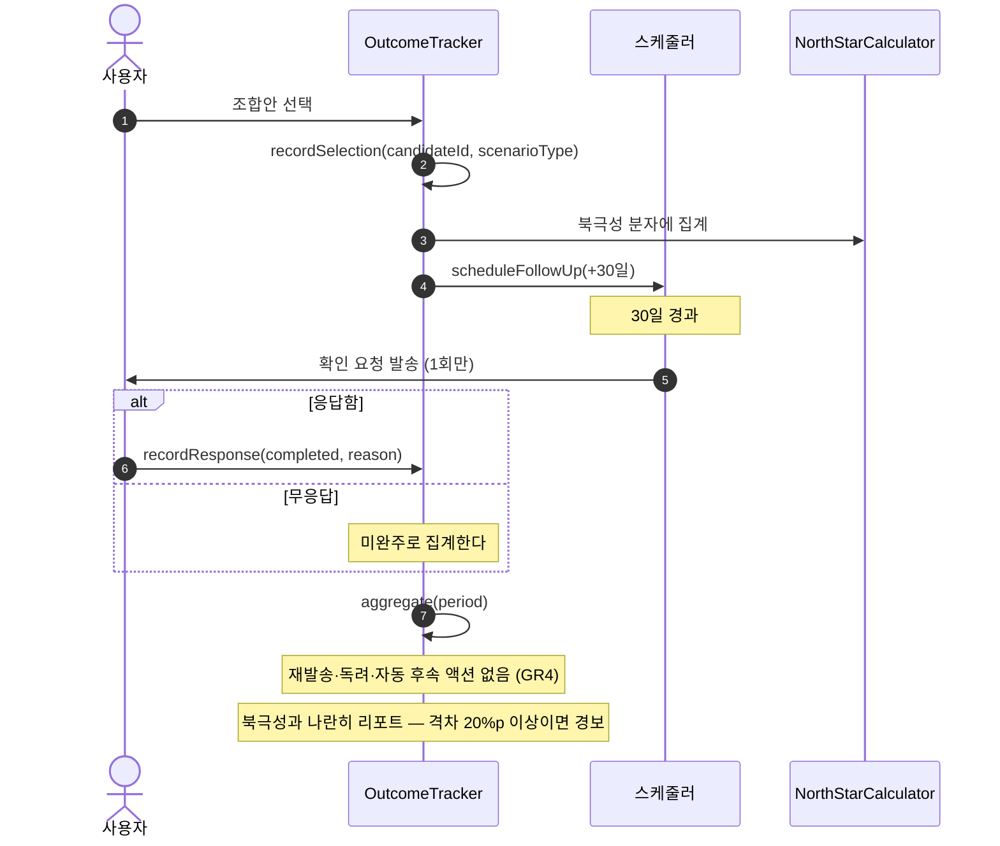

**`OutcomeTracker`에 재발송 메서드가 없다는 사실이 설계의 일부다.** 미완주를 발견하고도 개입하지 않는 것이 ADR-04이며, 개입 경로를 코드에 만들지 않아 실수로도 위반할 수 없게 한다.

### 5.9 SD-09 약관 최신성 — 30일 초과 카드 제외

**대응**: REQ-NF-007

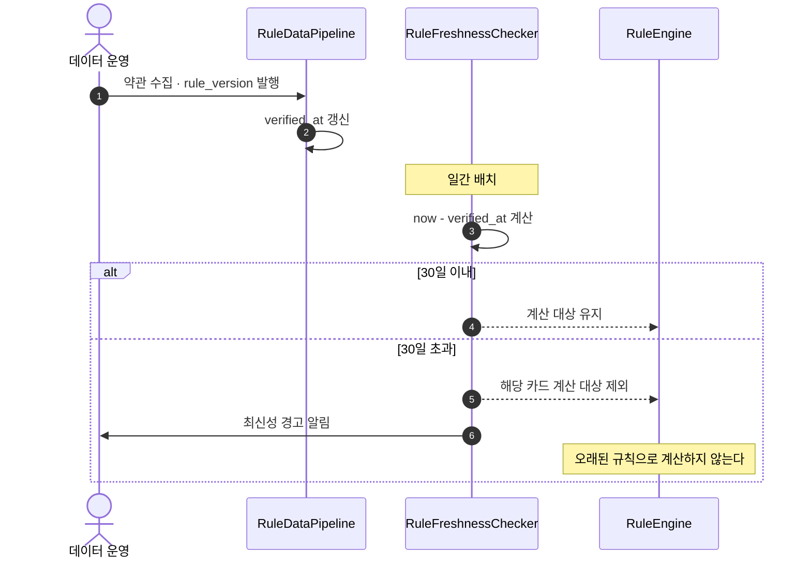

**지원 범위의 실질적 상한이 여기서 결정된다.** 관리 인력이 30일 안에 갱신할 수 있는 상품 수를 넘겨 지원하면, 초과분이 자동으로 계산에서 빠져 결과가 비게 된다.

### 5.10 SD-10 오조회 — PM을 우회하는 유일한 중단

**대응**: REQ-NF-004 · GR5

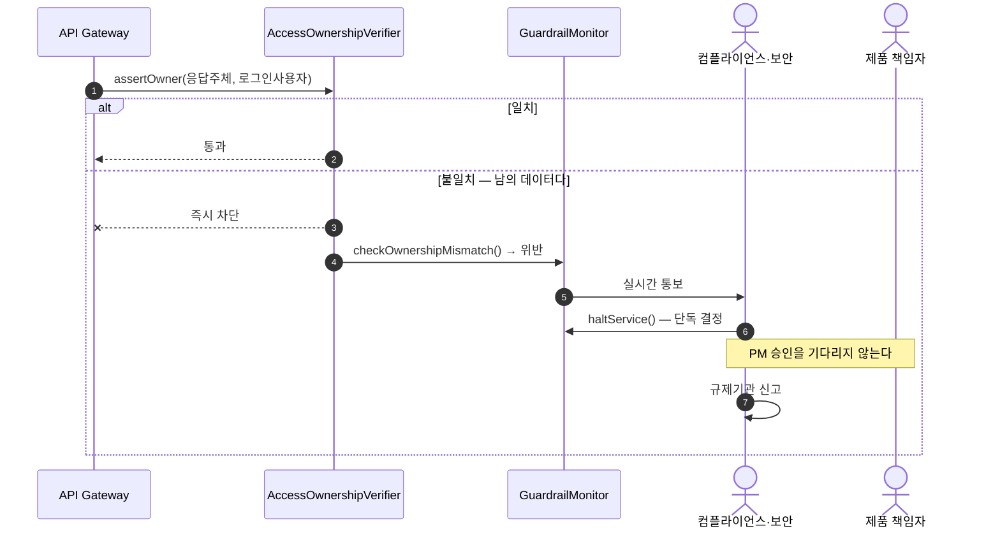

**이 서비스에서 PM을 우회하는 중단 경로는 이것 하나다.** 타인 데이터 노출은 사업 판단 대상이 아니라 즉시 신고 의무 사항이기 때문이다.

---

## 6. 논리 흐름 — 순서도

> **읽는 법** — 마름모는 **판단**(예/아니오로 갈라지는 지점), 사각형은 **처리**, 둥근 상자는 **시작·끝**이다.

### 6.1 FC-01 사용자 여정 전체

**대응**: SRS 8.3 정상 흐름 · REQ-NF-008

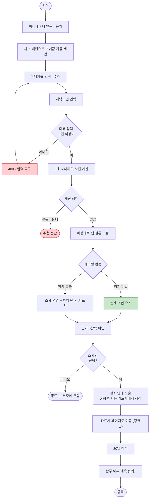

**초록 상자("현재 조합 유지")가 빨간 상자가 아니라는 점이 중요하다.** 정상 종료 경로이며, 이 사용자는 북극성 지표 분모에서 제외된다(ADR-05). 목표는 **입력 완료부터 결론까지 p95 5분 이내**다.

### 6.2 FC-02 계산 파이프라인

**대응**: REQ-FUNC-003 · REQ-NF-005 · ADR-03

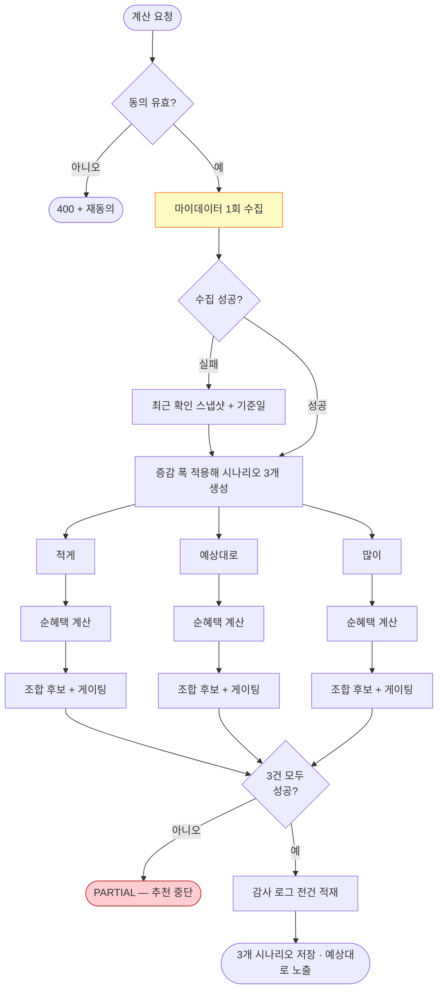

**노란 상자가 파이프라인 앞쪽에 딱 하나뿐이다.** 마이데이터 수집이 시나리오 분기 **앞**에 있어야 호출이 1회로 끝난다. 이 위치가 REQ-NF-005의 설계 구현이며, 세 갈래 안으로 들어가면 호출이 3배가 된다.

### 6.3 FC-03 게이팅 판정 로직

**대응**: REQ-FUNC-004 · ADR-01 · 의존성 D2

```mermaid
flowchart TD
    S(["조합 후보"]) --> A["Gross Benefit 산출"]
    A --> B["전환비용 3항목 산출"]
    B --> B1["연회비 변동"]
    B --> B2["실적 재달성 부담"]
    B --> B3["전환 실행 부담"]
    B1 --> C["Net Benefit = Gross − 전환비용"]
    B2 --> C
    B3 --> C
    C --> D{"절대 임계값<br/>이상?"}
    D -->|"아니오"| F["KEEP_CURRENT"]
    D -->|"예"| E{"현재 조합 대비<br/>상대 임계값 이상?"}
    E -->|"아니오"| F
    E -->|"예"| G["RECOMMEND_CHANGE"]
    F --> H(["현재 조합 유지 — 정상 결과"])
    G --> I(["조합안 + 차액 원 단위"])
    H --> J["GR2 감시: 임계 미달인데 변경 제안했나"]
    I --> J
    J --> K{"위반?"}
    K -->|"1건이라도"| K1(["즉시 중단"])
    K -->|"없음"| K2(["정상"])

    style D fill:#FFE0B2,stroke:#E65100
    style E fill:#FFE0B2,stroke:#E65100
    style H fill:#C8E6C9,stroke:#2E7D32
    style K1 fill:#FFCDD2,stroke:#C62828
```

**주황 마름모 두 개의 숫자가 아직 비어 있다** — 의존성 D2(절대·상대 임계값)가 미정이다. 그래서 `GatingPolicy`를 별도 클래스로 분리해, 숫자가 정해지면 그 클래스만 갈아끼울 수 있게 설계했다. 나머지 흐름은 임계값과 무관하게 지금 만들 수 있다.

### 6.4 FC-04 근거 6항목 검증 게이트

**대응**: REQ-FUNC-006 · REQ-EXC-002 · GR3

```mermaid
flowchart TD
    S(["근거 요청"]) --> A["항목 조립"]
    A --> B1["① 실적구간"]
    A --> B2["② 통합할인한도"]
    A --> B3["③ 연회비"]
    A --> B4["④ 제외조건"]
    A --> B5["⑤ 기준일"]
    A --> B6["⑥ 미반영 항목"]
    B1 --> C{"공개 항목<br/>≥ 6개?"}
    B2 --> C
    B3 --> C
    B4 --> C
    B5 --> C
    B6 --> C
    C -->|"아니오"| C1(["응답 거부 — GR3 = 0건"])
    C -->|"예"| D["AI가 사용자 언어로 설명"]
    D --> E{"금지어<br/>적발?"}
    E -->|"예"| E1["설명 차단 · 원문 근거만"] --> F
    E -->|"아니오"| F["경계 안내 부착"]
    F --> G(["근거 노출 — p95 ≤ 1s"])

    style C1 fill:#FFCDD2,stroke:#C62828
    style D fill:#E1BEE7,stroke:#6A1B9A
```

**보라 상자(AI)가 게이트 뒤에 있다.** 6항목 검증을 통과한 뒤에만 AI가 동작하므로, 근거가 부족한 결과에 AI가 그럴듯한 설명을 붙여 결함을 가리는 일이 구조적으로 불가능하다.

### 6.5 FC-05 Guardrail 감시 및 중단 결정

**대응**: SRS 11.2 Guardrail 5건

```mermaid
flowchart TD
    S(["상시 감시"]) --> A{"어느 Guardrail?"}
    A -->|"오조회"| B1["컴플라이언스 실시간 통보"]
    A -->|"게이팅 위반"| B2["계산 품질 발의"]
    A -->|"근거 미공개"| B3["계산 품질 발의"]
    A -->|"금지어 노출"| B4["컴플라이언스 발의"]
    A -->|"계산 오류율"| B5{"0.1% 초과?"}

    B1 --> C1(["단독 중단 · 규제기관 신고"])
    B2 --> D["PM 최종 결정"]
    B3 --> D
    B4 --> D
    B5 -->|"예"| D
    B5 -->|"아니오"| E(["정상"])
    D --> F(["중단 또는 계속"])

    style C1 fill:#FFCDD2,stroke:#C62828,stroke-width:3px
    style D fill:#FFF9C4,stroke:#F57F17
```

**경로가 두 갈래인 것이 요점이다.** 넷은 PM 결정을 거치고, **오조회만 컴플라이언스가 단독으로 중단**한다.

---

## 7. 상태 기계

> **읽는 법** — 상자가 **상태**, 화살표가 **상태를 바꾸는 사건**이다. 검은 점은 시작, 이중 원은 끝이다.

### 7.1 마이데이터 동의

```mermaid
stateDiagram-v2
    [*] --> 미동의
    미동의 --> 동의 : 동의 획득
    동의 --> 만료 : 유효기간 경과
    동의 --> 철회 : 사용자 철회
    만료 --> 동의 : 재동의
    철회 --> [*] : 수집 데이터 파기 (24h 내)

    note right of 만료
        계산 요청 → 400
    end note
    note right of 철회
        계산 요청 → 400
        audit_logs는 남는다
    end note
```

### 7.2 Calculation

```mermaid
stateDiagram-v2
    [*] --> 요청
    요청 --> 성공 : 시나리오 3건 전부 성공
    요청 --> 부분 : 1건 이상 실패
    요청 --> 실패 : 필수 데이터 누락
    성공 --> [*]
    부분 --> [*] : 추천 중단
    실패 --> [*] : 추천 중단

    note right of 부분
        성공한 시나리오만
        내놓지 않는다
    end note
```

### 7.3 PlanCandidate

```mermaid
stateDiagram-v2
    [*] --> 제시
    제시 --> 선택 : 사용자 저장·확정
    제시 --> 미선택 : 7일 경과
    제시 --> 만료 : rule_version 변경 · 기준일+30일
    선택 --> 만료 : rule_version 변경 · 기준일+30일
    미선택 --> [*]
    만료 --> [*] : 재계산 필요

    note right of 선택
        북극성 분자에 집계
    end note
    note right of 만료
        실행 대상이 되지 않는다
    end note
```

### 7.4 OutcomeLog

```mermaid
stateDiagram-v2
    [*] --> 미발송
    미발송 --> 발송 : 선택 +30일 (1회만)
    발송 --> 응답 : 사용자 응답
    발송 --> 무응답 : 응답 없음
    응답 --> [*]
    무응답 --> [*] : 미완주로 집계

    note right of 발송
        재발송·독려 없음
    end note
```

---

## 8. SRS ↔ 설계 추적 매트릭스

**요구사항 27건이 설계 산출물로 전부 옮겨졌는지 확인하는 표다.** 빈칸이 있으면 설계 누락이다.

| 요구사항 | 유스케이스 | 컴포넌트 | 클래스 | 시퀀스 | 순서도 | 상태 |
| :---: | :---: | :---: | :---: | :---: | :---: | :---: |
| REQ-FUNC-001 | UC-02 | FutureSpendInput | `FutureSpendPlanService` | SD-01 | FC-01 | — |
| REQ-FUNC-002 | UC-01·03 | MyDataConnector | `MyDataConnector`·`ConsentGuard` | SD-01·05 | FC-02 | 7.1 |
| REQ-FUNC-003 | UC-04 | RuleEngine | `RuleEngine`·`ScenarioBuilder` | SD-01·06 | FC-02 | 7.2 |
| REQ-FUNC-004 | UC-05 | CombinationOptimizer | `GatingPolicy`·`NetBenefitEvaluator` | SD-02 | FC-03 | 7.3 |
| REQ-FUNC-005 | UC-06 | AllocationService | `AllocationService` | SD-01 | FC-01 | — |
| REQ-FUNC-006 | UC-07 | EvidenceService | `EvidenceAssembler`·`ExplanationModule` | SD-03 | FC-04 | — |
| REQ-FUNC-007 | UC-02 | FutureSpendInput | `InitialValueSuggester` | — | FC-01 | — |
| REQ-FUNC-008 | UC-02 | FutureSpendInput | `FutureSpendPlanService` | — | FC-01 | — |
| REQ-FUNC-009 | UC-09 | 문구 스캐너 | `ScopeBoundaryNotice`·`ProhibitedTermScanner` | SD-03 | FC-01·04 | — |
| REQ-FUNC-010 | UC-10 | OutcomeTracker | `OutcomeTracker` | SD-08 | FC-01 | 7.4 |
| REQ-FUNC-011 | UC-05 | CombinationOptimizer | `StagedTransitionPresenter` | — | — | — |
| REQ-FUNC-012 | UC-02 | FutureSpendInput | `FutureSpendPlanService` | — | — | — |
| REQ-NF-001 | — | API Gateway | `LatencyInterceptor` | SD-01·03 | FC-01 | — |
| REQ-NF-002 | UC-12 | RuleEngine | `DeterminismVerifier` | SD-01 | FC-02 | — |
| REQ-NF-003 | — | MyDataConnector | `DegradedModeHandler` | SD-04 | FC-02 | — |
| REQ-NF-004 | UC-13 | AccessOwnershipVerifier | `AccessOwnershipVerifier` | SD-10 | FC-05 | 7.1 |
| REQ-NF-005 | — | MyDataConnector | `CallBudgetCounter` | SD-01 | FC-02 | — |
| REQ-NF-006 | — | AuditLogStore | `AuditRecorder` | SD-01·05 | FC-02 | — |
| REQ-NF-007 | UC-11 | RuleDataPipeline | `RuleFreshnessChecker` | SD-07·09 | — | 7.3 |
| REQ-NF-008 | UC-02 | FutureSpendInput | `InitialValueSuggester`·`JourneyTimer` | — | FC-01 | — |
| REQ-NF-009 | UC-15 | 전 모듈 (이벤트 계측) | `MetricEventEmitter`·`NorthStarCalculator` | SD-08 | — | 7.4 |
| REQ-EXC-001 | UC-04 | CalculationOrchestrator | `CalculationOrchestrator` | — | FC-01·02 | — |
| REQ-EXC-002 | UC-07 | EvidenceService | `EvidenceAssembler` | SD-03 | FC-04 | — |
| REQ-EXC-003 | — | MyDataConnector | `DegradedModeHandler` | SD-04 | FC-02 | — |
| REQ-EXC-004 | UC-01 | MyDataConnector | `ConsentGuard` | SD-05 | FC-02 | 7.1 |
| REQ-EXC-005 | UC-04 | CalculationOrchestrator | `resolveStatus()` | SD-06 | FC-02 | 7.2 |
| REQ-EXC-006 | UC-05 | CombinationOptimizer | `PlanExpiryPolicy` | SD-07 | — | 7.3 |

**빈칸이 있는 4건과 그 이유**

| 요구사항 | 빈 항목 | 이유 |
| :---: | --- | --- |
| REQ-FUNC-011·012 | 시퀀스 · 순서도 | 우선순위 Could(조건부 범위). 착수가 확정되면 작성한다 |
| REQ-FUNC-007·008 | 시퀀스 | 입력 화면 내부 동작이라 별도 시퀀스가 불필요하다. FC-01에 포함 |
| REQ-NF-008 | 시퀀스 | 사용성 지표라 특정 호출 흐름으로 표현되지 않는다 |
| REQ-NF-007 | 순서도 | 배치 흐름이며 SD-09가 이미 분기를 담고 있다 |

---

## 9. 설계 단계에 남은 TBD

| 항목 | 막고 있는 것 | 해소 조건 |
| --- | --- | --- |
| **`RuleEngine`의 계산 로직 전체** | 적용 순서 · 제외 대상 · 산정 기간 · 전월 정의 · **전환비용 산정** · 조합 생성 규칙 · 중복 혜택 | **의존성 D16 — 기획 결정** (SRS 4.1.0 RE-1~RE-8) |
| `GatingPolicy`의 임계값 2개 | `RECOMMEND_CHANGE` 판정선 | **의존성 D2** 확정 (**D16 선행**) |
| `ScenarioBuilder.deltaRatio` | 적게·많이 시나리오 계산 기준 | **의존성 D5** 확정 |
| 클라이언트 플랫폼 | 화면 설계 · 응답 형식 | SRS 3장 TBD |
| `certainty` 값 도메인 | `FutureSpendPlan` 검증 규칙 | SRS 6.4.3 TBD |
| `audit_logs` 보존기간·아카이빙 | 스토리지 설계 | **의존성 D9** 확정 |
| `past_spends` 파티셔닝 | 대용량 조회 성능 | 부하 테스트(REQ-NF-001) 후 |
| 단위원가 상한 | `CallBudgetCounter` 상한 정책 | **의존성 D3** 확정 |

**임계값(D2)과 증감 폭(D5)을 정책 클래스로 분리한 것이 이 설계의 대응 방식이다.** 두 숫자가 미정인 상태에서도 나머지 구조를 전부 만들 수 있고, 숫자가 정해지면 정책 클래스만 교체한다.

---

*입력 문서: `[SRS]cardfit-srs-v1_0.md` (SRS-CARDFIT-001 v1.0)*

*작성자: 기획 분석가, 검토자: 개발팀 리드, 승인자: 제품 책임자 (PM)*
