# [SRS] CardFit (한글)

# 소프트웨어 요구사항 명세서 (SRS)

**문서 ID:** SRS-CARDFIT-001

**개정 버전:** 1.0

**날짜:** 2026-08-25

**표준:** ISO/IEC/IEEE 29148:2018

**근거 문서:** PRD-CARDFIT-001 v1.0 (`../cardfit-prd-v1_0.md`)

**참조 문서:** `docs/source-docs/[SRS]ad-core-platform-reference.md` (양식 기준)

**파생 문서:** SDD-CARDFIT-001 (설계) · STD-CARDFIT-001 (테스트) · GTD-CARDFIT-001 (게이트 데이터) · TASK-CARDFIT-001 (태스크)

---

## 0. 이 문서의 구성

**1~7장은 사내 SRS 표준 양식**(`[SRS] AD-Core-Platform`)을 그대로 따른다.

**8~11장은 확장 장**이다. PRD에 이미 작성돼 있으나 표준 양식에 대응 장이 없는 내용을 담기 위해서만 개설했고, 각 장에 ISO/IEC/IEEE 29148:2018의 근거 조항을 명시했다. **양식을 채우기 위한 빈 장은 만들지 않았다.**

| 장 | 출처 | 근거 조항 |
| :---: | --- | --- |
| 1~7 | 사내 SRS 표준 양식 | — |
| **8. 사용자 특성 및 사용 시나리오** | PRD 2절 | **9.6.6** User characteristics |
| **9. 설계 결정 기록 (ADR)** | PRD 10-1 | **9.6.16** Design constraints · **9.6.20** Supporting information |
| **10. 가정 및 의존성** | PRD 10-2 · 10-3 · 10-4 | **9.6.8** Assumptions and dependencies · **9.6.7** Limitations (10.4) |
| **11. 검증** | PRD 7절 · 8절 | **9.6.19** Verification |
| **12. 재설정 규칙** | PRD 11절 | **9.6.20** Supporting information |

장 안에서 확장한 절도 근거 조항을 함께 표기했다 — **1.5**(9.6.7 Limitations 기술 제약) · **4.3**(9.6.12 c 이상 상황 처리) · **4.1 요구사항 배분**(9.6.9 Apportioning) · **6.5**(9.6.12 b 상태 전이) · **6.6**(9.6.15 논리 데이터베이스 요구) · **10.4**(9.6.7 Limitations).

**TBD로 남긴 항목** — 실측·정책 결정 없이는 정할 수 없어 채우지 않았다. 구현 클래스(5장) · 클라이언트 플랫폼(3장) · 요구사항 단위 개인 담당자(2장) · 감사 보존기간(REQ-NF-006) · 단위원가 상한(REQ-NF-005) · `certainty` 값 도메인 · 파티셔닝·인덱스 튜닝(6.4.3) · Net Benefit 임계값과 시나리오 증감 폭(의존성 D2·D5). **추정값을 만들어 넣지 않았다.**

### 다이어그램 색인

배경지식이 없는 독자를 위해 본문 각 장에 다이어그램을 배치했다. **표를 읽기 전에 그림을 먼저 보면 이해가 빠르다.**

| 위치 | 다이어그램 | 무엇을 보여주나 |
| :---: | --- | --- |
| **3장** | 컴포넌트 | 시스템이 어떤 코드 덩어리로 나뉘고, AI가 못 들어가는 영역이 어디인가 |
| **4장 도입** | 순서도 2개 | 계산이 도는 순서 · 게이팅이 판단하는 방식 |
| **4.1.1** | 시퀀스 2개 | 정상 계산 · 게이팅 판정의 호출 순서 |
| **4.2.1** | 시퀀스 | 오조회 차단과 단독 중단 경로 |
| **4.3** | 순서도 | 어떤 상황에서 결과를 주지 않는가 (예외 6건) |
| **4.3.1** | 시퀀스 2개 | 마이데이터 장애 · 부분 계산 처리 |
| **5장** | 클래스 | 코드 뼈대와 `구현 클래스` 열의 출처 |
| **6.4.1** | ERD | 데이터 표 15개가 어떻게 이어지나 |
| **6.5** | 상태 기계 4개 | 동의·계산·조합안·완주 계측이 거치는 상태 |
| **8.2** | 유스케이스 | 누가 이 서비스로 무엇을 하나 |
| **8.3** | 순서도 | 사용자 여정 전체와 두 개의 정상 종료 경로 |

**표준 양식(`[SRS] AD-Core-Platform`)에는 다이어그램이 없다.** 가독성과 비전문 독자에 대한 친절성을 위해 의도적으로 추가한 것이며, 장 구조·요구사항 표 9열·ID 체계는 양식을 그대로 따른다.

**배포 게이트 데이터는 `[GTD]cardfit-gate-data.md`(GTD-CARDFIT-001)에 있다** — 경계값 케이스 260건과 금지어 사전이며, D8을 해소한다. 스캐너는 구현·검증까지 완료됐다(`tools/`).

**테스트 케이스 27건은 `[STD]cardfit-test-spec.md`(STD-CARDFIT-001)에 있다** — 5장 추적성 매트릭스의 TC ID 본문이며, 배포 게이트(C-TEC-007a) 절차도 그 문서 4장에 있다.

**전체 설계 산출물은 `[SDD]cardfit-design.md`(SDD-CARDFIT-001)에 있다** — 유스케이스 명세, 컴포넌트 책임 정의, 클래스 다이어그램 3종, 시퀀스 다이어그램 10종, 순서도 5종, 상태 기계 4종, SRS↔설계 추적 매트릭스. 본 문서의 다이어그램은 그중 요구사항 이해에 필요한 것만 발췌한 것이다.

**데이터 모델은 6.2(논리)와 6.4(물리)로 나뉜다** — 6.2는 enum·엔터티 정의, 6.4는 ERD와 테이블 DDL이다. 6.4의 15개 테이블 중 5개는 정규화 과정에서 파생했고, 각 테이블이 어느 요구사항 때문에 필요한지를 **6.4.3**에 적었다.

---

## 1. 서론

### 1.1 목적

본 문서는 ISO/IEC/IEEE 29148:2018 표준에 따라, **미래 소비 변화를 기준으로 카드 조합을 재계산하고 그 계산 근거를 공개하는 개인화 카드 조합 최적화 서비스**의 요구사항을 정의한다.

### 1.2 범위

**CardFit**은 소비 구조가 곧 바뀔 사용자가 미래 지출을 기준으로 카드 조합을 다시 계산받고, 그 계산을 스스로 검증해 결정할 수 있게 하는 서비스다.

- 마이데이터 기반 **과거 소비·보유카드 자동 수집**과 사용자 입력 **미래 지출 계획**의 결합
- 실적구간·통합할인한도·연회비·제외항목을 반영한 **순혜택(Net Benefit) 계산**
- **지출 시나리오 3개**(적게·예상대로·많이) 사전 계산 및 탭 제공
- **Net Benefit 게이팅** — 바꿀 가치가 임계 미달이면 "현재 조합 유지"를 결론으로 반환
- 카드별 역할·금액 **배분안 산출** (계산·배분까지만)
- 적용 규칙·제외조건·기준일·`rule_version`을 포함한 **계산 근거 공개**
- **스코프 경계 고지** 및 금지어 자동 검수
- **실행 완주율 계측** (측정 전용, 개입 없음)

**범위 밖 (v1 제외)**

해지·전환 **실행 대행·상담·만류 대응 안내** · 신규카드 자동 발급 · 자동결제 · 대출·BNPL · 리텐션 전용 기능 · 정기 재진단 알림 · 카드 20장+ 대량 처리 최적화 · 시나리오 신뢰도 등급 배지.

**조건부 범위** — REQ-FUNC-011·012(우선순위 Could)는 Must·Should가 전부 완료되고 스프린트 여유가 남을 때만 착수한다. 미착수가 기본값이며, 빠져도 v1은 성립한다.

신규 카드는 카드사 공식 신청 페이지로 이동하는 링크만 제공하며, 신청서 작성·제출을 대행하지 않는다. 해지는 본 명세의 대상이 아니다. 이 범위 결정의 근거는 9장 ADR-04에 기록한다.

### 1.3 정의, 약어, 축약어

| 용어 | 정의 |
| --- | --- |
| 마이데이터 | 본인신용정보관리업. 카드 이용내역·보유카드 정보를 사용자 동의 기반으로 수집하는 유일한 공식 채널 |
| Gross Benefit | 전환비용을 차감하지 않은 조합의 총 예상 혜택 |
| **Net Benefit** | Gross Benefit − 전환비용 3항목. 조합 변경 권고 여부를 결정하는 판정값 |
| 전환비용 3항목 | 조합 변경에 수반되는 비용 — 연회비 변동 · 실적 재달성 부담 · 전환 실행 부담 |
| **게이팅 (Gating)** | Net Benefit이 임계 미달일 때 변경을 제안하지 않고 "현재 조합 유지"를 결론으로 반환하는 판정 단계 |
| 실적구간 | 전월 이용금액 구간에 따라 혜택 적용 수준이 달라지는 카드사 기준 |
| 통합할인한도 | 카드별로 월 단위 혜택 총액에 걸리는 상한 |
| 제외항목 | 실적 산정 또는 혜택 적용에서 배제되는 가맹점·업종·거래 유형 |
| `rule_version` | 카드 혜택 Rule의 버전 식별자. 적용 시작일·종료일을 가진다 |
| 시나리오 | 미래 지출 가정 3종 — 적게 · 예상대로 · 많이 |
| 조합안 (PlanCandidate) | 해지·유지·신규추가로 구성된 카드 조합 후보 |
| 완주 | 사용자가 조합안 선택 후 실제 해지·전환까지 실행을 마친 상태 |
| 북극성 (North Star) | 제품 성공을 대표하는 단일 지표. 본 서비스는 조합안 선택률 |
| Guardrail | 넘으면 즉시 중단하는 하한선 지표. 개선 대상이 아니라 지켜야 할 선 |
| Blind-spot 지표 | 개선도 중단도 하지 않지만 반드시 관측하는 지표. 본 서비스는 실행 완주율 |
| MoSCoW | 우선순위 프레임 — Must · Should · Could · Won't |
| Concierge Test | 기능 구현 없이 사람이 직접 수행해 수요를 검증하는 실험 |
| p95 | 95 백분위수. 요청 100건 중 95건이 해당 시간 이내에 완료됨 |
| SLO | Service Level Objective. 요구사항의 수치 판정 기준 |
| **ADR** | Architecture Decision Record. 제품 구조 결정과 기각한 대안을 기록한 문서 |
| E2E Response Time | 종단 간 요청 처리 시간 |
| RLS | Row Level Security. 행 단위 접근 제어를 데이터베이스가 강제하는 기능 |
| Server Actions | Next.js에서 별도 백엔드 서버 없이 서버 로직을 실행하는 방식 |

### 1.4 가정

| ID | 가정 | 반증되면 |
| :---: | --- | --- |
| A-001 | 사용자가 미래 지출을 숫자로 표현할 수 있다 (초기값 자동 제안으로 완화) | REQ-FUNC-001 재설계 |
| A-002 | 마이데이터로 수집한 과거 소비 내역은 **수집 후 갱신되지 않는다** | `spend_window` 기간 참조로는 과거 계산을 재현할 수 없어 REQ-NF-006 위반. 스냅샷 방식으로 전환 필요 |
| A-003 | 근거 공개가 사용자 신뢰를 만든다 | 근거 6항목 하한의 근거 |
| A-004 | Net Benefit 임계값을 사용자가 납득한다 | 게이팅 판정선 재설계 |

상세 가정과 검증 실험은 **10.2**에 있다.

### 1.5 기술 제약

> 근거: ISO/IEC/IEEE 29148:2018 **9.6.7** *Limitations* — 공급자의 선택지를 제한하는 항목이다. 아래 제약은 **요구사항이 아니라 요구사항을 실현할 수단을 미리 고정한 것**이며, 설계 자유도를 줄이는 대가로 인프라 복잡도와 구현 편차를 줄이는 것이 목적이다.

**시스템 내부 — 단일 통합 프레임워크**

| ID | 제약 | 영향받는 요구사항 |
| :---: | --- | --- |
| **C-TEC-001** | 모든 서비스는 **Next.js (App Router)** 기반의 단일 풀스택 프레임워크로 구현한다. 프론트엔드와 백엔드를 별도 분리하지 않는다 | 전 요구사항 · 3장 아키텍처 |
| **C-TEC-002** | 서버 측 로직(DB 접근, API 호출 등)은 Next.js의 **Server Actions 또는 Route Handlers**를 사용하여 별도의 백엔드 서버 없이 구현한다 | 6.1 API · REQ-NF-001 |
| **C-TEC-003** | 데이터베이스는 **Prisma + 로컬 Supabase**로 로컬 개발환경을 구성하고, 배포 시 **Supabase(PostgreSQL)** 를 사용하여 인프라 설정 복잡도를 최소화한다 | 6.4 스키마 · REQ-NF-004 · REQ-NF-006 |
| **C-TEC-004** | UI 및 스타일링은 **Tailwind CSS와 shadcn/ui**를 사용하여 일관된 디자인 코드를 강제한다 | 3장 클라이언트 계층 · REQ-NF-008 |

**시스템 외부 — 연결 및 AI 통합**

| ID | 제약 | 영향받는 요구사항 |
| :---: | --- | --- |
| **C-TEC-005** | AI 기능은 자체 서버 구축 없이 **Vercel AI SDK**를 사용하여 Next.js에서 외부 API를 호출하는 형태로 구현한다 | REQ-FUNC-006 · ADR-02 |
| **C-TEC-006** | 외부 AI 서비스 API 호출은 **Google Gemini API**를 기본으로 사용하며, **환경 변수 설정만으로 모델 교체가 가능**하도록 SDK의 표준 인터페이스를 준수한다 | REQ-FUNC-006 · REQ-NF-005 |
| **C-TEC-007** | 배포 및 인프라 관리는 **Vercel 플랫폼**으로 단일화하며, **파이프라인 구성 없이 Git Push만으로 배포를 자동화**한다. **예외 — 배포 전 검증 게이트 1개는 허용한다**(DEC-2 확정, 아래 C-TEC-007a) | REQ-NF-001 · REQ-NF-003 |
| **C-TEC-007a** | **배포 전 검증 게이트** — Git Push 시 ① 경계값 회귀 200건 ② 금지어 정적 스캔을 실행하고, **하나라도 실패하면 배포를 차단**한다. 그 외 빌드·배포 단계는 추가하지 않는다 | **REQ-NF-002 · REQ-FUNC-009 · GR1 · GR4** |

#### 1.5.1 제약이 요구사항에 미치는 영향

제약을 받아들이면 **해소되는 것과 새로 생기는 것**이 함께 있다. 설계 단계에서 되짚지 않도록 여기에 고정한다.

**해소 — 이전에 TBD였던 3건**

| 항목 | 해소 내용 |
| --- | --- |
| 클라이언트 플랫폼 (3장 TBD) | **웹**으로 확정. Next.js App Router + Tailwind + shadcn/ui (C-TEC-001·004) |
| 물리 스키마 표현 방식 (6.4) | **Prisma 스키마**를 정본으로 하고 6.4 DDL을 그 산출물로 관리한다 (C-TEC-003) |
| 배포·운영 방식 | **Vercel 단일화.** 별도 CI/CD 파이프라인 설계가 불필요하다 (C-TEC-007) |

**강화 — 요구사항을 더 확실히 지킬 수 있게 되는 것**

| 요구사항 | 강화 내용 |
| :---: | --- |
| **REQ-NF-004** 오조회 0건 | Supabase **RLS**로 행 단위 소유권을 **데이터베이스가 강제**할 수 있다. 기존에는 애플리케이션의 `AccessOwnershipVerifier` 전건 대조가 유일한 방어선이었고, 4.2·6.6에서 "DB가 지켜주지 않는 규칙"으로 분류했던 항목이다. **RLS를 1차 방어선, 애플리케이션 대조를 2차 방어선으로 이중화한다** |
| **REQ-NF-006** 감사 증적 | Supabase 권한 설정으로 `audit_logs`에 애플리케이션 계정의 UPDATE·DELETE를 미부여해 append-only를 강제한다 |

**새로 생기는 제약 — 대응이 필요한 것**

| # | 새 제약 | 충돌·위험 | 필요한 대응 |
| :---: | --- | --- | --- |
| **1** | 단일 코드베이스라 **계층을 물리적으로 분리할 수 없다** (C-TEC-001) | **ADR-02(AI 진입 금지)를 배포 경계로 강제하지 못한다.** `ExplanationModule`이 `RuleEngine`을 호출해도 빌드가 깨지지 않는다 | 디렉터리 경계 + **의존성 규칙 린트**(예: `eslint-plugin-boundaries`)와 아키텍처 테스트로 강제. **이 강제 장치가 없으면 ADR-02는 문서상의 약속에 그친다** |
| **2** | Vercel 서버리스 함수에 **실행 시간 상한**이 있다 (C-TEC-007) | 시나리오 3개를 한 요청에서 계산하는 방식(ADR-03)이 상한을 넘을 수 있다. REQ-NF-001 `p95 ≤ 5s`와 별개로 **하드 타임아웃**이 걸린다 | 3개 시나리오 계산의 실측 소요를 먼저 측정한다. 상한을 넘으면 ⓐ 계산 분할 후 저장, ⓑ 백그라운드 작업 + 폴링 중 선택. **ADR-03의 "탭 전환 시 재계산 없음"은 유지해야 한다** |
| **3** | AI 호출이 **외부 API 과금**이다 (C-TEC-005·006) | REQ-NF-005는 **마이데이터 호출 과금만** 다룬다. AI 호출 비용이 단위경제에서 빠져 있다 | REQ-NF-005의 임계치에 **근거 설명 1건당 AI 호출 ≤ 1회**를 추가하고, 모니터링 항목에 AI 토큰·과금액을 넣는다 |
| **4** | 모델 교체 가능성을 SDK 표준 인터페이스로 보장한다 (C-TEC-006) | 모델을 바꾸면 **같은 근거에 다른 설명 문장**이 나온다. 금지어 스캔 결과도 달라질 수 있다 | 모델 교체를 **GR4(금지어 0건) 회귀 대상**으로 지정한다. 환경 변수 변경만으로 배포되므로 스캔 없이 통과할 경로를 막아야 한다 |
| **5** | Prisma가 스키마 정본이 된다 (C-TEC-003) | 6.4 DDL과 Prisma 스키마가 **두 곳에서 갈라질 수 있다** | Prisma 스키마를 정본으로 하고 6.4는 생성물로 취급한다. 금액을 원 단위 정수로 두는 정책은 Prisma `BigInt`로 유지한다 |

> **1번이 가장 중요하다.** 마이크로서비스에서는 배포 단위가 달라 AI가 계산 엔진을 호출하는 것이 물리적으로 어렵지만, 단일 Next.js 앱에서는 `import` 한 줄이면 된다. **ADR-02를 지키는 책임이 아키텍처에서 규칙 검사로 옮겨간다.**

#### 1.5.2 스택 적합성 검토 — 요구사항 27건 대조

**요구사항 27건을 C-TEC-001~007에 대조한 결과, 11건이 이 스택 안에서 그대로 구현되지 않는다.** 아래를 해소하지 않으면 요구사항이 문서에만 남는다.

**갈래 ① 규제·연동 요건과 충돌 — 스택 변경이 필요할 수 있다 (2건)**

| 요구사항 | 무엇이 막히나 | 확인·대응 |
| :---: | --- | --- |
| **REQ-FUNC-002**<br>마이데이터 연동 | 마이데이터 카드 업권 API는 통상 **고정 IP 화이트리스트**와 **상호 TLS(인증서)** 를 요구하고, 인가 요건에 **물적설비**(전산·보안 설비)가 포함된다. Vercel 서버리스 함수는 기본적으로 **고정 출구 IP를 제공하지 않으며**, 설비 요건 충족 여부도 불확실하다 | **착수 전 선결.** ⓐ 제공자의 실제 연동 요건(IP·인증서·설비) 확인 ⓑ 충족 불가 시 **마이데이터 연동만 별도 서버로 분리**해야 하며, 이는 **C-TEC-001·007의 예외**가 된다. 의존성 **D1**과 함께 결정한다 |
| **REQ-FUNC-006**<br>AI 근거 설명 | Google Gemini는 **외부 사업자 API**다. 근거 설명을 위해 **사용자의 카드·소비 정보를 국외 사업자에게 전송**하게 되며, 이는 마이데이터 동의 범위와 개인정보 국외 이전 규제의 검토 대상이다 | **컴플라이언스 검토 필수.** 대응 후보 ⓐ 식별정보를 제거한 **금액·규칙만 전송** ⓑ 동의 범위에 국외 이전을 명시 ⓒ AI 설명을 선택 기능으로 분리. 의존성 **D9**에 편입 |

**갈래 ② C-TEC-007과의 충돌 — 해소됨 (2건)**

**DEC-2가 ⓐ(제약 완화)로 확정되어 C-TEC-007a가 신설됐다.** Guardrail 5건 중 2건이 배포 게이트를 전제로 설계됐고, 게이트가 없으면 *"1건이라도 발생 시 즉시 중단"* 이라는 판정이 **사전 차단에서 사후 중단으로 성격이 바뀌는** 문제였다.

| 요구사항 | 배포 전에 통과해야 하는 것 | 해소 방식 |
| :---: | --- | --- |
| **REQ-NF-002** | 경계값 회귀 **200건**을 **배포마다** 실행. 계산 오류율 ≤ 0.1%는 **GR1**이다 | **C-TEC-007a 게이트 ①.** 실패 시 배포 차단 |
| **REQ-FUNC-009** | 금지어 **배포 전 정적 스캔**. 적발 0건은 **GR4**이다 | **C-TEC-007a 게이트 ②.** 실패 시 배포 차단 |

**환경 변수만으로 모델을 교체하는 경로(C-TEC-006)에도 게이트 ②가 적용된다.** 모델 교체는 코드 변경 없이 배포될 수 있으므로, 게이트를 **모델 식별자 변경 시에도 반드시 통과**하도록 구성한다. 그렇지 않으면 스캔 없이 배포되는 경로가 남는다.

**갈래 ③ 실행 모델 제약 — 서버리스 요청·응답 수명 (3건)**

| 요구사항 | 무엇이 막히나 | 대응 |
| :---: | --- | --- |
| **REQ-FUNC-003·004**<br>3개 시나리오 + 조합 탐색 | 보유 카드 수에 따라 조합 탐색이 커지고, 시나리오 3개를 한 요청에서 계산한다. 서버리스 함수의 **실행 시간 상한**을 넘을 수 있다. `p95 ≤ 5s`(REQ-NF-001)와 별개인 **하드 타임아웃**이다 | **실측이 선행 조건이다.** 카드 수별 소요를 측정하고, 상한을 넘으면 ⓐ 시나리오별 분할 저장 ⓑ 백그라운드 계산 + 폴링 중 선택. 어느 쪽이든 **ADR-03의 "탭 전환 시 재계산 없음"은 유지**해야 한다 |
| **REQ-NF-007**<br>약관 수집·최신성 점검 | 8개 카드사 약관 수집과 일간 최신성 점검은 **주기 배치**다. Server Actions·Route Handlers는 요청·응답 모델이라 장시간 배치에 맞지 않는다 | Vercel Cron으로 **트리거**는 가능하다. 다만 수집 자체가 길면 **작업을 쪼개 여러 회 실행**하도록 설계해야 한다. UC-11은 사람이 수행하는 작업이라, 자동 수집 범위를 먼저 정해야 한다 |
| **REQ-FUNC-010**<br>선택 +30일 1회 발송 | **30일 뒤 실행**은 지연 작업 큐가 필요하다. 스택에 큐가 없다 | Vercel Cron으로 매일 "발송 대상 조회 → 발송"하면 큐 없이 해결된다. **`outcome_logs.status`가 이미 `미발송 → 발송` 상태를 갖고 있어 재발송 방지도 성립한다** |
| **REQ-NF-005**<br>호출 예산 통제 | 서버리스는 요청마다 인스턴스가 새로 뜨므로 **인메모리 카운터가 유지되지 않는다** | `CallBudgetCounter`를 **DB 기반**으로 설계한다. `calculations` 행에 호출 수를 기록해 결론 1건당 1회를 검증한다 |

**갈래 ④ 스택에 수단이 아예 없는 것 (4건)**

요구사항이 요구하는데 C-TEC-001~007에 대응 도구가 지정되지 않은 항목이다. **결정하지 않으면 개발자가 임의로 고르게 된다.**

| 필요한 수단 | 요구하는 요구사항 | 비고 |
| --- | :---: | --- |
| **사용자 발송 채널** (이메일·푸시·알림톡) | REQ-FUNC-010 완주 확인 요청 | 스택에 없다. 채널을 정해야 30일 후 발송이 성립한다 |
| **실시간 운영 알림** | Guardrail 5건 (오조회는 **컴플라이언스 즉시 통보**) | 문서에 "실시간 알림"이 7회 등장하나 수단이 없다 |
| **이벤트 분석·집계** | **REQ-NF-009** (`result_viewed` 등 7종), 11.2 측정 창구 | 사람 단위 7일 코호트 집계가 필요하다. Supabase에 직접 적재할지 분석 도구를 쓸지 결정 필요 |
| **APM (레이턴시 관측)** | REQ-NF-001 (p50·p95·p99), REQ-NF-003 (월 가용률) | p95를 관측할 수단이 없으면 REQ-NF-001은 검증 불가 상태가 된다 |

**해소되는 것 (2건)** — 1.5.1 강화 항목과 동일하다. Supabase **RLS**로 REQ-NF-004(오조회 0건)를 DB가 강제하고, 권한 설정으로 REQ-NF-006(append-only)을 강제한다.

**나머지 16건**은 이 스택 안에서 그대로 구현된다.

#### 1.5.3 결정이 필요한 3건

위 검토에서 **제약과 요구사항이 양립하지 않아, 어느 쪽을 고칠지 사람이 결정해야 하는 항목**이다.

| # | 결정 사항 | 선택지 | 결정하지 않으면 |
| :---: | --- | --- | --- |
| **DEC-1** | 마이데이터 연동을 Vercel에서 할 수 있는가 | **🟡 시연 범위 해소 — ⓒ 어댑터 경계 + 픽스처 프로바이더.** 외부 호출이 없어 고정 IP·인증서 요건이 발생하지 않는다. 실연동 시 ⓐ·ⓑ 중 선택이 다시 필요하다 | REQ-FUNC-002를 픽스처 모드로 착수 가능 |
| ~~**DEC-2**~~ | ~~배포 전 검증 게이트를 허용하는가~~ | **✅ 확정 — ⓐ C-TEC-007 완화.** 게이트 1개(회귀 + 금지어 스캔) 허용, 실패 시 배포 차단 → **C-TEC-007a** 신설 | — 해소됨 |
| **DEC-3a**<br>약관 요약 | 카드사 약관을 외부 AI에 전송하는가 | **ⓐ 전송 가능 — 약관은 공개 문서이므로 개인정보가 없다.** `rule_version`당 1회 요약해 캐시하면 사용자 수와 무관하게 호출이 고정된다 | 즉시 진행 가능. 결정 부담이 낮다 |
| **DEC-3b**<br>근거 설명 | **사용자의 카드·금액 정보**를 외부 AI에 전송하는가 | **🟡 시연 범위 해소 — 사전 생성 캐시.** 픽스처 페르소나는 실존 인물이 아니라 전송할 개인정보가 없다. 실사용자 데이터 시점에 ⓐ·ⓑ·ⓒ 중 선택이 필요하다 | REQ-FUNC-006 근거 설명을 픽스처 모드로 구현 가능 |

**DEC-3을 두 갈래로 나눈 것이 핵심이다.** AI의 두 기능은 **다루는 데이터가 달라 규제 부담이 다르다** — 약관 요약(DEC-3a)은 공개 문서만 다루므로 개인정보 이슈가 없고, 근거 설명(DEC-3b)만 사용자 금융정보를 포함한다. **둘을 묶어 두면 AI 기능 전체가 규제 검토에 막히지만, 나누면 절반은 즉시 진행할 수 있다.**

**DEC-1과 DEC-3b는 D1·D9(규제 확인)와 함께 처리한다.** DEC-2는 확정됐다 — C-TEC-007a로 반영했고, 해당 게이트의 판정 절차는 테스트 명세서(`[STD]cardfit-test-spec.md`) 4장에 있다.

---

## 2. 이해관계자

| 역할 | 이름 / 부서 | 책임 |
| --- | --- | --- |
| 제품 책임자 (PM) | 제품팀 | 요구사항 우선순위 결정 · 지표 집계·보고 · 금지어 예외 승인 · **중단 최종 결정** |
| 데이터 운영 | 데이터운영팀 | 카드사 약관 수집 · `rule_version` 관리 · 최신성 경고 운영 (Guardrail GR5 권한) |
| 계산 품질 | 품질팀 | 경계값 회귀 테스트 · 결정론성 검증 · 계산 오류 신고 정정 (GR1·GR2·GR3 **발의** 권한) |
| 컴플라이언스·보안 | 준법감시팀 | 동의 범위 점검 · 오조회 감시 · 문구 규제 검토. **오조회 발생 시 PM을 우회해 단독 중단** |
| 개발팀 리드 | 개발팀 | 설계 검토 및 승인 · 아키텍처 결정(ADR) 검토 |
| 개발 엔지니어 | 개발팀 | 규칙 엔진·연동·계측 구현 및 단위 테스트 |
| 시스템 운영자 | 운영팀 | 배포 · 가용성·성능 모니터링 · 비용(호출량) 모니터링 |

오조회(타인 데이터 노출)는 사업 판단 대상이 아닌 즉시 신고 의무 사항이므로, 컴플라이언스·보안 역할만 제품 책임자를 우회해 단독으로 서비스를 중단할 수 있다.

요구사항 단위의 개인 담당자 배정은 TBD다. 본 문서의 담당자 열에는 역할을 기재한다.

---

## 3. 시스템 맥락 및 인터페이스

> **그림 읽는 법** — 상자는 기능 단위 코드 덩어리(컴포넌트), 큰 테두리는 계층이다. 화살표는 "누가 누구를 부르나"를 뜻한다. **노란 테두리 안에는 AI가 들어갈 수 없다**(9장 ADR-02). 상세 컴포넌트 설계는 `[SDD]cardfit-design.md` 2장에 있다.

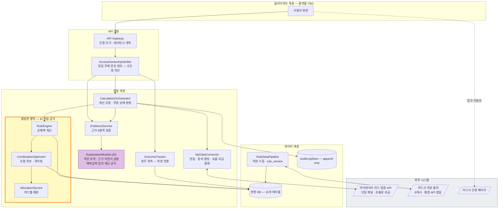

- **클라이언트 애플리케이션**
    - **TBD** — PRD에 클라이언트 플랫폼(웹/모바일 앱 구분, 진입 도메인)이 명시되지 않았다. 요구사항은 플랫폼 비종속으로 기술한다.
- **내부 구성요소**
    - **Rule Engine** : 결정론적 순혜택 계산. 실적구간·통합할인한도·연회비·제외항목 반영. **금액 산출은 전량 이 엔진이 담당한다**
    - **Combination Optimizer** : 조합 후보 생성 · Gross/Net Benefit 산출 · **게이팅 판정**
    - **Allocation Service** : 카드별 역할·금액 배분
    - **Evidence Service** : 적용 규칙·제외조건·기준일·`rule_version` 공개. **6항목 미달 시 응답 거부**
    - **Explanation Module (AI)** : 두 가지만 한다 — ⓐ **약관 요약** ⓑ **추천 근거의 자연어 설명**. **혜택금액을 임의로 계산하지 않는다** (ADR-02)
    - **MyData Connector** : 마이데이터 API 연동 · 동의 상태 관리 · 호출 과금 통제
    - **Rule Data Pipeline** : 카드사 약관 수집 · `rule_version` 버전관리 · 최신성 경고
    - **Outcome Tracker** : 조합안 선택·30일 후 완주 응답 계측 (측정 전용)
    - **Audit Log Store** : 계산 요청·응답·입력 스냅샷·`rule_version`·마이데이터 응답 코드 전건 보존
- **외부 시스템**
    - **마이데이터 카드 업권 API** — **단일 채널, 대체 공급자 없음**. 장애 시 우회 경로 없음. **호출당 과금**
    - **카드사 약관·혜택 Rule 출처** — 공식 통합 API 없음. 8개 카드사·겸영은행으로 파편화되어 수집·버전관리 필수
    - **카드사 공식 신청 페이지** — 이동 링크만 제공. 신청서 작성·제출을 대행하지 않는다

---

## 4. 구체적 요구사항

> **아래 두 그림이 4.1 표 전체의 지도다.** 요구사항 12건이 각각 어디에 해당하는지 그림에서 먼저 찾으면 표가 읽힌다. 마름모는 판단(갈라지는 지점), 사각형은 처리다.

**계산이 도는 순서** — REQ-FUNC-003 · REQ-NF-005

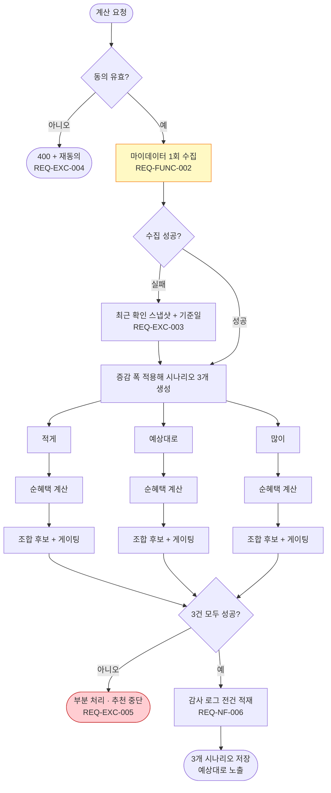

**노란 상자가 시나리오 분기 앞에 딱 하나뿐인 것이 REQ-NF-005의 설계다.** 마이데이터 수집이 세 갈래 안으로 들어가면 호출이 3배가 되어 `결론 1건당 호출 ≤ 1회`가 즉시 깨진다.

**게이팅이 판단하는 방식** — REQ-FUNC-004 · ADR-01

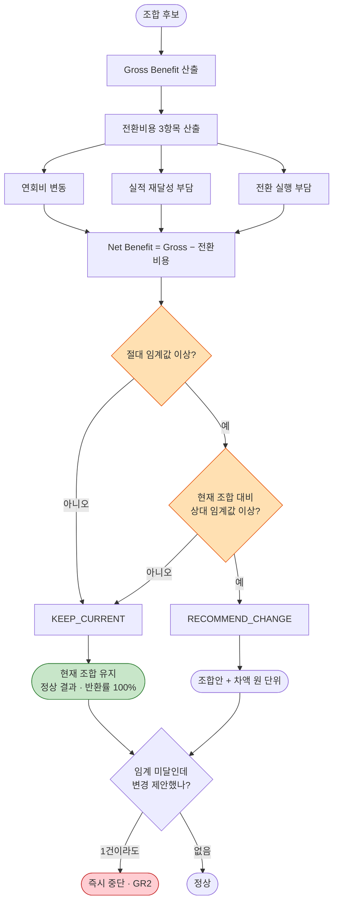

**초록 상자가 빨간 상자가 아니라는 점을 놓치면 이 서비스를 잘못 만든다.** "현재 조합 유지"는 실패가 아니라 정상 결과이며, 오히려 임계 미달인데 변경을 제안하는 것이 위반(GR2)이다. **주황 마름모 두 개의 숫자가 채워졌다** — 절대 **월 3,000원** · 상대 **10%**이며 둘을 **모두** 만족해야 변경 권고다(D2 확정, `[CALC]cardfit-calc-spec.md` 3.3절).

### 4.1 기능 요구사항

| ID | 제목 | 출처 | 우선순위 | 유형 | 검증 방식 | 인수 기준 | 상태 | 담당자 |
| --- | --- | --- | --- | --- | --- | --- | --- | --- |
| **REQ-FUNC-001** | 미래지출 입력 (카테고리·금액·시점) | PRD 3절 F-01 | Must Have | Functional | 1) 입력 흐름 테스트<br>2) 이벤트 비종속 검증<br>3) QA 검증 | 카테고리(자유 입력 허용)·금액·시점·확실도를 입력해 저장할 수 있어야 한다. **이벤트 필수 선택 단계가 0개**여야 하며, 지출 **감소** 방향 처리 실패가 0건이어야 한다 (AC-07) | Proposed | 개발 엔지니어 |
| **REQ-FUNC-002** | 마이데이터 연동 및 제약조건 수집 | PRD 3절 F-02 | Must Have | Functional | 1) 연동 통합 테스트<br>2) 동의 상태 전이 테스트<br>3) 보안 감사 | 과거 소비·보유카드를 자동 수집하고, 최대 카드 수·연회비 상한·신규 발급 허용 여부를 입력받아야 한다. **동의 만료·철회 상태에서 계산 요청은 400을 반환**해야 한다 (AC-01, AC-F4) | Proposed | 개발 엔지니어 |
| **REQ-FUNC-003** | 순혜택 시나리오 계산 (3개 시나리오) | PRD 3절 F-03 | Must Have | Functional | 1) 경계값 회귀 테스트 (E4, ≥ 200건)<br>2) 결정론성 검증<br>3) 사전 계산 검증 | 실적구간·통합할인한도·연회비·제외항목을 반영해 순혜택을 산출하고, **적게·예상대로·많이 3개 시나리오를 모두 사전 계산**해야 한다. **탭 전환 시 재계산 0건**, 각 탭에 지출 가정 캡션 누락 0건 (AC-06) | Proposed | 계산 품질 |
| **REQ-FUNC-004** | 조합 최적화 및 **Net Benefit 게이팅** | PRD 3절 F-04 | Must Have | Functional | 1) 게이팅 판정 전건 대조<br>2) 임계값 경계 테스트<br>3) Concierge Test (E2)<br>4) QA 검증 | 해지·유지·신규추가 조합 후보를 생성하고 Net Benefit을 산출해야 한다. **임계 미달 시 "현재 조합 유지"를 결론으로 반환**하며 반환률 100%. 임계 미달인데 변경을 제안한 건수 **0건** (AC-05, GR2) | Proposed | 계산 품질 |
| **REQ-FUNC-005** | 결제수단 배분 | PRD 3절 F-05 | Must Have | Functional | 1) 배분 합계 검증<br>2) QA 검증 | 카드별 역할과 배분 금액을 제시해야 한다. **배분 합계와 입력 총액의 오차 ≤ 1원** (AC-01). 실행 대행은 포함하지 않는다 | Proposed | 개발 엔지니어 |
| **REQ-FUNC-006** | 계산 근거 공개 | PRD 3절 F-06 | Must Have | Functional | 1) 근거 항목 수 검증<br>2) 미반영 항목 표기 검증<br>3) 신뢰 점수 전후 비교 (E2)<br>4) QA 검증 | 적용 규칙·**제외조건**·기준일·`rule_version`을 포함해 **공개 항목 ≥ 6개**를 표기해야 한다. 계산에 못 넣은 비용은 "이 계산에는 포함되지 않았습니다"로 표기하고 누락률 0%. **6항목 미달이면 응답을 거부**한다 (AC-02, AC-F2, GR3) | Proposed | 계산 품질 |
| **REQ-FUNC-007** | 과거 패턴 기반 초기값 자동 제안 | PRD 3절 F-11 | Must Have | Functional | 1) 제안값 산출 테스트<br>2) A/B 테스트 (E3, n=500)<br>3) 수정률 관측 | 과거 소비 패턴으로 미래지출 초기값을 제안해야 한다. **직접 입력 강제 항목 0개**. 온보딩 완료율 ≥ 60% 및 A군 대비 +15%p 달성, 초기값 수정률이 정상 범위여야 한다 | Proposed | 개발 엔지니어 |
| **REQ-FUNC-008** | 이벤트 비종속 입력 | PRD 3절 F-08 | Should Have | Functional | 1) 자유 카테고리 입력 테스트<br>2) 증감 양방향 테스트 | 자유 카테고리 입력과 증감 양방향 처리를 지원해야 한다. 이벤트 선택 단계를 **두지 않는 것**으로 충족한다 | Proposed | 개발 엔지니어 |
| **REQ-FUNC-009** | 스코프 경계 고지 및 **금지어 자동 검수** | PRD 3절 F-12 | Should Have | Functional | 1) 경계 안내 노출 검증<br>2) 금지어 정적·런타임 스캔<br>3) 사후 설문 (E6) | "해지" 항목 포함 결론에 **"신청·해지는 카드사에서 직접 진행하셔야 합니다"** 안내가 노출돼야 한다. 미노출 **0건**, 금지어 적발 **0건**, 범위 인지율 ≥ 90% (AC-03, GR4) | Proposed | 컴플라이언스·보안 |
| **REQ-FUNC-010** | 실행 완주율 계측 (측정 전용) | PRD 3절 F-13 | Should Have | Functional | 1) 발송·집계 테스트<br>2) 개입 없음 검증<br>3) 완주율 관측 (E7a·E7b) | 조합안 선택 **+30일에 1회만** 발송하고 완주 여부를 집계해야 한다. 응답 수집률 ≥ 30%, 집계 실패 0건. **무응답은 미완주로 집계**하며, 재발송·독려·자동 후속 액션 트리거가 **0건**이어야 한다 (AC-04) | Proposed | 제품 책임자 (PM) |
| REQ-FUNC-011 | 단계적 전환 제안 (효과 큰 카드부터) | PRD 3절 F-07 | Could Have | Functional | 1) 정렬 로직 테스트<br>2) QA 검증 | 조합 변경 항목을 효과 크기 순으로 제시해야 한다. **제시 방식이며 실행 지원이 아니다** | Proposed | 개발 엔지니어 |
| REQ-FUNC-012 | 소득·지출 범위(최소~평균) 입력 | PRD 3절 F-09 | Could Have | Functional | 1) 범위 입력 테스트<br>2) QA 검증 | 단일값 대신 범위로 입력할 수 있어야 한다 | Proposed | 개발 엔지니어 |

**요구사항 배분 및 증분 (29148 9.6.9)** — REQ-FUNC-003·004는 1 스프린트(2주)를 초과해 아래 4개 증분으로 배분한다. **요구사항 ID는 유지하고 인수 기준을 단계로 분할**해 추적 관계를 보존한다.

| 증분 | 범위 | 스프린트 | 완료 판정 |
| :---: | --- | :---: | --- |
| **REQ-FUNC-003 (a)** | 순혜택 계산 엔진 — **단일 시나리오("예상대로")만** | 1 | 경계값 회귀 200건 통과, 재계산 불일치 0건 (E4) |
| **REQ-FUNC-004 (a)** | 조합 후보 생성 + Gross/Net Benefit 산출 (전환비용 3항목 반영) | 1 | 배분 합계 오차 ≤ 1원, 후보 생성 실패 0건 |
| **REQ-FUNC-003 (b)** | 3개 시나리오 확장 — 증감 폭 적용, 사전 계산, 가정 캡션 | 1 | 탭 전환 재계산 0건, 마이데이터 추가 호출 0건 |
| **REQ-FUNC-004 (b)** | **게이팅** + "예상대로" 기본 노출 · 탭 전환 | 1 | "유지" 반환률 100%, GR2 = 0건 |

**게이팅을 마지막에 배치한 이유** — Net Benefit 임계값(의존성 D2)이 가장 늦게 확정될 항목이었다. **D2는 확정됐고**(절대 월 3,000원 · 상대 10%), 증분 순서는 계산 엔진 → 후보 생성 → 시나리오 확장 → 게이팅 그대로 유지한다.

#### 4.1.0 규칙 엔진 명세 — 기획이 정해야 하는 것

> **본 절이 식별한 RE-1~RE-8은 전건 확정됐다** — `[CALC]cardfit-calc-spec.md`(CALC-CARDFIT-001) 1장에 결정값이, 2~4장에 산정식이 있다. 아래 표는 **무엇이 왜 기획 결정이었는지**를 남긴 기록이며, 값의 정본은 계산 명세서다.
>
> 본 명세는 규칙 엔진이 "무엇을 입력받아 무엇을 내놓는가"까지만 정의했다. 그 안에서 **어떤 순서로 어떤 식을 적용하는가**는 기술 결정이 아니라 **기획·상품 결정**이며, 비어 있으면 REQ-FUNC-003·004가 구현자 재량으로 채워진다.

| # | 정해야 하는 것 | 왜 구현자가 정할 수 없나 | 막는 것 |
| :---: | --- | --- | :---: |
| **RE-1** | **계산 적용 순서** — 실적구간 판정 → 혜택 산출 → 통합할인한도 적용 → 제외항목 차감의 순서 | **순서가 바뀌면 금액이 달라진다.** 한도를 제외항목 차감 전에 적용하는지 후에 적용하는지에 따라 결과가 갈린다 | REQ-FUNC-003 |
| **RE-2** | **제외항목의 적용 대상** — 실적 산정에만 / 혜택 적용에만 / 둘 다 | 카드사마다 다르고, 약관 문구로도 모호한 경우가 있다. 상품 해석 결정이다 | REQ-FUNC-003 |
| **RE-3** | **Gross Benefit의 산정 기간** — 월 단위 / 연 단위 / 미래지출 입력 기간 | 연회비는 연 단위, 혜택 한도는 월 단위다. **기준 기간을 정하지 않으면 두 값을 더할 수 없다** | REQ-FUNC-003·004 |
| **RE-4** | **미래 시나리오에서 "전월 실적"의 정의** — 실적은 전월 기준인데, 미래 지출 계획에는 "전월"이 없다 | 시간축 해석 문제다. 첫 달을 어떻게 처리할지가 결과를 바꾼다 | REQ-FUNC-003 |
| **RE-5** | **전환비용 3항목의 산정 방법** — ⓐ 연회비 변동 ⓑ **실적 재달성 부담** ⓒ **전환 실행 부담** | ⓐ는 계산 가능하지만 **ⓑ·ⓒ는 돈으로 환산하는 기준이 없다.** 이 값이 Net Benefit을 결정하고, Net Benefit이 게이팅을 결정한다 | REQ-FUNC-004 · **D2** |
| **RE-6** | **조합 후보 생성 규칙** — 보유카드의 어떤 부분집합을 후보로 만드나. 전체 조합 / 제약 필터 후 / 상위 N개 | 카드 N장의 부분집합은 2^N이다. 규칙이 없으면 탐색 범위가 정해지지 않고 성능도 예측할 수 없다 | REQ-FUNC-004 · REQ-NF-001 |
| **RE-7** | **신규 카드 후보 풀의 출처와 범위** | `card_products`에 무엇을 담을지, 전 상품인지 선별인지 정해지지 않았다 | REQ-FUNC-004 · **D4** |
| **RE-8** | **동일 카테고리 중복 혜택 처리** — 두 카드가 같은 업종에 혜택을 줄 때 합산인지 택일인지 | 배분(REQ-FUNC-005)의 전제다. 합산 가정과 택일 가정의 금액 차이가 크다 | REQ-FUNC-005 |

**RE-5가 가장 무겁다.** 실적 재달성 부담과 전환 실행 부담은 *"수고"* 를 금액으로 바꾸는 일이라 정답이 없고, 이 값이 **게이팅 임계값(D2)과 짝을 이룬다.** 전환비용을 크게 잡으면 "유지" 결론이 늘고, 작게 잡으면 "변경" 결론이 늘어난다 — **D2를 정하기 전에 RE-5를 먼저 정해야 한다.**

**RE-1~RE-8은 260건 경계값 케이스의 기대값을 확정하는 데도 필요했다.** 경계 *지점*은 `[GTD]cardfit-gate-data.md`가 정의했고, **파라미터 바인딩은 완료됐다**(`abs_threshold: 3000` · `rel_threshold: 0.10` · `scenario_delta: 0.20`). 각 지점의 기대 *숫자*는 계산 명세서를 구현한 뒤 산출한다(BE-10).

#### 4.1.1 처리 흐름 — 시퀀스

> 근거: ISO/IEC/IEEE 29148:2018 **9.6.12 b)** *Functions — exact sequence of operations*
>
> **그림 읽는 법** — 맨 위 상자가 참여자, 아래로 내려가는 선이 시간이다. 위에서 아래로 읽으면 일이 벌어지는 순서다. `alt`로 갈라진 칸은 "이런 경우 / 저런 경우"를 뜻한다.

**① 정상 계산** — REQ-FUNC-003 · REQ-NF-005 · AC-01 · AC-06

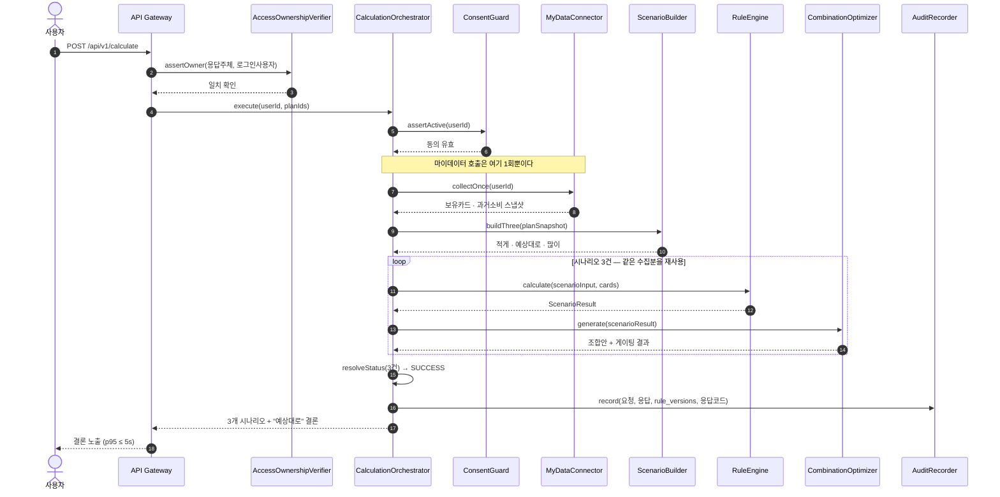

`collectOnce`가 반복문 **밖**에 있다. 시나리오가 3개라도 마이데이터 호출은 1회이며, 이것이 REQ-NF-005를 만족시키는 방식이다. 호출을 반복문 안으로 옮기면 요구사항이 즉시 깨진다.

**② 게이팅 — "현재 조합 유지" 반환** — REQ-FUNC-004 · AC-05 · GR2

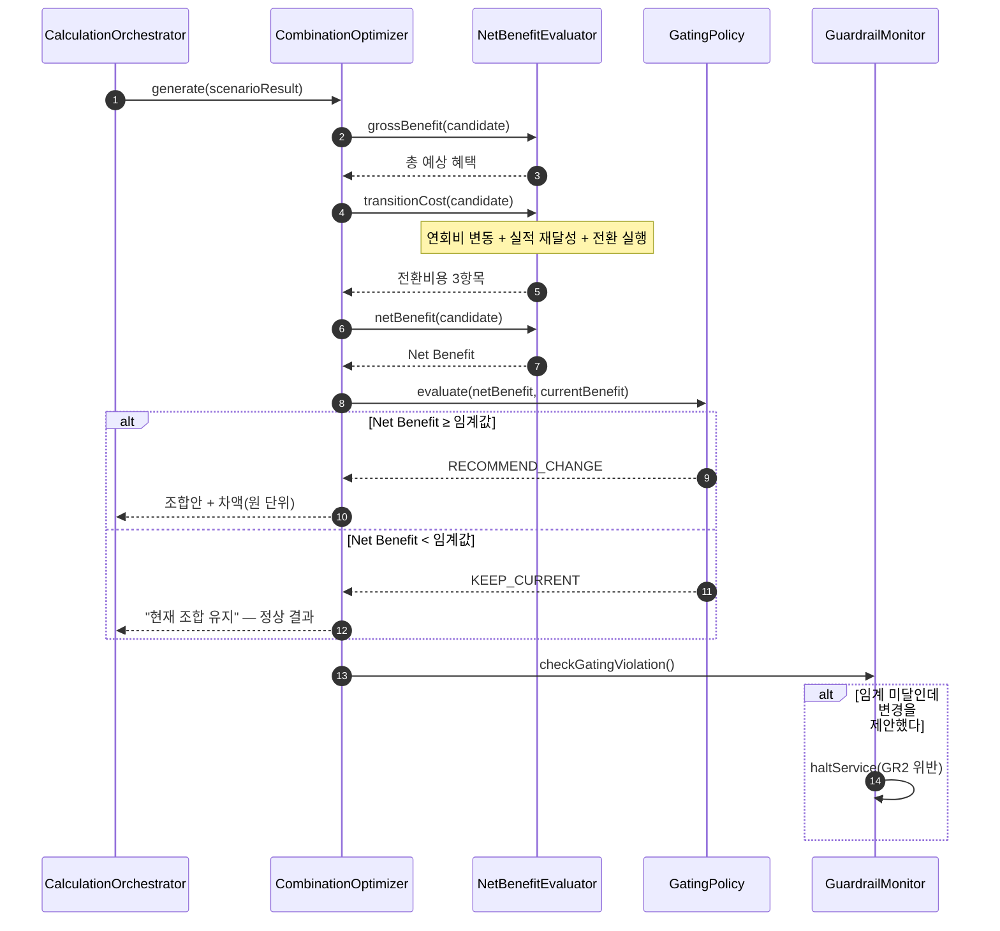

`alt`의 두 갈래가 **모두 정상 응답**이다. 오히려 임계 미달인데 변경을 제안하는 것이 위반(GR2)이며, 마지막 블록이 그 감시다.

### 4.2 비기능 요구사항

| ID | 제목 | 출처 | 우선순위 | 유형 | 검증 방식 | 인수 기준 (임계치 · 모니터링 항목) | 상태 | 담당자 |
| --- | --- | --- | --- | --- | --- | --- | --- | --- |
| **REQ-NF-001** | 응답 시간 및 여정 소요 | PRD 4절 NFR-01 | Must Have | Performance | 3개 시나리오 동시 산출 조건 부하 테스트 (AC-01·AC-02) | **임계치**: `POST /calculate` **p95 ≤ 5s** · `GET .../evidence` **p95 ≤ 1s** · 결론 도달 **p95 ≤ 5분**<br>**모니터링**: 엔드포인트별 p50·p95·p99 레이턴시, 여정 단계별 소요시간 분포, 타임아웃 건수 (실시간 · 일간) | Proposed | 시스템 운영자 |
| **REQ-NF-002** | 계산 정확성 및 결정론성 | PRD 4절 NFR-02 | Must Have | Accuracy | 경계값 회귀 스위트 (E4) · 동일입력 응답 해시 비교 | **임계치**: 계산 오류율 **≤ 0.1%** · 동일 입력 재계산 **불일치 0건** · 배분 합계 오차 **≤ 1원**<br>**모니터링**: 회귀 200건 통과율, 응답 해시 불일치 건수, 배분 합계 검증 실패 건수 (배포마다 · 일간) | Proposed | 계산 품질 |
| **REQ-NF-003** | 가용성 및 부분 장애 시 거동 | PRD 4절 NFR-03 | Must Have | Reliability | SLA 모니터링 · 장애 주입 테스트 (AC-F3·AC-F5) | **임계치**: 월 가용성 **≥ 99.5%** (월 허용 다운타임 **3시간 39분**) · 마이데이터 장애 시 경고 표시 후 계산 계속 · 필수 데이터 누락 시 추천 중단<br>**모니터링**: 월 가용률, 마이데이터 API 오류율·타임아웃율, 계산 실패율, 경고 표시 후 완주율 (실시간 알림 · 월간 SLA) | Proposed | 시스템 운영자 |
| **REQ-NF-004** | 인증·인가 및 오조회 차단 | PRD 4절 NFR-04 | Must Have | Security | 보안 감사 · 접근 제어 테스트 · 응답 주체 전건 대조 (AC-F4) | **임계치**: 오조회 **0건** (1건 = 즉시 중단·신고) · 마이데이터 인가 요건 준수(자본금·물적설비·보안) · 동의 범위 최소화 · 철회 시 파기 **24시간 내**<br>**모니터링**: 응답 주인 ≠ 로그인 사용자 검출 수, 동의 만료·철회 후 접근 시도 수, 파기 SLA 준수율, 동의 항목 수 변동 (실시간 알림) | Proposed | 컴플라이언스·보안 |
| **REQ-NF-005** | **비용 — 마이데이터 호출 과금 통제** | PRD 4절 NFR-05 | Must Have | Cost / Efficiency | 호출량 계측 · 단위경제 리포트 (AC-06) | **임계치**: 마이데이터는 호출당 과금되므로 **결론 1건당 호출 ≤ 1회**로 제한하고, 시나리오 3개는 1회 수집 데이터로 계산해야 한다 · 시나리오 확장으로 인한 추가 호출 **0건** · 결론 1건당 단위원가 상한 **TBD**(의존성 D3 확정 시)<br>**모니터링**: 결론당 호출 수, 일 호출량·과금액, 재계산 반복 호출 수, 결론 없이 종료된 낭비 호출 비율 (일간 · 주간) | Proposed | 시스템 운영자 |
| **REQ-NF-006** | 감사 증적 — 계산 재현성 | PRD 4절 NFR-06 | Must Have | Auditability | 적재율 검증 · 재현 테스트 | **임계치**: 계산 요청·응답, `rule_version`, 입력 스냅샷, 마이데이터 응답 코드 **전건 보존** · 적재 누락 **0건** · 보존기간 **TBD**(D9 규제 분류 확정 시)<br>**모니터링**: 감사로그 적재율(100% 기준), 재현 테스트 성공률 (일간) | Proposed | 컴플라이언스·보안 |
| **REQ-NF-007** | 데이터 최신성 — Rule 버전 관리 | PRD 4절 NFR-07 | Must Have | Maintainability | 최신성 점검 배치 · 제외 처리 검증 (AC-F6) | **임계치**: 갱신 지연 **≤ 30일** · 초과 시 해당 카드 **계산 대상 제외**(무단 사용 0건) · `rule_version` 적용 시작·종료일 필수<br>**모니터링**: 카드별 약관 최종 확인일 경과일수, 30일 초과 카드 수·제외 처리 건수, 최신성 경고 노출률 (일간) | Proposed | 데이터 운영 |
| **REQ-NF-008** | 사용성 — 입력 부담 및 결론 도달 | PRD 4절 · 7-2 | Should Have | Usability | A/B 테스트 (E3) · 여정 계측 | **임계치**: 온보딩 완료율 **≥ 60%** · 결론 도달 **p95 ≤ 5분**(기준선 수기 240분) · 직접 입력 강제 항목 **0개**<br>**모니터링**: 온보딩 완료율, 결론 도달 소요시간 p95, 초기값 수정률 (일간) | Proposed | 제품 책임자 (PM) |

| **REQ-NF-009** | 계측 가능성 — 지표 관측용 이벤트 | PRD 7-2 측정 창구 | Must Have | Observability | 이벤트 적재율 검증 · 대시보드 산식 검증 | **임계치**: 11.2가 정의한 측정 창구 이벤트를 **누락 없이 적재**해야 한다 — `result_viewed` · `evidence_expanded` · `scenario_tab_opened` · `onboarding_done`(`tag_selected` 포함) · `plan_selected` · `outcome_response` · `input_done`. 이벤트 적재 누락 **0건** · 사람 단위 7일 코호트 집계 가능<br>**모니터링**: 이벤트별 적재율, 근거 열람률(≥ 50%), 보조 탭 열람률(관찰), 이벤트 비종속 진입률(≥ 20%) (일간 · 주간) | Proposed | 제품 책임자 (PM) |

**대시보드 요구** — 북극성 · 보조 지표 · Guardrail 5개 · REQ-NF-001~009의 모니터링 항목을 한 화면에 두고 **페르소나 층별로 분해**한다. 임계치를 넘긴 항목은 2장의 담당 역할에게 자동 알림한다.

#### 4.2.1 오조회 차단 흐름 — 시퀀스

**③ 오조회 — 제품 책임자를 우회하는 유일한 중단** — REQ-NF-004 · GR5

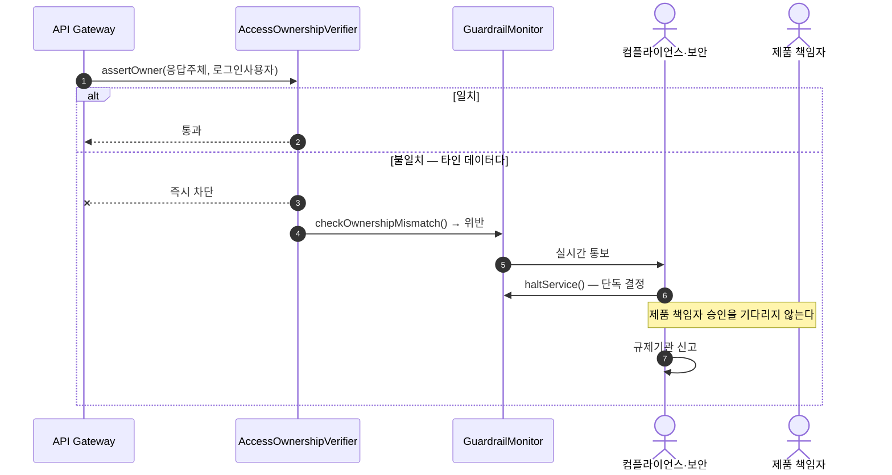

이 서비스에서 제품 책임자를 우회하는 중단 경로는 이것 하나다. 타인 데이터 노출은 사업 판단 대상이 아니라 즉시 신고 의무 사항이기 때문이다.

REQ-NF-009는 11.2가 지정한 측정 창구를 구현 책임으로 옮긴 것이다. 근거 열람률·보조 탭 열람률처럼 화면 행동으로만 관측되는 지표는 이벤트가 적재되지 않으면 측정할 수 없으므로, 계측을 비기능 요구사항으로 명시한다.

### 4.3 예외·실패 처리 요구사항

> **확장 절** — 근거: ISO/IEC/IEEE 29148:2018 **9.6.12 c)** *Functions — responses to abnormal situations (error handling and recovery)*. PRD 5-2에 이미 정의된 실패 경로를 요구사항으로 승격했다.

**"결과를 내지 않는 것"이 정답인 케이스가 6건이다.** 이 표가 없으면 장애·미입력 상황의 반환값이 구현자 재량이 되고, 그 재량이 미래 입력 반영률 100%와 근거 공개 6항목을 무너뜨린다.

> **그림 읽는 법** — 어떤 상황에서 무엇을 반환하는지 한눈에 본다. **빨간 상자는 "결과를 안 주는 것이 정답"**, 노란 상자는 "경고를 붙여 계속하는 것이 정답"이다.

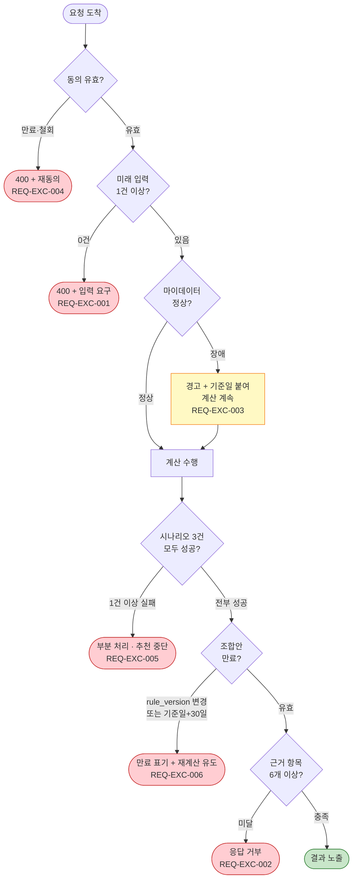

#### 4.3.1 예외 처리 흐름 — 시퀀스

**④ 마이데이터 장애 — 계산을 멈추지 않는다** — REQ-EXC-003 · REQ-NF-003 · AC-F3

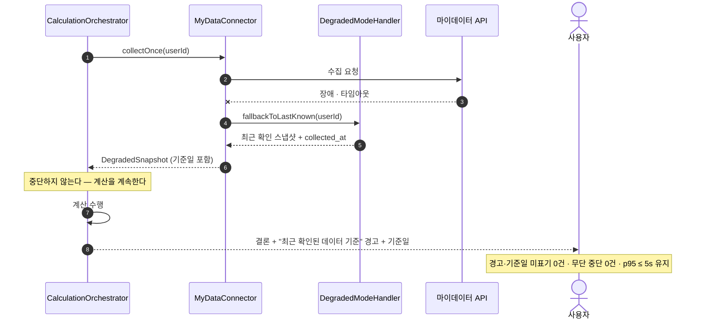

대체 공급자가 없는 단일 채널이라 장애 시 우회 경로가 없다. 그래서 "멈추기"가 아니라 "오래된 데이터임을 밝히고 계속하기"를 택했으며, **기준일을 반드시 노출**해 사용자가 스스로 판단할 수 있게 한다.

**⑤ 부분 계산 — 하나라도 실패하면 전체 중단** — REQ-EXC-005 · AC-F5

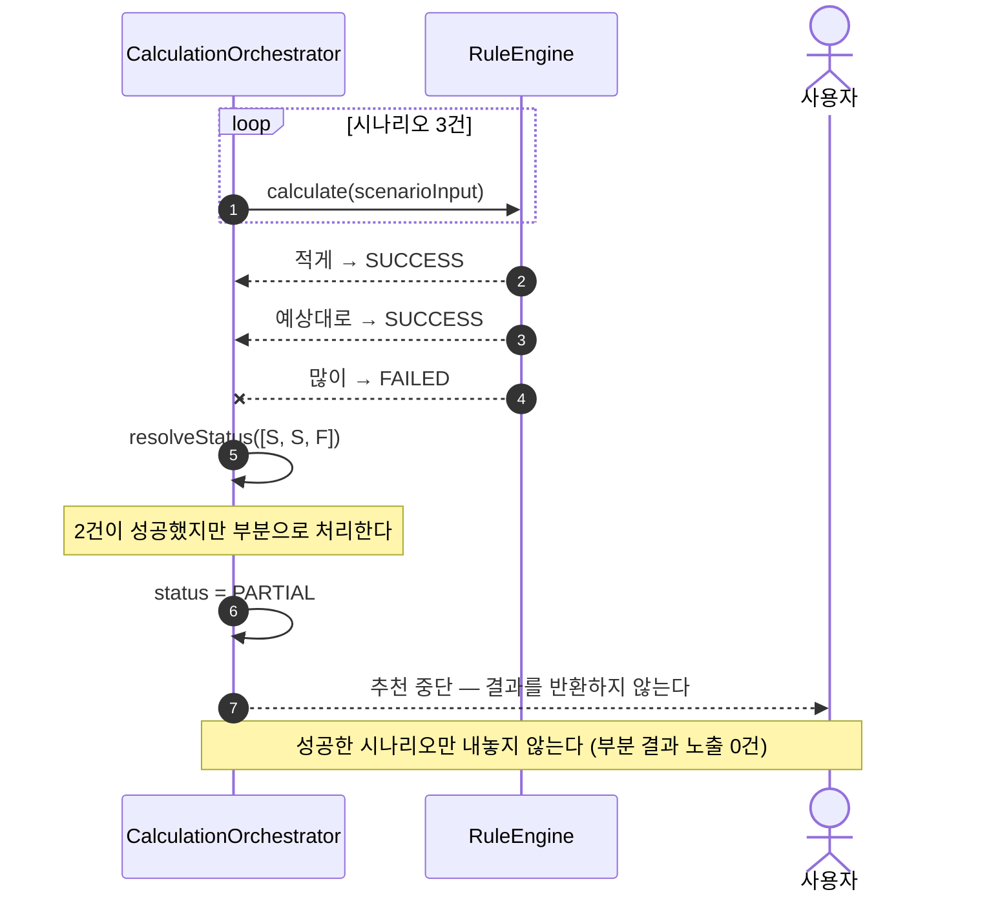

성공한 2건을 보여주고 싶은 유혹이 이 요구사항의 시험대다. 세 탭 중 하나가 비면 사용자는 남은 두 탭을 완전한 결과로 오인하므로, 전부 아니면 전무로 처리한다.

**노란 상자가 하나뿐인 것에 주의한다.** 마이데이터 장애만 "계속"이고 나머지 다섯은 모두 "중단"이다. 장애를 예외 처리한 이유는 **대체 공급자가 없어 멈추면 서비스가 성립하지 않기** 때문이며, 대신 기준일을 반드시 노출해 사용자가 스스로 판단하게 한다.

| ID | 제목 | 출처 | 우선순위 | 유형 | 검증 방식 | 인수 기준 | 상태 | 담당자 |
| --- | --- | --- | --- | --- | --- | --- | --- | --- |
| **REQ-EXC-001** | 미래 입력 0건 시 계산 거부 | PRD 5-2 AC-F1 | Must Have | Error Handling | 경계 입력 테스트 | 미래지출 입력 0건으로 계산 요청 시 **`400`을 반환하고 입력을 요구**한다. 미래 입력 미반영 결과 노출 **0건**, 오응답 0건 | Proposed | 개발 엔지니어 |
| **REQ-EXC-002** | 근거 6항목 미달 시 응답 거부 | PRD 5-2 AC-F2 | Must Have | Error Handling | 근거 항목 수 검증 | 근거 항목이 6개 미달인 결과는 **응답을 거부**한다. 6항목 미달 노출 **0건** (GR3) | Proposed | 계산 품질 |
| **REQ-EXC-003** | 마이데이터 장애 시 계산 계속 | PRD 5-2 AC-F3 | Must Have | Recovery | 장애 주입 테스트 | 마이데이터 API 장애·타임아웃 시 **"최근 확인된 데이터 기준" 경고와 기준일을 노출하고 계산을 계속**한다. 경고·기준일 미표기 0건, 무단 중단 **0건**, `p95 ≤ 5s` 유지 | Proposed | 개발 엔지니어 |
| **REQ-EXC-004** | 동의 만료·철회 시 계산 차단 | PRD 5-2 AC-F4 | Must Have | Error Handling | 동의 상태 전이 테스트 | 동의 만료 또는 철회 상태에서 계산 요청 시 **`400`과 재동의 유도**를 반환한다. 만료·철회 데이터 기반 계산 **0건**, 철회 후 파기 24시간 내 | Proposed | 컴플라이언스·보안 |
| **REQ-EXC-005** | 부분 계산 시 추천 중단 | PRD 5-2 AC-F5 · 6-3 | Must Have | Error Handling | 시나리오 부분 실패 테스트 | **3개 시나리오 중 하나라도 실패하면 전체를 "부분"으로 처리**하고 추천을 중단한다. 성공한 시나리오만 결과로 내놓지 않는다. 부분 결과 노출 **0건**, 상태 오분류 0건 | Proposed | 계산 품질 |
| **REQ-EXC-006** | 조합안 만료 시 재계산 유도 | PRD 5-2 AC-F6 · 6-3 | Must Have | Error Handling | 만료 판정 테스트 | `rule_version` 변경 또는 기준일 **+30일 경과** 시 **만료를 표기하고 재계산을 유도**한다. 만료 조합안이 실행 대상으로 노출되는 건수 **0건**, 만료 판정 지연 0건 | Proposed | 데이터 운영 |

---

## 5. 추적성 매트릭스

> **그림 읽는 법** — 상자 하나가 **클래스**(코드에서 만들 부품 하나)다. 상자 안 윗칸은 그 부품이 가진 데이터, 아랫칸은 그 부품이 하는 일이다. 화살표는 "이 부품이 저 부품을 쓴다"는 뜻이다. **아래 표의 `구현 클래스` 열이 이 그림에서 나왔다.** 전체 클래스 설계는 `[SDD]cardfit-design.md` 3장에 있다.

```mermaid
classDiagram
    direction TB
    class CalculationOrchestrator {
        +Calculation execute(userId, planIds)
        +CalculationStatus resolveStatus(scenarioResults)
    }
    class ConsentGuard {
        +void assertActive(userId)
    }
    class MyDataConnector {
        +MyDataSnapshot collectOnce(userId)
        +DegradedSnapshot fallbackToLastKnown(userId)
    }
    class ScenarioBuilder {
        -BigDecimal deltaRatio
        +List~ScenarioInput~ buildThree(planSnapshot)
    }
    class RuleEngine {
        +ScenarioResult calculate(scenarioInput, cards)
    }
    class CombinationOptimizer {
        +List~PlanCandidate~ generate(scenarioResult)
    }
    class NetBenefitEvaluator {
        +long netBenefit(candidate)
    }
    class GatingPolicy {
        -long absoluteThresholdWon
        -BigDecimal relativeThreshold
        +GatingResult evaluate(netBenefit, currentBenefit)
    }
    class AllocationService {
        +boolean verifySumWithin1Won(allocations, total)
    }
    class PlanExpiryPolicy {
        +boolean isExpired(candidate)
    }
    class EvidenceAssembler {
        +int countDisclosedItems(items)
        +void rejectIfBelowSix(items)
    }
    class ExplanationModule {
        +String describe(evidenceItems)
    }
    class OutcomeTracker {
        +void recordResponse(id, completed, reason)
    }
    class AccessOwnershipVerifier {
        +void assertOwner(responseOwnerId, loginUserId)
    }
    class AuditRecorder {
        +void record(request, response, ruleVersions, code)
    }

    AccessOwnershipVerifier --> CalculationOrchestrator
    CalculationOrchestrator --> ConsentGuard
    CalculationOrchestrator --> MyDataConnector
    CalculationOrchestrator --> ScenarioBuilder
    CalculationOrchestrator --> RuleEngine
    CalculationOrchestrator --> CombinationOptimizer
    CalculationOrchestrator --> AuditRecorder
    CombinationOptimizer --> NetBenefitEvaluator
    CombinationOptimizer --> GatingPolicy
    CombinationOptimizer --> PlanExpiryPolicy
    CombinationOptimizer --> AllocationService
    CalculationOrchestrator --> EvidenceAssembler
    EvidenceAssembler --> ExplanationModule
    CombinationOptimizer --> OutcomeTracker
```

**`ExplanationModule`(AI)에서 계산 클래스로 향하는 화살표가 하나도 없다.** 이것이 9장 ADR-02를 클래스 수준에서 강제하는 방식이다. AI는 확정된 근거 항목을 인자로 받아 문장만 만든다.

**클래스명에 정책이 드러난 3건** — `GatingPolicy`는 임계값(D2)이 미정이라 정책만 교체할 수 있게 분리했고, `ScenarioBuilder.deltaRatio`도 증감 폭(D5)을 상수로 박지 않았다. `MyDataConnector.collectOnce`는 이름에 `Once`를 넣어 REQ-NF-005(결론 1건당 호출 ≤ 1회)를 못 박았다.

| 요구사항 ID | 모듈 | 구현 클래스 | 테스트 케이스 ID |
| --- | --- | --- | --- |
| REQ-FUNC-001 | Future Spend Input | `FutureSpendPlanService` | TC-FUNC-001 |
| REQ-FUNC-002 | MyData Connector | `MyDataConnector` · `ConsentGuard` | TC-FUNC-002 |
| REQ-FUNC-003 | Rule Engine | `RuleEngine` · `ScenarioBuilder` | TC-FUNC-003 |
| REQ-FUNC-004 | Combination Optimizer | `CombinationOptimizer` · **`GatingPolicy`** | TC-FUNC-004 |
| REQ-FUNC-005 | Allocation Service | `AllocationService` | TC-FUNC-005 |
| REQ-FUNC-006 | Evidence Service | `EvidenceAssembler` · `ExplanationModule` | TC-FUNC-006 |
| REQ-FUNC-007 | Future Spend Input · MyData Connector | `InitialValueSuggester` | TC-FUNC-007 |
| REQ-FUNC-008 | Future Spend Input | `FutureSpendPlanService` | TC-FUNC-008 |
| REQ-FUNC-009 | Evidence Service · 문구 스캐너 | `ScopeBoundaryNotice` · `ProhibitedTermScanner` | TC-FUNC-009 |
| REQ-FUNC-010 | Outcome Tracker | `OutcomeTracker` | TC-FUNC-010 |
| REQ-FUNC-011 | Combination Optimizer | `StagedTransitionPresenter` | TC-FUNC-011 |
| REQ-FUNC-012 | Future Spend Input | `FutureSpendPlanService` | TC-FUNC-012 |
| REQ-NF-001 | 전 모듈 (API Gateway 계측) | `LatencyInterceptor` | TC-NF-001 |
| REQ-NF-002 | Rule Engine | `DeterminismVerifier` · `BoundaryRegressionSuite` | TC-NF-002 |
| REQ-NF-003 | MyData Connector · Rule Engine | `DegradedModeHandler` | TC-NF-003 |
| REQ-NF-004 | 전 모듈 (인가·동의 관리) | **`AccessOwnershipVerifier`** · `ConsentGuard` | TC-NF-004 |
| REQ-NF-005 | MyData Connector | `CallBudgetCounter` | TC-NF-005 |
| REQ-NF-006 | Audit Log Store | `AuditRecorder` | TC-NF-006 |
| REQ-NF-007 | Rule Data Pipeline | `RuleDataPipeline` · `RuleFreshnessChecker` | TC-NF-007 |
| REQ-NF-008 | Future Spend Input · Evidence Service | `InitialValueSuggester` · `JourneyTimer` | TC-NF-008 |
| REQ-NF-009 | 전 모듈 (이벤트 계측) | `MetricEventEmitter` · `NorthStarCalculator` | TC-NF-009 |
| REQ-EXC-001 | Future Spend Input · Rule Engine | `CalculationOrchestrator` | TC-EXC-001 |
| REQ-EXC-002 | Evidence Service | `EvidenceAssembler` | TC-EXC-002 |
| REQ-EXC-003 | MyData Connector | `DegradedModeHandler` | TC-EXC-003 |
| REQ-EXC-004 | MyData Connector | `ConsentGuard` | TC-EXC-004 |
| REQ-EXC-005 | Rule Engine · Combination Optimizer | `CalculationOrchestrator.resolveStatus()` | TC-EXC-005 |
| REQ-EXC-006 | Rule Data Pipeline · Combination Optimizer | **`PlanExpiryPolicy`** | TC-EXC-006 |

**테스트 케이스 ID의 본문은 `[STD]cardfit-test-spec.md`(STD-CARDFIT-001)에 있다** — 27건 전건에 사전조건·절차·기대 결과·판정 SLO가 정의돼 있고, 그중 6건이 P0(Guardrail 대응)이며 2건이 배포 게이트(C-TEC-007a)다.

모듈 열은 3장이 정의한 내부 구성요소, 구현 클래스 열은 `[SDD]cardfit-design.md` 3장 클래스 다이어그램에서 가져온 것이다. 각 요구사항에 대응하는 인수 기준과 검증 실험은 4.1·4.2·4.3의 검증 방식 및 인수 기준 열에 기재한다.

**클래스명에 정책이 드러난 3건** — `GatingPolicy`는 임계값(D2)이 미정이라 정책만 교체할 수 있게 분리했고, `PlanExpiryPolicy`는 만료 판정(ADR-06)을 한 곳에 모았으며, `AccessOwnershipVerifier`는 오조회 차단(GR5)을 API 계층에서 전건 대조한다.

---

## 6. 부록

### 6.1 API 엔드포인트 목록

| 서비스 유형 | 메서드 | 엔드포인트 | 설명 |
| --- | --- | --- | --- |
| **Calculation** | POST | `/api/v1/calculate` | 3개 시나리오 순혜택 계산 및 조합 결론 산출. **미래 입력 0건이면 `400`** · p95 ≤ 5s |
| **Calculation** | GET | `/api/v1/calculations/{calculationId}` | 계산 결과 조회 (시나리오 3개 · 결론 · 상태) |
| **Evidence** | GET | `/api/v1/calculations/{calculationId}/evidence` | 계산 근거 조회. **공개 항목 6개 미달 시 응답 거부** · p95 ≤ 1s |
| **Outcome** | POST | `/api/v1/outcomes/{outcomeId}/completion` | 30일 후 완주 응답 수집. **측정 전용 — 실행 개입 엔드포인트는 존재하지 않는다** |
| **외부 연동** | — | 마이데이터 카드 업권 API | 과거 소비·보유카드 수집. **단일 채널·호출당 과금** · 결론 1건당 호출 ≤ 1회 |
| **외부 연동** | — | 카드사 약관·혜택 Rule 출처 | 혜택 규칙 수집. **공식 통합 API 없음** — 8개 카드사·겸영은행으로 파편화되어 수집·`rule_version` 관리를 자체 수행한다 |
| **외부 연동** | — | 카드사 공식 신청 페이지 | **이동 링크 제공만.** 신청서 작성·제출 대행 없음 |

**PRD에 정의된 인터페이스는 위가 전부다.** 동의 발급·갱신 등 마이데이터 표준 규격에 속하는 엔드포인트는 PRD에 기술되지 않아 **추가하지 않았다**.

#### 6.1.1 공통 응답 봉투

> 근거: ISO/IEC/IEEE 29148:2018 **9.6.11** *External interfaces* — 각 인터페이스는 이름·목적·유효 범위·단위·타이밍·데이터 형식을 포함해야 한다.

모든 응답은 아래 봉투를 쓴다. **`warning`은 오류가 아니다** — 마이데이터 장애 시 계산을 계속하면서 기준일을 알리는 통로다(REQ-EXC-003).

```json
{
  "data":    { },
  "warning": { "code": "CF-2001", "message": "…", "baseDate": "2026-08-25" },
  "error":   { "code": "CF-4001", "message": "…", "requirement": "REQ-EXC-001" }
}
```

| 필드 | 규칙 |
| --- | --- |
| `data` | 성공 시에만 존재. 실패 시 **`null`이 아니라 키 자체가 없다** |
| `warning` | 성공이지만 주의가 필요할 때. `data`와 **함께** 존재할 수 있다 |
| `error` | 실패 시에만 존재. `requirement`로 어느 요구사항이 거부 근거인지 밝힌다 |

**금액은 전부 정수(원)로 직렬화한다.** 부동소수점 표현을 쓰지 않는다 — 배분 합계 오차 ≤ 1원(REQ-FUNC-005)과 재계산 불일치 0건(REQ-NF-002)을 JSON 경계에서도 유지하기 위해서다.

#### 6.1.2 에러 코드 체계

**4.3의 예외 6건에 코드를 부여한다.** 코드 없이 HTTP 상태만 쓰면 `400`이 두 가지 다른 거부(미래 입력 0건 · 동의 실효)를 가리켜 클라이언트가 분기할 수 없다.

| 코드 | HTTP | 이름 | 발생 조건 | 근거 |
| :---: | :---: | --- | --- | :---: |
| **CF-4001** | `400` | `FUTURE_SPEND_REQUIRED` | 미래지출 입력 0건 | REQ-EXC-001 |
| **CF-4002** | `400` | `CONSENT_INVALID` | 마이데이터 동의 만료 또는 철회 | REQ-EXC-004 |
| **CF-4030** | `403` | `OWNERSHIP_MISMATCH` | 응답 주체 ≠ 로그인 사용자 | REQ-NF-004 · GR5 |
| **CF-4100** | `410` | `PLAN_EXPIRED` | `rule_version` 변경 또는 기준일 +30일 경과 | REQ-EXC-006 |
| **CF-4221** | `422` | `EVIDENCE_INSUFFICIENT` | 근거 공개 항목 6개 미달 | REQ-EXC-002 · GR3 |
| **CF-4222** | `422` | `CALCULATION_PARTIAL` | 시나리오 3건 중 1건 이상 실패 | REQ-EXC-005 |
| **CF-2001** | `200` | `DATA_STALE` *(warning)* | 마이데이터 장애 — 최근 확인 스냅샷으로 계산 | REQ-EXC-003 |

**`CF-2001`만 `warning`이고 나머지는 `error`다.** 4.3.1의 순서도에서 마이데이터 장애만 "계속"이고 나머지 다섯이 "중단"인 것과 정확히 대응한다.

> **`CF-4030`을 클라이언트에 노출할 때 주의한다.** 오조회는 GR5 위반으로 즉시 중단·신고 대상이다. 응답에 **타인의 어떤 정보도 담기지 않아야** 하며, 코드와 메시지만 반환한다.

#### 6.1.3 엔드포인트별 요청·응답

**`POST /api/v1/calculate`**

| | 필드 | 타입 | 규칙 |
| --- | --- | --- | --- |
| 요청 | `futureSpendPlanIds` | `int64[]` | **1건 이상 필수.** 0건이면 `CF-4001` (REQ-EXC-001) |
| 요청 | `constraintId` | `int64` | 선택. 없으면 제약 없이 계산 |
| 응답 | `calculationId` | `int64` | |
| 응답 | `status` | `enum` | `SUCCESS` · `PARTIAL` · `FAILED` (6.2 `CalculationStatus`) |
| 응답 | `baseDate` | `date` | 근거 화면의 기준일 |
| 응답 | `scenarios[]` | `object[]` | **정확히 3건.** `scenarioType`(`LESS`·`AS_EXPECTED`·`MORE`) · `assumptionCaption` · `planCandidates[]` |
| 응답 | `defaultScenario` | `enum` | 항상 `AS_EXPECTED` (6.3 규칙6) |
| SLO | | | **p95 ≤ 5s** (REQ-NF-001) |

`planCandidates[]` 항목: `planCandidateId` · `composition` · `grossBenefitWon` · `transitionCost{annualFeeDeltaWon, performanceRebuildCostWon, executionBurdenCostWon}` · `netBenefitWon` · `gatingResult`(`KEEP_CURRENT`·`RECOMMEND_CHANGE`) · `benefitDeltaWon` · `expiresAt`

> **`gatingResult: KEEP_CURRENT`는 오류가 아니다.** `200`으로 반환하며 `error` 키를 두지 않는다. ADR-01의 "유지도 정답"을 프로토콜 수준에서 지키는 지점이다.

**`GET /api/v1/calculations/{calculationId}`** — 위 응답과 동일 스키마. 만료 시 `CF-4100`.

**`GET /api/v1/calculations/{calculationId}/evidence`**

| | 필드 | 타입 | 규칙 |
| --- | --- | --- | --- |
| 응답 | `items[]` | `object[]` | **6건 이상 필수.** 미달 시 `data` 없이 `CF-4221` (REQ-EXC-002) |
| 응답 | `items[].type` | `enum` | `PERFORMANCE_TIER` · `DISCOUNT_CAP` · `ANNUAL_FEE` · `EXCLUSION` · `BASE_DATE` · `UNREFLECTED` |
| 응답 | `unreflectedItems[]` | `object[]` | 미반영 항목. 없으면 빈 배열 — **키 생략 금지** |
| 응답 | `ruleVersions[]` | `string[]` | 적용된 전건 (REQ-NF-006) |
| 응답 | `termsSummary` | `string?` | AI 약관 요약. 생성 실패 시 `null`, 원문 근거는 그대로 반환 |
| 응답 | `rationale` | `string?` | AI 근거 설명. 상동 |
| 응답 | `scopeNotice` | `string` | "해지" 포함 결론 시 **필수** (REQ-FUNC-009) |
| SLO | | | **p95 ≤ 1s** (REQ-NF-001) |

> **`termsSummary`·`rationale`이 `null`이어도 응답은 성공이다.** AI는 보조 기능이므로 실패해도 근거 6항목은 그대로 노출된다(ADR-02).

**`POST /api/v1/outcomes/{outcomeId}/completion`**

| | 필드 | 타입 | 규칙 |
| --- | --- | --- | --- |
| 요청 | `completed` | `boolean` | |
| 요청 | `incompleteReason` | `string?` | **집계 전용.** 어떤 후속 액션도 트리거하지 않는다 (REQ-FUNC-010) |
| 응답 | `recorded` | `boolean` | |

> **응답에 재시도·독려를 유도하는 필드를 두지 않는다.** 측정 전용 엔드포인트이며, 실행 개입 엔드포인트는 존재하지 않는다(ADR-04).

### 6.2 데이터 모델 정의

```java
// ── 지출 시나리오 3종 ──────────────────────────────
public enum ScenarioType {
    LESS("적게", "입력값보다 낮춘 지출 가정"),
    AS_EXPECTED("예상대로", "사용자 입력값 그대로 — 기본 탭"),
    MORE("많이", "입력값보다 높인 지출 가정");
    // 증감 폭 ±20% — D5 확정 (CALC-CARDFIT-001 5장)
}

// ── 마이데이터 동의 상태 ───────────────────────────
public enum ConsentStatus {
    NOT_CONSENTED("미동의"),
    CONSENTED("동의"),
    EXPIRED("만료"),      // 계산 요청 시 400
    WITHDRAWN("철회");     // 계산 요청 시 400 + 수집 데이터 파기
}

// ── 계산 상태 ─────────────────────────────────────
public enum CalculationStatus {
    REQUESTED("요청"),
    SUCCESS("성공"),
    FAILED("실패"),
    PARTIAL("부분");       // 필수 데이터 누락 또는 시나리오 1개 이상 실패
                           // → 결과로 취급하지 않고 추천 중단
}

// ── 조합안 상태 ───────────────────────────────────
public enum PlanCandidateStatus {
    PRESENTED("제시"),
    SELECTED("선택"),
    NOT_SELECTED("미선택"),
    EXPIRED("만료");       // rule_version 변경 또는 기준일 +30일 경과
}

// ── 게이팅 판정 결과 ───────────────────────────────
public enum GatingResult {
    KEEP_CURRENT("현재 조합 유지", "Net Benefit 임계 미달 — 정상 결과"),
    RECOMMEND_CHANGE("조합 변경 권고", "Net Benefit 임계 통과");
    // 절대 월 3,000원 · 상대 10% — D2 확정 (CALC-CARDFIT-001 3.3절)
}

// ── 완주 계측 상태 ─────────────────────────────────
public enum OutcomeLogStatus {
    NOT_SENT("미발송"),
    SENT("발송"),          // 선택 +30일, 1회만. 재발송·독려 없음
    RESPONDED("응답"),
    NO_RESPONSE("무응답");  // 미완주로 집계
}

// ── 전환비용 3항목 ─────────────────────────────────
public enum TransitionCostItem {
    ANNUAL_FEE_DELTA("연회비 변동"),
    PERFORMANCE_REBUILD("실적 재달성 부담"),
    EXECUTION_BURDEN("전환 실행 부담");
}
```

**핵심 엔터티**

| 엔터티 | 주요 필드 | 출처 |
| --- | --- | --- |
| **User** | `user_id`, 마이데이터 동의 상태(`ConsentStatus`)·범위·일시 | 자체 |
| **HeldCard** | 카드사, 카드명, 연회비, 발급일, 실적 기준월 | 마이데이터 API |
| **PastSpend** | 가맹점, 업종코드, 금액, 결제일 | 마이데이터 API |
| **FutureSpendPlan** | 카테고리(자유 입력 허용), 금액, 시점, 확실도 | 사용자 (REQ-FUNC-001) |
| **Constraint** | 최대 카드 수, 연회비 상한, 신규 발급 허용 여부 | 사용자 (REQ-FUNC-002) |
| **BenefitRule** | 전월실적 구간, 통합할인한도, **제외 항목**, 적용 시작·종료일, **`rule_version`** | 카드사 약관 수집·버전관리 |
| **Calculation** | 입력 스냅샷, `ScenarioType`, 적용 `rule_version`, 기준일, **미반영 항목**, `CalculationStatus` | Rule Engine |
| **PlanCandidate** | 조합 구성, Gross Benefit, `TransitionCostItem` 3항목, **Net Benefit**, `GatingResult`, `PlanCandidateStatus` | Combination Optimizer |
| **Allocation** | 배정 카테고리, 배분 금액 | Allocation Service |
| **OutcomeLog** | 선택 여부·일시, 선택된 `ScenarioType`, 30일 후 완주 응답, `OutcomeLogStatus` | Outcome Tracker |

### 6.3 비즈니스 규칙 요약

1. **미래 입력 필수**: 미래지출 입력이 0건이면 계산 결과를 반환하지 않는다. 과거 데이터만으로 산출된 값은 결과로 취급하지 않는다
2. **Net Benefit 게이팅**: 임계 미달 시 항상 "현재 조합 유지"를 결론으로 반환한다. 이는 실패가 아니라 정상 결과다
3. **근거 6항목 하한**: 실적구간·혜택한도·연회비·제외조건·기준일·미반영 항목을 모두 공개하며, 미달 시 응답을 거부한다
4. **계산과 설명의 분리**: 혜택 계산과 최종 조합 추천은 **결정론적 규칙 엔진**이 담당한다. AI는 **약관 요약**과 **추천 근거의 자연어 설명**에 한정하며, **혜택금액을 임의로 계산하지 않는다**
5. **시나리오 사전 계산**: 3개 시나리오를 **1회 수집 데이터로** 미리 계산한다. 탭 전환은 재계산도 마이데이터 추가 호출도 일으키지 않는다
6. **기본 탭 고정**: 화면은 항상 "예상대로" 결론 하나로 열린다. 적게·많이는 사용자가 직접 여는 보조 탐색이며 기본 결론을 대체하지 않는다
7. **가정 캡션 필수**: 각 탭에 지출 가정을 캡션으로 명시한다(예: "예상보다 20% 적게 쓸 경우")
8. **배분 정합성**: 카드별 배분 금액의 합계는 입력 총액과 오차 1원 이내여야 한다
9. **부분 결과 금지**: 필수 데이터 누락 또는 시나리오 1개 이상 실패 시 전체를 "부분"으로 처리하고 추천을 중단한다
10. **조합안 만료**: `rule_version` 변경 또는 기준일 +30일 경과 시 만료되며, 만료분은 재계산 없이 실행 대상이 되지 않는다
11. **Rule 최신성**: 약관 갱신 지연이 30일을 넘긴 카드는 계산 대상에서 제외한다
12. **실행 불개입**: 완주 계측은 선택 +30일에 1회만 발송한다. 무응답은 미완주로 집계하고, 재발송·독려·자동 후속 액션은 수행하지 않는다
13. **스코프 경계 고지**: "해지" 항목이 포함된 결론에는 카드사 직접 진행 안내를 노출하고, 실행 지원으로 오인될 금지어를 자동 검수한다
14. **동의 실효 시 차단**: 만료·철회 상태의 데이터로 계산하지 않으며, 철회 시 수집 데이터를 파기한다

### 6.4 데이터베이스 스키마

**출처 구분** — 아래 15개 테이블 중 **10개는 PRD 6-1이 엔터티로 정의**한 것이고, **5개는 정규화 과정에서 파생**했다. 파생 테이블은 각각 왜 필요한지를 6.4.3에 적었다. 임의로 늘린 것이 아니라 이미 명세된 요구사항을 만족시키려면 없을 수 없는 테이블이다.

#### 6.4.1 ERD

> 근거: ISO/IEC/IEEE 29148:2018 **9.6.5 b)** — 관계를 보이기 위한 도해는 설계가 아니라 **논리적 관계**를 나타낸다. **9.6.15 d)** *data entities and their relationships*.

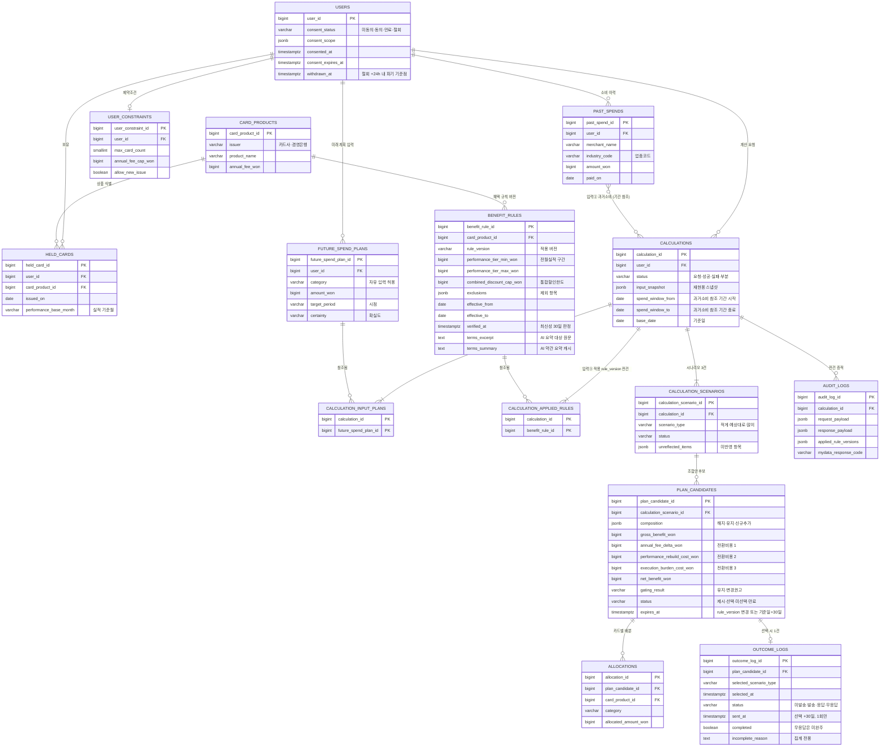

#### 6.4.2 테이블 정의

```sql
-- ═══════════════════════════════════════════════════════════
-- 금액은 전부 BIGINT(원 단위 정수)다. 부동소수점·DECIMAL 반올림으로는
-- "배분 합계와 입력 총액 오차 ≤ 1원"(REQ-FUNC-005)과
-- "동일 입력 재계산 불일치 0건"(REQ-NF-002)을 보장할 수 없다.
-- ═══════════════════════════════════════════════════════════

-- ── 사용자 및 동의 ────────────────────────────────────────
CREATE TABLE users (
    user_id             BIGSERIAL PRIMARY KEY,
    consent_status      VARCHAR(16) NOT NULL
        CHECK (consent_status IN ('NOT_CONSENTED','CONSENTED','EXPIRED','WITHDRAWN')),
    consent_scope       JSONB,              -- 동의 범위 최소화 점검 대상 (REQ-NF-004)
    consented_at        TIMESTAMPTZ,
    consent_expires_at  TIMESTAMPTZ,        -- 경과 시 계산 요청 400 (REQ-EXC-004)
    withdrawn_at        TIMESTAMPTZ,        -- +24시간 내 수집 데이터 파기
    created_at          TIMESTAMPTZ NOT NULL DEFAULT now()
);

-- ── 카드 상품 마스터 (파생) ────────────────────────────────
CREATE TABLE card_products (
    card_product_id     BIGSERIAL PRIMARY KEY,
    issuer              VARCHAR(64) NOT NULL,   -- 8개 카드사·겸영은행
    product_name        VARCHAR(128) NOT NULL,
    annual_fee_won      BIGINT NOT NULL,
    is_active           BOOLEAN NOT NULL DEFAULT TRUE,
    UNIQUE (issuer, product_name)
);

-- ── 마이데이터 수집분 ─────────────────────────────────────
CREATE TABLE held_cards (
    held_card_id        BIGSERIAL PRIMARY KEY,
    user_id             BIGINT NOT NULL REFERENCES users(user_id) ON DELETE CASCADE,
    card_product_id     BIGINT NOT NULL REFERENCES card_products(card_product_id),
    issued_on           DATE,
    performance_base_month CHAR(7),             -- 'YYYY-MM' 실적 기준월
    collected_at        TIMESTAMPTZ NOT NULL,   -- 근거 화면의 "기준일" 산출 근거
    UNIQUE (user_id, card_product_id)
);

CREATE TABLE past_spends (
    past_spend_id       BIGSERIAL PRIMARY KEY,
    user_id             BIGINT NOT NULL REFERENCES users(user_id) ON DELETE CASCADE,
    merchant_name       VARCHAR(256),
    industry_code       VARCHAR(16),            -- 업종코드
    amount_won          BIGINT NOT NULL,
    paid_on             DATE NOT NULL,
    collected_at        TIMESTAMPTZ NOT NULL
);
-- 계산마다 전량 조회되는 대용량 테이블 (6.6 사용 빈도)
CREATE INDEX idx_past_spends_user_paid ON past_spends (user_id, paid_on DESC);

-- ── 사용자 입력분 ─────────────────────────────────────────
CREATE TABLE future_spend_plans (
    future_spend_plan_id BIGSERIAL PRIMARY KEY,
    user_id             BIGINT NOT NULL REFERENCES users(user_id) ON DELETE CASCADE,
    category            VARCHAR(64) NOT NULL,   -- 자유 입력 허용 (REQ-FUNC-008)
    amount_won          BIGINT NOT NULL,        -- 증감 양방향: 음수 허용
    target_period       CHAR(7) NOT NULL,       -- 'YYYY-MM'
    certainty           VARCHAR(16),            -- 확실도 도메인 TBD
    is_suggested        BOOLEAN NOT NULL DEFAULT FALSE, -- 초기값 자동 제안분 여부
    was_edited          BOOLEAN NOT NULL DEFAULT FALSE, -- 초기값 수정률 측정 (T3)
    created_at          TIMESTAMPTZ NOT NULL DEFAULT now()
);

CREATE TABLE user_constraints (             -- 'constraints'는 SQL 예약어라 접두
    user_constraint_id  BIGSERIAL PRIMARY KEY,
    user_id             BIGINT NOT NULL REFERENCES users(user_id) ON DELETE CASCADE,
    max_card_count      SMALLINT,
    annual_fee_cap_won  BIGINT,
    allow_new_issue     BOOLEAN NOT NULL DEFAULT TRUE,
    created_at          TIMESTAMPTZ NOT NULL DEFAULT now()
);

-- ── 카드 혜택 Rule (버전 이력) ────────────────────────────
CREATE TABLE benefit_rules (
    benefit_rule_id     BIGSERIAL PRIMARY KEY,
    card_product_id     BIGINT NOT NULL REFERENCES card_products(card_product_id),
    rule_version        VARCHAR(32) NOT NULL,
    performance_tier_min_won BIGINT NOT NULL,   -- 전월실적 구간 하한
    performance_tier_max_won BIGINT,            -- NULL = 상한 없음
    combined_discount_cap_won BIGINT NOT NULL,  -- 통합할인한도
    exclusions          JSONB NOT NULL,         -- 제외 항목 (근거 6항목 중 1)
    effective_from      DATE NOT NULL,
    effective_to        DATE,                   -- NULL = 현행
    verified_at         TIMESTAMPTZ NOT NULL,   -- 최신성 30일 판정 기준 (REQ-NF-007)
    terms_source_url    VARCHAR(512),           -- 약관 원문 출처
    terms_excerpt       TEXT,                   -- AI 요약 대상 원문 발췌
    terms_summary       TEXT,                   -- AI 생성 약관 요약 (rule_version당 1회 캐시)
    terms_summary_at    TIMESTAMPTZ,            -- 요약 생성 시각
    UNIQUE (card_product_id, rule_version, performance_tier_min_won)
);
-- terms_summary를 캐시하는 이유: 약관은 사용자별로 다르지 않다. rule_version당
-- 1회만 요약하면 사용자 수와 무관하게 AI 호출이 고정된다 (REQ-NF-005 비용 통제)
-- 구버전을 삭제하지 않는다 — 과거 계산의 재현을 위해 (6.6 버전 관리)
CREATE INDEX idx_benefit_rules_freshness ON benefit_rules (verified_at);

-- ── 계산 ──────────────────────────────────────────────────
CREATE TABLE calculations (
    calculation_id      BIGSERIAL PRIMARY KEY,
    user_id             BIGINT NOT NULL REFERENCES users(user_id),
    status              VARCHAR(16) NOT NULL
        CHECK (status IN ('REQUESTED','SUCCESS','FAILED','PARTIAL')),
    input_snapshot      JSONB NOT NULL,         -- 재현성 (REQ-NF-006)
    spend_window_from   DATE NOT NULL,          -- 과거소비 참조 기간. 이 기간이 곧
    spend_window_to     DATE NOT NULL,          -- 어느 past_spends 행이 입력이었는지를 확정한다
    base_date           DATE NOT NULL,          -- 근거 화면의 기준일
    requested_at        TIMESTAMPTZ NOT NULL DEFAULT now(),
    completed_at        TIMESTAMPTZ
);

CREATE TABLE calculation_scenarios (        -- 파생: 시나리오 3건 사전 계산
    calculation_scenario_id BIGSERIAL PRIMARY KEY,
    calculation_id      BIGINT NOT NULL REFERENCES calculations(calculation_id) ON DELETE CASCADE,
    scenario_type       VARCHAR(16) NOT NULL
        CHECK (scenario_type IN ('LESS','AS_EXPECTED','MORE')),
    status              VARCHAR(16) NOT NULL CHECK (status IN ('SUCCESS','FAILED')),
    unreflected_items   JSONB NOT NULL,         -- 미반영 항목, 누락률 0% 표기용
    UNIQUE (calculation_id, scenario_type)      -- 시나리오당 정확히 1건
);

CREATE TABLE calculation_input_plans (      -- 파생: 입력① 어느 미래계획이 들어갔는지
    calculation_id      BIGINT NOT NULL REFERENCES calculations(calculation_id) ON DELETE CASCADE,
    future_spend_plan_id BIGINT NOT NULL REFERENCES future_spend_plans(future_spend_plan_id),
    PRIMARY KEY (calculation_id, future_spend_plan_id)
);
-- 미래 입력 0건이면 이 테이블에 행이 없다 → REQ-EXC-001 판정의 근거

CREATE TABLE calculation_applied_rules (    -- 파생: 입력③ 적용 rule_version 전건 보존
    calculation_id      BIGINT NOT NULL REFERENCES calculations(calculation_id) ON DELETE CASCADE,
    benefit_rule_id     BIGINT NOT NULL REFERENCES benefit_rules(benefit_rule_id),
    PRIMARY KEY (calculation_id, benefit_rule_id)
);

-- ── 조합안 및 배분 ────────────────────────────────────────
CREATE TABLE plan_candidates (
    plan_candidate_id   BIGSERIAL PRIMARY KEY,
    calculation_scenario_id BIGINT NOT NULL
        REFERENCES calculation_scenarios(calculation_scenario_id) ON DELETE CASCADE,
    composition         JSONB NOT NULL,         -- 해지·유지·신규추가 구성
    gross_benefit_won   BIGINT NOT NULL,
    annual_fee_delta_won        BIGINT NOT NULL, -- 전환비용 ①
    performance_rebuild_cost_won BIGINT NOT NULL, -- 전환비용 ②
    execution_burden_cost_won   BIGINT NOT NULL, -- 전환비용 ③
    net_benefit_won     BIGINT NOT NULL,        -- Gross − 전환비용 3항목
    gating_result       VARCHAR(24) NOT NULL
        CHECK (gating_result IN ('KEEP_CURRENT','RECOMMEND_CHANGE')),
    status              VARCHAR(16) NOT NULL
        CHECK (status IN ('PRESENTED','SELECTED','NOT_SELECTED','EXPIRED')),
    expires_at          TIMESTAMPTZ NOT NULL,   -- 기준일 +30일 (ADR-06)
    created_at          TIMESTAMPTZ NOT NULL DEFAULT now()
);
-- 게이팅 위반 전건 대조 (GR2 실시간 알림)
CREATE INDEX idx_plan_candidates_gating ON plan_candidates (gating_result, created_at);

CREATE TABLE allocations (
    allocation_id       BIGSERIAL PRIMARY KEY,
    plan_candidate_id   BIGINT NOT NULL
        REFERENCES plan_candidates(plan_candidate_id) ON DELETE CASCADE,
    card_product_id     BIGINT NOT NULL REFERENCES card_products(card_product_id),
    category            VARCHAR(64) NOT NULL,
    allocated_amount_won BIGINT NOT NULL
);
-- 무결성: SUM(allocated_amount_won) 과 입력 총액의 오차 ≤ 1원 (REQ-FUNC-005)
-- 단일 행 제약으로 표현 불가 — 애플리케이션 검증 + 일간 배치 대조 (REQ-NF-002)

-- ── 완주 계측 (측정 전용) ─────────────────────────────────
CREATE TABLE outcome_logs (
    outcome_log_id      BIGSERIAL PRIMARY KEY,
    plan_candidate_id   BIGINT NOT NULL UNIQUE  -- 선택 1건당 1행
        REFERENCES plan_candidates(plan_candidate_id),
    selected_scenario_type VARCHAR(16) NOT NULL, -- 어느 탭에서 골랐는지
    selected_at         TIMESTAMPTZ NOT NULL,
    status              VARCHAR(16) NOT NULL
        CHECK (status IN ('NOT_SENT','SENT','RESPONDED','NO_RESPONSE')),
    sent_at             TIMESTAMPTZ,            -- 선택 +30일, 1회만. 재발송 없음
    responded_at        TIMESTAMPTZ,
    completed           BOOLEAN,                -- NULL·무응답 = 미완주로 집계
    incomplete_reason   TEXT                    -- 집계 전용. 후속 액션 트리거 금지
);

-- ── 감사 증적 (append-only) ───────────────────────────────
CREATE TABLE audit_logs (
    audit_log_id        BIGSERIAL PRIMARY KEY,
    calculation_id      BIGINT REFERENCES calculations(calculation_id),
    user_id             BIGINT,                 -- 파기 후에도 증적 유지: FK 없음
    request_payload     JSONB NOT NULL,
    response_payload    JSONB,
    applied_rule_versions JSONB NOT NULL,
    mydata_response_code VARCHAR(16),
    created_at          TIMESTAMPTZ NOT NULL DEFAULT now()
);
-- UPDATE·DELETE 금지. 적재율 100% 감시 (REQ-NF-006)
```

#### 6.4.3 설계 판단 근거

| 판단 | 근거 요구사항 |
| --- | --- |
| **금액은 전부 `BIGINT`(원 단위 정수)** | 배분 합계 오차 ≤ 1원(REQ-FUNC-005) · 재계산 불일치 0건(REQ-NF-002). 부동소수점은 두 조건을 동시에 만족할 수 없다 |
| **소프트 삭제를 쓰지 않는다** | 동의 철회 시 **24시간 내 파기**(REQ-NF-004). 논리 삭제는 파기 요구와 충돌한다. 대신 `audit_logs`가 `user_id`에 FK를 걸지 않아 파기 후에도 증적이 남는다 |
| **`benefit_rules` 구버전을 삭제하지 않는다** | 과거 계산의 재현(REQ-NF-006). 버전 이력이 없으면 만료된 조합안의 근거를 되짚을 수 없다 |
| **`verified_at` 컬럼 추가** | 갱신 지연 30일 판정(REQ-NF-007)의 기준점. PRD가 "최신성 경고"를 요구하는데 판정할 컬럼이 없었다 |
| **`is_suggested` · `was_edited` 추가** | 초기값 수정률 감시(트레이드오프 T3). 완료율만 오르고 틀린 초기값이 통과하는 경로를 잡기 위해 필요하다 |
| **`user_constraints`로 접두** | `constraints`는 SQL 예약어다 |

**계산의 입력 3종을 관계로 드러낸다**

`Calculation`은 **미래계획 · 과거소비 · 혜택규칙** 세 가지를 입력으로 받는다. 이 흐름이 서비스의 핵심이므로 ERD에 관계선으로 표시했고, 각 입력의 카디널리티는 아래와 같다.

| 입력 | 관계 | 표현 방식 |
| :---: | --- | --- |
| ① 미래계획 | 계산 1건이 **여러 건**을 읽고, 계획 1건이 **여러 계산**에 쓰인다 (M:N) | `calculation_input_plans` 접합 테이블. 행이 0건이면 REQ-EXC-001 판정 근거가 된다 |
| ② 과거소비 | 계산 1건이 **수백~수천 건**을 읽는다 (M:N) | `spend_window_from`·`spend_window_to` 기간으로 확정. 행 단위 접합은 규모가 과도하다 |
| ③ 혜택규칙 | 카드 여러 장 → 규칙 **여러 개** (M:N) | `calculation_applied_rules` 접합 테이블. REQ-NF-006 전건 보존 |

**1:1 관계로 두면 안 되는 이유** — 세 입력을 각각 `1:1`로 모델링하면 계산 1건에 미래계획 1건·과거소비 1건·혜택규칙 1건만 연결된다. 카테고리가 여럿이고 카드가 여러 장인 이 서비스에서는 성립하지 않으며, 특히 ③을 1:1로 두면 **적용된 `rule_version`을 전건 보존할 수 없어 REQ-NF-006이 깨진다.**

**파생 테이블 5개**

| 테이블 | 왜 필요한가 |
| --- | --- |
| `card_products` | `held_cards`와 `benefit_rules`가 같은 카드를 문자열로 조인하면 Rule 버전 관리가 깨진다 |
| `calculation_input_plans` | 어느 미래계획이 계산에 들어갔는지를 행 단위로 고정한다. 스냅샷만으로는 "계획 → 계산" 추적이 불가능하다 |
| `calculation_scenarios` | PRD가 시나리오를 `Calculation`의 필드로 두었으나, **"시나리오 하나라도 실패하면 전체를 부분으로 처리"**(REQ-EXC-005)는 계산 단위 상태와 시나리오 단위 결과를 분리해야 표현된다 |
| `calculation_applied_rules` | 계산 1건에 카드 여러 장 → `rule_version`도 복수다. PRD의 단일 필드로는 전건 보존(REQ-NF-006)이 불가능하다 |
| `audit_logs` | PRD 4절 감사 증적 요구를 담을 테이블이 엔터티 목록에 없었다 |

**남은 TBD** — 아래는 실측·정책 없이 정할 수 없어 비워 두었다.

- `past_spends` **파티셔닝 전략** — 사용자 수·조회 패턴 실측 후 결정 (월 단위 range 파티션이 유력)
- `audit_logs` **보존기간·아카이빙** — 의존성 D9(규제 분류) 확정 후
- `certainty` **값 도메인** — PRD가 필드만 정의하고 값 체계를 정하지 않았다
- **PK 타입** — `BIGSERIAL`로 두었다. 외부 노출 식별자가 필요하면 UUID 병행 검토
- **인덱스 튜닝** — 위 3개는 요구사항이 직접 지목한 것만 선언했다. 나머지는 부하 테스트(REQ-NF-001) 후

### 6.5 상태 전이 규칙

> **확장 절** — 근거: ISO/IEC/IEEE 29148:2018 **9.6.12 b)** *Functions — exact sequence of operations*. PRD 6-3에 이미 정의된 상태 전이를 명세로 옮겼다.

> **그림 읽는 법** — 상자가 상태, 화살표가 상태를 바꾸는 사건이다. 검은 점이 시작, 이중 원이 끝이다.

<table><tr><td width="50%">

**마이데이터 동의**

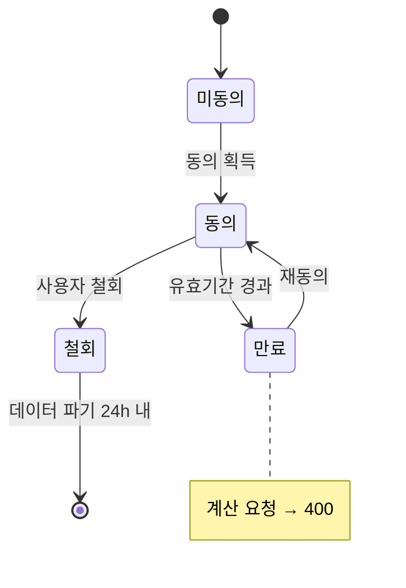

</td><td width="50%">

**Calculation**

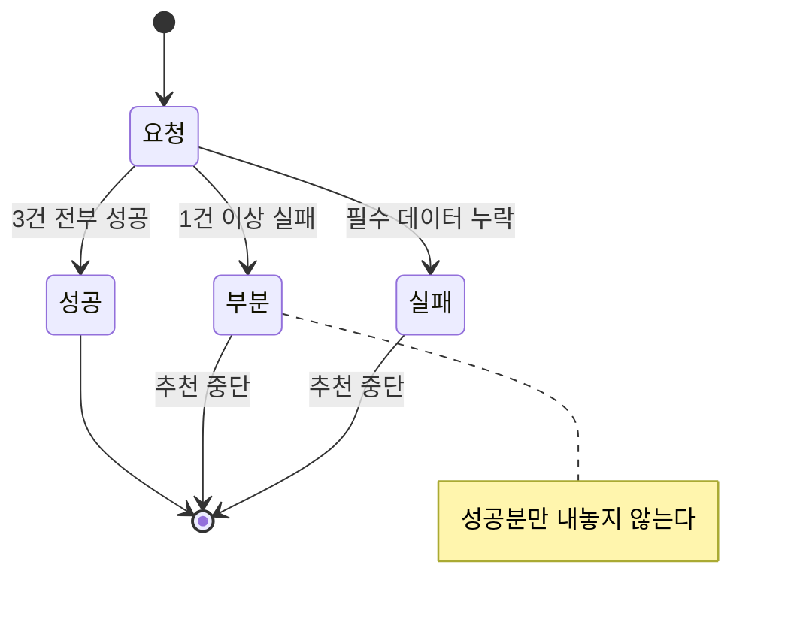

</td></tr><tr><td width="50%">

**PlanCandidate**

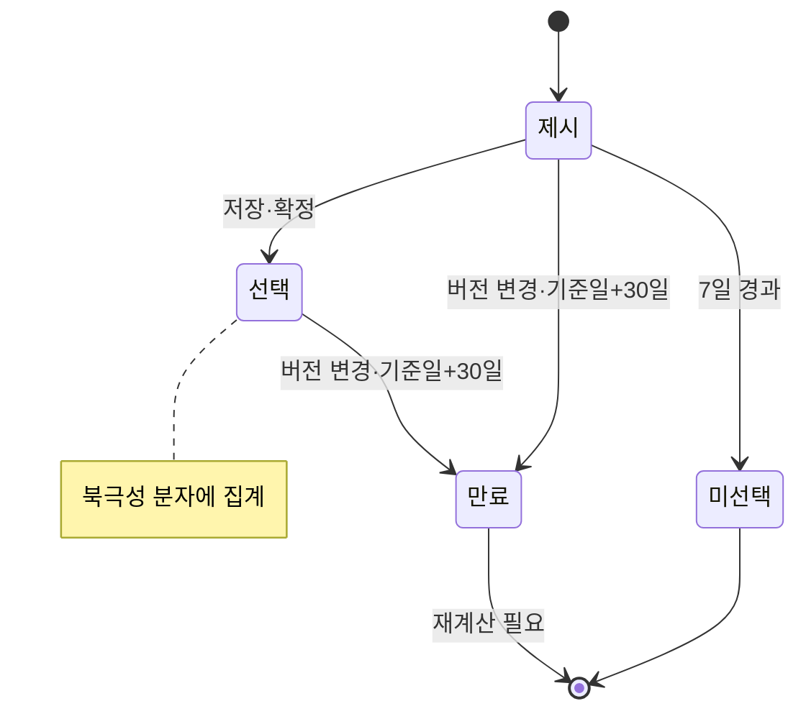

</td><td width="50%">

**OutcomeLog**

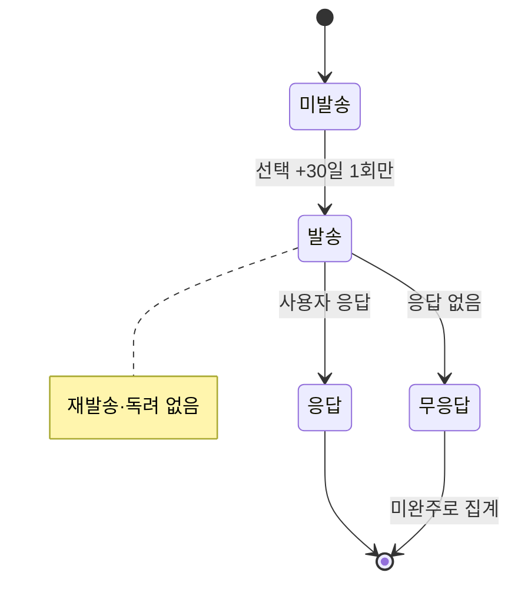

</td></tr></table>

| 객체 | 상태값 | 전이 규칙 |
| --- | --- | --- |
| **마이데이터 동의** | 미동의 → 동의 → (만료 / 철회) | 만료·철회 상태의 계산 요청은 **`400`**. 철회 시 수집 데이터 파기 (REQ-EXC-004) |
| **Calculation** | 요청 → (성공 / 실패 / 부분) | **부분 = 필수 데이터 누락**. 결과로 취급하지 않고 추천 중단. **3개 시나리오 중 하나라도 실패하면 전체를 부분으로 처리** (REQ-EXC-005) |
| **PlanCandidate** | 제시 → (선택 / 미선택) → 만료 | **`rule_version` 변경 또는 기준일 +30일 경과 시 만료.** 만료 조합안은 재계산 없이 실행 대상이 되지 않는다 (REQ-EXC-006) |
| **OutcomeLog** | 미발송 → 발송 → (응답 / 무응답) | 발송은 선택 +30일 **1회만**. **무응답은 미완주로 집계**. 재발송·독려 없음 (REQ-FUNC-010) |

조합안 만료는 근거 공개 요구(REQ-FUNC-006)의 성립 조건이다. 기준일 이후 약관이 갱신되면 이미 제시된 계산 근거가 무효가 되므로, 만료 조합안은 재계산 없이 실행 대상이 되지 않아야 한다.

### 6.6 논리 데이터베이스 요구사항

> **확장 절** — 근거: ISO/IEC/IEEE 29148:2018 **9.6.15** *Logical database requirements*. PRD 4절(감사 증적·데이터 운영)과 6-1·6-3에 이미 정의된 데이터 요구를 정리했다.

| 항목 | 요구사항 |
| --- | --- |
| **정보 유형** | 마이데이터 수집분(보유카드·과거 소비) · 사용자 입력분(미래지출·제약조건) · 수집 관리분(카드 혜택 Rule) · 산출분(계산·조합안·배분) · 계측분(완주 응답) · 감사분 |
| **사용 빈도** | `past_spends`는 계산마다 전량 조회되는 대용량 테이블이다. `benefit_rules`는 조회 대비 갱신 빈도가 낮고 버전 이력이 누적된다 |
| **접근 능력** | 계산 결과·근거는 **본인만** 조회 가능하다. 응답 주체와 로그인 사용자 불일치(오조회)는 0건이어야 한다 (REQ-NF-004) |
| **무결성 제약** | ① 배분 합계 = 입력 총액 (오차 ≤ 1원) ② `Calculation`은 적용 `rule_version`과 기준일을 반드시 가진다 ③ 시나리오 3건이 모두 성공하지 않으면 `PARTIAL` ④ `PlanCandidate`는 만료 시점을 반드시 가진다 |
| **버전 관리** | `benefit_rules`는 적용 시작일·종료일을 가진 **버전 이력**으로 보관한다. 과거 계산의 재현을 위해 구버전을 삭제하지 않는다 |
| **보안** | 동의 범위를 최소화해 수집한다. 철회 시 수집 데이터를 **24시간 내 파기**한다 |
| **보존 요구** | 계산 요청·응답, `rule_version`, 입력 스냅샷, 마이데이터 응답 코드를 **전건 보존**한다. **보존기간은 TBD** — 의존성 D9(규제 분류) 확정 시 결정 |

---

## 7. 향후 개선 사항

현재 v1 설계는 결정론적 계산과 실행 불개입에 초점을 두고 있다. 다음 개선 사항은 향후 버전에서 계획된다.

### 7.1 정기 재진단 (F-10)

- 소비 구조 변화를 주기적으로 감지해 재계산을 제안
- **v1에서 제외한 이유**: Drift가 시장이 아니라 **사용자 입력**에서 발생해, 정기 점검할 대상이 존재하지 않는다. 재진단 트리거를 입력 변화에 연결하는 설계가 선행돼야 한다

### 7.2 대량 보유 카드 처리 최적화 (F-14)

- 카드 20장 이상 보유 사용자의 조합 탐색 성능 최적화
- **v1에서 제외한 이유**: 대상 사용자 비중이 낮아 우선순위 최저 구간이다

### 7.3 시나리오 신뢰도 등급

- 각 시나리오 결론에 신뢰도 등급(강건 / 조건부 / 보류)을 배지로 표기
- 세 탭의 결론이 서로 다를 때 어느 결론을 얼마나 신뢰할지 판단을 돕는다
- **별도 검토 사항** — 계산·노출 방식만 v1에서 확정했다

### 7.4 지속 사용 동기 (Job E)

- 이벤트가 끝난 뒤에도 재방문할 이유를 제공
- **v1에서 제외한 이유**: 리텐션 전용 기능은 범위 밖이며, D+90 재방문율을 관측할 수단이 아직 없다

### 7.5 실행 지원 재검토

- 완주율이 구조적으로 낮다고 확인되면, 실행 지원 범위를 재검토할 수 있다
- **선행 조건**: 9장 **ADR-04**를 먼저 뒤집어야 한다. 마이데이터 사업자의 직권·대행 권한과 모집인 규제 분류(의존성 D9)가 전제다

---

## 8. 사용자 특성 및 사용 시나리오

> **확장 장** — 근거: ISO/IEC/IEEE 29148:2018 **9.6.6** *User characteristics*. 특정 요구사항을 진술하는 대신, **4장의 요구사항이 왜 그렇게 명세됐는지**의 배경을 기술한다. 출처는 PRD 2절.

### 8.1 대상 사용자 특성

**소비 구조가 곧 바뀔 사용자**가 대상이다. 다음 특성이 요구사항 설계를 직접 규정했다.

| 특성 | 요구사항에 미친 영향 |
| --- | --- |
| **미래 지출을 정확한 숫자로 알지 못한다** | 초기값 자동 제안(REQ-FUNC-007)이 Could가 아니라 **Must**다. 정확한 입력을 전제하면 온보딩에서 이탈한다 |
| **이벤트명으로 자기 상황을 분류하고 싶어하지 않는다** | 이벤트 선택 단계를 **두지 않는다**(REQ-FUNC-008). 자유 카테고리와 증감 양방향을 허용한다 |
| **예측이 틀릴 것을 스스로 안다** | 시나리오 3개를 모두 사전 계산한다(REQ-FUNC-003). 단일 예측값만 제시하면 결과 전체의 신뢰가 무너진다 |
| **계산 결과를 그대로 믿지 않는다** | 근거 공개가 6항목 하한을 가진다(REQ-FUNC-006). 금액만 보여주는 방식으로는 검증 욕구를 충족하지 못한다 |
| **카드 혜택 규칙에 대한 전문 지식이 없다** | AI가 근거를 사용자 언어로 설명한다. 단, **계산에는 관여하지 않는다**(ADR-02) |
| **여러 안을 비교할 여력이 없다** | 화면은 항상 결론 하나로 열린다. 보조 탭은 사용자가 직접 열어야 한다 |

### 8.2 사용 시나리오 (User Stories)

> **그림 읽는 법** — 사람 모양이 **행위자**(서비스를 쓰는 사람), 둥근 상자가 그 사람이 **하는 일**이다. 점선은 외부 시스템 연결이다. 유스케이스 상세 명세는 `[SDD]cardfit-design.md` 1장에 있다.

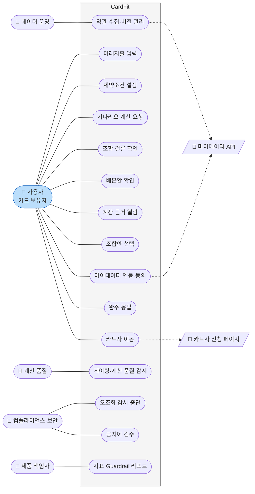

**행위자 5명 중 4명이 운영 인력이다.** 이 서비스는 사용자 기능만으로 성립하지 않는다 — 약관을 수집하는 사람이 없으면 계산이 비고, 감시하는 사람이 없으면 Guardrail이 작동하지 않는다. 2장 이해관계자 표가 이 그림의 왼쪽·오른쪽에 대응한다.

| # | 스토리 | 우선순위 | 대응 요구사항 |
| :---: | --- | :---: | --- |
| **US-A** | 소비가 곧 바뀔 사용자로서, 미래 지출을 카드 혜택과 연결해 계산받고 싶다 | 1 | REQ-FUNC-001·002·003·004·005 |
| **US-C** | 계산 결과대로 실제 해지·전환까지 완주하고 싶다 — **스코프 경계 스토리** | 1 | REQ-FUNC-009·010 (고지·측정만) |
| US-F | 이벤트명을 고르지 않고도 내 소비 변화를 인정받고 싶다 | 3 | REQ-FUNC-001·008 |
| US-B | 계산 근거를 직접 검증하고 싶다 | 4 | REQ-FUNC-006 |
| US-D | 정확한 숫자를 몰라도 부담 없이 입력하고 싶다 | 5 | REQ-FUNC-007·012 |
| US-E | 이벤트가 끝난 뒤에도 쓸 이유를 갖고 싶다 | 비MVP | 7.4 향후 개선 |

**US-C는 최우선 순위이면서 의도적으로 미해결이다.** 실행 대행 권한이 없어 고지(REQ-FUNC-009)와 측정(REQ-FUNC-010)으로만 다룬다. 근거는 **ADR-04**.

### 8.3 정상 흐름

마이데이터 연동 → 초기값 제안 → 미래지출 입력 → 제약조건 입력 → **3개 시나리오 계산** → "예상대로" 탭 결론 제시(조합 또는 유지) → 근거 확인 → 선택 → (30일 후) 완주 여부 계측

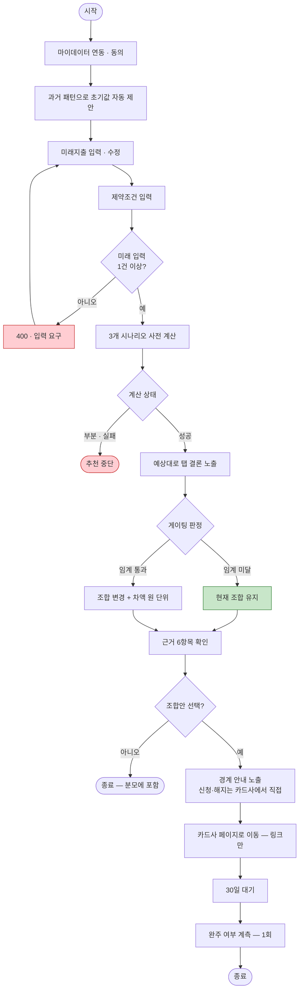

**두 개의 종료 경로가 모두 정상이다.** 초록 상자("현재 조합 유지")로 끝난 사용자는 북극성 지표 **분모에서 제외**된다(9장 ADR-05) — 선택할 조합안이 애초에 없기 때문이다. `Z1`(선택 안 함)은 분모에 포함된다. 이 구분이 지표 설계의 핵심이며 11.1에서 다시 다룬다.

**목표는 입력 완료부터 결론까지 p95 5분 이내**다(REQ-NF-008). 기준선은 수기 판단 240분이다.

---

## 9. 설계 결정 기록 (ADR)

> **확장 장** — 근거: ISO/IEC/IEEE 29148:2018 **9.6.16** *Design constraints* 및 **9.6.20** *Supporting information*(문제 배경과 판단 근거). 출처는 PRD 10-1.

**왜 SRS에 ADR을 두는가** — 이 명세의 결정 대부분은 "무엇을 만들까"가 아니라 **"무엇을 하지 않기로 했는가"**다. 게이팅·스코프 경계·지표 분모 제외는 모두 **성과 지표를 스스로 깎는 선택**이라, 근거를 남기지 않으면 다음 분기에 "왜 이렇게 불편하게 만들었나"로 되돌려진다.

| ID | 결정 | 이 결정이 없었다면 | 기각한 대안과 이유 | 감수하는 비용 | 구속하는 요구사항 |
| :---: | --- | --- | --- | --- | :---: |
| **ADR-01** | **Net Benefit 임계 미달 시 "현재 조합 유지"를 결론으로 반환한다** | 전환비용을 감춘 채 항상 "바꾸세요"를 반환하게 된다 — 경쟁자와 같은 제품이 되고 차별점이 사라진다 | ⓐ 항상 최적 조합 제시 → 전환비용이 혜택을 넘는 케이스에서 사용자 손실 · ⓑ 임계값 없이 점수만 표기 → 판단을 사용자에게 되던짐 | **북극성이 구조적으로 낮아진다.** "유지" 사용자는 선택할 조합안이 없다 → ADR-05로 상쇄 | REQ-FUNC-004 |
| **ADR-02** | **혜택 계산과 최종 조합 추천은 결정론적 규칙 엔진이 한다. AI는 ⓐ 약관 요약과 ⓑ 추천 근거의 자연어 설명만 한다.** 명시적 원칙 — **"AI가 혜택금액을 임의 계산하지 않는다."** 경계를 시스템 설계 단계에서 강제한다 | 계산에 LLM이 끼어들어 동일 입력에 다른 금액이 나온다 — 결정론성 요구가 성립 불가 | ⓐ LLM이 계산까지 → 재현 불가·감사 불가 · ⓑ AI 미사용 → 근거 6항목이 약관 문어체로 남아 검증 가능성이 형식만 충족 | AI로 계산 커버리지를 빠르게 넓히는 경로를 포기 — 카드사별 규칙을 사람이 정의해야 한다 | REQ-NF-002 · REQ-FUNC-006 |
| **ADR-03** | **지출 시나리오 3개를 1회 수집 데이터로 사전 계산**하고, 탭 전환은 재계산을 일으키지 않는다 | 사용자가 입력값을 바꿔가며 재요청 → 마이데이터 호출이 사용량에 비례해 늘고 단위경제가 깨진다 | ⓐ 탭 전환 시 실시간 재계산 → 호출 과금 증가(REQ-NF-005 위반) · ⓑ 단일 시나리오만 → 예측이 틀리면 결과 전체가 무효 | 열어보지 않는 탭 2개의 계산을 항상 낸다 — 가정 A7이 반증되면 낭비로 확정 | REQ-FUNC-003 · REQ-NF-005 |
| **ADR-04** | **해지·전환 실행은 스코프 밖.** 고지와 측정으로만 다루고 개입하지 않는다 | 마이데이터 사업자에게 없는 대행 권한을 전제한 기능이 설계에 들어간다 — 규제 리스크 | ⓐ 실행 대행·상담 제공 → 직권 없음, 모집인 규제 저촉(D9) · ⓑ 측정도 하지 않음 → 최우선 사용자 Job을 통째로 방치 | **가장 중요한 사용자 Job을 의도적으로 미해결로 남긴다.** 완주 실패를 보고도 개입하지 않는다 | REQ-FUNC-009 · REQ-FUNC-010 |
| **ADR-05** | **북극성 분모에서 "예상대로" 결론이 "유지"인 사용자를 제외한다.** 제외군 30% 초과 시 산식 재설계 | 정직하게 "유지"를 권할수록 북극성이 떨어진다 — **잘하면 점수가 내려가는 지표**가 되어 ADR-01과 정면 충돌 | ⓐ 분모에 포함 → 게이팅을 끌 인센티브 발생 · ⓑ "유지 수락"을 분자에 포함 → 성격이 다른 두 행동을 한 지표로 섞음 | 유효 표본이 얇아진다. 제외군 비율 자체를 감시 지표로 추가해야 한다 | 11.1 북극성 정의 |
| **ADR-06** | **조합안은 `rule_version` 변경 또는 기준일 +30일에 만료**된다. 만료분은 재계산 없이 실행 대상이 되지 않는다 | 3주 전 계산을 들고 실행하는 사이 약관이 갱신되면, 이미 틀린 근거로 해지를 권한 셈이 된다 | ⓐ 만료 없음 → 검증 가능성이 형식만 남는다 · ⓑ 열람 시마다 재계산 → 마이데이터 호출 증가(REQ-NF-005 위반) | 사용자가 다시 계산해야 하는 마찰이 생긴다 — 실행 완주율을 더 낮출 수 있다 | REQ-EXC-006 · REQ-NF-007 |
| **ADR-07** | **우선순위 프레임은 MoSCoW.** Could(REQ-FUNC-011·012)는 In/Out이 아니라 **"조건부 범위"**로 위치를 고정한다 | 실측이 없어 RICE의 Reach·Confidence를 채울 수 없다. Could의 자리를 비워두면 스프린트마다 범위 협상이 재발한다 | ⓐ RICE·WSJF → 입력값을 만들어 붙여야 함 · ⓑ Could를 범위 밖으로 편입 → 여유가 생겨도 착수 근거가 사라짐 | 정량 비교가 불가능해 우선순위 근거가 서술형으로 남는다 | 1.2 범위 |

> **ADR-01과 ADR-05는 한 쌍이다.** 게이팅만 도입하고 지표 분모를 그대로 두면, 지표가 게이팅을 끄라고 압박한다. 둘을 함께 결정한 것이 이 명세의 핵심 구조 판단이고, **리스크 R5(인센티브 충돌)와 의존성 D3(수익모델)이 이 쌍의 유효성을 결정**한다 — 발급 연계 수수료 모델을 택하면 "유지" 결론은 수익 0원이 되어 ADR-01이 조직 내부에서 무너진다.

---

## 10. 가정 및 의존성

> **확장 장** — 근거: ISO/IEC/IEEE 29148:2018 **9.6.8** *Assumptions and dependencies*. 이 요인들은 설계 제약이 아니지만, **바뀌면 4장의 요구사항이 함께 바뀐다.** 출처는 PRD 10-2·10-3·10-4.

### 10.1 리스크 및 대응

| # | 리스크 | 영향 | 대응 |
| :---: | --- | --- | --- |
| **R1** | **최상위 전제 붕괴** — 미래 입력의 수고가 혜택 보상을 정당화하지 못한다 | 🔴 REQ-FUNC-001~006 동시 무효화 | REQ-FUNC-007(초기값 제안)을 Must로 승격. **E2에서 최우선 검증** |
| **R2** | 마이데이터 인가·제휴 지속성 | 🔴 계산 불성립 | 인가 vs 제휴 조기 확정 — **착수 전 선결(D1)** |
| **R3** | 카드 혜택 Rule 파편화 (공식 통합 API 없음) | 계산 신뢰도 붕괴 | `rule_version` 관리 + 최신성 경고 + 30일 초과 카드 제외(REQ-NF-007) + 초기 지원 범위 축소 |
| **R4** | **지표 착시** — 선택 후 실행 실패가 성공으로 집계 | 지표가 실패를 못 본다 | 실행 완주율을 북극성과 **나란히 리포트**(11.2 Blind-spot 층) |
| **R5** | **인센티브 충돌** — 발급 연계 수수료 모델이면 "유지" 결론은 수익 0원 | 차별점과 매출 충돌 | **임계값(D2) 확정 후 정합한 수익모델 선택.** 순서를 뒤집으면 임계값이 수수료 쪽으로 왜곡된다 |
| **R6** | **호출 비용** — 시나리오 3개로 마이데이터·계산 호출량 증가 | 단위경제 악화 | 3개 시나리오는 **1회 수집 데이터로 계산**(ADR-03, REQ-NF-005). 보조 탭 열람률이 낮으면 재검토 |
| **R7** | 스코프 오인 — 실행 지원 제품으로 인식 | 규제 리스크 | 경계 고지 + 금지어 자동 검수(REQ-FUNC-009), 위반 0건 유지 |

### 10.2 주요 가정

가정은 결정을 유보한 자리가 아니라 **결정을 지탱하는 전제**다. 무엇이 틀리면 무엇을 다시 여는지 고정한다.

| # | 가정 | 지탱하는 결정 | 검증 실험 | 반증되면 |
| :---: | --- | :---: | :---: | --- |
| **A1** | 미래 입력의 수고가 혜택 보상으로 정당화된다 | **서비스 전체** · ADR-01 | **E2** | **REQ-FUNC-001~006 동시 무효화** — 전제 재검토(피벗) |
| A2 | 사용자가 미래 지출을 숫자로 표현할 수 있다 | REQ-FUNC-001 | E1·E3 | REQ-FUNC-001 재설계 (REQ-FUNC-007로 완화) |
| A3 | 근거 공개가 신뢰를 만든다 | REQ-FUNC-006 · ADR-06 | E2 (전후 비교) | 근거 공개 6항목 하한의 근거 |
| A4 | 사용자 Job 우선순위가 실사용자에게도 유지된다 | 8.2 스토리 우선순위 · ADR-07 | E1·E2 | 기능 우선순위 재배열 |
| **A5** | **Net Benefit 임계값을 사용자가 납득한다** | ADR-01 · REQ-FUNC-004 | **D2 확정 후 E2** | **게이팅 판정선 정량 정의 불가** |
| A6 | 실행 완주율이 낮다 | REQ-FUNC-010 · Blind-spot 층 | E7a → E7b | 보조 지표의 존재 이유 |
| A7 | 적게·많이 시나리오를 실제로 열어본다 | ADR-03 · REQ-FUNC-003(b) | E2·E3 | REQ-FUNC-003의 계산 비용이 정당화되지 않는다 |

> **A5의 검증 대상이 생겼다.** 나머지는 "맞는지 확인해야 하는" 가정이지만, A5는 확인할 대상(임계값)이 없었다. **D2가 확정돼**(절대 월 3,000원 · 상대 10%) 이제 E2에서 사용자 납득 여부를 그대로 물을 수 있다.

### 10.3 착수 전 선결 의존성

> **개정 이력** — 2026-08-25 해소 반영. D8·D12에 이어 **D2·D5·D14·D15·D16이 확정**됐고, **D1·D4·D11·D13은 픽스처 데이터로 시연·개발 범위에서 해소**됐다. 근거 문서는 `[CALC]cardfit-calc-spec.md`(CALC-CARDFIT-001)와 `[FXT]cardfit-fixture-spec.md`(FXT-CARDFIT-001)다.

**상태 표기**

| 표기 | 뜻 |
| :---: | --- |
| ✅ | **해소** — 결정본 문서에 값이 있다 |
| 🟡 | **시연 범위 해소** — 픽스처로 개발·시연이 가능하다. 실서비스 전환 시 다시 열린다 |
| ⬜ | **v1 시연 범위 밖** — 대응 태스크가 없다 |
| 🔴 | 미정 |

| # | 의존성 | 상태 | 해소 근거 · 막는 요구사항 |
| :---: | --- | :---: | --- |
| **D1** | 마이데이터 **인가 vs 제휴** 결정 | 🟡 | **FXT 1·3장** — 어댑터 경계(`FixtureMyDataProvider` ↔ `ApiMyDataProvider`)와 스냅샷 시드로 REQ-FUNC-002를 픽스처 모드에서 구현·검증한다. 사업·규제 판단은 실서비스 전 필요 |
| **D2** | **Net Benefit 절대·상대 임계값** | ✅ | **CALC 1장·3.3절** — 절대 **월 3,000원** · 상대 **10%**. 두 조건을 **모두** 만족해야 변경 권고 |
| **D3** | **수익모델** 선택 | ⬜ | v1 시연 범위 밖. R5(인센티브 충돌)는 유지되며, **D2 확정 이후** 정합한 모델을 고른다 |
| **D4** | v1 지원 카드사·상품 범위 | 🟡 | **FXT 2장** — 카드사 8곳 · 상품 **24종** 카탈로그. 혜택 규칙은 공개 약관을 근사한 값이며 실제 상품 조건이 아니다 |
| **D5** | **시나리오 3개의 증감 폭** | ✅ | **CALC 5장** — **±20%** (적게 0.8 · 예상대로 1.0 · 많이 1.2) |
| D6 | 실험 참여자 모집 경로 | ⬜ | E2 착수 시점 항목. 개발 태스크를 막지 않는다 |
| D7 | 개인정보 동의서 · Concierge 스크립트 | ⬜ | E2 착수 시점 항목 |
| ~~D8~~ | 경계값 케이스 ≥ 200건 · 금지어 사전 | ✅ | 케이스 **260건** · 금지어 6 카테고리(GTD). **기대값 바인딩도 완료** — D2·D5 주입으로 `params_bound: true` |
| D9 | 모집인 등록·재무자문 규제 분류 | 🟡 | 픽스처 모드에는 실제 신청·해지 경로가 없어 규제 표면이 없다. 실서비스 전 확인 필요 — REQ-FUNC-009의 금지어 게이트는 그대로 작동한다 |
| D10 | 실제 사용자 인터뷰 | ⬜ | A4 확정용. 개발 태스크를 막지 않는다 |
| **D11** | **DEC-1** Vercel에서 마이데이터 연동 가능한가 | 🟡 | **FXT 1장** — 픽스처 모드에서는 외부 호출이 없어 고정 IP·인증서 요건이 발생하지 않는다. 실연동 시 DEC-1이 다시 열린다 |
| ~~D12~~ | **DEC-2** 배포 전 검증 게이트 허용 여부 | ✅ | 확정 — 허용(C-TEC-007a) |
| **D13** | **DEC-3b** 사용자 금융정보의 외부 AI 전송 | 🟡 | **FXT 4장** — 픽스처 페르소나는 실존 인물이 아니라 전송할 개인정보가 없다. AI 근거 설명은 **사전 생성 캐시**로 제공한다. 실사용자 데이터 시점에 재검토 |
| **D14** | 발송 채널 · 알림 · 이벤트 분석 · APM 도구 | ✅ | **FXT 5장** — 도구 선정 대신 **DB 테이블 4종**(`outbox` · `alerts` · `events` · `latency_samples`)으로 구현한다. 도구 도입 시 어댑터만 교체 |
| **D15** | 서버리스 실행 시간 상한 내 3개 시나리오 계산 | ✅ | 픽스처가 있어 **즉시 실측 가능**하다. 측정 대상 규모는 CALC 4.1절(카드 8장 기준 후보 1,024개 생성 → 상위 20개)이며 IN-07이 수행한다 |
| **D16** | **규칙 엔진 계산 명세 RE-1~RE-8** | ✅ | **CALC 2~4장** — 적용 순서 · 제외 대상 · 산정 기간 · 전월 실적 정의 · 전환비용 산정 · 조합 생성 · 후보 풀 · 중복 혜택을 전건 확정 |

**Must 7건을 막고 있던 항목이 모두 풀렸다.** D16 → D2 순서를 지켜 전환비용 산정(RE-5)을 먼저 고정하고 그 위에서 임계값을 정했다. REQ-FUNC-002·003·004·006은 착수 가능 상태다.

**🟡 4건의 성격을 혼동하면 안 된다.** D1·D4·D11·D13은 **없어진 것이 아니라 시연 시점에서 미뤄진 것**이다. 픽스처는 외부 경계만 대체하며 계산·게이팅·인증·감사는 실제 코드가 그대로 돈다(FXT 1장). 실서비스 전환 시 다시 열리는 항목과 그 이유는 FXT 9장에 있다.

**D16은 이 명세의 가장 큰 공백이었다.** D2(임계값)는 숫자 하나지만, D16은 **계산 로직 자체**다. 순서가 다르면 같은 입력에 다른 금액이 나오므로, REQ-NF-002(재계산 불일치 0건)를 만족해도 **틀린 값으로 일관되게 틀릴 수 있다.** 상세는 4.1.0과 CALC-CARDFIT-001에 있다.

### 10.4 제약 사항 (Limitations)

> 근거: ISO/IEC/IEEE 29148:2018 **9.6.7** *Limitations*

| 구분 | 제약 |
| --- | --- |
| **규제·정책** | 마이데이터 인가 요건(자본금·물적설비·보안) 준수 필수. 모집인 등록·재무자문 규제 분류 미확인(D9). **실행 대행 권한 없음** |
| **외부 인터페이스** | 마이데이터 카드 업권 API가 **단일 채널이며 대체 공급자가 없다.** 장애 시 우회 경로가 없고 호출당 과금된다 |
| **데이터 출처** | 카드 혜택 Rule의 **공식 통합 API가 없다.** 8개 카드사·겸영은행으로 파편화되어 수집·버전관리를 자체 수행해야 한다 |
| **감사 기능** | 계산 요청·응답·`rule_version`·입력 스냅샷·마이데이터 응답 코드를 전건 보존해야 한다 |
| **품질 요구** | 동일 입력에 대한 재계산 불일치가 0건이어야 한다 — 계산 경로에 비결정론적 구성요소를 둘 수 없다(ADR-02) |
| **보안** | 타인 데이터 노출(오조회) 1건으로 서비스가 중단된다. 컴플라이언스가 PM을 우회해 단독 중단할 수 있다 |

---

## 11. 검증

> **확장 장** — 근거: ISO/IEC/IEEE 29148:2018 **9.6.19** *Verification* — 4장 요구사항에 대응하는 검증 접근과 방법을 규정한다. 출처는 PRD 7절·8절.

### 11.1 북극성 지표

**조합안 선택률** — 계산 결과를 받은 사용자 중 제시된 조합안을 **저장·확정**한 비율. 목표 **≥ 40%**.

이 값은 외부 벤치마크가 없는 영역이라 **팀 합의로 확정한 임계치**다. 근거를 만들어 붙이는 대신 확정 경로를 고정했다 — **E2 실측값으로 재설정**하며, 20% 미달이면 목표 조정이 아니라 **전제 재검토(피벗)**로 간다.

| 항목 | 규칙 |
| --- | --- |
| 집계 단위 | **사람 단위** — 재계산 반복은 1로 |
| 인정 기간 | 결과 열람 후 **7일 이내** 선택 (코호트) |
| **분모 제외** | **"예상대로" 탭 결론이 "현재 조합 유지"인 사용자** — 선택할 조합안이 없다 (ADR-05) |
| 시나리오 처리 | **어느 탭에서 선택해도 분자에 포함**하고, 선택된 시나리오를 함께 기록 |
| 제외군 감시 | 제외군 비율이 **30% 초과 시 산식 재설계** |

> **분모 제외가 이 지표의 핵심 설계다.** 임계 미달 시 "유지"를 정답으로 반환하는데(REQ-FUNC-004), 그 사용자를 분모에 넣으면 **정직하게 유지를 권할수록 점수가 떨어진다.** 잘하면 점수가 내려가는 지표는 지표가 아니다.
>
> 제외군 판정은 **기본 탭("예상대로") 결론을 기준**으로 한다. 그렇지 않으면 같은 사용자가 탭에 따라 제외군에도 분모에도 들어간다.

### 11.2 지표 체계 — 기준선 · 목표 · 측정 창구

| 구분 | 지표 | 정의 | 기준선 | 목표 | 측정 창구 (이벤트 · 주기) |
| --- | --- | --- | --- | --- | --- |
| **North Star** | 조합안 선택률 | 11.1 산식 | **없음 — 신규 지표.** E2 실측값으로 확정 | ↑ **≥ 40%** | `plan_selected` ÷ `result_viewed`, 사람 단위 **7일 코호트** · 주간 |
| Input | 온보딩 완료율 | 미래지출 입력 저장 ÷ 마이데이터 동의 | **없음.** E3 A군(초기값 제안 미적용)이 기준선 | ↑ **≥ 60%** | `future_spend_saved` ÷ `mydata_consent_done` · 일간 |
| Input | 결론 도달 소요시간 | 입력 완료 → 결과 표시, p95 | **240분** — 수기 판단(사용자 진술 1건, E1 n=15로 재측정) | ↓ **p95 ≤ 5분** | `input_done` → `result_viewed` 타임스탬프 차, APM p95 · 일간 |
| Input | 계산 근거 열람률 | 근거 펼침 ÷ 결과 열람 | **없음.** E2 실측값으로 확정 | ↑ **≥ 50%** | `evidence_expanded` ÷ `result_viewed` · 주간 |
| Input | 이벤트 비종속 진입률 | 태그 미선택 완료 ÷ 전체 완료 | **없음.** 베타 첫 4주가 기준선 | ↑ **≥ 20%** | `onboarding_done`의 `tag_selected=false` 비율 · 주간 |
| Input | 보조 탭 열람률 | 적게·많이 탭 1회 이상 열람 ÷ 결과 열람 | **없음.** 베타 첫 4주가 기준선 | **관찰 — 목표 없음.** 낮으면 REQ-FUNC-003의 계산 비용이 정당화되지 않는다 | `scenario_tab_opened`(예상대로 제외) ÷ `result_viewed` · 주간 |
| **🔍 Blind-spot** | **실행 완주율** | 30일 후 "바꿨다" ÷ 조합안 선택자 (**무응답 = 미완주**) | **없음 — E7b로 기준선 확보**(착수 +21주 이후) | **개선 대상 아님 — 측정 전용.** 북극성과 나란히 보고, 격차 20%p 이상이면 경보 | `outcome_response`(발송 +30일, 1회) ÷ `plan_selected` · 월간 |
| **Guardrail** | 불필요 신규카드 추천률 | 임계 미달인데 "변경" 결론 | **0** | **0% — 1건이면 즉시 중단** | 게이팅 판정 로그 전건 대조 · **실시간 알림** |
| **Guardrail** | 계산 오류율 | 경계값 회귀 실패 ÷ 전체 / 재계산 불일치 | **0** | **≤ 0.1%, 불일치 0건** | 회귀 스위트(배포마다) + 응답 해시 비교 · 일간 |
| **Guardrail** | 근거 미공개 결과 노출 | 공개 항목 6개 미달 노출 건수 | **0** | **0건** | 근거 응답 항목 수 검증 로그 · **실시간 알림** |
| **Guardrail** | 실행 지원 오인 문구 노출 | 금지어 스캐너 적발 건수 | **0** | **0건** | 배포 전 정적 스캔 + 런타임 문구 스캔 · **실시간 알림** |
| **Guardrail** | 오조회 (타인 데이터 표시) | 응답 주인 ≠ 로그인 사용자 | **0** | **0건 — 1건이면 중단·신고** | 응답 주체 전건 대조 · **실시간 알림 + 컴플라이언스 즉시 통보** |

**기준선이 "없음"인 이유** — 서비스가 아직 없어 실측값이 존재하지 않는 지표가 6개다. 기준선을 추정값으로 채우지 않고 **어느 실험·시점이 그 값을 확정하는지**를 명시했다. Guardrail 5건은 위반 건수 지표라 기준선이 **정의상 0**이고 목표와 같다 — 개선할 값이 아니라 지켜야 할 선이다.

**Blind-spot 층을 왜 따로 두는가** — 북극성은 "골랐는지"까지만 잰다. 선택 후 실행에 실패한 사용자는 **지표상 성공으로 집계**된다. 이 지표는 Input(올릴 수단이 없다)도 Guardrail(낮다고 멈출 수 없다)도 아니다 — **개선하지도 중단하지도 않지만 반드시 봐야 하는 것**이다. 그래서 목표값을 두지 않고, 무응답을 미완주로 세어 좋게 나올 자유도를 없앴다.

### 11.3 트레이드오프 선언

| # | 올리려는 지표 | 악화 감시 | 긴장의 실체 |
| :---: | --- | --- | --- |
| T1 | **조합안 선택률** | 불필요 신규카드 추천 **0%** | 선택률을 올리는 가장 쉬운 방법은 **혜택 좋아 보이는 신규카드를 끼워 넣는 것**이다. 숫자는 오르고 차별점은 무너진다 |
| T2 | 결론 도달 시간 ↓ | 계산 오류율 · 근거 항목 수 | 5분을 맞추려 규칙을 건너뛰거나 근거를 6개 미만으로 깎으면 검증 가능성이 사라진다 |
| T3 | 온보딩 완료율 ↑ | **초기값 수정률** | REQ-FUNC-007로 완료율은 오르지만 **틀린 초기값을 검토 없이 통과**시킬 수 있다 |
| T4 | 어떤 편의성 지표든 | 오조회 0건 · 오인 문구 0건 | **협상 대상이 아니다.** 1건이면 멈춘다 |

### 11.4 검증 실험 설계

| 실험 | 검증 대상 | 설계 | 성공 기준 |
| :---: | --- | --- | --- |
| **E2 Concierge** (최우선) | 계산 결과를 받으면 조합안을 선택한다 (A1) | **모집 40 / 유효 30**(제외군 25% 가정), 사람이 직접 계산. 근거 공개 2군 | 선택률 **≥ 40%** · 근거 열람 **전후** 신뢰 점수 상승. **2군 비교는 방향 관찰**(15/15 검출력 13%로 판정 불가) |
| E1 인터뷰 | 미래 입력 의향이 실재한다 (A2·A4) | 실제 사용자 n=15 — **모의 인터뷰 전면 교체** | Job A 언급률 ≥ 60% |
| E3 A/B | 초기값 제안이 온보딩 이탈을 줄인다 | n=500 (250/250) | B군 ≥ 60% **및 A군 대비 +15%p** · **수정률 정상** |
| E4 회귀 | 규칙 엔진이 경계값에서 정확하다 (REQ-NF-002) | 경계값 케이스 ≥ 200건 | 오류율 ≤ 0.1% · 불일치 0건 |
| E5 벤치마크 | 동일 데이터에서 더 정확한 조합을 낸다 | 같은 스냅샷 n=20 비교 | 비교 단위·근거 항목·전환비용 3축 전부 우위 |
| E6 경계 인지 | 스코프 고지가 기대 격차를 막는다 (REQ-FUNC-009) | E2·E4 참여자 사후 설문 | 인지율 ≥ 90%(n=30에서 신뢰구간 ±11%p) · 금지어 0건 |
| **E7a** | 미완주 사유의 종류를 안다 | E2 선택자, 30일 후 (**개입 없음**) | 목표 없음. **비율은 산출하지 않는다**(응답 6명 수준) |
| **E7b** | 실행 완주 비율을 안다 | **베타** 선택자, 30일 후 | 목표 없음 — 기준선 확보. **착수 +21주 이후** |

**중단 조건** — 계산 오류율 초과 또는 게이팅 위반·근거 미공개·오인 문구·오조회 **1건 = 즉시 중단** / E2 선택률 **< 20% = 전제 재검토(피벗)** / E2 제외군 **> 30% = 북극성 산식 재설계** / E3 +15%p 미달 또는 수정률 비정상 = **초기값 제안 재설계** / 마이데이터 인가·제휴 미확정 = **베타 진입 불가**

> **표본 수는 목표값과 중단선의 간격에서 역산했다.** 40% vs 20%를 가르는 데는 30명이면 충분하다(오판 확률 1.7%). 검출력 13%인 비교 기준은 삭제했다 — **있는 효과를 없다고 잘못 기록하는 것이 가장 나쁜 결과다.**

### 11.5 성과 지표로 쓰지 않는 것

누적 가입자 수 · 앱 다운로드 수 · 결과 화면 조회 수 · **계산 요청 건수**(마이데이터는 호출당 과금 — 성과가 아니라 **비용**이다. 시나리오 3개 계산으로 호출량이 늘어 더 중요해졌다) · "예상 절감액 총합"(실행되지 않은 금액이다)

---

## 12. 재설정 규칙

이 명세의 수치는 모두 결정된 값이다. 다만 **언제 어떤 값을 실측으로 갈아끼우는지**를 미리 못 박아 둔다. 그 시점이 오기 전까지는 아래 값이 판단 기준이다.

| # | 대상 | 현재 값의 성격 | 갱신 시점 | 갱신 후 처리 |
| :---: | --- | --- | :---: | --- |
| **1** | 북극성 40% · 온보딩 60% · 근거 열람 50% | **팀 합의로 확정한 임계치.** 외부 벤치마크가 없는 영역이라 근거를 만들어 붙이지 않았다 | **E2·E3 완료 후** | 11.2 기준선 열을 실측값으로 교체하고 목표를 재설정한다. E2 선택률 20% 미달이면 목표 조정이 아니라 **피벗** |
| **2** | 8.2 스토리 우선순위 | 팀 추정과 모의 인터뷰로 **교차검증한 제품 가설** | **E1(n=15) 완료 후** | 실제 응답으로 전면 교체. A4 반증 시 기능 우선순위 재배열(ADR-07 재검토) |
| **3** | **D1~D5** | **미정 — 착수 전 선결** | 착수 전 | D2 없이는 게이팅 판정선을, D3 없이는 REQ-NF-005 단위원가 상한을, D5 없이는 REQ-FUNC-003(b) 계산 기준을 확정할 수 없다 |
| **4** | 구현 클래스 · 테스트 케이스 상세 | **TBD** — 설계 단계 산출물 | 설계 완료 후 | 5장 추적성 매트릭스의 TBD를 채운다 |
| **5** | 시나리오 신뢰도 등급 | **별도 검토 — 본 명세 범위 밖** | 별도 검토 완료 후 | 도입 시 6.3 비즈니스 규칙에 노출 규칙을 추가한다 |

**의도적으로 미해결로 남긴 것 — US-C(실행 완주).** 최우선 순위 스토리이지만 범위 밖이다. 고지(REQ-FUNC-009)와 측정(REQ-FUNC-010)으로만 다루며, 이는 누락이 아니라 **ADR-04의 결정**이다. 되돌리려면 ADR-04를 먼저 뒤집어야 한다.

---

*입력 문서: `../cardfit-prd-v1_0.md` (PRD-CARDFIT-001 v1.0)*

*작성자: 기획 분석가, 검토자: 개발팀 리드, 승인자: 제품 책임자 (PM)*
